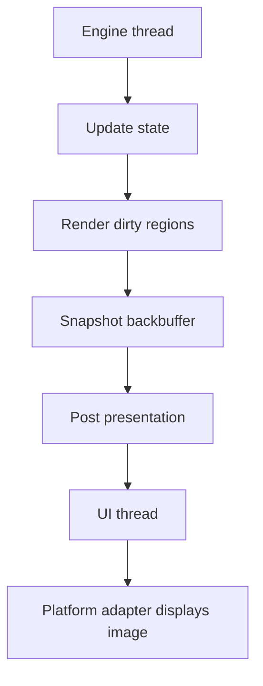
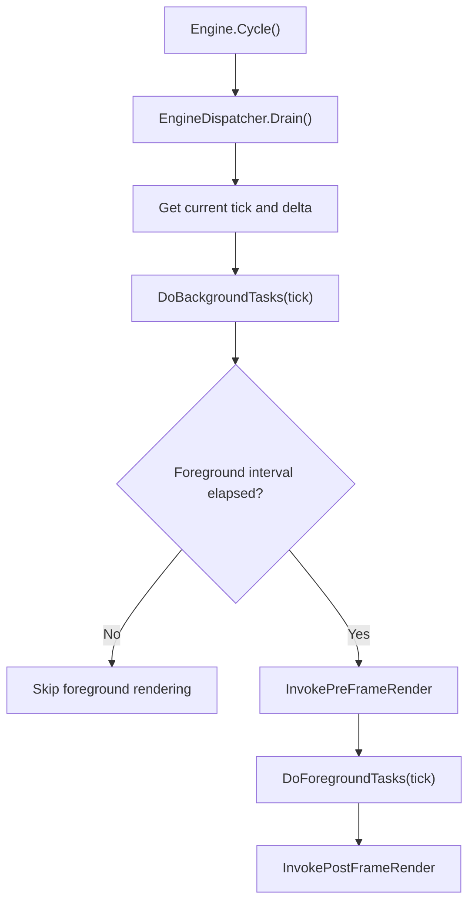
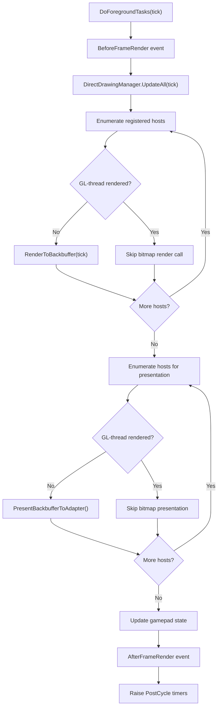
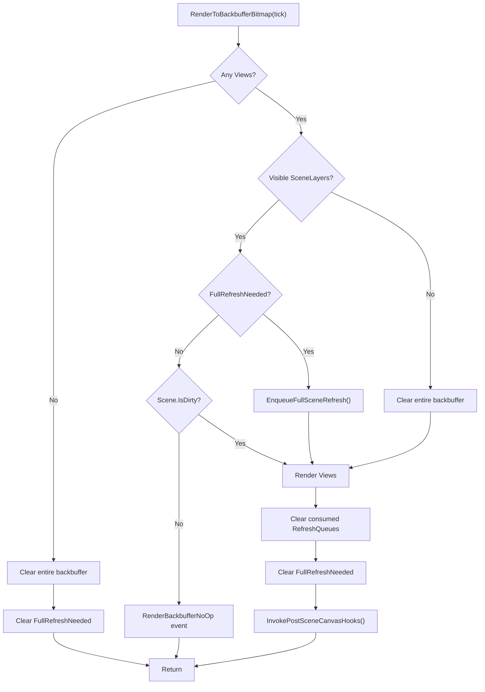
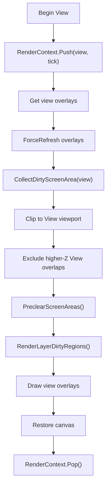
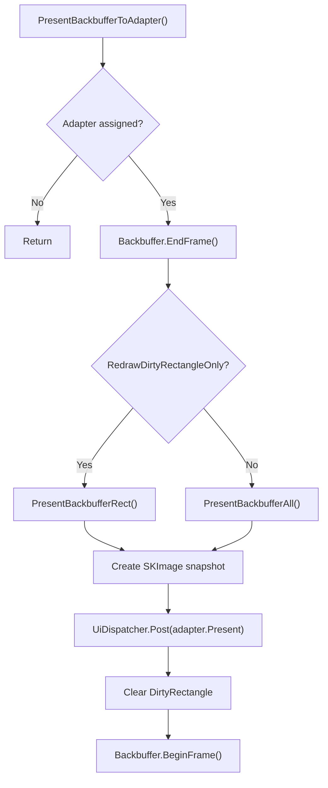

This page documents Gondwana's CPU-backed bitmap rendering path from the engine
cycle, through `RenderSurfaceHost`, to the platform-specific presentation
adapter.

The bitmap path is used whenever:

```csharp
surface.Backbuffer.IsGlThreadRendered == false
```

The standard implementation is `BitmapBackbuffer`. Unlike the GL path, bitmap
rendering is driven directly by the engine thread and uses dirty-region
tracking to avoid redrawing unchanged scene content.

## Architectural overview

The bitmap path separates rendering from presentation:

1. The engine thread updates drawing state.
2. The engine thread renders changed scene regions into the bitmap backbuffer.
3. The engine takes an `SKImage` snapshot of the backbuffer.
4. Presentation is posted to the UI thread.
5. The platform adapter displays the snapshot.



This arrangement is possible because the bitmap backbuffer is CPU-accessible
and does not require an OpenGL context to be current while scene content is
drawn.

## Entry from the engine cycle

`Engine.Cycle()` obtains the current high-resolution tick, performs background
work, and uses `EngineConfiguration.TargetFPS` to determine whether foreground
rendering is due.



Background work runs before rendering and includes input polling, animation,
sprite movement, collision resolution, and camera updates. These operations may
invalidate scene regions or request a full scene refresh.

## `Engine.DoForegroundTasks`

The bitmap route is called directly from `DoForegroundTasks`:

```csharp
foreach (var surface in RenderSurfaceHostRegistry.All)
{
    if (!surface.Backbuffer.IsGlThreadRendered)
        surface.RenderToBackbuffer(tick);
}
```

After all bitmap hosts have rendered, the engine makes a second pass to present
their backbuffers:

```csharp
foreach (var surface in RenderSurfaceHostRegistry.All)
{
    if (!surface.Backbuffer.IsGlThreadRendered)
        surface.PresentBackbufferToAdapter();
}
```

The complete foreground activity is:



## `RenderSurfaceHost.RenderToBackbuffer`

`RenderToBackbuffer` is the common host-level dispatcher. It raises the
begin/end events and selects the implementation appropriate for the
backbuffer:

```csharp
RenderBackbufferBegin?.Invoke();

if (Backbuffer.IsGlThreadRendered)
    RenderToBackbufferGpuFull(tick);
else
    RenderToBackbufferBitmap(tick);

RenderBackbufferEnd?.Invoke();
```

For a bitmap backbuffer, control passes to `RenderToBackbufferBitmap`.

## `RenderToBackbufferBitmap`

The bitmap implementation uses the scene's layer `RefreshQueue` instances to
determine which world regions need to be redrawn.



### Full-scene invalidation

When `Scene.FullRefreshNeeded` is true,
`EnqueueFullSceneRefresh()`:

1. Iterates every configured `View`.
2. Gets the view's screen viewport.
3. Converts that viewport to a layer-specific world rectangle.
4. Expands the world rectangle by one tile in every direction.
5. Pixel-aligns the result.
6. Adds it to the layer's `RefreshQueue`.

The one-tile expansion protects against fractional camera or parallax movement
and rounding at tile boundaries.

### Per-view rendering

Each view is rendered independently:



`RenderContext.Push` makes the current view and tick available to drawing code.
The `finally` block guarantees the matching `RenderContext.Pop`, even if a
drawable throws while rendering.

### Collecting dirty screen regions

`CollectDirtyScreenArea(view)` examines every visible scene layer:

1. Skip a layer whose `RefreshQueue` is clean.
2. Snapshot its dirty world rectangles.
3. Convert each world rectangle to view screen coordinates.
4. Intersect it with the view viewport.
5. Discard empty results.
6. Add the resulting rectangle without duplicates.

World rectangles are stored per layer because different layers may have
different coordinate transforms or parallax behavior. Conversion to screen
space therefore occurs separately for each view.

### Preclearing changed areas

`PreclearScreenAreas` clears each changed screen patch to
`Backbuffer.ClearColor`. Clearing may expose content from other visible layers,
so `EnqueueForOverlappingSceneLayers` converts the cleared screen patch back
into the world coordinates of every visible layer and marks the overlapping
layer regions for rendering.

This prevents a changed or removed foreground drawable from leaving stale
pixels or erasing unchanged background content.

### Rendering dirty layer regions

`RenderLayerDirtyRegions(view, layer)`:

1. Skips a clean layer.
2. Iterates the layer's dirty world rectangles.
3. Calls `SceneLayer.GetDrawablesInWorldRect`.
4. Projects the world rectangle to a screen rectangle.
5. Calls `Backbuffer.DrawDrawables`, clipped to that screen rectangle.

`DrawDrawables` draws visible tiles, sprites, and scene-layer direct drawings.
It also updates the backbuffer's aggregate `DirtyRectangle` so the presentation
stage knows which adapter pixels changed.

After every view is processed, the visible layers' refresh queues are cleared.

## Post-scene canvas hooks

`InvokePostSceneCanvasHooks()` runs after scene content and overlays have been
drawn but before the frame is finalized. It provides the backbuffer canvas to:

- `RenderBackbufferPostScene` subscribers; and
- registered engine plugins through `InvokePostRenderCanvas`.

For a bitmap backbuffer, the entire backbuffer is marked dirty before these
hooks execute. Arbitrary subscriber or plugin drawing therefore cannot be
accidentally omitted from presentation.

## Finalizing and presenting the bitmap

`PresentBackbufferToAdapter()` finalizes the rendered frame:



When dirty-only presentation is enabled, the source and destination rectangles
identify the changed screen patch. Otherwise, the complete backbuffer snapshot
is presented.

Presentation is posted rather than executed on the engine thread because UI
framework controls must be accessed from their owning UI thread.

## Platform adapters

### WinForms

`WinFormBitmapRenderSurfaceAdapter.Present` stores the newest snapshot and calls
`SKControl.Invalidate()`. During `SKControl.PaintSurface`, the adapter:

1. Intersects the requested source rectangle with the image.
2. Clips the destination to the control bounds.
3. Clears the destination patch.
4. Draws the corresponding image patch.
5. Disposes superseded snapshots after painting.

### Avalonia

`AvaloniaBitmapRenderSurfaceAdapter.Present` stores the snapshot and posts
`BlitAndInvalidate` at Avalonia's render priority. It copies the image pixels
into a `WriteableBitmap`, assigns that bitmap to the control, and calls
`InvalidateVisual`.

This is a CPU pixel-copy presentation path.

### Blazor

`BlazorBitmapRenderSurfaceAdapter.Present` reads the requested image region into
an RGBA byte array and queues the frame on the Blazor component. The component
then updates the browser canvas.

This path necessarily crosses from Skia's bitmap representation into a
browser-compatible pixel buffer.

## Thread ownership

| Operation | Thread |
| --- | --- |
| Background updates and camera updates | Engine thread |
| `DirectDrawingManager.UpdateAll` | Engine thread |
| `RenderToBackbufferBitmap` | Engine thread |
| Dirty-region collection | Engine thread |
| Bitmap backbuffer drawing | Engine thread |
| Backbuffer snapshot creation | Engine thread |
| Adapter `Present` | UI thread |
| Platform paint or visual update | UI thread |

## Condensed call stack

```text
Engine.Cycle()
└─ DoForegroundTasks(tick)
   ├─ DirectDrawingManager.UpdateAll(tick)
   ├─ RenderSurfaceHost.RenderToBackbuffer(tick)
   │  └─ RenderToBackbufferBitmap(tick)
   │     ├─ EnqueueFullSceneRefresh()
   │     ├─ CollectDirtyScreenArea(view)
   │     ├─ PreclearScreenAreas(view, dirtyRects)
   │     │  └─ EnqueueForOverlappingSceneLayers(...)
   │     ├─ RenderLayerDirtyRegions(view, layer)
   │     │  ├─ SceneLayer.GetDrawablesInWorldRect(...)
   │     │  └─ Backbuffer.DrawDrawables(...)
   │     └─ InvokePostSceneCanvasHooks()
   └─ RenderSurfaceHost.PresentBackbufferToAdapter()
      ├─ Backbuffer.EndFrame()
      ├─ Backbuffer.Snapshot()
      └─ UiDispatcher.Post(adapter.Present)
         └─ Platform-specific UI presentation
```

## Summary

The bitmap path is an engine-driven, dirty-region renderer:

- rendering happens directly on the engine thread;
- scene-layer refresh queues identify changed world regions;
- dirty regions are projected independently for each view;
- the bitmap backbuffer tracks the aggregate changed screen area; and
- platform presentation is marshalled onto the UI thread.

It trades bookkeeping complexity for reduced CPU drawing and reduced
presentation work when only a small portion of the frame changes.
