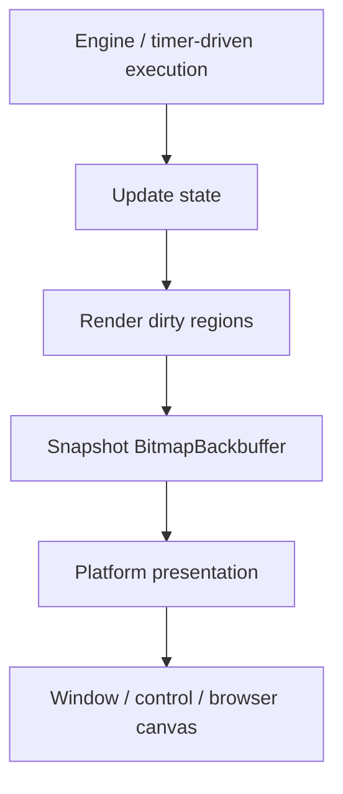
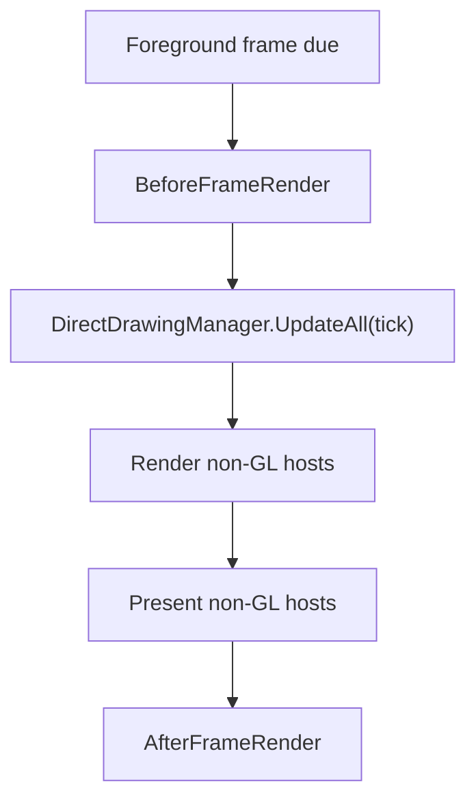
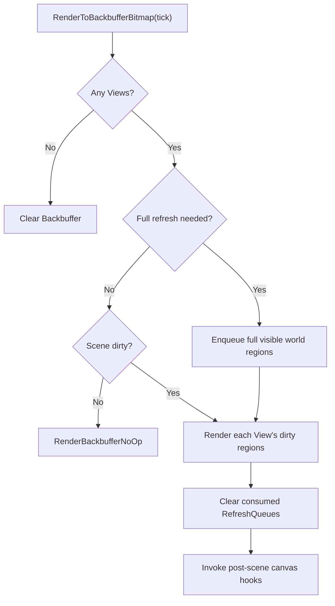
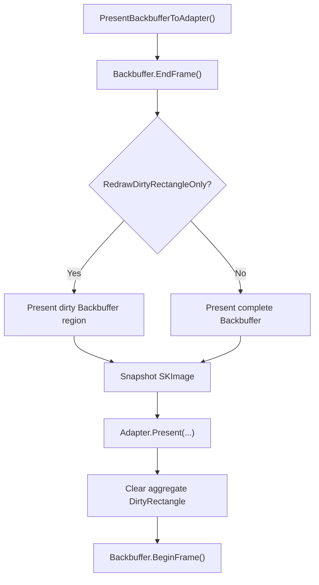

This page documents Gondwana's **CPU-backed bitmap rendering path** from engine/timer execution, through `RenderSurfaceHost`, to platform-specific presentation.

The bitmap path is used whenever:

```csharp
surface.Backbuffer.IsGlThreadRendered == false
```

The standard implementation is `BitmapBackbuffer`.

Unlike the GPU path, bitmap scene rendering uses SceneLayer RefreshQueues and Backbuffer dirty-rectangle tracking so unchanged content does not need to be redrawn or re-presented.

---

## Architectural overview

The bitmap path separates scene rendering from final platform presentation:

1. Gondwana advances game/rendering state.
2. Changed Scene regions are rendered into the CPU Backbuffer.
3. The Backbuffer is finalized and snapshotted as an immutable `SKImage`.
4. Presentation is marshalled to the platform/UI layer as needed.
5. The adapter displays the image using the current presentation transform.



A bitmap Backbuffer is CPU-accessible and does not require an OpenGL context to be current while Scene content is drawn.

---

## Execution context: desktop vs browser

On desktop hosts, the normal Gondwana engine loop runs `Engine.Cycle()` on the engine thread. Bitmap rendering therefore occurs from that engine/render thread, while UI presentation is posted to the UI framework's owning thread.

Blazor/WASM uses timer-driven engine execution instead. `BlazorGameHostBase` starts the engine with `StartTimerDriven(...)`, and the bitmap host's JavaScript `requestAnimationFrame` loop calls `Engine.Tick()` through `OnAnimationFrame()`.

That means the bitmap algorithm is the same in both environments, but the outer execution context differs:

| Environment | What drives the bitmap engine cycle? |
| --- | --- |
| Desktop | Gondwana's normal engine loop |
| Blazor bitmap | Gondwana JavaScript `requestAnimationFrame` → `Engine.Tick()` |

Do not assume "bitmap" always means "background engine thread"; browser timer-driven execution runs wherever `Tick()` is invoked.

---

## Entry from the foreground pass

When foreground rendering is due, `Engine.DoForegroundTasks(tick)` updates DirectDrawing state and renders every non-GL host directly:

```csharp
foreach (var surface in RenderSurfaceHostRegistry.All)
{
    if (!surface.Backbuffer.IsGlThreadRendered)
        surface.RenderToBackbuffer(tick);
}
```

After rendering, Gondwana performs a second pass to present those same non-GL hosts:

```csharp
foreach (var surface in RenderSurfaceHostRegistry.All)
{
    if (!surface.Backbuffer.IsGlThreadRendered)
        surface.PresentBackbufferToAdapter();
}
```

The overall bitmap foreground flow is therefore:



GPU hosts are skipped here because their Scene rendering must happen from the owning GL/WebGL callback.

---

## `RenderSurfaceHost.RenderToBackbuffer`

`RenderToBackbuffer(tick)` is the common host-level entry point:

```text
Backbuffer.BeginFrame()
  -> RenderBackbufferBegin
  -> RenderToBackbufferBitmap(tick)
  -> RenderBackbufferEnd
```

For `BitmapBackbuffer`, any queued logical resize request is applied during `BeginFrame()` before drawing begins.

---

## `RenderToBackbufferBitmap`

The bitmap renderer uses each SceneLayer's `RefreshQueue` to determine which world regions need to be redrawn.

At a high level:



If a Scene has Views but no normal SceneLayers, View-bound DirectDrawings can still participate in rendering.

---

## Full-scene invalidation

When `Scene.FullRefreshNeeded` is true, Gondwana converts each View's logical Backbuffer viewport into the corresponding world extent for each visible SceneLayer.

That world extent is expanded to protect against fractional camera movement, projection boundaries, and rounding, then added to the layer's RefreshQueue.

The RefreshQueue stores world-space invalidation because each View may project the same layer differently.

---

## Per-View dirty rendering

For each View, Gondwana:

1. pushes the View and current tick into `RenderContext`;
2. identifies View-bound DirectDrawing overlays;
3. ensures overlays that require redraw participate in invalidation;
4. projects dirty layer world rectangles into logical Backbuffer screen rectangles;
5. clips those rectangles to the View's viewport;
6. excludes portions hidden by higher-Z Views where appropriate;
7. pre-clears changed screen areas;
8. redraws affected layer content; and
9. draws the View overlays.

The matching `RenderContext.Pop()` occurs in cleanup so drawing code cannot leave the wrong View active after an exception.

---

## Collecting dirty screen regions

Dirty state begins in SceneLayer world coordinates.

For each visible layer, Gondwana snapshots its dirty world rectangles and projects them into the current View's logical Backbuffer `ScreenPx`.

Each projected rectangle is intersected with the Viewport and empty results are discarded.

This per-View projection matters because the same SceneLayer can appear through multiple Views with different Cameras, zoom levels, or viewport positions.

---

## Pre-clearing changed areas

Before redrawing changed content, Gondwana clears affected Backbuffer screen patches to `Backbuffer.ClearColor`.

A clear can expose lower layers that were previously covered, so the cleared screen patch is converted back into the world coordinates of other visible layers and those overlapping regions are enqueued for redraw as needed.

This prevents stale pixels and prevents removed foreground content from erasing unchanged background content without repainting it.

---

## Rendering dirty layer regions

For each dirty world rectangle, `RenderLayerDirtyRegions` obtains the drawables intersecting that world extent, projects the region into logical Backbuffer screen space, and calls `Backbuffer.DrawDrawables(...)` clipped to the affected area.

`DrawDrawables` renders visible tiles, sprites, and SceneLayer-bound DirectDrawings.

For bitmap Backbuffers it also expands `BackbufferBase.DirtyRectangle` to include the actual changed visual bounds. That aggregate rectangle is always expressed in **logical Backbuffer `ScreenPx`**.

After all Views are processed, consumed layer RefreshQueues are cleared.

---

## Post-scene canvas hooks

After normal Scene and View composition, Gondwana can invoke:

- `RenderSurfaceHost.RenderBackbufferPostScene`; and
- engine plugins through `IEnginePlugin.OnPostRenderCanvas`.

These hooks receive the fully composed Backbuffer canvas before final presentation.

When surface handlers or render-canvas plugins are present on a bitmap host, Gondwana marks the **entire logical Backbuffer dirty** before invoking them. This is intentional: arbitrary post-processing may change pixels anywhere on the surface, and restricting final presentation to the earlier Scene dirty region could omit those changes.

On desktop bitmap hosts these hooks execute on the engine/render thread. In timer-driven browser mode they execute in the execution context that called `Engine.Tick()`.

---

## Finalizing and presenting the bitmap

`RenderSurfaceHost.PresentBackbufferToAdapter()` finalizes the frame and chooses dirty-only or full presentation:



The CPU `SKImage` snapshot is immutable and safe for the platform presentation path to consume independently of subsequent Backbuffer drawing.

---

## Logical Backbuffer size vs adapter size

Current Gondwana rendering no longer assumes that the Backbuffer and adapter have matching dimensions.

`EngineConfiguration.RenderScale` establishes the logical Backbuffer resolution from the first valid adapter size. After that, normal window/control/canvas resizing changes only the adapter's `PresentationTransform`.

The transform preserves aspect ratio and centers the Backbuffer in the available destination. Different aspect ratios produce letterboxing or pillarboxing rather than silently stretching the logical render surface.

`RenderSurfaceHostBase.PresentationScale` exposes the derived fit scale.

Changing `RenderScale` explicitly queues a new logical resolution. For `BitmapBackbuffer`, the actual bitmap/surface reallocation occurs during a subsequent `BeginFrame()`.

---

## Presentation filtering

`EngineConfiguration.RenderScalingFilter` controls how the logical Backbuffer is sampled into the destination:

- `Linear` — smooth scaling;
- `NearestNeighbor` — useful for pixel art and integer-like presentation.

The presentation transform also provides the inverse mapping used by input normalization, so adapter pointer coordinates remain aligned with logical Backbuffer `ScreenPx`.

---

## WinForms bitmap presentation

`WinFormBitmapRenderSurfaceAdapter` retains the newest CPU snapshot and invalidates its `SKControl`.

During the UI paint callback, the adapter draws the relevant image data through the current presentation mapping. Superseded snapshots are disposed when no longer needed.

Scene rendering remains on Gondwana's engine/render execution context; control painting remains on the WinForms UI thread.

---

## Avalonia bitmap presentation

`AvaloniaBitmapRenderSurfaceAdapter` presents the CPU-backed frame through Avalonia's UI rendering infrastructure.

The path remains CPU-oriented: Gondwana renders into `BitmapBackbuffer`, then the adapter transfers that completed image into the Avalonia presentation surface and invalidates the visual as needed.

As with WinForms, adapter resize changes presentation geometry rather than silently reallocating the logical Backbuffer.

---

## Blazor bitmap compatibility path

Blazor retains the original Canvas 2D bitmap route alongside WebGL.

`BlazorGameHost` uses `BlazorBitmapRenderSurfaceComponent` and `BitmapBackbuffer`. The host starts Gondwana in timer-driven mode, and Gondwana's JavaScript `requestAnimationFrame` loop calls the .NET `OnAnimationFrame()` method, which advances `Engine.Tick()`.

After the bitmap renderer produces a snapshot, `BlazorBitmapRenderSurfaceAdapter` converts the requested image region into an RGBA byte array. `BlazorBitmapRenderSurfaceComponent` sends those pixels to its JavaScript module, which updates the HTML canvas.

The component also retains the last browser-side bitmap frame so a canvas resize can re-present it using the new destination geometry without requiring the logical Backbuffer itself to resize.

This path is useful when CPU-backed rendering or bitmap frame access is required, but it necessarily incurs CPU pixel conversion/JavaScript transfer that the WebGL path avoids.

See [[WebGL Rendering Path]] for the GPU browser route.

---

## Thread / execution ownership

| Operation | Desktop bitmap | Blazor bitmap |
| --- | --- | --- |
| Engine advancement | Engine thread | Browser rAF → `Engine.Tick()` |
| Dirty-region Scene rendering | Engine thread | Timer-driven browser execution context |
| `BitmapBackbuffer` drawing | Engine thread | Timer-driven browser execution context |
| Snapshot creation | Same render context | Same render context |
| Native UI presentation | UI thread | N/A |
| Browser canvas update | N/A | JS/browser canvas path |

The important invariant is that bitmap rendering does not require a current GL context. Platform presentation still obeys the threading/interop requirements of the destination UI system.

---

## Condensed call stacks

### Desktop bitmap

```text
Engine.Cycle()
└─ DoForegroundTasks(tick)
   ├─ DirectDrawingManager.UpdateAll(tick)
   ├─ RenderSurfaceHost.RenderToBackbuffer(tick)
   │  └─ RenderToBackbufferBitmap(tick)
   │     ├─ collect / project RefreshQueue regions
   │     ├─ pre-clear affected Backbuffer areas
   │     ├─ redraw affected drawables
   │     ├─ draw View overlays
   │     └─ invoke post-scene hooks
   └─ PresentBackbufferToAdapter()
      ├─ Backbuffer.EndFrame()
      ├─ Backbuffer.Snapshot()
      └─ platform adapter presentation
```

### Blazor bitmap

```text
browser requestAnimationFrame
└─ BlazorGameHostBase.OnAnimationFrame()
   └─ Engine.Tick()
      └─ DoForegroundTasks(tick)
         ├─ RenderToBackbufferBitmap(tick)
         └─ PresentBackbufferToAdapter()
            └─ BlazorBitmapRenderSurfaceAdapter.Present(...)
               └─ RGBA byte transfer
                  └─ HTML canvas update
```

---

## Summary

The bitmap path is Gondwana's CPU-backed, dirty-region renderer:

- SceneLayer RefreshQueues identify changed world areas;
- each View projects those areas into logical Backbuffer `ScreenPx`;
- only affected content is normally redrawn;
- the Backbuffer tracks aggregate changed pixels for optional partial presentation;
- post-scene hooks force full Backbuffer presentation when arbitrary canvas drawing is possible;
- logical Backbuffer resolution remains independent of window/canvas resize; and
- platform adapters present the immutable CPU snapshot using the current aspect-preserving presentation transform.

On desktop this normally runs from Gondwana's engine thread. In Blazor bitmap mode the same rendering path is advanced by a JavaScript `requestAnimationFrame` loop through timer-driven `Engine.Tick()`.

---

## Where to read next

- [[Rendering Pipeline]]
- [[Backbuffers]]
- [[Refresh Queues]]
- [[Dirty Rectangles]]
- [[GL Rendering Path]]
- [[WebGL Rendering Path]]

Relevant source files:

- `Gondwana/Engine.cs`
- `Gondwana/Rendering/RenderSurfaceHost.cs`
- `Gondwana/Rendering/Backbuffers/BitmapBackbuffer.cs`
- `Gondwana/Rendering/RenderSurfaceAdapterBase.cs`
- `Gondwana.Blazor.Hosting/BlazorGameHostBase.cs`
- `Gondwana.Blazor/Rendering/BlazorBitmapRenderSurfaceAdapter.cs`
- `Gondwana.Blazor/Rendering/BlazorBitmapRenderSurfaceComponent.razor.cs`
