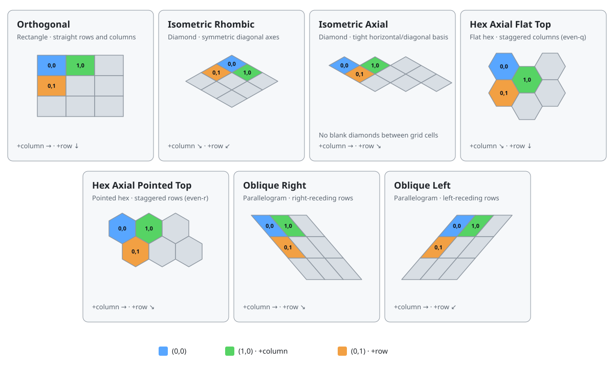

<!-- Revision: 2026-08-04 · seven systems · packed IsometricAxial · ObliqueRight and ObliqueLeft -->

Gondwana currently provides seven coordinate systems supporting different tile map geometry.

A coordinate system defines how a `SceneLayer` interprets its grid:

- where each grid coordinate is placed in world pixel space
- what shape a tile occupies
- how world pixels map back to tiles
- which tiles count as neighbors
- how tile bounds, overhang, and wrapping are calculated

This is related to, but different from, [[Coordinate Spaces]]. **Coordinate spaces** describe *where a value lives* (`Grid -> World -> Screen`). A **coordinate system** supplies the layer-specific rules for the `Grid -> World` part of that pipeline.



In the diagram, blue is tile `(0,0)`, green is `(1,0)`, and orange is `(0,1)`.

---

## Selecting a coordinate system

The usual approach is to select the coordinate system when adding the layer to a scene:

```csharp
using System.Drawing;
using Gondwana.Drawing.Coordinates;
using Gondwana.Scenes;

var scene = new Scene();

SceneLayer groundLayer = scene.AddLayer(
    columnCount: 100,
    rowCount: 100,
    width: 64,
    height: 32,
    coordinateSystem: CoordinateSystemTypes.IsometricRhombic);
```

`Orthogonal` is the default when `coordinateSystem` is omitted.

An existing layer can also be changed:

```csharp
groundLayer.CoordinateSystemType = CoordinateSystemTypes.ObliqueLeft;
```

Changing the property replaces the layer's internal coordinate strategy. It does not convert the map, resize the tiles, or reshape the artwork for the new geometry. In normal use, choose the system when the layer is created and make the tile dimensions and artwork match it.

---

## `ISceneLayerCoordinates`

`ISceneLayerCoordinates` is the internal strategy interface behind every coordinate system. `SceneLayer.CoordinateSystemType` selects one of its internal implementations.

The interface is deliberately `internal`: game code normally works through `SceneLayer`, not through a coordinate implementation directly. The principal public entry points are:

```csharp
PointF worldPx = groundLayer.GridToWorldPx(new PointF(4, 7));
PointF grid = groundLayer.WorldPxToGrid(worldPx);

SceneLayerTile? tile = groundLayer[4, 7];
SceneLayerTile? neighbor = tile is null
    ? null
    : groundLayer.GetAdjacentTile(tile, CardinalDirections.E);

PointF wrapped = groundLayer.WrapGrid(new PointF(-1, 7));
```

Internally, the interface provides eight operations.

| Member | Responsibility |
| --- | --- |
| `GetAnchorPixelAtSceneLayerCoordinates` | Converts a grid position to the projection-defined world-pixel anchor used to place the tile. For a rectangle this is its top-left corner; for an isometric diamond it is its top vertex. |
| `GetSceneLayerCoordinatesAtPixel` | Converts a world-pixel position back to grid coordinates. Orthogonal, isometric, and oblique systems can return fractional coordinates. The hex systems resolve the containing or nearest hex and return integer-valued coordinates in a `PointF`. |
| `GetSceneLayerTilesInPixelRange` | Finds tiles whose rendered bounds intersect a world-pixel rectangle. Rendering and dirty-region logic use this to gather candidate tiles efficiently. |
| `GetPixelRangeForTile` | Returns one tile's world-pixel bounding rectangle. |
| `GetPixelRangeForTileList` | Returns the union of the world-pixel bounds for several tiles. |
| `GetAdjacentSceneLayerTile` | Applies the topology's neighbor rules. Square-derived systems can expose eight directions; hex systems expose six. |
| `GetPolygonPts` | Returns the tile footprint as world-pixel polygon vertices for hit testing, grid outlines, bounds, and debug drawing. |
| `FindEquivalentSceneLayerCoordinates` | Wraps grid coordinates into valid layer bounds using modulo arithmetic. |

Several methods accept `includeOverhang`. When `false`, the result describes the base tile footprint. When `true`, the result is expanded to account for artwork that extends beyond that footprint.

The interface is concerned only with **grid space and world pixel space**. Camera position, viewport placement, parallax, and zoom are handled later when world pixels become screen pixels.

---

## Supported coordinate systems

### 1. Orthogonal

`CoordinateSystemTypes.Orthogonal`

Orthogonal is the conventional rectangular tile grid. Columns run left to right, rows run top to bottom, and every tile occupies an axis-aligned rectangle.

For a tile size of `W x H`:

```text
worldX = column * W
worldY = row    * H
```

The layer origin is also applied to the final world position.

Orthogonal supports the eight compass neighbors: `N`, `NE`, `E`, `SE`, `S`, `SW`, `W`, and `NW`.

Use it for traditional top-down maps, platformers, board layouts, and any map whose logical and visual axes should remain horizontal and vertical.

---

### 2. Isometric rhombic

`CoordinateSystemTypes.IsometricRhombic`

Isometric rhombic is Gondwana's classic tightly packed diamond projection. Moving along one grid axis travels down and to the right; moving along the other travels down and to the left.

Ignoring the layer origin, its anchor transform is:

```text
worldX = (column - row) * W / 2
worldY = (column + row) * H / 2
```

The anchor is the diamond's top vertex. A rectangular grid therefore becomes a rhombus-shaped arrangement in world space.

The underlying grid still has eight addressable compass directions. The projection changes where those neighbors appear visually; it does not change the layer's rectangular `(column, row)` storage.

Use it for the familiar 2.5D isometric-map appearance in which adjacent diamond tiles share edges.

---

### 3. Isometric axial

`CoordinateSystemTypes.IsometricAxial`

Isometric axial uses a horizontal column axis and a diagonal row axis. Each tile is drawn as a diamond, and the two axes form an affine basis that packs those diamonds edge-to-edge.

Ignoring the layer origin, its anchor transform is:

```text
worldX = column * W + row * W / 2
worldY = row * H / 2
```

One column advances horizontally by `(W, 0)`. One row advances diagonally by `(W/2, H/2)`. The area of that basis is exactly the area of one `W x H` diamond, so the tiles neither overlap nor leave holes.

Including the layer origin, the forward and inverse transforms are:

```text
worldX = -OriginX + column * W + row * W / 2
worldY = -OriginY + row * H / 2

row    = (worldY + OriginY) / (H / 2)
column = (worldX + OriginX - row * W / 2) / W
```

The inverse is continuous: a world-pixel position between tile anchors can produce fractional grid coordinates.

The important difference from `IsometricRhombic` is the choice of basis. Rhombic uses two symmetric diagonal axes; Axial uses one horizontal axis and one diagonal axis. A finite Axial layer therefore forms a right-sheared parallelogram rather than a symmetric rhombus.

Adjacency follows the same eight-direction rectangular index space as Orthogonal.

Use it when a tightly packed diamond map should use a continuous axial basis rather than the classic symmetric rhombic projection.

---

### 4. Hex axial, flat top

`CoordinateSystemTypes.HexAxialFlatTop`

This system draws flat-topped hexagons using an **even-column offset layout** (even-q). Columns overlap horizontally and alternate columns are vertically staggered.

- columns advance by `0.75 * TileWidth`
- odd columns are shifted down by `TileHeight / 2`
- rows within a column advance by `TileHeight`

A hex has six direct neighbors. For flat-top hexes they are `E`, `W`, `NE`, `NW`, `SE`, and `SW`. `N` and `S` are not direct neighbors and return `null`.

Pixel-to-grid conversion first estimates the nearby cell, then uses the hex polygons and nearest centers to resolve the containing tile. This avoids treating transparent corners of a hex's rectangular image bounds as part of the wrong tile.

Use flat-top hexes when the map's strongest visual axis should run horizontally through the flat sides.

---

### 5. Hex axial, pointed top

`CoordinateSystemTypes.HexAxialPointedTop`

This system draws pointed-top hexagons using an **even-row offset layout** (even-r). Rows overlap vertically and alternate rows are horizontally staggered.

- rows advance by `0.75 * TileHeight`
- odd rows are shifted right by `TileWidth / 2`
- columns within a row advance by `TileWidth`

Its six direct neighbors are `N`, `S`, `NE`, `NW`, `SE`, and `SW`. `E` and `W` are not direct neighbors and return `null`.

Like the flat-top implementation, reverse conversion uses polygon hit testing and nearest-center selection so the result follows the actual hex footprint.

Use pointed-top hexes when the map's strongest visual axis should run vertically through the pointed ends.

---

### 6. Oblique right

`CoordinateSystemTypes.ObliqueRight`

Oblique right is the renamed form of the original `Oblique` coordinate system. It uses a right-receding, sheared square lattice whose tile footprints are parallelograms.

Let `skewX = W / 2` and `faceWidth = W - skewX`. Its complete transform is:

```text
worldX = -OriginX + column * faceWidth + row * skewX
worldY = -OriginY + row * H

row    = (worldY + OriginY) / H
column = (worldX + OriginX - row * skewX) / faceWidth
```

A column advances horizontally by `(faceWidth, 0)`; a row advances down and right by `(skewX, H)`.

Tile images still occupy `W x H` rectangular bitmap bounds. Artwork normally uses transparency in the unused corners around the parallelogram. Adjacency uses the same eight-direction rectangular index space as Orthogonal.

Use it for cabinet, tactics, pseudo-3D, or stylized maps whose depth axis should recede to the right.

---

### 7. Oblique left

`CoordinateSystemTypes.ObliqueLeft`

Oblique left mirrors the oblique geometry so rows recede to the left. It is a separate coordinate implementation, including its own forward transform, inverse transform, range query, bounds, polygon, adjacency, and wrapping operations.

Using the same `skewX` and `faceWidth` definitions:

```text
worldX = -OriginX + column * faceWidth - row * skewX
worldY = -OriginY + row * H

row    = (worldY + OriginY) / H
column = (worldX + OriginX + row * skewX) / faceWidth
```

A column still advances by `(faceWidth, 0)`, while a row advances down and left by `(-skewX, H)`. Its tile polygon is the horizontal mirror of the right-receding parallelogram.

Use it when the same pseudo-3D treatment should recede toward the left. Artwork must match the left-sheared footprint; right-receding artwork is not mirrored automatically.

---

## Quick comparison

| Type | Tile footprint | Grid layout in world space | Direct neighbors |
| --- | --- | --- | ---: |
| `Orthogonal` | Rectangle | Axis-aligned rectangular lattice | 8 |
| `IsometricRhombic` | Diamond | Classic diagonal rhombic lattice | 8 |
| `IsometricAxial` | Diamond | Horizontal/diagonal axial lattice | 8 |
| `HexAxialFlatTop` | Flat-top hexagon | Staggered columns (even-q) | 6 |
| `HexAxialPointedTop` | Pointed-top hexagon | Staggered rows (even-r) | 6 |
| `ObliqueRight` | Parallelogram | Right-sheared rectangular lattice | 8 |
| `ObliqueLeft` | Parallelogram | Left-sheared rectangular lattice | 8 |

---

## Key insight

A `SceneLayer` always stores tiles by `(column, row)`. The selected coordinate system decides what those indices mean geometrically.

Changing the system changes more than appearance. It changes projection, reverse lookup, tile footprints, visible-range queries, and neighbor topology together. That is why these rules live behind one shared interface.

---

## Mental model

```text
SceneLayer grid
      |
      v
ISceneLayerCoordinates
      |
      +-- placement and reverse lookup
      +-- tile polygon and pixel bounds
      +-- adjacency and wrapping
      |
      v
World pixel geometry
```

The camera and view system then transform that world geometry into screen space.

---

## Where to read next

- [[Coordinate Spaces]]
- [`Gondwana/Drawing/Coordinates/ISceneLayerCoordinates.cs`](https://isthimius.github.io/Gondwana/api/latest/ISceneLayerCoordinates_8cs_source.html)
- [`Gondwana/Drawing/Coordinates/CoordinateSystemTypes.cs`](https://isthimius.github.io/Gondwana/api/latest/CoordinateSystemTypes_8cs_source.html)
- coordinate implementations under [`Gondwana/Drawing/Coordinates/`](https://github.com/Isthimius/Gondwana/tree/master/Gondwana/Drawing/Coordinates)
- [`Gondwana/Scenes/SceneLayer.cs`](https://isthimius.github.io/Gondwana/api/latest/SceneLayer_8cs_source.html)
- [`Gondwana/Scenes/Scene.cs`](https://isthimius.github.io/Gondwana/api/latest/Scene_8cs_source.html)

---

## Periodic layers

`WrapHorizontally` repeats the column axis; `WrapVertically` repeats the row axis. Isometric and oblique period vectors can be diagonal. Staggered hex layouts require compatible dimensions, and pixel-rounded periods must be consistent. See [[SceneLayer Wrapping]] for constraints and examples.
