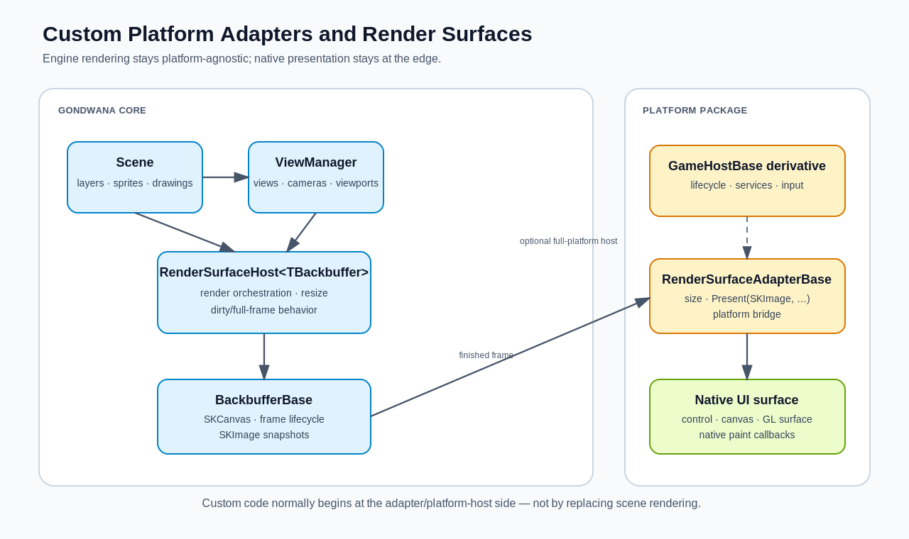
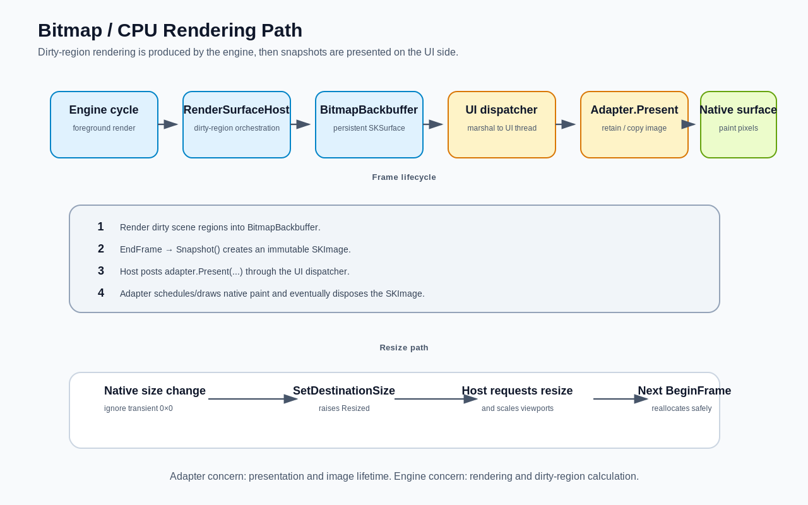
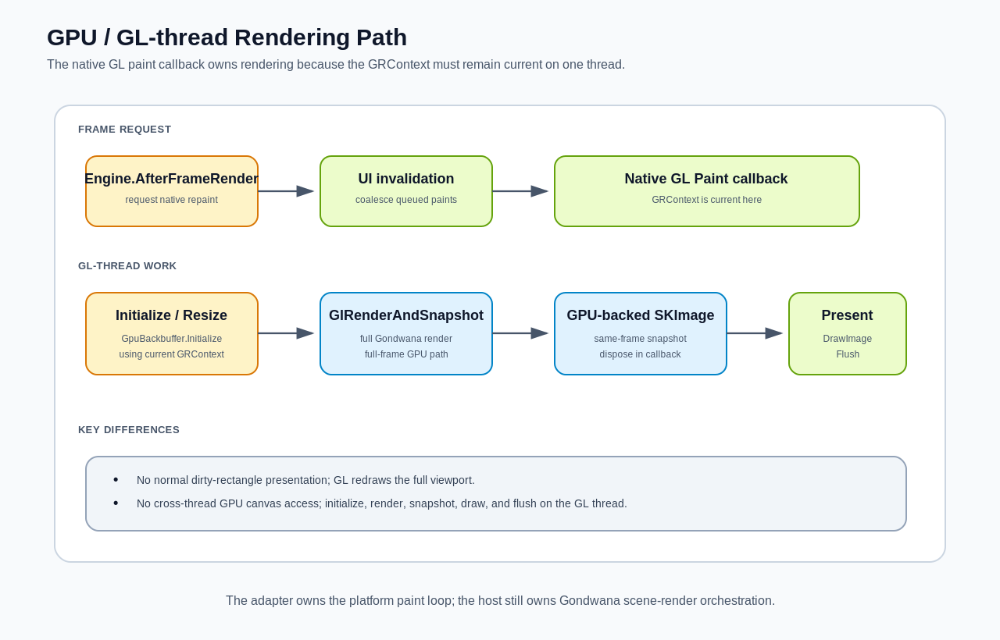

Gondwana deliberately separates **scene rendering** from **platform presentation**.

That separation is what allows the same scene, views, sprites, direct drawings, widgets, and rendering rules to target very different environments:

- WinForms
- Avalonia
- Blazor/WebAssembly
- a custom desktop control
- an editor viewport
- an off-screen or remote presentation target
- a future platform that Gondwana does not ship with

The important part is choosing the **smallest extension point that actually solves your problem**.

> **Most custom platforms do not need a custom renderer.**
>
> If Gondwana can still render into an `SKCanvas`, the usual extension point is a custom `RenderSurfaceAdapterBase` paired with the existing `RenderSurfaceHost<TBackbuffer>`.

This article covers both sides of that boundary:

1. creating a custom **platform/render-surface adapter**
2. integrating that surface into a custom **platform host**
3. choosing between the built-in bitmap and GPU backbuffers
4. adding custom drawing without replacing the renderer
5. implementing a custom `BackbufferBase` when the built-in backbuffers are not enough
6. understanding where Gondwana's current rendering abstraction stops

---

## The architecture at a glance



**Figure 1 — Gondwana keeps scene rendering in the engine and platform presentation at the edge.**

The major pieces are:

| Component | Responsibility |
|---|---|
| `Scene` | Owns world content: layers, tiles, sprites, direct drawings, and scene state. |
| `ViewManager` | Owns the views, cameras, and viewport rectangles rendered by a surface. |
| `RenderSurfaceHost<TBackbuffer>` | Coordinates scene rendering, dirty/full redraw behavior, resizing, backbuffer lifecycle, and presentation. |
| `BackbufferBase` | Provides the `SKCanvas` that Gondwana renders into and produces `SKImage` snapshots for presentation. |
| `RenderSurfaceAdapterBase` | Bridges Gondwana's rendered output to the platform's actual UI surface. |
| platform control/component | Owns native UI events, paint callbacks, layout, and usually input-event forwarding. |
| `GameHostBase` | Optional higher-level platform/application lifecycle integration: platform services, input, scene creation/binding, widget routing, engine startup, and shutdown. |

A useful mental model is:

> **The host renders. The backbuffer stores the rendered frame. The adapter presents it. The platform control owns the native surface.**

---

# Start by deciding what you actually need

Before creating a new rendering class, identify which problem you are solving.

| Goal | Recommended extension |
|---|---|
| Present Gondwana in a new UI framework or native control | Derive from `RenderSurfaceAdapterBase` and reuse a built-in backbuffer. |
| Wrap the adapter in a reusable platform control/component | Create a small platform control that owns the adapter and `RenderSurfaceHost<TBackbuffer>`. |
| Port the complete Gondwana application lifecycle to a new platform | Derive from `GameHostBase` and configure platform services/input around your render surface. |
| Add color grading, a vignette, debug overlay, scanlines, or other final-pass drawing | Use `RenderBackbufferPostScene` or `IEnginePlugin.OnPostRenderCanvas`. |
| Change how the in-memory render target is allocated, resized, snapshotted, or synchronized | Derive from `BackbufferBase`. |
| Replace SkiaSharp with a completely different renderer | This is a core renderer change, not merely a render-surface adapter. |

This distinction matters because `RenderSurfaceHostBase` is primarily **engine infrastructure**, not the normal external extension point.

The concrete `RenderSurfaceHost<TBackbuffer>` already contains Gondwana's rendering orchestration and is sealed. A custom platform should normally **instantiate it**, not replace it.

```csharp
var adapter = new MyPlatformBitmapRenderSurfaceAdapter(nativeSurface);

var host =
    new RenderSurfaceHost<BitmapBackbuffer>(adapter);

host.Bind(scene);
```

That preserves the existing rendering behavior instead of duplicating it in every platform package.

---

# The render-surface adapter contract

A platform render adapter derives from:

```csharp
public abstract class RenderSurfaceAdapterBase
```

Its public contract is intentionally small:

```csharp
public int Width { get; protected set; }
public int Height { get; protected set; }

public event Action<RenderSurfaceAdapterResizedEventArgs>? Resized;

public abstract void Present(
    SKImage bufferImage,
    SKRectI bufferRect,
    SKRect destRect);
```

The base class also provides:

```csharp
protected void SetDestinationSize(
    int destWidth,
    int destHeight);
```

`SetDestinationSize()` updates the adapter dimensions and raises `Resized` when they actually change.

The render host listens for that event and coordinates the corresponding backbuffer resize and viewport scaling.

---

## Adapter responsibilities

A custom adapter should normally do four things:

1. **Report the native surface size**
2. **Raise Gondwana resize notifications**
3. **Present an `SKImage` to the platform**
4. **Own the platform-side lifetime of the presented image**

It should generally **not**:

- traverse scene layers
- render sprites itself
- perform world-to-screen transforms
- manage cameras
- maintain refresh queues
- duplicate `RenderSurfaceHost<TBackbuffer>` rendering logic

Those are engine responsibilities.

---

# Bitmap/CPU render surfaces

The bitmap path is the simplest custom-platform path and should usually be the first implementation attempted.

Use:

```csharp
RenderSurfaceHost<BitmapBackbuffer>
```

when the platform can accept raster output, a bitmap, a Skia image, a pixel buffer, or something that can be produced from one.

The existing WinForms, Avalonia, and Blazor bitmap integrations all follow this basic architecture even though their final presentation mechanisms are very different.



**Figure 2 — Bitmap rendering occurs in the engine path; presentation is marshaled to the UI adapter.**

---

## How the bitmap path works

At a high level:

1. Gondwana renders dirty scene regions into the `BitmapBackbuffer`.
2. The host finalizes the backbuffer frame.
3. The backbuffer creates an immutable `SKImage` snapshot.
4. The host posts `RenderSurfaceAdapter.Present(...)` through the engine UI dispatcher.
5. The adapter gives that snapshot to the native UI surface.
6. The native surface paints the image.
7. The adapter disposes the snapshot when it is no longer needed.
8. The backbuffer begins the next frame.

By default, `RenderSurfaceHost<TBackbuffer>` uses dirty-rectangle presentation:

```csharp
host.RedrawDirtyRectangleOnly = true;
```

If your platform cannot efficiently repaint only part of a surface, disable it:

```csharp
host.RedrawDirtyRectangleOnly = false;
```

Gondwana will then present the entire backbuffer.

---

# A framework-neutral bitmap adapter

The following example uses a deliberately tiny fictional platform abstraction. The point is not the `IPlatformBitmapSurface` interface itself; the point is how a native platform surface maps onto `RenderSurfaceAdapterBase`.

```csharp
using SkiaSharp;

public interface IPlatformBitmapSurface
{
    int PixelWidth { get; }
    int PixelHeight { get; }

    bool IsAvailable { get; }

    event Action? SizeChanged;

    // Raised by the native platform when the surface should paint.
    event Action<SKCanvas>? Paint;

    // Requests a native repaint.
    void Invalidate();
}
```

A Gondwana adapter around that surface could look like this:

```csharp
using Gondwana.Rendering;
using SkiaSharp;

public sealed class MyBitmapRenderSurfaceAdapter
    : RenderSurfaceAdapterBase, IDisposable
{
    private readonly IPlatformBitmapSurface _surface;

    private SKImage? _currentImage;
    private readonly Queue<SKImage> _disposeAfterPaint = new();

    private SKRectI _sourceRect;
    private SKRect _destinationRect;

    private readonly SKPaint _paint = new()
    {
        BlendMode = SKBlendMode.Src,
        FilterQuality = SKFilterQuality.None,
        IsAntialias = false
    };

    public MyBitmapRenderSurfaceAdapter(
        IPlatformBitmapSurface surface)
        : base(
            Math.Max(1, surface.PixelWidth),
            Math.Max(1, surface.PixelHeight))
    {
        _surface = surface
            ?? throw new ArgumentNullException(nameof(surface));

        _surface.SizeChanged += OnSizeChanged;
        _surface.Paint += OnPaint;
    }

    private void OnSizeChanged()
    {
        var width = _surface.PixelWidth;
        var height = _surface.PixelHeight;

        // Do not report transient 0x0 layout/minimize sizes.
        if (width <= 0 || height <= 0)
            return;

        SetDestinationSize(width, height);
    }

    public override void Present(
        SKImage bufferImage,
        SKRectI bufferRect,
        SKRect destRect)
    {
        if (!_surface.IsAvailable)
        {
            bufferImage.Dispose();
            return;
        }

        var old = _currentImage;

        _currentImage = bufferImage;
        _sourceRect = bufferRect;
        _destinationRect = destRect;

        if (old is not null &&
            !ReferenceEquals(old, _currentImage))
        {
            _disposeAfterPaint.Enqueue(old);
        }

        _surface.Invalidate();
    }

    private void OnPaint(SKCanvas canvas)
    {
        var image = _currentImage;

        if (image is null)
            return;

        var source = new SKRect(
            _sourceRect.Left,
            _sourceRect.Top,
            _sourceRect.Right,
            _sourceRect.Bottom);

        canvas.DrawImage(
            image,
            source,
            _destinationRect,
            _paint);

        while (_disposeAfterPaint.Count > 0)
            _disposeAfterPaint.Dequeue().Dispose();
    }

    public void Dispose()
    {
        _surface.SizeChanged -= OnSizeChanged;
        _surface.Paint -= OnPaint;

        while (_disposeAfterPaint.Count > 0)
            _disposeAfterPaint.Dequeue().Dispose();

        _currentImage?.Dispose();
        _currentImage = null;

        _paint.Dispose();
    }
}
```

The platform-specific work is confined to:

- obtaining pixel dimensions
- receiving resize notifications
- requesting a repaint
- receiving a native paint callback
- drawing an `SKImage` into that native paint surface

Everything above that boundary remains standard Gondwana rendering.

---

## Important: the adapter owns `SKImage` lifetime after `Present`

This is one of the easiest mistakes to make in a custom adapter.

The host creates a snapshot and passes it to:

```csharp
Present(
    SKImage bufferImage,
    SKRectI bufferRect,
    SKRect destRect)
```

The host does **not** immediately dispose that image after the call.

That is intentional because some platforms cannot draw it synchronously. A desktop adapter may need to retain it until the next native paint event. A browser adapter may need to read its pixels into a transfer buffer.

Therefore:

> Once an image reaches `Present`, the adapter must make sure it is eventually disposed.

Typical strategies are:

- draw it immediately, then dispose it
- retain it as the current frame, then dispose the previous frame after painting
- copy/read the data required by the platform, then dispose the image

If the native target has already been destroyed, dispose the image immediately.

---

# Resizing correctly

The platform control owns the actual surface dimensions.

When those dimensions change, call:

```csharp
SetDestinationSize(width, height);
```

Do **not** manually resize the host or directly mutate backbuffer dimensions.

The normal chain is:

```text
native control resized
        ↓
adapter.SetDestinationSize(...)
        ↓
RenderSurfaceAdapterBase.Resized
        ↓
RenderSurfaceHost<TBackbuffer>
        ↓
backbuffer resize request
        ↓
viewports scaled proportionally
        ↓
full scene refresh
```

For `BitmapBackbuffer`, the resize is requested from the UI side but the actual surface reallocation occurs safely during the next render-frame setup.

---

## Avoid zero-sized adapter dimensions

Many UI frameworks temporarily report `0x0` while:

- minimizing a window
- removing a control from layout
- creating a handle
- performing initial measurement
- switching tabs or docking layouts

Do not pass those transient values through `SetDestinationSize()`.

Prefer:

```csharp
if (width > 0 && height > 0)
    SetDestinationSize(width, height);
```

Also make sure the adapter has positive dimensions **before** constructing the render host.

`RenderSurfaceHost<TBackbuffer>` rejects adapters whose initial width or height is non-positive.

If a platform cannot know its real dimensions until after layout, either:

- delay creation of the host, or
- initialize the adapter with a harmless positive placeholder such as `1x1`, then report the real size when available

Blazor uses this general delayed-size pattern.

---

# Wrapping the adapter in a platform render-surface control

A convenient platform package usually exposes more than a raw adapter.

It normally provides a native control/component that owns both:

- the platform adapter
- the Gondwana render host

Conceptually:

```csharp
using Gondwana.Rendering;
using Gondwana.Rendering.Backbuffers;

public sealed class MyRenderSurface : IDisposable
{
    public MyBitmapRenderSurfaceAdapter Adapter { get; }

    public RenderSurfaceHost<BitmapBackbuffer> Host { get; }

    public MyRenderSurface(IPlatformBitmapSurface nativeSurface)
    {
        Adapter =
            new MyBitmapRenderSurfaceAdapter(nativeSurface);

        Host =
            new RenderSurfaceHost<BitmapBackbuffer>(Adapter);
    }

    public void Dispose()
    {
        Host.Dispose();
        Adapter.Dispose();
    }
}
```

That produces a platform-facing API similar in spirit to Gondwana's built-in render-surface controls.

Application code can then interact with:

```csharp
renderSurface.Host.Bind(scene);
```

and with:

```csharp
renderSurface.Host.ViewManager
```

without caring how the final pixels reach the screen.

---

## Host registration is automatic

Constructing a `RenderSurfaceHost<TBackbuffer>` also registers the host with Gondwana's `RenderSurfaceHostRegistry`.

That is how the engine discovers active render surfaces during its frame lifecycle.

You do not normally need a separate platform-side registration step:

```csharp
var host =
    new RenderSurfaceHost<BitmapBackbuffer>(adapter);
```

Disposing the host unregisters it.

This is another reason to let the platform control or component clearly own the host lifetime.

---

## One scene binds to one render-surface host

A `Scene` can be bound to only one render-surface host at a time.

This is intentional ownership, not a platform limitation.

If a second host attempts to bind the same scene, Gondwana rejects the binding rather than allowing two hosts to race over the scene's render state and refresh queues.

For multiple simultaneous views of the same scene on one surface, use the host's:

```csharp
host.ViewManager
```

That is the intended mechanism for:

- split screen
- picture-in-picture
- minimaps
- multiple cameras
- overlapping viewports

Do not implement those cases by creating several hosts and binding the same `Scene` to all of them.

---

# GPU/GL-thread render surfaces

A GPU-backed render surface is not merely a faster version of the bitmap adapter.

It uses a different threading and presentation model.

Use:

```csharp
RenderSurfaceHost<GpuBackbuffer>
```

when the platform can provide a Skia-compatible GPU/GL context and a paint callback where that context is current.

A native GPU API by itself is not enough. If the platform cannot expose a compatible Skia GPU context and surface, start with the bitmap path instead.



**Figure 3 — GPU rendering is driven from the native GL paint callback so rendering and presentation remain on the owning GL thread.**

---

## The critical GPU rule

After `GpuBackbuffer.Initialize(...)` has attached the backbuffer to a `GRContext`, all work that touches that GPU surface must remain on the thread where that context is current.

That means the GPU adapter drives rendering from the native GL paint callback.

The engine's normal background bitmap-render path does not render a `GpuBackbuffer`.

Instead, the platform callback uses:

```csharp
using var image =
    host.GlRenderAndSnapshot();
```

`GlRenderAndSnapshot()`:

1. renders the Gondwana scene
2. ends the GPU backbuffer frame
3. snapshots the GPU surface
4. begins the next backbuffer frame
5. returns the GPU-backed `SKImage`

The adapter then draws that image to the native window surface.

The snapshot should be disposed **inside the same paint callback**.

---

# A simplified GPU adapter skeleton

Every GL-capable UI toolkit exposes its context differently, so the exact platform surface API will vary.

The Gondwana side typically follows this shape:

```csharp
using Gondwana;
using Gondwana.Rendering;
using Gondwana.Rendering.Backbuffers;
using SkiaSharp;

public sealed class MyGpuRenderSurfaceAdapter
    : RenderSurfaceAdapterBase, IDisposable
{
    private RenderSurfaceHostBase? _host;
    private GpuBackbuffer? _backbuffer;

    private int _resizePending;
    private int _invalidatePending;

    public MyGpuRenderSurfaceAdapter(
        int initialWidth,
        int initialHeight)
        : base(
            Math.Max(1, initialWidth),
            Math.Max(1, initialHeight))
    {
    }

    public void SetHost(RenderSurfaceHostBase host)
    {
        _host = host
            ?? throw new ArgumentNullException(nameof(host));

        _backbuffer = host.Backbuffer as GpuBackbuffer
            ?? throw new InvalidOperationException(
                "This adapter requires GpuBackbuffer.");

        Engine.Instance.AfterFrameRender += OnAfterFrameRender;
    }

    public void NativeSizeChanged(
        int width,
        int height)
    {
        if (width <= 0 || height <= 0)
            return;

        SetDestinationSize(width, height);

        Interlocked.Exchange(
            ref _resizePending,
            1);
    }

    private void OnAfterFrameRender()
    {
        if (Interlocked.CompareExchange(
                ref _invalidatePending,
                1,
                0) != 0)
        {
            return;
        }

        Engine.Instance.UiDispatcher?.Post(
            RequestNativePaint);
    }

    // Call this from the platform's GL paint callback.
    public void PaintOnGlThread(
        GRContext grContext,
        SKCanvas windowCanvas,
        int framebufferWidth,
        int framebufferHeight)
    {
        Interlocked.Exchange(
            ref _invalidatePending,
            0);

        if (_backbuffer is null ||
            _host is null)
        {
            windowCanvas.Clear(SKColors.Black);
            return;
        }

        if (Interlocked.Exchange(
                ref _resizePending,
                0) == 1)
        {
            _backbuffer.Initialize(
                grContext,
                Width,
                Height);
        }

        using var image =
            _host.GlRenderAndSnapshot();

        if (image is null)
        {
            windowCanvas.Clear(SKColors.Black);
            return;
        }

        var destination = SKRect.Create(
            0,
            0,
            framebufferWidth,
            framebufferHeight);

        windowCanvas.DrawImage(
            image,
            destination);

        grContext.Flush();

        _backbuffer.RecordFrame();
    }

    // The normal bitmap presentation path is not used by
    // a GL-thread-driven adapter.
    public override void Present(
        SKImage bufferImage,
        SKRectI bufferRect,
        SKRect destRect)
    {
        bufferImage.Dispose();
    }

    private void RequestNativePaint()
    {
        // Platform-specific:
        // invalidate/request the GL surface to paint.
    }

    public void Dispose()
    {
        Engine.Instance.AfterFrameRender -=
            OnAfterFrameRender;
    }
}
```

This example omits platform-specific context acquisition, but the important Gondwana rules are present.

---

# Initializing the GPU backbuffer

The host can create a `GpuBackbuffer` before the native `GRContext` exists.

That is expected.

The built-in GPU backbuffer begins with a temporary CPU raster surface. When the native GL context becomes available, initialize the real GPU target on the GL thread:

```csharp
var adapter =
    new MyGpuRenderSurfaceAdapter(width, height);

var host =
    new RenderSurfaceHost<GpuBackbuffer>(adapter);

adapter.SetHost(host);

// Later, from the native GL thread:
var gpuBackbuffer =
    (GpuBackbuffer)host.Backbuffer;

gpuBackbuffer.Initialize(
    grContext,
    adapter.Width,
    adapter.Height);
```

A production adapter normally performs that initialization automatically the first time its native GL paint callback receives a valid context.

On later resizes, call `Initialize(...)` again on the GL thread with the new dimensions.

For `GpuBackbuffer`, `RequestResize()` is intentionally a no-op. GPU resource recreation must happen where the GL context is valid.

---

# GPU rendering does not use dirty-region presentation

`GpuBackbuffer.IsGlThreadRendered` returns `true`.

That changes host behavior.

The GPU path:

- does not consume the normal refresh queue
- does not accumulate a backbuffer dirty rectangle
- redraws the full viewport for each GL paint
- renders and presents synchronously on the GL thread

This is deliberate.

A dirty-region queue is useful when a CPU backbuffer is persistent and selected regions can be cheaply copied to a UI surface.

It is much less useful when the GL paint callback is already presenting a full GPU frame and the rendering context must remain on one thread.

Do not try to force the bitmap dirty-rectangle pipeline onto the GPU path.

---

# `GRContext` ownership must match

For efficient GPU presentation, the backbuffer's GPU surface and the native presentation surface should participate in the same compatible Skia GPU context.

The built-in WinForms GPU implementation follows this pattern:

```text
SKGLControl PaintSurface
        ↓
capture current GRContext
        ↓
GpuBackbuffer.Initialize(GRContext, width, height)
        ↓
Gondwana renders into off-screen GPU surface
        ↓
GlRenderAndSnapshot()
        ↓
draw GPU-backed SKImage to the window surface
```

That lets the final presentation remain a GPU-side operation instead of performing an expensive GPU-to-CPU readback every frame.

---

# VSync, frame requests, and native paint loops

`GpuBackbuffer` stores GPU-related configuration such as:

```csharp
gpuBackbuffer.VSync
gpuBackbuffer.MsaaSampleCount
gpuBackbuffer.TargetFps
```

The backbuffer does not magically configure the native windowing toolkit.

A platform GPU adapter is responsible for translating relevant settings to its native GL control when that toolkit exposes them.

For example, if the native control exposes a VSync property, the adapter can observe:

```csharp
gpuBackbuffer.VSync
```

and apply it to the platform control.

Similarly, the platform decides how a new native paint is requested.

The built-in WinForms GPU adapter listens to the engine's `AfterFrameRender` event and posts an invalidation to the UI thread. It also coalesces invalidation requests so a fast engine loop cannot flood the UI message queue.

That is a good pattern to copy when the target framework uses invalidation-driven painting.

---

# Custom rendering without a custom backbuffer

A surprisingly large number of "custom renderer" requirements are actually **post-scene drawing requirements**.

Examples:

- vignette
- letterboxing
- CRT/scanline overlay
- debug information
- editor selection outlines
- fade-to-black
- whole-screen tint
- custom compositing
- a final Skia filter pass

For a single render surface, use:

```csharp
host.RenderBackbufferPostScene += canvas =>
{
    canvas.Save();

    try
    {
        using var paint = new SKPaint
        {
            Color = new SKColor(
                red: 0,
                green: 0,
                blue: 0,
                alpha: 64)
        };

        canvas.DrawRect(
            0,
            0,
            host.Backbuffer.Width,
            host.Backbuffer.Height,
            paint);
    }
    finally
    {
        canvas.Restore();
    }
};
```

This hook runs after the scene has been rendered but before the frame is finalized and presented.

The canvas is in full-surface screen space at this point.

---

## Per-surface hook vs engine plugin

Use:

```csharp
RenderSurfaceHost<TBackbuffer>.RenderBackbufferPostScene
```

when the effect belongs to one surface or one game instance.

Use:

```csharp
IEnginePlugin.OnPostRenderCanvas(...)
```

when the same behavior belongs to an engine-wide plugin.

The threading rule follows the backbuffer:

| Surface | Post-render hook thread |
|---|---|
| bitmap/CPU | engine render/background thread |
| GPU/GL | native GL thread while the `GRContext` is current |

Do not marshal a GPU canvas operation to another thread.

Also note that a CPU post-scene hook causes the host to mark the full backbuffer dirty, because Gondwana cannot know which pixels your arbitrary canvas code modified.

If you only need a localized world-space or view-space graphic, a normal `DirectDrawing` may be more efficient.

---

# When a custom `BackbufferBase` is appropriate

A custom adapter changes **where the finished frame goes**.

A custom backbuffer changes **what Gondwana renders into**.

That is a much deeper extension.

Consider a custom `BackbufferBase` when you need something such as:

- a specialized `SKSurface` allocation strategy
- unusual pixel formats
- a custom off-screen render target
- special synchronization around a shared native surface
- a nonstandard snapshot strategy
- a platform-specific GPU surface that still exposes an `SKCanvas`
- custom frame begin/end behavior

Do not create a custom backbuffer merely because you are adding a new UI framework.

The built-in `BitmapBackbuffer` and `GpuBackbuffer` are deliberately platform-neutral enough to be paired with new adapters.

---

# The `BackbufferBase` contract

A custom backbuffer must provide the core rendering primitives Gondwana expects.

Conceptually:

```csharp
using System.Drawing;
using Gondwana.Drawing;
using Gondwana.Rendering.Backbuffers;
using SkiaSharp;

public sealed class MyBackbuffer : BackbufferBase
{
    private SKSurface _surface;

    // Important: RenderSurfaceHost<TBackbuffer> can use
    // Activator.CreateInstance(type, width, height) for
    // custom backbuffer types, so expose this constructor.
    public MyBackbuffer(
        int width,
        int height)
        : base(width, height)
    {
        _surface = CreateSurface(
            width,
            height);
    }

    public override SKCanvas Canvas =>
        _surface.Canvas;

    protected override void BeginFrame()
    {
        Canvas.RestoreToCount(1);
        Canvas.Save();
        Canvas.ResetMatrix();

        Canvas.ClipRect(
            new SKRect(
                0,
                0,
                Width,
                Height));
    }

    protected override void EndFrame()
    {
        _surface.Flush();
    }

    protected override SKImage Snapshot()
    {
        return _surface.Snapshot();
    }

    protected override void DrawTileFrame(
        Tile tile,
        RectangleF destRectScreen)
    {
        var image =
            tile.CurrentFrame.SkImage;

        if (image is null)
            return;

        Canvas.DrawImage(
            image,
            new SKRect(
                destRectScreen.Left,
                destRectScreen.Top,
                destRectScreen.Right,
                destRectScreen.Bottom));
    }

    protected override void RequestResize(
        int width,
        int height)
    {
        if (width <= 0 ||
            height <= 0)
        {
            return;
        }

        _surface.Dispose();

        _surface = CreateSurface(
            width,
            height);

        UpdateSize(
            width,
            height);
    }

    private static SKSurface CreateSurface(
        int width,
        int height)
    {
        var info =
            new SKImageInfo(
                width,
                height);

        return SKSurface.Create(info)
            ?? throw new InvalidOperationException(
                "Unable to create render surface.");
    }

    public override void Dispose()
    {
        _surface.Dispose();
        base.Dispose();
    }
}
```

Because `BackbufferBase` members such as `BeginFrame()`, `EndFrame()`, and `Snapshot()` are declared `protected internal` in Gondwana, an override implemented from another assembly is normally declared `protected override`.

Then the standard host can use it:

```csharp
var host =
    new RenderSurfaceHost<MyBackbuffer>(adapter);
```

---

## Custom backbuffers need a public `(int width, int height)` constructor

`RenderSurfaceHost<TBackbuffer>` has explicit construction paths for Gondwana's built-in:

- `BitmapBackbuffer`
- `GpuBackbuffer`

For another backbuffer type it falls back to runtime construction with width and height.

Therefore a custom backbuffer intended for:

```csharp
RenderSurfaceHost<MyBackbuffer>
```

should expose:

```csharp
public MyBackbuffer(
    int width,
    int height)
```

If the target uses aggressive trimming or AOT compilation, remember that reflection-based construction may require preservation metadata or a Gondwana core integration for that custom type.

The built-in backbuffers have explicit construction paths partly to avoid that problem on browser/WASM targets.

---

# `IsGlThreadRendered` is a behavioral switch

`BackbufferBase` defaults to:

```csharp
public virtual bool IsGlThreadRendered => false;
```

When it remains `false`, Gondwana uses the normal CPU/bitmap-style engine path.

When it returns `true`, the host treats the backbuffer as a GL-thread-driven surface:

- the normal engine render loop skips it
- the adapter is expected to drive rendering
- full-frame GPU rendering is used
- dirty-rectangle presentation is bypassed
- `GlRenderAndSnapshot()` becomes the expected presentation path

Do not override this property casually.

It is not a performance hint. It changes who owns the rendering thread.

---

# Gondwana still expects Skia

Even with a custom `BackbufferBase`, Gondwana's current rendering contract is still Skia-based.

The backbuffer must expose:

```csharp
SKCanvas Canvas
```

and snapshots are represented as:

```csharp
SKImage
```

Tiles, direct drawings, post-render hooks, and other rendering code ultimately target that Skia canvas abstraction.

Therefore a native renderer implemented directly in:

- Direct3D
- Vulkan
- Metal
- another non-Skia drawing API

cannot be dropped in solely by implementing `RenderSurfaceAdapterBase`.

You would need one of two things:

1. a Skia surface/context backed by that native graphics API, while preserving the `SKCanvas` contract, or
2. a deeper Gondwana renderer change that replaces the current Skia rendering abstraction

That boundary is intentional and worth preserving unless the engine itself is being redesigned.

---

# Building a complete custom platform host

A render-surface adapter is enough when you are embedding Gondwana into an application that already manages its own lifecycle.

If you are creating a **first-class Gondwana platform package**, rendering is only one part of the job.

`GameHostBase` provides the higher-level lifecycle seam.

Its initialization sequence includes:

```text
Configure logging
        ↓
Configure platform
        ↓
Configure input
        ↓
Load content
        ↓
Create scene graph
        ↓
Bind scene
        ↓
Create scene objects
        ↓
Initialize engine
        ↓
Start engine
```

A minimal platform host might look like:

```csharp
using Gondwana.Hosting;

public abstract class MyPlatformGameHost
    : GameHostBase
{
    protected MyRenderSurface RenderSurface
    {
        get;
    }

    protected MyPlatformGameHost(
        MyRenderSurface renderSurface)
    {
        RenderSurface =
            renderSurface
            ?? throw new ArgumentNullException(
                nameof(renderSurface));
    }

    protected override void ConfigurePlatform()
    {
        // Register any platform-specific services here:
        // audio formats, clipboard services, etc.
    }

    protected override void ConfigureKeyboard()
    {
        // Install the platform keyboard adapter/poller.
    }

    protected override void ConfigureMouse()
    {
        // Install the platform mouse adapter/poller.
    }

    protected override void ConfigureGamepads()
    {
        // Install the desired gamepad manager, if any.
    }

    protected override void ConfigureTouch()
    {
        // Install the platform touch adapter, if any.
    }

    protected override void BindScene()
    {
        if (Scene is null)
        {
            throw new InvalidOperationException(
                "Scene has not been created.");
        }

        RenderSurface.Host.Bind(
            Scene,
            limitCameraToWorldBoundPx: false);
    }

    protected override void OnInputConfigured()
    {
        InitializeWidgetInput(
            RenderSurface.Host);
    }
}
```

That follows the same broad separation used by Gondwana's platform hosting packages:

```text
Gondwana.Hosting
        ↓
platform-specific GameHostBase derivative
        ↓
platform render-surface control/component
        ↓
RenderSurfaceAdapterBase
        ↓
RenderSurfaceHost<TBackbuffer>
```

---

## Synchronization context matters

`GameHostBase.Initialize()` ultimately starts the engine with a `SynchronizationContext`.

By default it uses:

```csharp
SynchronizationContext.Current
```

Therefore a platform host should usually initialize Gondwana from its UI thread after the platform has installed the appropriate synchronization context.

If the platform uses a different dispatch model, `GameHostBase` provides:

```csharp
protected virtual SynchronizationContext? GetSynchronizationContext()
```

and:

```csharp
protected virtual void StartEngineCore(
    SynchronizationContext syncContext)
```

as advanced host-level seams.

The important invariant is that Gondwana's UI dispatcher must ultimately be able to marshal presentation work back to the platform thread that owns the native UI surface.

---

# Input belongs beside the platform surface, not inside the renderer

A full platform integration normally has two parallel responsibilities:

```text
               PLATFORM PACKAGE
                       │
        ┌──────────────┴──────────────┐
        │                             │
        ▼                             ▼
 Rendering integration           Input integration
        │                             │
 RenderSurfaceAdapterBase        keyboard adapter
 native paint/resize             mouse adapter
 control/component               touch adapter
        │                        gamepad manager
        └──────────────┬──────────────┘
                       ▼
                   Gondwana
```

The render adapter should not become a grab bag for keyboard, mouse, touch, or gamepad logic.

The native render control may **forward** input events to the surrounding platform control or input adapter, but the rendering and input abstractions remain separate.

That keeps custom surfaces usable in editors, previews, tools, and applications that may want different input behavior.

---

# A practical implementation order

For a new platform, build the integration in this order.

## 1. Get a bitmap surface on screen

Implement:

```csharp
RenderSurfaceAdapterBase
```

and pair it with:

```csharp
RenderSurfaceHost<BitmapBackbuffer>
```

First prove that:

- the adapter reports a valid size
- a scene renders
- resizing works
- full-frame presentation works
- `SKImage` objects are disposed correctly

At this stage, it is reasonable to disable dirty-region presentation:

```csharp
host.RedrawDirtyRectangleOnly = false;
```

Correctness first.

---

## 2. Add dirty-region presentation if the platform benefits from it

Once full-frame presentation is solid:

```csharp
host.RedrawDirtyRectangleOnly = true;
```

Make sure the adapter correctly respects:

```csharp
bufferRect
destRect
```

and that the platform can update only the affected destination region without leaving stale pixels behind.

---

## 3. Add platform input

Wire:

- keyboard
- mouse
- touch
- gamepad

using the appropriate Gondwana input abstractions.

If the platform supports Gondwana widgets, initialize:

```csharp
InitializeWidgetInput(renderSurface.Host);
```

after the render host and input pollers exist.

---

## 4. Add the higher-level `GameHostBase` integration

Once rendering and input work independently, wrap them in a platform host so startup, scene binding, engine lifecycle, and disposal are consistent.

---

## 5. Add GPU rendering only if the platform can support the threading contract

Do not start with GPU unless the target requires it.

The bitmap implementation gives you a much simpler way to validate:

- scene correctness
- viewports
- resize behavior
- input coordinates
- platform lifecycle

Then the GPU adapter can be treated as a presentation/threading optimization rather than a simultaneous platform-porting and rendering problem.

---

# Common mistakes

## Rendering the scene inside `Present()`

Do not do this:

```text
Present()
  -> iterate scene
  -> draw layers
  -> draw sprites
```

`Present()` receives a frame Gondwana has already rendered.

It should present that frame.

---

## Subclassing `RenderSurfaceHostBase` for every platform

Normally unnecessary.

Use:

```csharp
RenderSurfaceHost<BitmapBackbuffer>
```

or:

```csharp
RenderSurfaceHost<GpuBackbuffer>
```

and put platform behavior in the adapter/control/host package.

---

## Forgetting to dispose snapshots

Every `SKImage` passed to the adapter must eventually be disposed.

Long-running rendering makes even a small per-frame leak very large very quickly.

---

## Reporting `0x0` during layout

Transient zero sizes can break resize assumptions and produce invalid surfaces.

Ignore them until the native target has a real positive size.

---

## Resizing GPU resources from the UI resize event

A resize event may occur on the UI thread, but GPU resource recreation must happen on the GL thread where the correct context is current.

Record the resize request, then perform:

```csharp
GpuBackbuffer.Initialize(...)
```

from the native GL callback.

---

## Posting GPU canvas work to another thread

Do not.

When using a GPU backbuffer, render and final Skia GPU presentation on the thread where the `GRContext` is current.

---

## Creating a custom backbuffer for a simple overlay

Use:

```csharp
RenderBackbufferPostScene
```

or a `DirectDrawing`.

A backbuffer is infrastructure, not the first customization tool.

---

## Assuming an adapter replaces SkiaSharp

It does not.

The adapter changes the **presentation edge**.

Gondwana's renderer still targets `SKCanvas`.

---

# Testing a custom adapter

A custom platform integration deserves tests at two levels.

## Adapter-level tests

Verify:

- initial dimensions are positive
- resize events update `Width` and `Height`
- duplicate sizes do not raise unnecessary resize notifications
- invalid/transient zero sizes are ignored by your platform wrapper
- `Present()` disposes images when the target is unavailable
- replaced frames are eventually disposed
- source/destination rectangles are honored
- disposal unsubscribes native events

---

## Integration tests

Verify:

- `RenderSurfaceHost<TBackbuffer>` can be constructed
- a scene can be bound
- resize requests reach the backbuffer
- viewports scale as expected
- full redraw occurs after resize
- bitmap presentation occurs on the UI thread
- GPU rendering occurs on the GL thread
- GPU resize initialization occurs on the GL thread
- widgets receive input relative to the correct render surface
- disposing the platform control releases the host and adapter

For GPU integrations, also test repeated resize/minimize/restore cycles. Those are where context-lifetime and zero-size bugs tend to hide.

---

# Reference implementation map

The built-in platform implementations are the best examples of the intended separation.

## Core rendering

- [`Gondwana/Rendering/RenderSurfaceAdapterBase.cs`](https://isthimius.github.io/Gondwana/api/latest/RenderSurfaceAdapterBase_8cs_source.html)
- [`Gondwana/Rendering/RenderSurfaceHostBase.cs`](https://isthimius.github.io/Gondwana/api/latest/RenderSurfaceHostBase_8cs_source.html)
- [`Gondwana/Rendering/RenderSurfaceHost.cs`](https://isthimius.github.io/Gondwana/api/latest/RenderSurfaceHost_8cs_source.html)
- [`Gondwana/Rendering/Backbuffers/BackbufferBase.cs`](https://isthimius.github.io/Gondwana/api/latest/BackbufferBase_8cs_source.html)
- [`Gondwana/Rendering/Backbuffers/BitmapBackbuffer.cs`](https://isthimius.github.io/Gondwana/api/latest/BitmapBackbuffer_8cs_source.html)
- [`Gondwana/Rendering/Backbuffers/GpuBackbuffer.cs`](https://isthimius.github.io/Gondwana/api/latest/GpuBackbuffer_8cs_source.html)

## WinForms

Bitmap:

- [`Gondwana.WinForms/Rendering/WinFormBitmapRenderSurfaceAdapter.cs`](https://isthimius.github.io/Gondwana/api/latest/WinFormBitmapRenderSurfaceAdapter_8cs_source.html)
- [`Gondwana.WinForms/Rendering/WinFormBitmapRenderSurfaceControl.cs`](https://isthimius.github.io/Gondwana/api/latest/WinFormBitmapRenderSurfaceControl_8cs_source.html)

GPU:

- [`Gondwana.WinForms/Rendering/WinFormGpuRenderSurfaceAdapter.cs`](https://isthimius.github.io/Gondwana/api/latest/WinFormGpuRenderSurfaceAdapter_8cs_source.html)
- [`Gondwana.WinForms/Rendering/WinFormGpuRenderSurfaceControl.cs`](https://isthimius.github.io/Gondwana/api/latest/WinFormGpuRenderSurfaceControl_8cs_source.html)

Hosting:

- [`Gondwana.WinForms.Hosting/WinFormsGameHostBase.cs`](https://isthimius.github.io/Gondwana/api/latest/WinFormsGameHostBase_8cs_source.html)
- [`Gondwana.WinForms.Hosting/WinFormsBitmapGameHost.cs`](https://isthimius.github.io/Gondwana/api/latest/WinFormsBitmapGameHost_8cs_source.html)
- [`Gondwana.WinForms.Hosting/WinFormsGpuGameHost.cs`](https://isthimius.github.io/Gondwana/api/latest/WinFormsGpuGameHost_8cs_source.html)

## Avalonia

- [`Gondwana.Avalonia/Rendering/AvaloniaBitmapRenderSurfaceAdapter.cs`](https://isthimius.github.io/Gondwana/api/latest/AvaloniaBitmapRenderSurfaceAdapter_8cs_source.html)
- [`Gondwana.Avalonia/Rendering/AvaloniaBitmapRenderSurfaceControl.cs`](https://isthimius.github.io/Gondwana/api/latest/AvaloniaBitmapRenderSurfaceControl_8cs_source.html)
- [`Gondwana.Avalonia/Rendering/AvaloniaGpuRenderSurfaceAdapter.cs`](https://isthimius.github.io/Gondwana/api/latest/AvaloniaGpuRenderSurfaceAdapter_8cs_source.html)
- [`Gondwana.Avalonia/Rendering/AvaloniaGpuRenderSurfaceControl.cs`](https://isthimius.github.io/Gondwana/api/latest/AvaloniaGpuRenderSurfaceControl_8cs_source.html)
- platform hosting under [`Gondwana.Avalonia.Hosting/`](https://github.com/Isthimius/Gondwana/tree/master/Gondwana.Avalonia.Hosting)

## Blazor

- [`Gondwana.Blazor/Rendering/BlazorBitmapRenderSurfaceAdapter.cs`](https://isthimius.github.io/Gondwana/api/latest/BlazorBitmapRenderSurfaceAdapter_8cs_source.html)
- [`Gondwana.Blazor/Rendering/BlazorBitmapRenderSurfaceComponent.razor`](https://github.com/Isthimius/Gondwana/blob/master/Gondwana.Blazor/Rendering/BlazorBitmapRenderSurfaceComponent.razor)
- [`Gondwana.Blazor/Rendering/BlazorBitmapRenderSurfaceComponent.razor.cs`](https://isthimius.github.io/Gondwana/api/latest/BlazorBitmapRenderSurfaceComponent_8razor_8cs_source.html)
- platform hosting under [`Gondwana.Blazor.Hosting/`](https://github.com/Isthimius/Gondwana/tree/master/Gondwana.Blazor.Hosting)

The three implementations are useful precisely because they solve presentation very differently while preserving the same engine-side model.

---

# Related wiki topics

- [[Backbuffers]]
  - [[Bitmap Rendering Path]]
  - [[GL Rendering Path]]
- [[Refresh Queues]]
- [[Dirty Rectangles]]
- [[Using Views and Cameras]]
- [[DirectDrawing]]
- [[Input Handling]]

---

# Mental model

When adding a platform, keep this boundary in mind:

```text
GAME / ENGINE CODE
    Scene
    Views
    Sprites
    DirectDrawings
    Widgets
        │
        ▼
RENDER ORCHESTRATION
    RenderSurfaceHost<TBackbuffer>
        │
        ▼
RENDER TARGET
    BitmapBackbuffer
        or
    GpuBackbuffer
        │
        ▼
PLATFORM BOUNDARY
    RenderSurfaceAdapterBase
        │
        ▼
NATIVE UI
    Control / Window / Canvas / GL Surface
```

If the destination changes, customize the **adapter**.

If application lifecycle and input change, customize the **platform host**.

If the render-target storage model changes, customize the **backbuffer**.

If only final-frame drawing changes, use the **post-render hook**.

If `SKCanvas` itself is no longer an acceptable rendering abstraction, you have crossed the boundary into a **core renderer change**.

That separation is what lets Gondwana remain code-first and platform-agnostic without making every platform implementation reimplement the engine.
