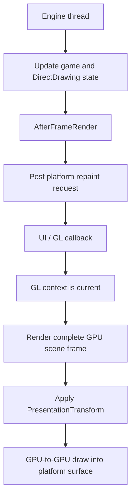
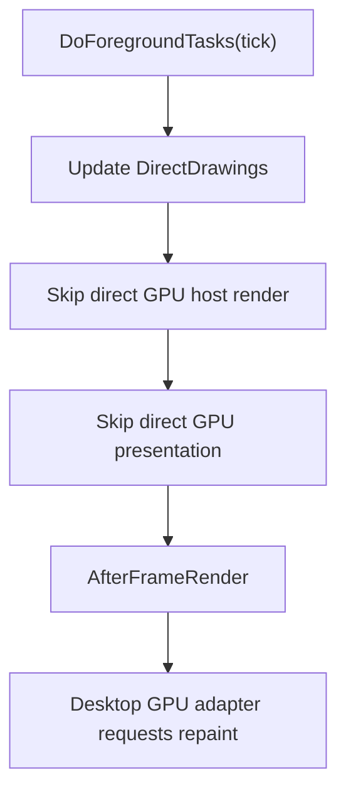
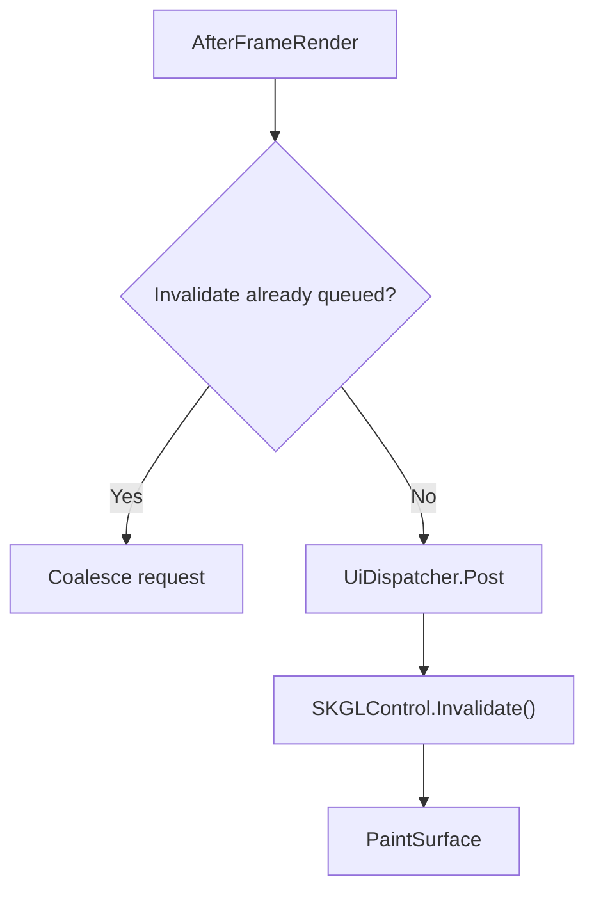
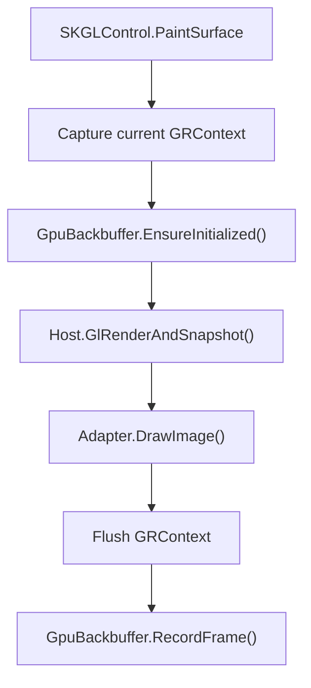

This page documents Gondwana's **desktop OpenGL rendering path** for WinForms and Avalonia.

The browser GPU path uses the same `GpuBackbuffer` and much of the same host-level rendering code, but its frame-driving model is different enough to deserve separate treatment. See [[WebGL Rendering Path]] for Blazor/WebGL.

The desktop GL path is selected whenever a render surface uses a Backbuffer for which:

```csharp
surface.Backbuffer.IsGlThreadRendered == true
```

`GpuBackbuffer` returns `true`.

Unlike bitmap rendering, scene rendering is not performed directly by the engine's normal foreground render loop. The engine prepares foreground state and requests a platform repaint; the native GL callback performs rendering and presentation while the required OpenGL context is current.

---

## Why desktop GL rendering is callback-driven

An initialized `GpuBackbuffer` owns an Skia GPU `SKSurface` associated with a `GRContext`.

GPU operations must execute while the corresponding platform GL context is current. On WinForms and Avalonia, the reliable place for that is the platform's GL paint/render callback, not Gondwana's background engine thread.

The division of responsibility is therefore:

- the engine controls **when a new foreground frame is requested**;
- the platform controls **when the GL callback can execute**; and
- scene rendering, snapshotting, scaling, and presentation occur synchronously inside that callback.



---

## Entry from the engine cycle

`Engine.Cycle()` performs simulation/background work and uses `EngineConfiguration.TargetFPS` to determine when foreground work is due.

Within `DoForegroundTasks(tick)`:

1. `BeforeFrameRender` is raised.
2. `DirectDrawingManager.UpdateAll(tick)` updates drawing state.
3. GL-thread-rendered hosts are skipped by the engine's direct Backbuffer rendering loop.
4. GL-thread-rendered hosts are skipped by the engine's direct presentation loop.
5. `AfterFrameRender` is raised.

Conceptually:

```csharp
if (!surface.Backbuffer.IsGlThreadRendered)
    surface.RenderToBackbuffer(tick);
```

and later:

```csharp
if (!surface.Backbuffer.IsGlThreadRendered)
    surface.PresentBackbufferToAdapter();
```

For a desktop `GpuBackbuffer`, `AfterFrameRender` means **foreground state preparation is complete and the platform may request a GL repaint**. It does not mean the GPU frame has already been rendered.



---

## WinForms GL path

The WinForms implementation uses:

- `WinFormGpuRenderSurfaceControl`;
- `WinFormGpuRenderSurfaceAdapter`;
- `RenderSurfaceHost<GpuBackbuffer>`; and
- SkiaSharp's `SKGLControl`.

### Frame request

`WinFormGpuRenderSurfaceAdapter.SetHost(...)` subscribes to `Engine.AfterFrameRender`.

When a foreground frame completes, the adapter posts `SKGLControl.Invalidate()` through `Engine.UiDispatcher`.

A `_pendingInvalidate` flag coalesces queued dispatcher callbacks so a fast engine loop cannot flood the WinForms message queue with duplicate repaint requests.



### PaintSurface

Inside the native GL callback the adapter:

1. synchronizes the current WinForms VSync setting;
2. captures or refreshes the active `GRContext`;
3. lets `GpuBackbuffer.EnsureInitialized(grContext)` perform first-time GPU initialization or apply an explicit logical-resolution request;
4. calls `Host.GlRenderAndSnapshot()`;
5. applies the current presentation transform through `RenderSurfaceAdapterBase.DrawImage(...)`;
6. draws the GPU-backed image into the native GL surface;
7. flushes the GPU context; and
8. records the completed frame.



The Backbuffer snapshot and the native destination surface share GPU context/resources. This is a GPU-to-GPU presentation path; Gondwana does not read the completed frame back into CPU memory.

---

## Avalonia GL path

The Avalonia implementation uses:

- `AvaloniaGpuRenderSurfaceControl`, derived from `OpenGlControlBase`;
- `AvaloniaGpuRenderSurfaceAdapter`;
- `RenderSurfaceHost<GpuBackbuffer>`; and
- a Skia `GRContext` created from Avalonia's current OpenGL context.

`AvaloniaGpuRenderSurfaceAdapter.AttachToEngine(...)` subscribes to `AfterFrameRender` and posts `RequestNextFrameRendering()` through Gondwana's UI dispatcher.

### Initialization

`OnOpenGlInit` creates the Skia `GRContext` while Avalonia's OpenGL context is current, updates the adapter's physical destination dimensions, and initializes the `GpuBackbuffer`.

### OnOpenGlRender

For each render callback Gondwana:

1. resets Skia's cached GL state because Avalonia's compositor may have changed it;
2. calculates the current physical-pixel framebuffer dimensions;
3. updates the adapter's presentation dimensions if they changed;
4. calls `GpuBackbuffer.EnsureInitialized(_grContext)`;
5. wraps Avalonia's framebuffer as an Skia `SKSurface`;
6. calls `Host.GlRenderAndSnapshot()`;
7. draws the GPU snapshot through `Adapter.DrawImage(...)` using the current presentation transform;
8. flushes the `GRContext`; and
9. records the completed frame.

Avalonia controls swap/compositor synchronization. `GpuBackbuffer.VSync` does not directly control Avalonia's compositor.

---

## Adapter resize no longer means Backbuffer resize

This is an important distinction from older versions of the GL path.

A desktop window/control resize updates the adapter's **destination dimensions** only. It does not recreate or resize the logical `GpuBackbuffer`.

The adapter computes an aspect-preserving `PresentationTransform` from:

- the existing logical Backbuffer size; and
- the current destination size.

The Backbuffer is centered in the destination, with letterboxing or pillarboxing when the aspect ratios differ.

`RenderSurfaceHostBase.PresentationScale` reports the derived fit scale.

A new logical GPU resolution is requested only when Gondwana explicitly changes logical rendering resolution, such as when `EngineConfiguration.RenderScale` changes. `GpuBackbuffer.RequestResize(...)` queues that request, and `EnsureInitialized(...)` applies it from the next GL callback where the context is valid.

A replaced `GRContext` also forces GPU surface recreation.

---

## `GlRenderAndSnapshot()`

Both desktop paths converge on `RenderSurfaceHostBase.GlRenderAndSnapshot()`:

```csharp
public SKImage? GlRenderAndSnapshot()
{
    if (!Backbuffer.IsGlThreadRendered)
        return null;

    var tick = HighResTimer.GetCurrentTick();

    RenderToBackbuffer(tick);
    Backbuffer.EndFrame();

    var img = Backbuffer.Snapshot();

    Backbuffer.BeginFrame();

    return img;
}
```

The method obtains a fresh high-resolution tick at **actual GL render time**. The platform may deliver the repaint callback later than the engine foreground cycle that requested it.

The returned `SKImage` is GPU-backed and should be consumed and disposed inside the same GL callback.

---

## Full GPU scene rendering

`RenderSurfaceHost.RenderToBackbuffer(tick)` selects the GPU renderer when `Backbuffer.IsGlThreadRendered` is true:

```text
RenderToBackbuffer(tick)
  -> Backbuffer.BeginFrame()
  -> RenderBackbufferBegin
  -> RenderToBackbufferGpuFull(tick)
  -> RenderBackbufferEnd
```

`RenderToBackbufferGpuFull` intentionally bypasses dirty-region processing.

For each configured View, Gondwana:

1. pushes the View into `RenderContext`;
2. clips drawing to that View's logical Backbuffer viewport;
3. excludes regions covered by higher-Z Views where appropriate;
4. clears/composes the View presentation area;
5. converts the full Viewport into each visible SceneLayer's world extent;
6. expands the extent to protect projection/rounding boundaries;
7. retrieves all visible drawables in that extent;
8. draws the complete View content;
9. renders View-bound overlays; and
10. restores canvas state and pops the render context.

After View composition completes, post-scene canvas hooks run.

This is a **full scene-frame redraw** whenever a desktop GL callback renders a new frame.

---

## Why RefreshQueues are bypassed

The bitmap `RefreshQueue` mechanism is built around engine-side invalidation and queue consumption.

Using it from a separate GL callback creates ordering problems: world rectangles can be posted after a GL callback begins, and queue-clearing work can race with invalidations for a subsequent frame.

The GPU path therefore does not call the bitmap-only dirty processing methods such as:

- `EnqueueFullSceneRefresh`;
- `CollectDirtyScreenArea`;
- `PreclearScreenAreas`; or
- `RenderLayerDirtyRegions`.

`BackbufferBase` likewise skips aggregate dirty-rectangle tracking for `IsGlThreadRendered` Backbuffers.

View clipping still exists, but View clipping is a composition rule, not dirty-region optimization.

---

## Presentation scaling

Desktop GL presentation uses `RenderSurfaceAdapterBase.DrawImage(...)`.

That method clears the destination surface, calculates or reuses the authoritative `PresentationTransform`, and draws the completed Backbuffer into its centered destination rectangle.

`EngineConfiguration.RenderScalingFilter` controls sampling:

- `Linear` for smooth scaling;
- `NearestNeighbor` for pixel-preserving scaling.

Presentation scaling occurs after the Scene has been rendered in logical Backbuffer `ScreenPx`. Camera/View math therefore remains tied to the logical Backbuffer rather than physical window pixels.

---

## Post-scene canvas hooks

`RenderBackbufferPostScene` and `IEnginePlugin.OnPostRenderCanvas` execute from the GL callback for a GPU surface.

At that point the GPU Backbuffer's Skia canvas is valid and its `GRContext` is current. GPU drawing commands can safely use that canvas synchronously.

Do not retain the canvas, GPU snapshot, or context-dependent resources for use after the callback returns.

---

## Frame pacing

`EngineConfiguration.TargetFPS` controls how frequently the desktop engine reaches foreground rendering and therefore how frequently `AfterFrameRender` requests a GL repaint.

Actual displayed FPS can still be constrained by:

- the platform UI framework;
- repaint coalescing;
- monitor refresh rate;
- compositor behavior;
- VSync where the platform exposes it; and
- GPU workload.

`GpuBackbuffer.RecordFrame()` counts callbacks that actually completed GPU presentation. This allows Gondwana to distinguish engine foreground cadence from frames that were truly drawn.

WinForms explicitly coalesces queued invalidations. Avalonia delegates repaint scheduling to its rendering/compositor system.

---

## Thread ownership

| Operation | WinForms / Avalonia desktop GL |
| --- | --- |
| Simulation/background updates | Engine thread |
| `DirectDrawingManager.UpdateAll` | Engine thread |
| `AfterFrameRender` | Engine thread |
| Repaint request | Posted to platform UI dispatcher |
| Scene GPU rendering | Platform UI/GL callback |
| `RenderBackbufferPostScene` | Platform UI/GL callback |
| GPU snapshot | Platform UI/GL callback |
| Presentation scaling/blit | Platform UI/GL callback |
| `RecordFrame` | Platform UI/GL callback |

The GL-context rule keeps GPU resource access legal. It does not automatically make arbitrary game-state mutations shared between the engine and render callback thread-safe; renderable state still needs Gondwana's normal synchronization/stable-state discipline.

---

## Condensed call stacks

### WinForms

```text
Engine.Cycle()
└─ DoForegroundTasks(engineTick)
   └─ AfterFrameRender
      └─ WinFormGpuRenderSurfaceAdapter.QueueInvalidate()
         └─ UiDispatcher.Post(SKGLControl.Invalidate)
            └─ SKGLControl.PaintSurface
               ├─ GpuBackbuffer.EnsureInitialized(GRContext)
               ├─ Host.GlRenderAndSnapshot()
               │  └─ RenderToBackbufferGpuFull(glTick)
               ├─ Adapter.DrawImage(...)
               └─ GpuBackbuffer.RecordFrame()
```

### Avalonia

```text
Engine.Cycle()
└─ DoForegroundTasks(engineTick)
   └─ AfterFrameRender
      └─ AvaloniaGpuRenderSurfaceAdapter
         └─ UiDispatcher.Post(RequestNextFrameRendering)
            └─ OnOpenGlRender(...)
               ├─ Adapter.UpdateDimensions(...)
               ├─ GpuBackbuffer.EnsureInitialized(GRContext)
               ├─ Host.GlRenderAndSnapshot()
               │  └─ RenderToBackbufferGpuFull(glTick)
               ├─ Adapter.DrawImage(...)
               └─ GpuBackbuffer.RecordFrame()
```

---

## Desktop GL vs WebGL

Both paths use `GpuBackbuffer`, GPU-only frame content, and `RenderToBackbufferGpuFull` when a new Scene frame is rendered.

The key pacing difference is ownership of the outer loop:

| Desktop GL | WebGL |
| --- | --- |
| Engine foreground cadence requests a platform GL repaint | `SKGLView`/browser `requestAnimationFrame` owns the paint loop |
| Requested GL callback normally renders a new Scene frame | Browser paint may rerender the Scene **or** re-present the current Backbuffer |
| Simulation normally runs on the separate engine thread | `Engine.Tick()` runs inside the browser animation callback |
| Uses `GlRenderAndSnapshot()` + adapter `DrawImage()` | Uses `GlRenderToCanvas()` / `GlDrawCurrentFrameToCanvas()` |

See [[WebGL Rendering Path]] for the browser-specific pipeline.

---

## Summary

The desktop GL path is an engine-paced, platform-callback-driven full-scene GPU renderer:

- the engine updates state and requests a native GL repaint;
- the platform invokes rendering with the correct context current;
- Gondwana redraws the complete logical View composition;
- RefreshQueues and dirty presentation are bypassed;
- the logical Backbuffer remains independent of window size;
- the adapter applies aspect-preserving presentation scaling; and
- the completed frame remains on the GPU from scene rasterization through final display.

---

## Where to read next

- [[Rendering Pipeline]]
- [[Backbuffers]]
- [[WebGL Rendering Path]]
- [[Bitmap Rendering Path]]
- [[Performance Tuning]]

Relevant source files:

- [`Gondwana/Rendering/RenderSurfaceHost.cs`](https://isthimius.github.io/Gondwana/api/latest/RenderSurfaceHost_8cs_source.html)
- [`Gondwana/Rendering/RenderSurfaceHostBase.cs`](https://isthimius.github.io/Gondwana/api/latest/RenderSurfaceHostBase_8cs_source.html)
- [`Gondwana/Rendering/Backbuffers/GpuBackbuffer.cs`](https://isthimius.github.io/Gondwana/api/latest/GpuBackbuffer_8cs_source.html)
- [`Gondwana.WinForms/Rendering/WinFormGpuRenderSurfaceAdapter.cs`](https://isthimius.github.io/Gondwana/api/latest/WinFormGpuRenderSurfaceAdapter_8cs_source.html)
- [`Gondwana.WinForms/Rendering/WinFormGpuRenderSurfaceControl.cs`](https://isthimius.github.io/Gondwana/api/latest/WinFormGpuRenderSurfaceControl_8cs_source.html)
- [`Gondwana.Avalonia/Rendering/AvaloniaGpuRenderSurfaceAdapter.cs`](https://isthimius.github.io/Gondwana/api/latest/AvaloniaGpuRenderSurfaceAdapter_8cs_source.html)
- [`Gondwana.Avalonia/Rendering/AvaloniaGpuRenderSurfaceControl.cs`](https://isthimius.github.io/Gondwana/api/latest/AvaloniaGpuRenderSurfaceControl_8cs_source.html)
