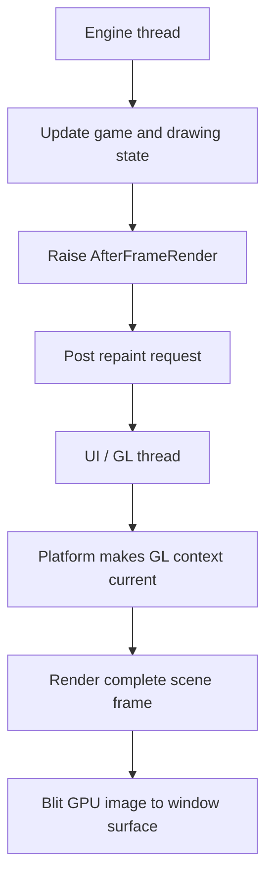
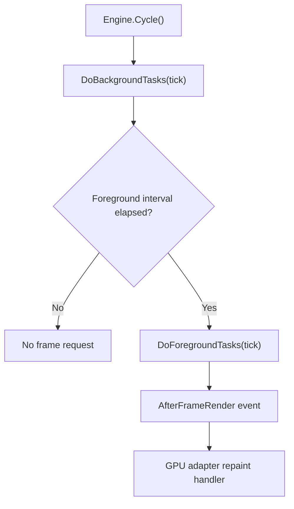
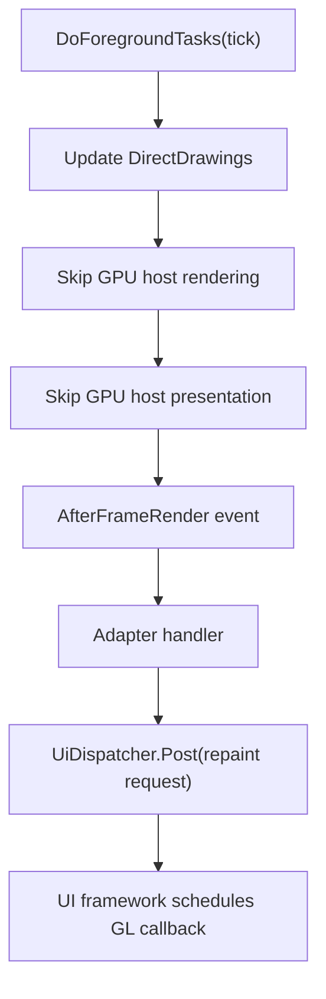
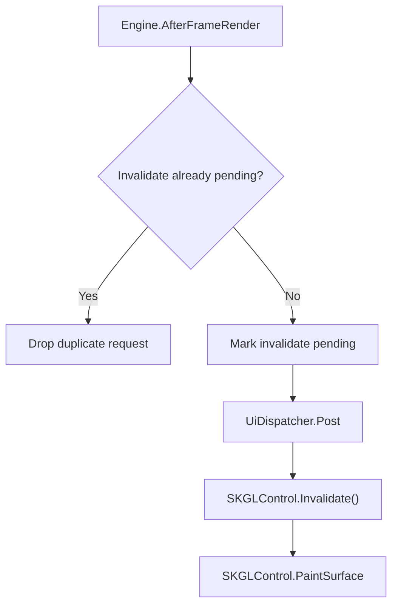
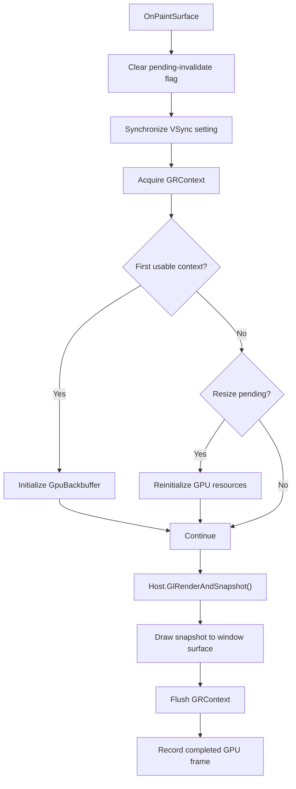
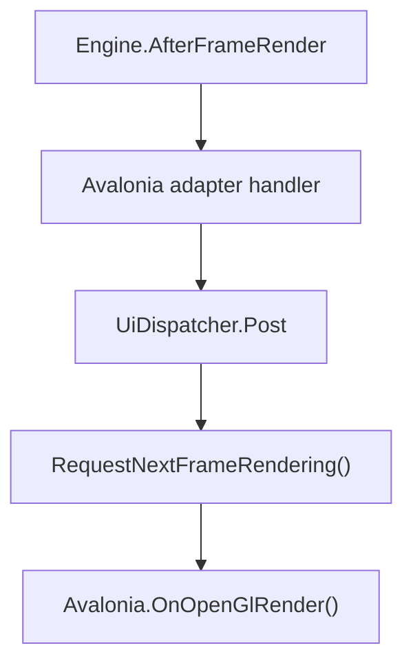
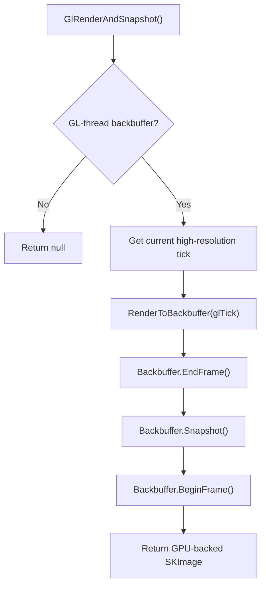
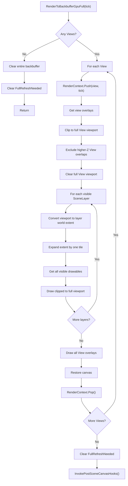

This page documents Gondwana's GPU/OpenGL rendering path from the engine cycle,
through `RenderSurfaceHost`, to the WinForms and Avalonia GL presentation
surfaces.

The GL path is used whenever:

```csharp
surface.Backbuffer.IsGlThreadRendered == true
```

`GpuBackbuffer` returns `true` for this property.

Unlike bitmap rendering, GPU rendering is not executed directly by the engine
thread. The engine requests a platform repaint, and the platform's GL callback
performs rendering while its OpenGL context is current.

## Why GL rendering is callback-driven

An initialized `GpuBackbuffer` owns an Skia `SKSurface` associated with a
`GRContext`. OpenGL operations must occur on a thread where the corresponding
platform GL context is current.

The engine cycle runs on a background engine thread. The WinForms or Avalonia
GL callback is the reliable point at which the UI framework has made the
correct context current.

Therefore:

- the engine controls **when a frame is requested**;
- the platform GL callback controls **when GPU rendering is legal**; and
- scene rendering and presentation both occur synchronously inside that
  callback.



## Entry from the engine cycle

`Engine.Cycle()` performs background work and applies the configured foreground
frame-rate throttle. When foreground work is due, it calls
`DoForegroundTasks(tick)`.



Within `DoForegroundTasks`:

1. `BeforeFrameRender` is raised.
2. `DirectDrawingManager.UpdateAll(tick)` updates drawing state.
3. GPU hosts are skipped by the engine's direct rendering loop.
4. GPU hosts are also skipped by the direct presentation loop.
5. `AfterFrameRender` is raised.

The relevant guards are:

```csharp
if (!surface.Backbuffer.IsGlThreadRendered)
    surface.RenderToBackbuffer(tick);
```

and:

```csharp
if (!surface.Backbuffer.IsGlThreadRendered)
    surface.PresentBackbufferToAdapter();
```

Thus, `AfterFrameRender` does not mean the GL frame has already been rendered.
For GPU hosts, it is the signal that foreground state preparation is complete
and a GL repaint may now be requested.

## Frame-request activity



The repaint request is asynchronous. The engine cycle does not wait for the
GL frame to finish.

## WinForms GL path

### Initialization and event wiring

`WinFormGpuRenderSurfaceControl` creates:

- a `WinFormGpuRenderSurfaceAdapter`;
- a `RenderSurfaceHost<GpuBackbuffer>`; and
- the event wiring that initializes or resizes the GPU backbuffer while the GL
  context is current.

It then calls:

```csharp
adapter.SetHost(Host);
```

`SetHost` subscribes to `Engine.AfterFrameRender`. The handler coalesces repaint
requests with `_pendingInvalidate` and posts `SKGLControl.Invalidate()` to the
UI thread.

Coalescing prevents a fast engine loop from flooding the WinForms message queue
when the UI or GPU cannot paint at the same rate.



### `OnPaintSurface`

WinForms invokes `OnPaintSurface` with its GL context current:



The adapter draws the returned image across the entire backend render target.
Because the off-screen backbuffer and the control surface share the same
`GRContext`, this is a GPU-to-GPU blit rather than a CPU pixel readback.

## Avalonia GL path

`AvaloniaGpuRenderSurfaceControl` derives from `OpenGlControlBase`. Its adapter
subscribes to `Engine.AfterFrameRender` and posts
`RequestNextFrameRendering()` to the UI thread.



`OnOpenGlInit` creates the Skia `GRContext` while Avalonia's context is current
and initializes the `GpuBackbuffer`.

For each `OnOpenGlRender` callback:

1. Reset Skia's cached GL state because Avalonia's compositor may have changed
   it.
2. Calculate the physical-pixel dimensions.
3. Reinitialize the GPU backbuffer if the control was resized.
4. Wrap Avalonia's framebuffer in an Skia `SKSurface`.
5. Call `Host.GlRenderAndSnapshot()`.
6. Draw the returned image over the complete framebuffer.
7. Flush the `GRContext`.
8. Record the completed GPU frame.

## `RenderSurfaceHostBase.GlRenderAndSnapshot`

Both platform paths converge here:

```csharp
public SKImage? GlRenderAndSnapshot()
{
    if (!Backbuffer.IsGlThreadRendered)
        return null;

    var tick = HighResTimer.GetCurrentTick();

    RenderToBackbuffer(tick);
    Backbuffer.EndFrame();

    var img = Backbuffer.Snapshot();

    Backbuffer.BeginFrame();

    return img;
}
```

The method obtains a fresh tick at actual GL render time. This is intentionally
different from the earlier engine-cycle tick because the UI framework may
deliver the repaint callback later.

The returned `SKImage` is GPU-backed and aliases GPU resources owned by the
backbuffer. The caller disposes it inside the same GL callback, before the next
frame can reuse those resources.



## `RenderSurfaceHost.RenderToBackbuffer`

The common method raises host rendering events and selects the GL implementation:

```csharp
RenderBackbufferBegin?.Invoke();

if (Backbuffer.IsGlThreadRendered)
    RenderToBackbufferGpuFull(tick);
else
    RenderToBackbufferBitmap(tick);

RenderBackbufferEnd?.Invoke();
```

Because this call originates inside the platform GL callback, the
`RenderBackbufferBegin`, post-scene hooks, and `RenderBackbufferEnd` callbacks
also run on the GL/UI thread for a GPU host.

Subscribers that issue GPU drawing commands may therefore safely use the
backbuffer canvas during these callbacks, provided they do not retain it beyond
the callback.

## `RenderToBackbufferGpuFull`

The GL renderer bypasses dirty-region processing entirely. Every GL frame
redraws every configured view in full.



### Full-view rendering

For every visible layer, the renderer:

1. Converts the complete viewport from screen space into that layer's world
   space.
2. Expands the world rectangle by one tile in each direction to protect against
   rounding and boundary conditions.
3. Retrieves every drawable intersecting that extent.
4. Draws the result clipped to the complete viewport.

This is full-view rendering, not dirty-rectangle rendering.

When multiple views exist, higher-Z view rectangles are excluded from lower
views. This is view composition and does not represent dirty-region
optimization.

## Dirty-region isolation

The following bitmap-only operations are never reached by the GL branch:

- `EnqueueFullSceneRefresh`;
- `CollectDirtyScreenArea`;
- `PreclearScreenAreas`;
- `RenderLayerDirtyRegions`; and
- clearing consumed layer `RefreshQueue` instances.

In addition, `BackbufferBase.AddToBackbufferDirtyRectangle` immediately returns
for a GL-thread-rendered backbuffer:

```csharp
if (IsGlThreadRendered || area.IsEmpty)
    return;
```

Calls made internally by `ClearRect` and `DrawDrawables` therefore do not build
a presentation dirty rectangle for a GPU host.

The viewport clipping used by the GL renderer is not dirty clipping. It limits
one view to its configured screen rectangle and preserves correct overlap
between multiple views.

## GPU snapshot and presentation

After scene rendering:

1. `Backbuffer.EndFrame()` finalizes the off-screen GPU drawing pass.
2. `GpuBackbuffer.Snapshot()` returns a lightweight GPU-backed image.
3. `Backbuffer.BeginFrame()` prepares the off-screen surface for continued use.
4. The platform callback draws the snapshot across its complete target surface.
5. The platform flushes its `GRContext`.
6. The snapshot is disposed before leaving the callback.

`RenderSurfaceHost.PresentBackbufferToAdapter()` is never used for a GPU host.
The GPU adapter's `Present` implementation is therefore only a defensive
fallback that disposes an unexpected image.

## Frame pacing

`EngineConfiguration.TargetFPS` controls how frequently
`DoForegroundTasks()` reaches `AfterFrameRender`, and therefore how frequently
the engine requests a GL repaint.

Actual GPU presentation may be further constrained by:

- the UI framework's repaint scheduling;
- monitor refresh rate;
- VSync;
- compositor behavior; and
- GPU workload.

WinForms coalesces pending invalidations, so engine cycles cannot accumulate an
unbounded queue of repaint messages. Avalonia delegates repaint scheduling and
composition to its rendering system.

`GpuBackbuffer.RecordFrame()` counts frames that actually completed their GL
callback. This lets Gondwana distinguish requested foreground cycles from
frames that were truly rendered.

## Thread ownership

| Operation | Thread |
| --- | --- |
| Background simulation and input polling | Engine thread |
| `DirectDrawingManager.UpdateAll` | Engine thread |
| `AfterFrameRender` notification | Engine thread |
| Repaint request posting | Engine thread to UI dispatcher |
| WinForms `PaintSurface` | UI/GL thread |
| Avalonia `OnOpenGlRender` | UI/GL thread |
| `GlRenderAndSnapshot` | UI/GL thread |
| `RenderToBackbufferGpuFull` | UI/GL thread |
| GPU snapshot and framebuffer blit | UI/GL thread |
| `RecordFrame` | UI/GL thread |

Because update work and GPU drawing occur on different threads, renderable
state shared between them must either be synchronized or exposed to the render
thread as a stable snapshot. The GL-context rule protects GPU resources; it
does not by itself make arbitrary scene mutations thread-safe.

## Condensed call stacks

### WinForms

```text
Engine.Cycle()
└─ DoForegroundTasks(engineTick)
   └─ AfterFrameRender
      └─ WinFormGpuRenderSurfaceAdapter handler
         └─ UiDispatcher.Post(SKGLControl.Invalidate)
            └─ SKGLControl.PaintSurface
               └─ WinFormGpuRenderSurfaceAdapter.OnPaintSurface()
                  └─ RenderSurfaceHostBase.GlRenderAndSnapshot()
                     └─ RenderSurfaceHost.RenderToBackbuffer(glTick)
                        └─ RenderToBackbufferGpuFull(glTick)
```

### Avalonia

```text
Engine.Cycle()
└─ DoForegroundTasks(engineTick)
   └─ AfterFrameRender
      └─ AvaloniaGpuRenderSurfaceAdapter handler
         └─ UiDispatcher.Post(RequestNextFrameRendering)
            └─ AvaloniaGpuRenderSurfaceControl.OnOpenGlRender()
               └─ RenderSurfaceHostBase.GlRenderAndSnapshot()
                  └─ RenderSurfaceHost.RenderToBackbuffer(glTick)
                     └─ RenderToBackbufferGpuFull(glTick)
```

## Summary

The GL path is an engine-paced but platform-callback-driven full-view renderer:

- the engine updates state and requests a frame;
- the platform invokes rendering with the correct GL context current;
- all configured views and visible layers are redrawn;
- refresh queues and presentation dirty rectangles are bypassed;
- rendering, snapshotting, and presentation remain entirely on the GPU; and
- actual completed frames are counted independently of engine-cycle frequency.

This split is required by OpenGL context ownership and keeps GPU resource access
inside the platform callback where it is valid.
