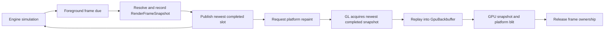

Desktop WinForms and Avalonia use immutable **`RenderFrameSnapshot`** command streams to separate simulation from GPU rendering. Browser WebGL keeps its synchronous render path; see [[WebGL Rendering Path]].

## Engine production and GL consumption

At `TargetFPS` foreground cadence, the Engine updates effects and DirectDrawings, resolves visibility, ordering, animation frames, camera transforms, geometry, and presentation state, and records a complete frame for each desktop GPU surface. The snapshot contains a Skia picture, not Scene, View, Tile, Sprite, effect, or DirectDrawing references. Its ordered native commands preserve clipping, layers, opacity, transforms, and overlays without allocating a managed command object per drawable.

```mermaid
flowchart LR
    A[Engine simulation] --> B[Foreground frame due]
    B --> C[Resolve and record RenderFrameSnapshot]
    C --> D[Publish newest completed slot]
    D --> A
    D --> E[Request platform repaint]
    E --> F[GL acquires newest completed snapshot]
    F --> G[Replay into GpuBackbuffer]
    G --> H[GPU snapshot and platform blit]
    H --> I[Release frame ownership]
```

The Engine does not wait for each visual frame to be drawn. GL does not acquire the broad simulation gate for ordinary replay and never traverses the live scene. CPU query, sorting, and command recording still cost time on the Engine thread; this change does not eliminate that work.

## Bounded mailbox ownership

Each surface has exactly three reusable slots. A slot is free, building, published, rendering, or briefly releasing its native resources. There is one producer and one consumer.

Publication atomically replaces the previous unacquired published frame. Acquisition takes the newest complete frame. For example, while GL renders 100, publishing 101, 102, and 103 leaves 103 for its next acquisition. Intermediate frames are disposed without replay. A rendering slot cannot be reused until the consumer releases it. No FIFO or unbounded frame queue exists.

A short private monitor protects ownership transitions only. Recording, native disposal, and replay happen outside that monitor. Shutdown closes publication and retires the pending frame; a frame already owned by the consumer remains valid until release. Failed builds return their slot.

## Resources and callbacks

The recording backbuffer owns an `SKPictureRecorder` on the Engine thread. It creates no GPU surfaces or textures. Completed pictures copy paint/path values and retain native image/font references. Mutable bitmap drawing is captured by Skia as immutable image content. Original managed drawing objects can be disposed after recording without invalidating a consumer's frame. Replacing or releasing a slot disposes its picture and releases those retained resources.

Gondwana tile slices, SVG rasterizations, text, video bitmaps, particles, widgets, and normal DirectDrawing resources are CPU resources. GL resolves/uploads them when replaying the picture. Applications must synchronize resource mutation/disposal with Engine recording, using normal Engine dispatcher/lifecycle discipline. DirectDrawing disposal retains its simulation gate for this reason.

**Desktop callback contract change:** `RenderBackbufferBegin`, `RenderBackbufferPostScene`, `RenderBackbufferEnd`, and `IEnginePlugin.OnPostRenderCanvas` now run during Engine recording. Draw only to the supplied recording canvas, using CPU images/fonts/shaders and immediate drawing commands. Do not access `host.Backbuffer.Canvas`, `canvas.Surface`, pixel readback, a current `GRContext`, GPU textures, or context-bound resources from these callbacks. Built-in DirectImage and DirectRectangle reject texture-backed image inputs during recording. Custom drawables must follow the same resource contract. Context-specific platform work belongs in the platform GL lifecycle, not scene callbacks.

This is an intentional threading/behavior change with unchanged callback signatures. Browser WebGL hooks retain their synchronous GL behavior. Bitmap hooks retain their Engine-thread behavior.

## GPU destination and context lifecycle

`RenderFrameSnapshot` buffers visual commands; `GpuBackbuffer` remains the existing GPU destination. There are no additional buffered GPU render targets and no CPU frame-pixel transfer.

WinForms `PaintSurface` and Avalonia `OnOpenGlRender` call `EnsureInitialized` with the current context, then `GlRenderAndSnapshot`. That method acquires a completed recording, replays it, ends the backbuffer frame, and returns a scoped GPU-backed `SKImage`. The adapter applies the existing presentation transform, blits, flushes, and counts the presentation. The returned image must be disposed inside the GL callback. Without a new recording, the existing backbuffer is presented again.

Ordinary window resize changes presentation only. Logical resize and MSAA/context replacement still recreate GPU resources exclusively on GL. The size notification briefly takes the simulation gate to update live viewports. Recordings with mismatched logical dimensions are discarded; the cleared new surface remains until a matching Engine frame arrives. CPU recordings remain valid across MSAA and context replacement because they retain no old GPU target/context. Surface and context disposal still belong to the platform's GL lifecycle.

WinForms VSync and Avalonia compositor scheduling retain their existing behavior. Input uses the inverse presentation transform as before.

Avalonia GL deinitialization releases native surfaces before their context while
preserving the logical host and mailbox for recreation. `AvaloniaGpuGameHost`
calls the control's `Dispose()` at permanent shutdown. Custom Avalonia hosts must
also call `Dispose()` when permanently removing the control; temporary detach or
context loss is not permanent disposal.

## Diagnostics

The saved-scene Scene Viewer's **F3 diagnostics overlay** (used by the `.gscn` editor/Studio View Scene workflow or direct Scene Viewer launches) holds a `ProfilerWidget` collection request only while visible. F3 is a Scene Viewer control, not a global Engine hotkey. Its measurements distinguish:

- Gross CPS: simulation cycles.
- Engine FPS: foreground production cadence.
- GPU FPS: completed platform presentations, including re-presentation of existing content.
- Snapshot build, query/sort, command recording, and overlay recording: Engine work.
- GL replay: command replay and backbuffer flush CPU duration, not GPU execution time.
- Snapshot age: publication completion to acquisition.
- Published/replaced frames and occupied slots: mailbox activity; slots never exceed three.
- GL broad-lock wait/held: zero for snapshot replay; this does not measure the separate mailbox monitor or infrequent resize handoff.

Replay may fall behind publication and drop visual frames without blocking simulation. See [[Performance Tuning]] for interpreting producer costs.

## Validation

Core tests cover latest-frame selection, slot reuse, concurrent publication/replay, shutdown, source-resource disposal, immutable bitmap capture, and pixel equivalence. The opt-in `DesktopGpuSnapshotTests` in the Scene Viewer test project exercises a native GL context, MSAA, logical resize, and context replacement. Run it with `GONDWANA_GPU_TESTS=1`; it is skipped on ordinary CI without a desktop GL driver.

The separate `SceneViewerSnapshotDogfoodTests` runs the actual viewer and Engine loop against the path in `GONDWANA_VIEWER_SCENE`, with `GONDWANA_VIEWER_DOGFOOD=1`. Run it alone because hosted Engine shutdown ends the process-global Engine lifecycle.
