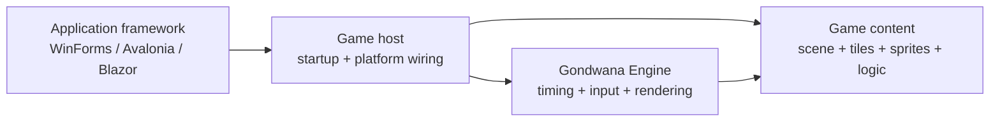
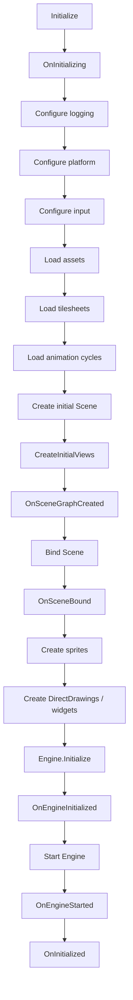
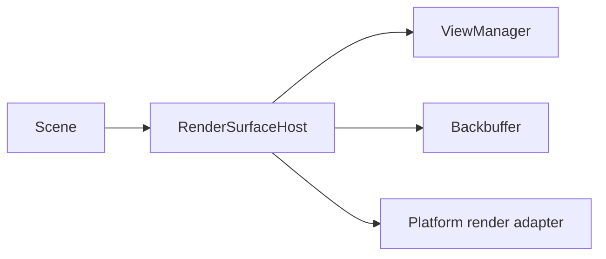

A Gondwana game host is the bridge between your game code, the Gondwana engine, and the application framework that owns the window or browser surface.

For most games, the host is the right place to organize startup and shutdown. It gives asset loading, scene creation, input setup, render-surface binding, engine startup, and cleanup a predictable order without forcing those responsibilities into `Program.cs`, a Form, an Avalonia Window, or a Blazor component.

This page focuses on using the host model as a game developer. For lower-level lifecycle and threading details, see [[Gondwana Engine Lifecycle]].

---

## The short version



The application framework creates the render surface and your game host. The host then performs Gondwana initialization in a defined order.

For ordinary game code:

- derive from the platform-specific game host
- override lifecycle hooks to load content and build the game
- call `Initialize()` once from the platform/UI startup path
- dispose the host when the game surface shuts down

---

## `GameHostBase`

`GameHostBase` in `Gondwana.Hosting` coordinates the platform-neutral lifecycle.

The public entry point is:

```csharp
host.Initialize();
```

Conceptually, initialization runs in this order:



The value of the host is not that any one step is complicated. The value is that game code can rely on the same ordering across platforms.

---

## Choose the platform host

Most games should derive from a platform host rather than directly from `GameHostBase`.

| Platform | Bitmap / compatibility host | GPU host |
| --- | --- | --- |
| WinForms | `WinFormsGameHost` | `WinFormsGpuGameHost` |
| Avalonia | `AvaloniaBitmapGameHost` | `AvaloniaGpuGameHost` |
| Blazor | `BlazorGameHost` | `BlazorGpuGameHost` |

These hosts already know how to wire their render surface, input adapters, scene binding, and platform behavior into the base lifecycle.

For example, WinForms owns the standard keyboard and mouse initialization and exposes narrower hooks such as `OnKeyboardAdapterInitialized()` and `OnMouseAdapterInitialized()` for game-specific work.

### GPU versus bitmap

The host also selects the rendering path used by that application surface:

- WinForms and Avalonia provide bitmap and GPU hosts.
- Blazor uses `BlazorGameHost` for the Canvas 2D/bitmap compatibility path and `BlazorGpuGameHost` for WebGL/GPU rendering.

Scene, tile, sprite, camera, and gameplay code should generally remain independent of that choice.

See [[GL Rendering Path]], [[WebGL Rendering Path]], and [[Bitmap Rendering Path]].

---

## A typical WinForms host

```csharp
internal sealed class MyGameHost : WinFormsGameHost
{
    private Tilesheet _worldSheet = null!;
    private SceneLayer _worldLayer = null!;

    internal MyGameHost(WinFormBitmapRenderSurfaceControl renderSurface)
        : base(renderSurface)
    {
    }

    protected override void LoadTilesheets()
    {
        _worldSheet = TilesheetRegistry.Instance.LoadFromImageFile(
            "world",
            @"assets\world.png");
    }

    protected override void LoadAnimationCycles()
    {
        // Define reusable Cycle objects after tilesheets are loaded.
    }

    protected override Scene CreateInitialScene()
    {
        var scene = new Scene();

        _worldLayer = scene.AddLayer(
            columnCount: 40,
            rowCount: 24,
            width: 32,
            height: 32,
            zOrder: 0,
            parallax: 1f,
            coordinateSystem: CoordinateSystemTypes.Orthogonal);

        return scene;
    }

    protected override void CreateInitialViews()
    {
        // With the current host implementation, leave this empty for the
        // normal default view. Scene binding creates that view automatically.
    }

    protected override void OnSceneBound()
    {
        // Configure a custom view layout here if the default full view is not enough.
        // Example:
        // RenderSurface.Host.ViewManager.ConfigureVerticalSplit();
    }

    protected override void CreateSprites()
    {
        // Scene and layers now exist and are bound to the render surface.
    }

    protected override void OnEngineStarted()
    {
        // Begin work that assumes normal engine timing is active.
    }
}
```

The exact render-surface property differs by platform host, but the content lifecycle is the same.

The CLI project templates are useful starting points because they expose the intended host hooks in lifecycle order.

---

## What belongs in each hook

### `OnInitializing()`

Use this for game-level preparation that must happen before platform, input, or content initialization.

Examples include choosing configuration paths, initializing game-owned services, or determining startup mode.

Do not create scene objects here; the scene does not exist yet.

### `LoadAssets()`

Load non-tilesheet resources such as audio, fonts, data files, or game-owned definitions.

Platform services have already been configured before this hook runs.

### `LoadTilesheets()`

Load tilesheet images and `.gts` definitions here.

Use the public tilesheet manager/registry APIs, for example:

```csharp
_worldSheet = Engine.Managers.Tilesheets.LoadFromImageFile(
    "world",
    @"assets\world.png");
```

### `LoadAnimationCycles()`

Create reusable `FrameSequence` and `Cycle` definitions here. Tilesheets are already loaded.

See [[Tile Animation]].

### `CreateInitialScene()`

Build and return the initial `Scene` and its `SceneLayer` collection.

This is the natural place to establish:

- layer dimensions and tile size
- coordinate systems
- parallax
- layer Z-order
- scene/layer collision setup

### `CreateInitialViews()` — current implementation caveat

`GameHostBase` calls `CreateInitialViews()` before `BindScene()`.

With the current render-host implementation, `ViewManager` creates a `Camera` against the render host's **currently bound scene**. Before binding, that scene is `Scene.Empty`. For that reason, the standard Gondwana templates currently leave `CreateInitialViews()` empty.

When no views exist, `RenderSurfaceHost.Bind(...)` creates the default full-surface view after the real scene becomes current.

For custom view layouts, configure the `ViewManager` in `OnSceneBound()` with the current implementation. This ensures newly created cameras are associated with the bound scene.

This distinction is especially relevant for bitmap rendering because camera movement marks its associated scene for refresh.

### `OnSceneGraphCreated()`

This runs after the scene has been created but before binding. Use it for scene-graph work that does not require a bound render surface.

### `OnSceneBound()`

The scene is now attached to the platform render host.

This is the safe point for work that requires the bound `RenderSurfaceHost`, including custom view layouts:

```csharp
protected override void OnSceneBound()
{
    RenderSurface.Host.ViewManager.ConfigureVerticalSplit();
}
```

The property path shown above is for `WinFormsGameHost`; other platform hosts expose their own render-surface property.

### `CreateSprites()`

Create movable scene actors here. The scene and its layers already exist and are bound.

### `CreateDirectDrawings()`

Create DirectDrawing objects, HUD elements, and widgets here.

The method name predates the widget layer; it remains a reasonable place to create widgets backed by DirectDrawing.

### `OnEngineInitialized()`

`Engine.Initialize()` has completed, but the engine has not started running yet.

Use this only for work that specifically requires initialized engine state before the loop begins.

### `OnEngineStarted()`

The engine is running. This is a good place to start gameplay timers, music, or other behavior that assumes normal engine timing.

### `OnInitialized()`

The full host initialization sequence has completed.

---

## Platform input hooks

Platform hosts deliberately own the standard adapter setup.

A WinForms host, for example, initializes the keyboard adapter before calling your hook:

```csharp
protected override void OnKeyboardAdapterInitialized()
{
    Engine.Input.KeyboardEventPoller!.KeyDown += OnKeyDown;
}
```

That lets game code subscribe to an already-configured adapter instead of rebuilding platform setup.

See [[Input Handling]].

---

## Scene binding

Constructing a `Scene` is not enough to render it. The platform host binds the scene to its `RenderSurfaceHost`:



Binding makes the scene current for that surface, updates the view manager for the new scene, marks the scene for refresh, and lets the adapter present the resulting backbuffer.

For normal games, let the platform game host perform binding. Manual binding is mainly relevant when implementing custom platform/render integrations.

See [[Custom Platform Adapters and Render Surfaces]].

---

## Desktop and browser execution differ

The host lifecycle is intentionally similar across platforms, but execution scheduling is not identical.

Desktop hosts use Gondwana's normal desktop execution model. Browser hosts integrate engine advancement with browser animation scheduling; the Blazor GPU path is driven through the browser/WebGL render callback rather than pretending the browser has the same rendering-thread model as desktop.

Keep this difference behind the host boundary when possible. Gameplay code should not depend on a particular presentation callback unless it is genuinely platform-specific.

See [[Gondwana Engine Lifecycle]] and [[Rendering Pipeline]] for the detailed timing and threading rules.

---

## Shutdown and disposal

The host owns orderly shutdown as well as startup.

Dispose it from the hosting/UI thread when the game surface is closing:

```csharp
_host?.Dispose();
```

The base host coordinates engine stop/wait behavior before cleanup hooks release game-owned resources.

Useful shutdown hooks include:

- `UnhookEvents()` — unsubscribe handlers installed during startup
- `OnDisposing()` — release game-owned resources before final host disposal
- `OnDisposed()` — final notification after disposal completes

Do not release render/native resources from an arbitrary engine callback while rendering may still be active.

---

## When to bypass the host model

Direct engine/render setup is appropriate when:

- integrating Gondwana into an unusual existing application
- building a new platform adapter or render surface
- writing specialized tooling or tests
- deliberately taking ownership of lifecycle and threading

For a normal game, the host model removes boilerplate and gives platform services a predictable place to integrate.

---

## Common mistakes

### Putting the whole game in `Program.cs` or a Form

Let the application framework create the window/surface. Put Gondwana startup and game construction in the game host.

### Rebuilding platform adapter setup

Use the hooks exposed by the platform host unless you are deliberately implementing a lower-level integration.

### Creating sprites before their layer exists

Create layers in `CreateInitialScene()` and sprites later in `CreateSprites()`.

### Defining animation cycles before their tilesheets

`LoadTilesheets()` runs before `LoadAnimationCycles()` for this reason.

### Creating custom views before the scene is bound

With the current implementation, let binding create the default view or configure custom views in `OnSceneBound()` so their cameras are associated with the real scene.

### Starting engine-timed behavior too early

If work assumes normal engine timing, start it in or after `OnEngineStarted()`.

### Forgetting disposal

The game host owns shutdown too. Dispose it when the application surface is finished.

---

## Where to read next

- [[Make Your First Game in 30 Minutes]] — end-to-end project setup
- [[Gondwana Engine Lifecycle]] — detailed lifecycle, timing, threading, and callback behavior
- [[Engine Architecture Overview]] — subsystem relationships
- [[Engine Configuration]] — configuration loading and startup order
- [[Views, Cameras, and Viewports]] — cameras and view layouts
- [[Rendering Pipeline]] — how a bound scene reaches the backbuffer
- [[Custom Platform Adapters and Render Surfaces]] — working below the standard host layer
