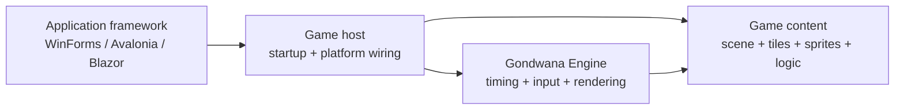
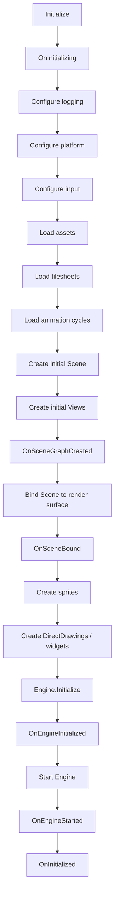
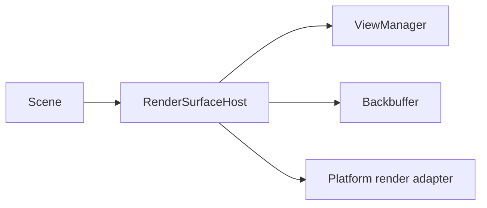

A Gondwana game host is the bridge between your game code, the Gondwana engine, and the application framework that owns the window or browser surface.

For most games, the host is the right place to organize startup and shutdown. It gives asset loading, scene creation, input setup, render-surface binding, engine startup, and cleanup a predictable order without forcing those responsibilities into `Program.cs`, a Form, an Avalonia Window, or a Blazor component.

This page is about using the host model as a game developer. For the lower-level engine lifecycle and threading details, see [[Gondwana Engine Lifecycle]].

---

## The short version

A typical Gondwana application has three distinct responsibilities:



The application framework creates the render surface and your game host. The host then performs the ordered Gondwana initialization sequence.

In normal game code:

- let the platform host configure platform adapters
- override host hooks to load your content and build the game
- call `Initialize()` once from the platform/UI startup path
- dispose the host when the application or game surface is shutting down

---

## `GameHostBase`

`GameHostBase` is the platform-neutral lifecycle coordinator in `Gondwana.Hosting`.

It owns the sequence; your derived host fills in the game-specific pieces.

The important public entry point is:

```csharp
host.Initialize();
```

That one call performs the full startup sequence:



The value of the host is not that each step is complicated. The value is that every Gondwana application can rely on the same order.

---

## Choose the platform host, not bare `GameHostBase`

Most games should derive from one of Gondwana's platform-specific hosts instead of directly from `GameHostBase`.

| Platform | Bitmap / compatibility host | GPU host |
| --- | --- | --- |
| WinForms | `WinFormsGameHost` | `WinFormsGpuGameHost` |
| Avalonia | `AvaloniaBitmapGameHost` | `AvaloniaGpuGameHost` |
| Blazor | `BlazorGameHost` | `BlazorGpuGameHost` |

The platform hosts already know how to wire the appropriate render surface, input adapters, scene binding, and platform behavior into the base lifecycle.

For example, the WinForms host seals the low-level platform setup and exposes narrower hooks such as `OnConfigurePlatform()`, `OnKeyboardAdapterInitialized()`, and `OnMouseAdapterInitialized()`. Game code normally customizes those hooks instead of replacing the platform wiring itself.

### GPU versus bitmap

The host choice also selects the rendering path used by that application surface.

- WinForms and Avalonia offer bitmap and GPU hosts.
- Blazor uses `BlazorGameHost` for the Canvas 2D/bitmap compatibility path and `BlazorGpuGameHost` for the WebGL/GPU path.

Your scene, sprites, tiles, cameras, and most game logic should not care which host is presenting them. Keep backend-specific work at the hosting/render-surface boundary whenever possible.

See [[GL Rendering Path]], [[WebGL Rendering Path]], and [[Bitmap Rendering Path]] for renderer-specific behavior.

---

## A typical game host

A normal host is mostly a collection of focused overrides:

```csharp
internal sealed class MyGameHost : WinFormsGameHost
{
    private Tilesheet _worldSheet = null!;
    private SceneLayer _worldLayer = null!;

    internal MyGameHost(WinFormBitmapRenderSurfaceControl renderSurface)
        : base(renderSurface)
    {
    }

    protected override void LoadTilesheets()
    {
        _worldSheet = new Tilesheet("world", @"assets\world.png");
    }

    protected override void LoadAnimationCycles()
    {
        // Define reusable Cycle objects after tilesheets are loaded.
    }

    protected override Scene CreateInitialScene()
    {
        var scene = new Scene();

        _worldLayer = scene.AddLayer(
            columnCount: 40,
            rowCount: 24,
            width: 32,
            height: 32,
            zOrder: 0,
            parallax: 1f,
            coordinateSystem: CoordinateSystemTypes.Orthogonal);

        return scene;
    }

    protected override void CreateInitialViews()
    {
        RenderSurfaceHost.ViewManager.ConfigureSingleFullView();
    }

    protected override void CreateSprites()
    {
        // Scene is already created and bound here.
    }

    protected override void OnEngineStarted()
    {
        // Begin gameplay work that assumes the engine is running.
    }
}
```

The exact render-surface property exposed by a platform host differs by host type, but the content lifecycle remains the same.

The project templates generated by Gondwana CLI are a good starting point because they already expose the intended hooks in lifecycle order.

---

## What belongs in each hook

### `OnInitializing()`

Use this for game-level preparation that must happen before platform, input, or content initialization.

Examples:

- choose configuration paths
- initialize game-owned services
- determine startup mode
- establish feature flags needed by later hooks

Do not create scene objects here. The scene does not exist yet.

### `LoadAssets()`

Load non-tilesheet resources needed by the game, such as:

- audio resources
- fonts
- data files
- game-owned configuration or definitions

Platform audio backends should already have been configured by the time this hook runs.

### `LoadTilesheets()`

Load tilesheet images and `.gts` definitions here.

This runs before `LoadAnimationCycles()`, so animation definitions can safely reference loaded tilesheets.

### `LoadAnimationCycles()`

Create reusable `FrameSequence` and `Cycle` definitions here.

See [[Tile Animation]].

### `CreateInitialScene()`

Build and return the initial `Scene` and its `SceneLayer` collection.

This is where the structural world model belongs:

- layer dimensions
- layer tile size
- coordinate-system selection
- parallax
- layer Z-order
- scene-level collision setup

### `CreateInitialViews()`

Configure the camera/view layout after the scene exists.

Examples include:

- one full-screen view
- split screen
- picture-in-picture
- a secondary minimap view

See [[Views, Cameras, and Viewports]].

### `OnSceneGraphCreated()`

Use this when something needs the finished scene and views but must happen before the scene is bound to the render surface.

Most games will not need this hook often.

### `OnSceneBound()`

At this point the initial scene has been attached to the platform render surface.

Use this for behavior that specifically requires a bound scene/render host.

### `CreateSprites()`

Create movable scene actors here. The scene and layers already exist and are bound.

### `CreateDirectDrawings()`

Create DirectDrawing objects, HUD elements, widgets, and other drawing primitives here.

The name is historical enough that it is worth noting: this hook is also a reasonable place to create widgets backed by DirectDrawing.

### `OnEngineInitialized()`

The engine has completed `Engine.Initialize()`, but it has not started running yet.

Use this only for work that specifically needs initialized engine state before the loop begins.

### `OnEngineStarted()`

The engine is running.

This is a good place to begin game behavior that assumes normal engine timing is active, such as starting gameplay timers or music.

### `OnInitialized()`

The entire host sequence has completed. Use this as the final application-level startup hook when needed.

---

## Platform configuration and input hooks

Platform-specific host bases deliberately own the standard adapter setup.

For example, a WinForms host configures the WinForms keyboard and mouse adapters before calling the corresponding game hooks:

```csharp
protected override void OnKeyboardAdapterInitialized()
{
    Engine.Input.KeyboardEventPoller!.KeyDown += OnKeyDown;
}
```

This ordering matters: the hook runs after the adapter exists, so game code can subscribe to it without having to recreate the platform initialization itself.

The same principle applies across platforms even when the exact hooks differ.

See [[Input Handling]] for the input subsystem itself.

---

## Scene binding is a host responsibility

A `Scene` does not render merely because you constructed it.

The host creates the scene graph and then binds the current `Scene` to the platform's `RenderSurfaceHost`. Binding connects:



Once bound, views can project the scene into the backbuffer and the adapter can present that backbuffer to the window or browser surface.

For ordinary applications, let the platform game host perform this step. Direct render-surface binding is mainly relevant when building custom platform integrations.

See [[Custom Platform Adapters and Render Surfaces]] for that lower-level case.

---

## Desktop and browser execution differ

The host lifecycle is intentionally similar across platforms, but the engine cannot be scheduled identically everywhere.

Desktop hosts normally start Gondwana with the platform/UI synchronization context while the engine manages its normal execution model.

Blazor browser hosts integrate engine advancement with browser animation scheduling. In particular, the GPU path is driven from the WebGL/`requestAnimationFrame` rendering path rather than pretending the browser has the same background-thread rendering model as desktop.

As a game developer, keep this distinction behind the host boundary. Avoid writing gameplay code that assumes a particular host thread or presentation callback unless that code truly is platform-specific.

For the detailed threading and callback rules, see [[Gondwana Engine Lifecycle]] and [[Rendering Pipeline]].

---

## Shutdown and disposal

The game host also owns orderly engine shutdown.

Dispose it from the hosting/UI thread when the game surface is closing:

```csharp
_host?.Dispose();
```

The base host coordinates engine stop/wait behavior before managed cleanup hooks release resources. It then disposes widget input routing, invokes event-unhooking hooks, and disposes the engine.

Use the shutdown hooks for game-owned cleanup:

- `UnhookEvents()` — unsubscribe handlers installed during startup
- `OnDisposing()` — release game-owned resources before final host disposal
- `OnDisposed()` — final notification after disposal completes

Do not release render/native resources from an arbitrary engine callback while rendering may still be active.

---

## When to bypass the host model

You can initialize `Engine` and render infrastructure directly, but most games should not.

Direct engine setup makes sense when:

- integrating Gondwana into an unusual existing application architecture
- building a new platform adapter or render surface
- writing specialized tooling or tests
- deliberately taking ownership of lifecycle and threading

For a normal game, the host model removes boilerplate and gives future engine versions a predictable place to integrate new platform services.

---

## Common mistakes

### Putting the whole game in `Program.cs` or a Form

Let the application framework create the window/surface. Put Gondwana startup and game construction in the game host.

### Overriding low-level platform setup unnecessarily

Use the hooks exposed by the platform host. Do not rebuild keyboard, render-surface, or platform setup simply to attach game behavior.

### Creating sprites before their scene layer exists

Create the scene and layers in `CreateInitialScene()`. Create sprites later in `CreateSprites()`.

### Defining animation cycles before loading their tilesheets

`LoadTilesheets()` runs before `LoadAnimationCycles()` for this reason.

### Starting game timers too early

If the work assumes normal engine timing, start it in or after `OnEngineStarted()`.

### Forgetting disposal

The host owns engine shutdown as well as startup. Dispose it when the application surface is finished.

---

## Where to read next

- [[Make Your First Game in 30 Minutes]] — end-to-end project setup
- [[Gondwana Engine Lifecycle]] — detailed lifecycle, timing, threading, and callback behavior
- [[Engine Architecture Overview]] — subsystem relationships
- [[Engine Configuration]] — configuration loading and startup order
- [[Views, Cameras, and Viewports]] — view creation and camera behavior
- [[Rendering Pipeline]] — how a bound scene reaches the backbuffer
- [[Custom Platform Adapters and Render Surfaces]] — building below the standard host layer
