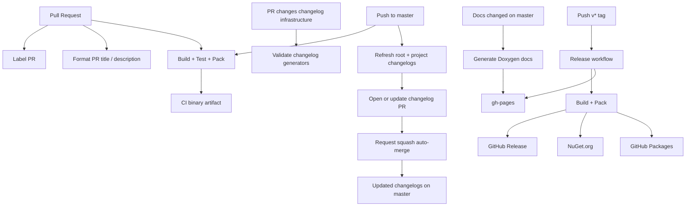
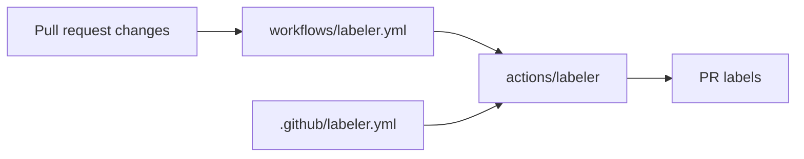
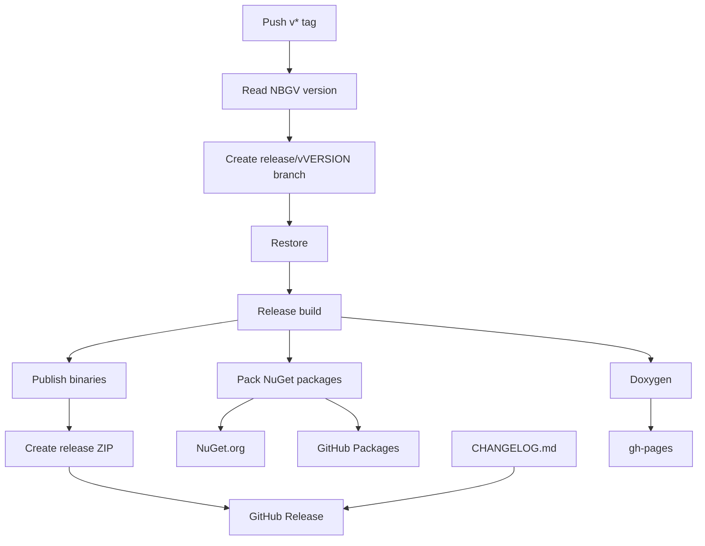

Gondwana uses GitHub Actions and repository-level YAML configuration to automate several project-maintenance tasks.

These include:

- building and testing the engine
- validating NuGet packages
- producing downloadable binary artifacts
- publishing API documentation
- labeling pull requests
- formatting pull request titles and descriptions
- maintaining running root and per-project changelogs
- creating GitHub releases
- publishing packages to NuGet and GitHub Packages

Most of this automation lives under:

```text
.github/
├── labeler.yml
├── release.yml
└── workflows/
    ├── changelog-master.yml
    ├── ci-master.yml
    ├── docs.yml
    ├── format-pr-title.yml
    ├── labeler.yml
    └── release.yml
```

There are two different kinds of YAML files here.

Files under `.github/workflows/` are **GitHub Actions workflows**. They define things that GitHub actually runs.

Files such as `.github/labeler.yml` and `.github/release.yml` are **configuration files**. They describe rules consumed by GitHub Actions or GitHub itself.

---

## Contents

- [Workflow overview](#workflow-overview)
- [CI — ci-master.yml](#ci--ci-masteryml)
- [Changelog maintenance — changelog-master.yml](#changelog-maintenance--changelog-masteryml)
- [Documentation — docs.yml](#documentation--docsyml)
- [PR labels — labeler.yml](#pr-labels--labeleryml)
- [PR title and description formatting](#pr-title-and-description-formatting)
- [Releases — release.yml](#releases--releaseyml)
- [Release-note configuration](#release-note-configuration)
- [Secrets and permissions](#secrets-and-permissions)
- [Where configuration ends and GitHub begins](#where-configuration-ends-and-github-begins)
- [Modifying a workflow](#modifying-a-workflow)
- [Troubleshooting](#troubleshooting)
- [Mental model](#mental-model)

---

## Workflow overview

At a high level, Gondwana's repository automation looks like this:



The important point is that these workflows serve different purposes.

**CI answers:**

> Does the current code build, test, package, and produce the expected binaries?

**Changelog automation answers:**

> Do the root and per-project `[Unreleased]` sections accurately reflect the commits currently on `master`, without rewriting released history?

**Docs answers:**

> Can the current documentation be generated and published?

**PR automation answers:**

> Can routine repository housekeeping happen consistently without manual work?

**Release answers:**

> Can a tagged version become an actual Gondwana release?

---

# CI — `ci-master.yml`

File:

```text
.github/workflows/ci-master.yml
```

The CI workflow is Gondwana's main validation pipeline.

It runs when:

- code is pushed to `master`
- a pull request is opened
- a pull request receives new commits
- a pull request is reopened
- a draft pull request becomes ready for review

Documentation-only and changelog-only changes are excluded from the normal CI workflow.

The current `paths-ignore` rules exclude:

```text
docs/**
.github/workflows/docs.yml
.github/release.yml
CHANGELOG.md
**/CHANGELOG.md
```

That keeps generated changelog refreshes and documentation-only updates from needlessly rebuilding the entire engine.

---

## CI environment

CI currently runs on:

```yaml
runs-on: ubuntu-latest
```

and installs:

```yaml
dotnet-version: '8.0.x'
```

Although Gondwana contains Windows-targeting projects, the workflow builds from Linux using:

```text
/p:EnableWindowsTargeting=true
```

This allows the repository to validate Windows-targeted assemblies without requiring the entire CI job to run on a Windows runner.

---

## Restore

The workflow performs both workload restoration and normal NuGet restoration.

Conceptually:

```text
restore workloads
       ↓
restore NuGet dependencies
       ↓
build
```

The normal restore explicitly uses the Release configuration.

This matters because some Gondwana projects contain runtime-specific dependencies whose assets are resolved differently depending on configuration.

The restore therefore includes:

```text
/p:Configuration=Release
```

before the later `--no-restore` build.

---

## Build

CI performs a full Release build:

```bash
dotnet build \
    --configuration Release \
    --no-restore \
    /p:EnableWindowsTargeting=true
```

If this fails, the rest of the validation pipeline does not represent a releasable repository state.

---

## Unit tests

The CI workflow explicitly runs:

```text
Testing/Gondwana.Tests/Gondwana.Tests.csproj
```

using the already-built Release output.

Conceptually:

```text
Build
  ↓
Gondwana.Tests
  ↓
Pack validation
```

This makes unit tests part of the normal pull-request and `master` validation path.

---

## Pack validation

CI also runs:

```bash
dotnet pack
```

but does **not** publish those packages.

This is deliberate.

CI answers:

> Could Gondwana be packaged successfully?

The release workflow answers:

> Should those packages actually be published?

Keeping those responsibilities separate prevents an ordinary pull request or push from accidentally becoming a package release.

---

## Published binaries

After validation, CI publishes selected Gondwana projects into temporary staging directories.

These include engine assemblies such as:

```text
Gondwana.dll
Gondwana.Audio.Midi.dll
Gondwana.Blazor.dll
Gondwana.Blazor.Hosting.dll
Gondwana.Hosting.dll
Gondwana.Input.SDL2.dll
Gondwana.Video.dll
Gondwana.Widgets.dll
Gondwana.WinForms.dll
Gondwana.WinForms.Hosting.dll
```

It also publishes selected executable projects, including tooling and demos.

The workflow then stages the exact downloadable files into an artifact directory and creates:

```text
Gondwana-binaries.zip
```

Finally, GitHub Actions uploads that ZIP as the workflow artifact:

```text
Gondwana-binaries
```

This is useful for testing a build without performing a formal Gondwana release.

---

# Changelog maintenance — `changelog-master.yml`

File:

```text
.github/workflows/changelog-master.yml
```

This workflow maintains Gondwana's **running changelogs on `master`** and validates the changelog-generation machinery when that machinery changes.

It works with:

```text
Tooling/scripts/Generate-Root-Changelog.ps1
Tooling/scripts/Generate-Project-Changelogs.ps1
Tooling/scripts/Changelog-ProjectGroups.ps1
Tooling/scripts/release.ps1
cliff.toml
```

The PowerShell scripts contain the changelog-generation logic.

The workflow supplies the GitHub-side orchestration around them.

---

## Two different jobs

`changelog-master.yml` has two distinct responsibilities:

```text
pull request changes changelog infrastructure
        ↓
validate-changelog-script
        ↓
prove the generators behave safely


ordinary push reaches master
        ↓
update-changelogs
        ↓
refresh [Unreleased]
        ↓
open/update automation PR
        ↓
request squash auto-merge
```

The validation job is **repository-read-only**. It may rewrite files inside the temporary runner workspace while exercising test scenarios, but it has no permission to write those changes back to GitHub.

The update job receives narrowly scoped write permissions only when it is running for a `master` push.

---

## Pull-request validation

The workflow runs its validation job only when a pull request changes changelog infrastructure such as:

- `Generate-Project-Changelogs.ps1`
- `Generate-Root-Changelog.ps1`
- `Changelog-ProjectGroups.ps1`
- `release.ps1`
- `cliff.toml`
- `changelog-master.yml` itself

This means ordinary feature pull requests do not spend time running specialized changelog tests.

When changelog infrastructure *does* change, the workflow checks several important contracts.

### Preview mode must be read-only

Both generators are run with:

```powershell
-PreviewOnly
```

and the workflow compares Git status before and after.

A preview is considered broken if it modifies the working tree.

---

### Repeat runs must be idempotent

The workflow runs the changelog generators repeatedly and hashes the resulting changelog files.

Running the generators twice against the same Git history must produce the same files.

It also explicitly verifies that refreshing `[Unreleased]` does **not** alter existing released history.

This is an important property because `[Unreleased]` is derived state while released sections are treated as historical records.

---

### Root changelog behavior is validated

The grouped root changelog is checked separately.

Validation confirms that:

- normal generation produces a leading `# [Unreleased]` section
- the section is grouped by project or repository area
- previously released root history is preserved exactly
- a second run is idempotent
- supplying `-Tag vX.Y.Z` replaces `[Unreleased]` with that versioned release section

The root generator therefore has automated tests for both its development and release modes.

---

### Missing project changelogs are bootstrapped

The workflow temporarily removes a project `CHANGELOG.md` and runs the project generator.

It verifies that a new changelog contains:

- prior tagged release history
- the current `[Unreleased]` section

It then runs the generator again and verifies that the freshly bootstrapped file is already stable.

A second bootstrap test supplies a synthetic release tag and verifies that the current commits become that version rather than remaining `[Unreleased]`.

---

### Existing project changelogs are tested with `-Tag`

The validation also exercises the normal release transition against an existing project changelog.

It confirms that:

```text
[Unreleased]
      ↓
-Tag vX.Y.Z
      ↓
vX.Y.Z
```

occurs without changing the older released history below it.

---

## Updating changelogs after a push to `master`

For ordinary non-changelog pushes to `master`, the `update-changelogs` job:

1. checks out the latest `master` with full Git history
2. installs `git-cliff`
3. runs `Generate-Root-Changelog.ps1`
4. runs `Generate-Project-Changelogs.ps1`
5. verifies that the generators changed only `CHANGELOG.md` files
6. opens or updates an automation pull request if changes exist

The generated pull request uses the branch:

```text
automation/update-changelogs
```

with a title of:

```text
docs: update unreleased changelogs
```

The generated commit uses:

```text
docs: update unreleased changelogs [skip release notes]
```

The same automation branch is reused, so later pushes to `master` can update an already-open changelog pull request rather than creating a stream of separate PRs.

---

## Why it uses a pull request instead of pushing directly

The workflow deliberately does **not** write generated changelogs straight to `master`.

Instead:

```text
master changes
      ↓
generate changelogs
      ↓
automation branch
      ↓
pull request
      ↓
normal repository merge rules
      ↓
master
```

This keeps automated repository writes visible and lets branch protection, required checks, and GitHub's normal pull-request machinery remain in the path.

The workflow then requests **squash auto-merge** for the changelog PR.

GitHub completes that merge only when the repository's auto-merge and branch-rule requirements permit it.

---

## Avoiding recursive automation

A changelog update creates another commit on `master`, so loop prevention is essential.

The workflow avoids recursion in several ways.

First, its push trigger ignores:

```text
CHANGELOG.md
**/CHANGELOG.md
```

A merge that changes only changelogs therefore does not start another changelog refresh.

The update job also excludes runs whose actor is:

```text
github-actions[bot]
```

And the normal CI workflow independently ignores changelog-only changes.

The PR-title Copilot workflow also excludes PRs whose title starts with:

```text
docs: update changelog
```

so the generated changelog PR is not needlessly rewritten by AI-assisted PR metadata automation.

---

## Concurrency

The update job uses a single concurrency group:

```text
changelog-master
```

with in-progress work cancelled when a newer run supersedes it.

This matters when several changes reach `master` close together.

The desired changelog is always the one derived from the **latest** `master` history, so an older refresh should not race a newer refresh to update the automation branch.

---

## No-change behavior

If the generators produce no changelog changes, the workflow does not create an empty commit or pull request.

It also checks for an existing stale pull request from:

```text
automation/update-changelogs
```

and closes it when there is no longer anything to update.

This keeps the automation branch and PR state aligned with the actual generated result.

---

# Documentation — `docs.yml`

File:

```text
.github/workflows/docs.yml
```

The documentation workflow publishes Gondwana's generated API documentation.

It can be started:

- manually with `workflow_dispatch`
- automatically when relevant documentation files change on `master`

The automatic path is restricted to:

```text
docs/**
.github/workflows/docs.yml
```

So a normal engine-code commit does not unnecessarily run the standalone documentation workflow.

---

## Version detection

Documentation uses **Nerdbank.GitVersioning**, through the `nbgv` command-line tool, to determine the package version:

```text
NuGetPackageVersion
```

That version is injected into the Doxygen configuration.

The Doxygen source configuration contains a placeholder:

```text
@PROJECT_VERSION@
```

which the workflow replaces with the actual version before generation.

For example, conceptually:

```text
@PROJECT_VERSION@
        ↓
     v1.2.3
```

This keeps generated API documentation tied to the engine version from which it was produced.

---

## Doxygen

The workflow installs Doxygen and generates the API documentation using the repository's Doxygen configuration under:

```text
docs/doxy/
```

A temporary generated configuration file is produced before Doxygen runs.

This avoids permanently rewriting the checked-in Doxygen configuration just to inject a version number.

---

## Publishing to `gh-pages`

Generated documentation is published to the repository's:

```text
gh-pages
```

branch.

The workflow:

1. generates the documentation
2. copies the finished `docs` tree to a temporary directory
3. fetches or creates `gh-pages`
4. clears the previous published contents
5. copies in the newly generated documentation
6. creates `.nojekyll`
7. commits the result
8. force-pushes it to `gh-pages`

The `.nojekyll` file tells GitHub Pages not to process the generated site through Jekyll.

That matters for generated documentation containing directory or filename conventions that Jekyll might otherwise treat specially.

---

# PR labels — `labeler.yml`

There are **two** files called `labeler.yml`, and they have different jobs:

```text
.github/workflows/labeler.yml
.github/labeler.yml
```

This distinction is worth remembering.

---

## `.github/workflows/labeler.yml`

This is the executable GitHub Actions workflow.

It runs for pull-request events such as:

- opened
- synchronized
- reopened
- marked ready for review

It invokes GitHub's `actions/labeler` action.

That action then reads:

```text
.github/labeler.yml
```

for the actual rules.

So the relationship is:



---

## `.github/labeler.yml`

This file maps changed paths to Gondwana labels.

For example, changes under the core engine:

```text
Gondwana/**
```

map to:

```text
gondwana-core
```

Changes under:

```text
Gondwana.Widgets/**
```

map to:

```text
gondwana-widgets
```

Similar rules exist for:

- Avalonia
- Blazor
- WinForms
- audio
- hosting
- SDL2 input
- video
- CLI
- templates
- tooling
- demos
- documentation

Repository-maintenance files such as `.github/**`, `.props`, and `.json` can also receive the `chore` label.

---

## Multiple labels are possible

The rules are not mutually exclusive.

For example, a change under:

```text
Tooling/Gondwana.Cli/**
```

may match both a specific tooling label and the broader:

```text
tooling
```

classification.

That is intentional.

Labels can describe both the specific subsystem and its broader category.

---

# PR title and description formatting

File:

```text
.github/workflows/format-pr-title.yml
```

This workflow provides Gondwana's AI-assisted PR metadata automation.

It uses the GitHub Copilot CLI to help standardize pull-request metadata.

---

## When it runs

The workflow listens to:

```text
pull_request_target
```

events including:

- opened
- reopened
- synchronize
- edited

However, it deliberately restricts execution further.

It only runs when the pull request:

- targets `master`
- originates from the same Gondwana repository
- is **not** the automated changelog-maintenance PR

The changelog exclusion is implemented by ignoring titles that begin with:

```text
docs: update changelog
```

That keeps the generated:

```text
docs: update unreleased changelogs
```

pull request out of Copilot title/description formatting.

The same-repository restriction is especially important.

`pull_request_target` workflows execute with permissions associated with the base repository. Running arbitrary fork-provided content in that context would be dangerous.

Gondwana therefore excludes fork-based pull requests from this Copilot automation.

---

## Conventional PR titles

The workflow checks whether the existing title already resembles a Conventional Commit title.

For example:

```text
feat(rendering): add image instance layers
```

or:

```text
fix(collisions): preserve frame collision override
```

The expected general structure is:

```text
type(scope): description
```

Supported types include:

```text
feat
fix
perf
refactor
docs
test
build
ci
chore
revert
```

A breaking change can use:

```text
type(scope)!: description
```

---

## Existing valid titles are preserved

The automation is not intended to fight the maintainer.

If a PR already has a valid conventional title, the workflow leaves it alone.

Likewise, before writing the generated title, it checks the live PR title again.

This prevents the workflow from overwriting a title that somebody manually corrected while the job was running.

---

## How Copilot gets context

The workflow does **not** simply hand Copilot the entire repository.

Instead, it constructs a limited context from:

- the branch's commit messages
- a changed-file summary from `git diff --stat`

Both are capped to reasonable sizes.

The resulting prompt asks Copilot to generate exactly one conventional title appropriate for the PR's eventual squash-merge commit.

This keeps the automation focused and limits unnecessary prompt size.

---

## Validation and fallback

Copilot's response is not blindly trusted.

The workflow validates the returned title against the required format.

It checks things such as:

- allowed Conventional Commit type
- lowercase description
- expected scope syntax
- reasonable description length
- no trailing period

If Copilot fails or returns an invalid response, the workflow attempts to use an existing conventional commit message from the branch.

If that also fails, it falls back to:

```text
chore(core): update pull request
```

In other words:

```text
Copilot suggestion
       ↓
validation
       ↓
valid? ── yes ──> use it
  │
  no
  ↓
conventional commit fallback
  │
  ↓
generic safe fallback
```

The workflow therefore treats AI output as a suggestion that must satisfy deterministic rules.

---

## PR descriptions

The same workflow can populate an empty PR body.

If the PR already contains a description, it leaves it alone.

If the body is blank, Copilot receives the same limited branch context and is asked to produce a concise Markdown summary consisting of two to four bullet points.

Again, the generated response is cleaned and constrained before being written.

The end result is that a newly opened Gondwana PR can automatically receive both:

- a conventional title
- a basic summary

while still preserving human-written metadata whenever it already exists.

---

# Releases — `release.yml`

File:

```text
.github/workflows/release.yml
```

The release workflow turns a Gondwana version tag into a published release.

It runs when GitHub receives a tag matching:

```text
v*
```

For example:

```text
v1.4.0
```

A tag is therefore not merely decorative in Gondwana.

It is an executable release event.

---

## Release flow

Conceptually:



---

## Release branch

After determining the version through NBGV, the workflow creates or overwrites:

```text
release/v<version>
```

For example:

```text
release/v1.4.0
```

The branch points at the tagged release commit.

This provides a named branch corresponding to the release state in addition to the immutable Git tag.

---

## Restore, build, and pack

The release performs its own Release restore and build rather than assuming some previous CI job's output is still available.

It then packs the repository's packable projects into:

```text
./nupkgs
```

This separation is important.

CI may have already validated the same commit, but a release should remain reproducible from the tagged source itself.

---

## Release binaries

The workflow publishes the engine assemblies and selected executable projects.

Library assemblies are staged as DLLs.

Applications and tools that require runtime assets are staged as **full published directories**, not merely their `.exe` files.

That distinction is deliberate.

A standalone executable file is not necessarily a complete .NET application distribution.

Its associated:

- DLLs
- runtime configuration
- native dependencies
- assets

may be required as well.

The release workflow therefore preserves the complete publish folders for those projects.

---

## Binary ZIP

The staged output is packaged as:

```text
Gondwana-<version>-binaries.zip
```

For example:

```text
Gondwana-1.4.0-binaries.zip
```

That ZIP becomes an asset attached to the GitHub Release.

---

## Release notes come from `CHANGELOG.md`

The release workflow treats:

```text
CHANGELOG.md
```

as the source of truth for the GitHub Release body.

Before release creation, it extracts the newest release section from the changelog into:

```text
RELEASE_NOTES.md
```

The extraction supports both the newer git-cliff-style heading:

```text
# [version]
```

and the repository's older:

```text
# vX.Y.Z
```

format.

If no valid release notes can be extracted, the release fails instead of publishing an empty or misleading release.

This is intentional.

During normal development, `changelog-master.yml` keeps the root and project changelogs' leading `[Unreleased]` sections current.

When `release.ps1` performs a release, it calls the root and project changelog generators with the resolved `vX.Y.Z` tag. That converts the current derived sections into versioned release sections before the release commit and tag are pushed.

The expected release process therefore updates the changelog **before the tag is created**, so the tagged commit contains the notes belonging to that release.

`release.ps1` pushes the release commit and version tag atomically. The GitHub release workflow begins only after that tag reaches GitHub.

---

## GitHub Release

The workflow creates a GitHub Release using:

- the version tag
- the extracted changelog section
- the generated binary ZIP

The release is therefore built directly from the same tagged repository state described by its release notes.

---

## NuGet.org

Every ordinary `.nupkg` generated during packing is pushed to:

```text
nuget.org
```

using the repository secret:

```text
NUGET_API_KEY
```

Symbol packages are excluded from this particular file-selection command.

The publish command also uses:

```text
--skip-duplicate
```

which prevents an already-published identical version from causing the push step to fail solely because it already exists.

---

## GitHub Packages

The release also configures the repository's GitHub Packages NuGet feed and attempts to push the generated packages there.

Authentication uses GitHub's built-in:

```text
GITHUB_TOKEN
```

Unlike the NuGet.org publish, GitHub Packages publishing is treated as **best effort**.

If one or more GitHub Packages uploads fail, the workflow emits a warning and continues rather than invalidating the entire release.

That makes NuGet.org and the GitHub Release the more critical publication paths.

---

## Documentation during release

A release also regenerates Doxygen documentation and republishes the `gh-pages` branch.

This means a formal release refreshes the published API documentation even if the standalone docs workflow has not recently run.

The version injected into Doxygen is the release's NBGV version.

---

# Release-note configuration

File:

```text
.github/release.yml
```

This file should not be confused with:

```text
.github/workflows/release.yml
```

They are different things.

`workflows/release.yml` is Gondwana's executable release pipeline.

`.github/release.yml` is GitHub's configuration for **automatically generated release notes**.

It defines release-note categories based on labels.

For example:

```text
breaking-change
Semver-Major
```

belong under:

```text
Breaking Changes
```

Labels such as:

```text
enhancement
feature
Semver-Minor
```

belong under:

```text
New Features
```

and bug-related labels belong under:

```text
Fixes
```

There are also Gondwana-specific categories for:

- core
- widgets
- Avalonia
- Blazor
- WinForms
- audio
- hosting
- SDL2 input
- video
- tooling
- demos

Anything not otherwise classified can fall under:

```text
Other Changes
```

The configuration also excludes release-note noise from labels such as:

```text
documentation
docs
chore
ignore-for-release
```

and excludes pull requests authored by:

```text
github-actions[bot]
```

That is especially useful now that changelog maintenance itself can create automated pull requests.

---

## Important current behavior

The current Gondwana release workflow does **not** use GitHub's generated release notes as the body of its automated release.

Instead, it explicitly supplies:

```text
RELEASE_NOTES.md
```

extracted from:

```text
CHANGELOG.md
```

So `.github/release.yml` remains useful GitHub release-note configuration, but it is **not currently the source of truth for the tag-driven Gondwana release workflow**.

The source of truth there is the changelog.

That is an important distinction when modifying release behavior.

---

# Secrets and permissions

Repository automation sometimes needs credentials, but secret values should never appear in these YAML files.

Gondwana primarily relies on two forms of authentication.

---

## `GITHUB_TOKEN`

GitHub automatically provides:

```text
GITHUB_TOKEN
```

to workflow runs.

It is used for repository-scoped operations such as:

- editing pull requests
- applying labels
- creating and updating the automated changelog pull request
- requesting auto-merge for that changelog pull request
- publishing GitHub Packages
- creating GitHub Releases
- pushing documentation when appropriate

Each workflow should request only the permissions it needs.

For example, `changelog-master.yml` defaults to read-only contents access for validation. Its `update-changelogs` job separately requests:

```yaml
permissions:
  contents: write
  pull-requests: write
```

because that job must create/update a branch-backed pull request and request auto-merge.

Examples include:

```yaml
permissions:
  contents: read
  pull-requests: write
```

or:

```yaml
permissions:
  contents: write
  packages: write
```

This is preferable to granting broad write access to every workflow.

---

## `NUGET_API_KEY`

Publishing to NuGet.org requires the repository secret:

```text
NUGET_API_KEY
```

The value itself must never be committed to the repository.

The workflow only references it by name:

```text
secrets.NUGET_API_KEY
```

The actual value is managed through GitHub repository settings.

---

## Copilot permissions

The PR-formatting workflow also requests:

```text
copilot-requests: write
```

because it invokes GitHub Copilot CLI during the workflow.

Again, that permission is isolated to the workflow that actually requires it.

---

# Where configuration ends and GitHub begins

Not every part of Gondwana's automation exists in source control.

The YAML files describe workflow behavior, but repository settings also matter.

Examples include:

- repository secrets
- GitHub Pages configuration
- branch protection
- Actions permissions
- whether Actions may create pull requests
- auto-merge availability and branch rules
- available GitHub labels
- NuGet API credentials
- GitHub Packages permissions

This distinction is useful when troubleshooting.

If the YAML looks correct but a workflow still cannot perform an operation, the missing piece may be a GitHub repository setting rather than source code.

---

# Modifying a workflow

Workflow files should be treated as production infrastructure.

A small indentation error can disable a workflow.

A small permission change can give a workflow more access than intended.

A small trigger change can make something run far more often than expected.

The safest pattern is:

```text
create development branch
        ↓
modify workflow
        ↓
push branch
        ↓
inspect PR behavior
        ↓
merge when validated
```

For workflows that only execute on `master` or tags, some behavior cannot be fully exercised from a branch alone.

`changelog-master.yml` is intentionally better behaved in this respect: changes to the changelog scripts, `cliff.toml`, release script, shared project groups, or the workflow itself trigger a **pull-request validation job** before the `master` write path is involved.

Its actual automatic PR creation still occurs only after a qualifying push reaches `master`.

For workflows without such a validation path, review the trigger and permissions particularly carefully before merging.

---

## YAML indentation matters

YAML uses indentation to represent structure.

For example:

```yaml
jobs:
  build:
    runs-on: ubuntu-latest
```

is not equivalent to:

```yaml
jobs:
build:
  runs-on: ubuntu-latest
```

The first describes a `build` job.

The second is structurally wrong for a GitHub Actions workflow.

There are few faster ways to turn sophisticated automation into expensive whitespace.

---

## Pin actions deliberately

Workflow dependencies are themselves versioned.

Examples currently used by Gondwana include actions such as:

```text
actions/checkout
actions/setup-dotnet
actions/setup-node
actions/upload-artifact
actions/labeler
actions/github-script
taiki-e/install-action
peter-evans/create-pull-request
```

Some first-party actions are referenced by release tag, while the changelog workflow pins important third-party actions to exact commit SHAs.

For example, the `git-cliff` installer and changelog-PR action are deliberately pinned rather than floating automatically to whatever a future tag happens to contain.

When changing an action version or pinned commit, review its release notes, required runtime versions, and trust implications rather than simply changing the number because a newer one exists.

Infrastructure should be boring.

Boring infrastructure is usually infrastructure that works.

---

# Troubleshooting

When a workflow fails, start in GitHub's **Actions** tab.

Select the failed workflow run, then identify:

```text
workflow
   ↓
job
   ↓
step
   ↓
log output
```

That hierarchy matters.

A workflow can contain multiple jobs, and a job can contain many steps.

The useful error is usually near the end of the **first failed step**, not necessarily at the bottom of the entire workflow page.

---

## Common failure categories

### Restore failures

Look for:

- unavailable NuGet packages
- incorrect runtime identifiers
- configuration-dependent assets
- workload restoration failures

---

### Build failures

Treat these much like a local Release build failure.

Try reproducing locally with the same major options used by CI, especially:

```text
Release
EnableWindowsTargeting=true
```

---

### Test failures

The CI workflow directly runs `Gondwana.Tests`.

A failure here generally indicates that compilation succeeded but engine behavior no longer satisfies the tested contract.

---

### Permission failures

Errors involving:

```text
403
Resource not accessible by integration
permission denied
```

often point to workflow `permissions:` or repository Actions settings.

---

### NuGet publication failures

Check:

- whether `NUGET_API_KEY` exists
- whether it has expired
- whether the package version already exists
- whether the package ID is owned by the associated NuGet account

---

### GitHub Packages failures

The release workflow intentionally treats these as non-fatal.

A warning here does not necessarily mean the GitHub Release or NuGet.org publication failed.

Check the individual package push messages before assuming the entire release was unsuccessful.

---

### Changelog automation failures

For failures in `changelog-master.yml`, first identify whether the failed job was:

```text
validate-changelog-script
```

or:

```text
update-changelogs
```

Validation failures commonly indicate:

- a preview unexpectedly modified files
- a second generator run produced different bytes
- released history changed during an `[Unreleased]` refresh
- a missing changelog did not bootstrap correctly
- `-Tag` did not replace the current section as expected
- `git-cliff` produced output that no longer matches the scripts' assumptions

Update-job failures commonly involve:

- `git-cliff` installation or generation
- a generator changing something other than a `CHANGELOG.md`
- permission to create or update the automation branch/PR
- repository auto-merge settings
- branch protection or required checks preventing the requested auto-merge

The workflow's design intentionally turns these assumptions into explicit failures instead of silently writing questionable changelog output.

---

### Documentation failures

Check:

- NBGV version detection
- Doxygen installation
- Doxygen warnings/errors
- generated configuration
- `gh-pages` push permissions

---

### Copilot PR automation failures

The PR formatting workflow contains deterministic fallback behavior.

A Copilot failure therefore does not automatically mean the entire PR workflow must fail.

Check whether the workflow:

1. received enough branch context
2. successfully invoked Copilot CLI
3. rejected the generated title during validation
4. selected a conventional commit fallback
5. ultimately used the generic fallback

This is a good example of the intended architecture: AI may assist repository automation, but deterministic code remains responsible for validating its output.

---

# Mental model

The simplest way to think about Gondwana's GitHub automation is:

| Concern | Source |
|---|---|
| Does Gondwana build and test? | `workflows/ci-master.yml` |
| Are running root/project changelogs current? | `workflows/changelog-master.yml` |
| Can API docs be regenerated? | `workflows/docs.yml` |
| What labels should a PR receive? | `workflows/labeler.yml` + `.github/labeler.yml` |
| Should PR metadata be normalized? | `workflows/format-pr-title.yml` |
| What happens when a version tag is pushed? | `workflows/release.yml` |
| How would GitHub categorize generated release notes? | `.github/release.yml` |

Or, more compactly:

```text
Pull Request
├── label it
├── normalize its metadata
├── build + test it
└── if changelog infrastructure changed:
        validate changelog generation

master
├── build + test normal code changes
├── refresh root + project [Unreleased] sections
│       └── automation PR
│             └── requested squash auto-merge
└── publish docs when docs change

v* tag
└── build release
    ├── create GitHub Release
    ├── publish NuGet packages
    ├── publish GitHub Packages
    └── regenerate API docs
```

The changelog workflow is the bridge between ordinary development and formal releases:

```text
commits on master
      ↓
running [Unreleased]
      ↓
release.ps1
      ↓
versioned changelog section
      ↓
v* tag
      ↓
release.yml
```

These files are not part of the Gondwana engine runtime.

They are the machinery around the engine that keeps builds repeatable, pull requests organized, changelogs current, documentation published, and releases reproducible.
