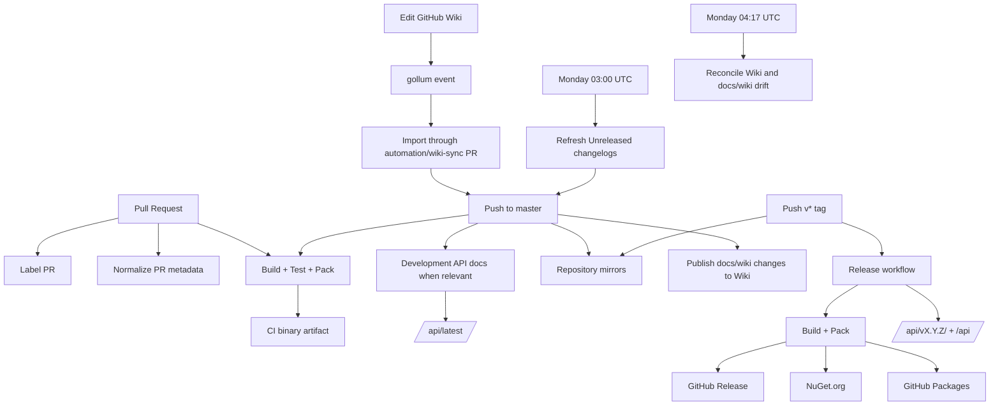
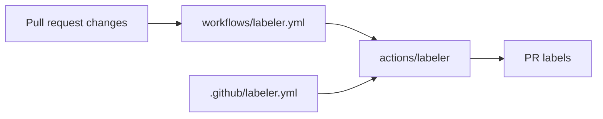
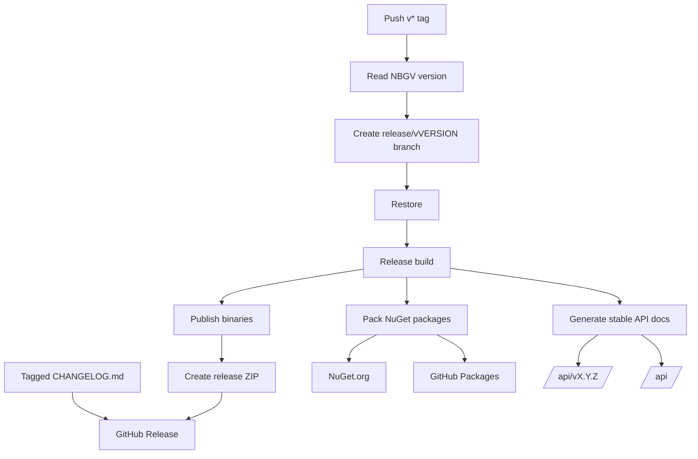

Gondwana uses GitHub Actions and repository-level configuration to automate project maintenance, validation, documentation, synchronization, mirroring, and releases.

The main automation covers:

- building, testing, packing, and staging binaries
- maintaining root and per-project changelogs
- publishing development and release API documentation
- synchronizing the GitHub Wiki with `docs/wiki`
- labeling pull requests
- formatting pull request titles and descriptions
- mirroring the repository to secondary Git hosts
- creating GitHub Releases
- publishing packages to NuGet.org and GitHub Packages

Most of the automation lives under:

```text
.github/
├── labeler.yml
├── release.yml
└── workflows/
    ├── changelog-weekly.yml
    ├── ci-master.yml
    ├── docs.yml
    ├── format-pr-title.yml
    ├── labeler.yml
    ├── mirror-gitlab.yml
    ├── mirror-sourceforge.yml
    ├── mirror_bitbucket.yml
    ├── mirror_codeberg.yml
    ├── release.yml
    ├── wiki-reconcile-weekly.yml
    └── wiki-sync.yml
```

Files under `.github/workflows/` are **GitHub Actions workflows**: they define things GitHub actually runs.

Files such as `.github/labeler.yml` and `.github/release.yml` are **configuration files** consumed by workflows or by GitHub itself.

---

## Contents

- [Workflow overview](#workflow-overview)
- [CI — ci-master.yml](#ci--ci-masteryml)
- [Changelog maintenance — changelog-weekly.yml](#changelog-maintenance--changelog-weeklyyml)
- [Wiki synchronization — wiki-sync.yml](#wiki-synchronization--wiki-syncyml)
- [Weekly Wiki reconciliation — wiki-reconcile-weekly.yml](#weekly-wiki-reconciliation--wiki-reconcile-weeklyyml)
- [API documentation — docs.yml](#api-documentation--docsyml)
- [PR labels — labeler.yml](#pr-labels--labeleryml)
- [PR title and description formatting](#pr-title-and-description-formatting)
- [Repository mirrors](#repository-mirrors)
- [Releases — release.yml](#releases--releaseyml)
- [Release-note configuration](#release-note-configuration)
- [Secrets and permissions](#secrets-and-permissions)
- [Where configuration ends and GitHub begins](#where-configuration-ends-and-github-begins)
- [Modifying a workflow](#modifying-a-workflow)
- [Troubleshooting](#troubleshooting)
- [Mental model](#mental-model)

---

# Workflow overview

At a high level, Gondwana's repository automation looks like this:



The workflows answer different questions.

**CI answers:**

> Does the current code build, test, package, and produce the expected binaries?

**Changelog automation answers:**

> Are the derived `[Unreleased]` sections reasonably current without creating changelog churn after every merge?

**Wiki synchronization answers:**

> Do `docs/wiki` and the GitHub Wiki represent the same documentation while allowing either surface to be edited safely?

**Docs automation answers:**

> Can current development and tagged-release API documentation be generated and published?

**PR automation answers:**

> Can routine repository housekeeping happen consistently without manual work?

**Release automation answers:**

> Can a tagged version become an actual Gondwana release?

---

# CI — `ci-master.yml`

File:

```text
.github/workflows/ci-master.yml
```

The CI workflow is Gondwana's main validation pipeline.

It runs for:

- pushes to `master`
- pull requests that are opened
- pull requests that receive new commits
- reopened pull requests
- draft pull requests marked ready for review

Documentation-only and changelog-only changes are excluded from the normal CI workflow.

The current `paths-ignore` rules include:

```text
docs/**
.github/workflows/docs.yml
.github/release.yml
CHANGELOG.md
**/CHANGELOG.md
```

That keeps generated changelog refreshes and documentation-only changes from rebuilding the entire engine.

A Wiki import is a special case: its checkpoint file lives under `Tooling/scripts/wiki-sync`, outside `docs/**`, so an imported Wiki PR is not accidentally treated as a documentation-only CI no-op.

---

## CI environment

CI currently runs on:

```yaml
runs-on: ubuntu-latest
```

with:

```yaml
dotnet-version: '8.0.x'
```

Although Gondwana contains Windows-targeting projects, CI builds from Linux using:

```text
/p:EnableWindowsTargeting=true
```

This allows Windows-targeted assemblies to be validated without moving the entire build to a Windows runner.

---

## Restore and build

The workflow restores workloads and NuGet dependencies, then performs a full Release build.

The normal restore includes:

```text
/p:Configuration=Release
```

because some runtime-specific dependencies are resolved differently by configuration.

The build uses the already-restored dependency graph:

```bash
dotnet build \
    --configuration Release \
    --no-restore \
    /p:EnableWindowsTargeting=true
```

---

## Tests

CI explicitly runs:

```text
Testing/Gondwana.Tests/Gondwana.Tests.csproj
```

It also runs the browser-side Blazor presentation helper tests with Node.js:

```text
Testing/BlazorPresentationTests.mjs
```

Conceptually:

```text
Restore
  ↓
Build
  ↓
Gondwana.Tests
  ↓
Blazor presentation tests
  ↓
Pack validation
```

---

## Pack validation

CI runs `dotnet pack`, but it does **not** publish packages.

CI answers:

> Could Gondwana be packaged successfully?

The release workflow answers:

> Should those packages actually be published?

Keeping those responsibilities separate prevents an ordinary pull request or push from becoming a package release.

---

## Published CI binaries

After validation, CI publishes selected projects into temporary staging directories and creates:

```text
Gondwana-binaries.zip
```

GitHub Actions uploads the ZIP as the workflow artifact:

```text
Gondwana-binaries
```

This provides downloadable build output without performing a formal release.

---

# Changelog maintenance — `changelog-weekly.yml`

File:

```text
.github/workflows/changelog-weekly.yml
```

This workflow replaced the older `changelog-master.yml` design.

The important architectural change is that Gondwana no longer regenerates `[Unreleased]` and opens a changelog PR after every qualifying push to `master`.

Instead, changelogs are refreshed **in a scheduled batch**.

---

## Schedule and manual execution

The workflow runs:

```text
Monday 03:00 UTC
```

which is Sunday night in US Eastern time:

- 11:00 PM during EDT
- 10:00 PM during EST

It can also be started manually with:

```text
Actions → Changelog (weekly) → Run workflow
```

The schedule intentionally keeps normal development commits free from a second automated changelog PR after nearly every merge.

---

## What the weekly job does

The workflow:

1. verifies that `CHANGELOG_PUSH_TOKEN` is available
2. checks out current `master` with full history
3. records the starting `master` SHA
4. installs `git-cliff`
5. runs `Test-ChangelogConfiguration.ps1`
6. runs `Generate-Root-Changelog.ps1`
7. runs `Generate-Project-Changelogs.ps1`
8. stages only `CHANGELOG.md` files
9. fails if generation changed any other file
10. exits cleanly if the changelogs are already current
11. commits the refresh
12. verifies that `master` has not moved
13. pushes the commit directly to `master` with a force-with-lease guard

The generated commit is:

```text
docs: refresh unreleased changelogs [skip release notes]
```

---

## Why the workflow pushes directly to `master`

This is intentionally different from the former automation-PR design.

The weekly refresh is deterministic generated maintenance, and batching it once per week makes a dedicated PR less useful than it was when changelogs were regenerated continuously.

The workflow still protects against clobbering newer work.

Before pushing, it fetches `master` and confirms that the remote SHA still equals the SHA recorded at the beginning of the run.

The final push also uses:

```text
--force-with-lease
```

against that exact starting SHA.

So the contract is:

```text
record master SHA
      ↓
generate changelogs
      ↓
master unchanged?
   ├── no  → fail; rerun later
   └── yes → lease-protected push
```

A PR merge or other direct update that moves `master` during generation therefore causes a visible failure instead of an overwrite.

---

## Changelog configuration validation

Before touching the real changelogs, the weekly workflow runs:

```powershell
./Tooling/scripts/Test-ChangelogConfiguration.ps1
```

The test suite creates temporary Git history and exercises changelog behavior in isolation.

It checks contracts such as:

- root and project selection behavior
- missing-file bootstrap
- preview safety
- idempotent repeated refreshes
- tagged generation
- preservation of released history
- excluded-only root no-ops
- project configuration combinations

This keeps the scheduled write path behind a validation step.

---

## Project selection

The authoritative project metadata lives in:

```text
Tooling/scripts/Changelog-ProjectGroups.ps1
```

Each configured area independently declares:

```text
GenerateChangelog
IncludeInRootChangelog
```

That allows all four logical combinations.

For example:

- engine projects can have both a project changelog and root entry
- demos can have project changelogs without appearing in the root changelog
- repository/build areas can appear only in the root changelog
- omitted areas can generate neither

This is the central place to update when a new deployable project should participate in changelog generation.

---

## Changelog exclusions

`cliff.toml` contains explicit parser rules to keep automation noise out of generated changelogs.

Among other exclusions, it skips:

```text
docs(wiki):
changelog
[skip release notes]
docs: update changelog
```

That means Wiki-sync automation and the scheduled changelog-refresh commit do not recursively become changelog entries.

---

## Concurrency

The weekly workflow uses:

```text
changelog-weekly-master
```

with:

```text
cancel-in-progress: false
```

A manually started run and the scheduled run therefore do not update `master` concurrently.

---

## No-change behavior

If generation produces no staged changelog changes, the workflow reports that the changelogs are current and exits without creating a commit.

There is no automation branch or changelog PR to clean up.

---

# Wiki synchronization — `wiki-sync.yml`

Files and supporting code:

```text
.github/workflows/wiki-sync.yml
docs/wiki/
Tooling/scripts/wiki-sync/
```

Gondwana keeps its GitHub Wiki mirrored into the main repository under:

```text
docs/wiki
```

Both are supported editing surfaces.

You can:

- edit an article in the repository and merge it to `master`
- edit an article directly through GitHub's Wiki UI

The synchronization workflow keeps the two sides aligned without making either one permanently read-only.

The repository-only file:

```text
docs/wiki/README.md
```

documents the synchronization machinery itself and is deliberately excluded from publication to the Wiki.

---

## Day-to-day: repository → Wiki

A push to `master` that changes:

```text
docs/wiki/**
```

triggers `wiki-sync.yml`, except when the only relevant file is:

```text
docs/wiki/README.md
```

The workflow checks out the synchronization code from trusted `master`, runs its unit tests, then performs:

```text
repo-to-wiki
```

The comparison is content-aware. If the Wiki already represents the same content, there is no unnecessary content commit.

Normal repository edits therefore follow:

```text
branch
  ↓
PR
  ↓
merge to master
  ↓
wiki-sync.yml
  ↓
GitHub Wiki
```

---

## Day-to-day: Wiki → repository

Editing the GitHub Wiki produces a GitHub:

```text
gollum
```

event.

That triggers the same `wiki-sync.yml`, but in the opposite direction:

```text
wiki-to-repo
```

A Wiki import **never pushes directly to `master`**.

Instead, the sync machinery uses the stable branch:

```text
automation/wiki-sync
```

and creates or updates a pull request against `master`.

Automated Wiki-import PR titles begin with:

```text
docs(wiki):
```

The workflow requests auto-merge through GitHub's API, but normal repository rules remain authoritative. Required checks, branch protection, and required human review are not bypassed.

---

## Why Wiki imports use a PR

The Wiki UI is an external editing surface relative to the main source repository.

Importing through a PR gives the repository a reviewable boundary:

```text
Wiki edit
   ↓
gollum
   ↓
three-way comparison
   ↓
automation/wiki-sync
   ↓
docs(wiki): ... PR
   ↓
normal repository checks/review
   ↓
master
```

This is intentionally more conservative than silently copying Wiki state into `master`.

---

## Conflict behavior

The synchronizer uses whole-file three-way comparisons based on the last acknowledged state.

Its purpose is to preserve unrelated one-sided edits while refusing ambiguous two-sided edits.

Cases that fail visibly include:

- the same article independently changed on both sides
- delete/edit conflicts
- divergent Wiki history
- merge conflicts between the automation branch and current `master`
- concurrent remote changes detected while a push is in progress

There is no silent last-writer-wins policy.

Binary Wiki assets receive the same protection.

A conflict can therefore be conservative: two independent edits to different parts of the same Markdown file still count as competing whole-file edits.

---

## Checkpoints and source anchors

Synchronization state is recorded under:

```text
Tooling/scripts/wiki-sync/
```

including the imported Wiki revision.

Automated Wiki publication commits also record a source master SHA.

Together, those anchors let the script determine what changed on each side since the last common acknowledged state.

The checkpoint is intentionally outside `docs/**` so Wiki-import PRs are not skipped by CI's documentation-only path filter.

---

## Manual synchronization

`wiki-sync.yml` also supports `workflow_dispatch`.

Use:

```text
Actions → Wiki sync → Run workflow
```

and choose one of:

| Direction | Authoritative source | Destination |
|---|---|---|
| `repo-to-wiki` | current `master` `docs/wiki` | GitHub Wiki |
| `wiki-to-repo` | current GitHub Wiki | automation branch / PR |

Manual runs are **authoritative recovery operations**. They may replace destination content, including deletions, while still excluding the repository-only `docs/wiki/README.md`.

Use them when you intentionally know which side should win.

The `wiki-to-repo` manual direction still uses the protected PR path; it does not bypass `master`.

---

## Loop prevention

The sync system compares actual content rather than relying on token-based event suppression.

Repeated equivalent events become no-ops.

This matters because a successful import eventually creates a `master` change under `docs/wiki`, which can in turn trigger the repository-to-Wiki direction.

The content comparison recognizes that the destination is already current and stops the loop naturally.

---

## Concurrency

The day-to-day and weekly Wiki workflows share:

```text
wiki-sync-master
```

with in-progress work preserved rather than cancelled.

Runs read current heads and perform complete comparisons, so a later run can cover coalesced events without depending only on the original event's changed-file list.

---

# Weekly Wiki reconciliation — `wiki-reconcile-weekly.yml`

File:

```text
.github/workflows/wiki-reconcile-weekly.yml
```

Normal Wiki synchronization is **event-driven**.

The weekly workflow exists only as a safety net for events or runs that did not complete cleanly.

It runs:

```text
Monday 04:17 UTC
```

and can also be started manually.

The time is intentionally distinct from the Monday 03:00 UTC changelog refresh.

---

## What reconciliation does

The weekly job:

1. checks out trusted synchronization code from `master`
2. runs the Wiki synchronization unit tests
3. performs `wiki-to-repo`
4. performs `repo-to-wiki`

Import happens first so an unacknowledged Wiki edit gets its normal shared PR before repository publication is retried.

The workflow compares complete trees rather than relying on a prior event payload.

It can therefore recover from cases such as:

- a missed `gollum` event
- a failed or interrupted day-to-day sync
- a deletion that was not propagated
- rename edge cases
- temporary drift between the Wiki and `docs/wiki`

A rename can safely degrade to deletion plus addition.

If the trees are already equivalent, the weekly job does not invent work.

If both sides changed ambiguously, it fails rather than picking a winner.

So the intended relationship is:

```text
day-to-day events = normal synchronization
weekly reconcile  = recovery safety net
```

---

# API documentation — `docs.yml`

File:

```text
.github/workflows/docs.yml
```

The standalone docs workflow publishes **development API documentation** from `master`.

It can be started manually and also runs automatically when relevant API-affecting source or documentation infrastructure changes.

The path filter includes relevant:

- `.cs`
- `.csproj`
- `.props`
- `.targets`
- version configuration
- Doxygen configuration
- API-doc tooling

while excluding areas such as demos, tests, and unrelated tooling.

This is intentionally different from ordinary Wiki prose: editing `docs/wiki` does not require rebuilding Doxygen output.

---

## Development documentation

The workflow uses Nerdbank.GitVersioning to determine the current package version, validates the API-doc publisher, generates Doxygen output, and publishes it as:

```text
/api/latest/
```

The displayed version identifies it as development documentation from `master`.

The workflow then requests a GitHub Pages build.

---

## Stable release documentation

Stable API documentation is published by the tag-driven release workflow rather than `docs.yml`.

For a stable tag:

```text
vX.Y.Z
```

the release workflow publishes an immutable version under:

```text
/api/vX.Y.Z/
```

and updates the stable entry point:

```text
/api/
```

This produces two distinct tracks:

```text
/api/          → latest stable release
/api/latest/   → development master
/api/vX.Y.Z/   → immutable tagged release
```

Development publishing and release publishing share the concurrency group:

```text
api-docs-publication
```

so they do not update the Pages branch concurrently.

---

# PR labels — `labeler.yml`

There are two files called `labeler.yml`, and they have different jobs:

```text
.github/workflows/labeler.yml
.github/labeler.yml
```

The workflow file is executable automation.

The configuration file maps changed paths to labels.

Conceptually:



---

## Current label behavior

Path rules cover areas including:

- Gondwana core
- Widgets
- Avalonia
- Blazor
- WinForms
- hosting
- input
- video
- CLI
- templates
- tooling
- demos
- documentation
- repository chores

There are also broad category labels for:

```text
audio
testing
```

Audio matching is designed to cover current and future `Gondwana.Audio*` projects.

Testing matching covers the current `Testing/**` tree and future `Gondwana.Testing*` projects.

Generated changelogs are explicitly excluded from the path rules:

```text
!**/CHANGELOG.md
```

so a project does not receive a functional label merely because its generated changelog changed.

Multiple labels are intentional. A Templates change, for example, may receive both a template-specific label and the broader tooling label.

---

# PR title and description formatting

File:

```text
.github/workflows/format-pr-title.yml
```

This workflow provides Gondwana's AI-assisted PR metadata automation using GitHub Copilot CLI.

It listens to `pull_request_target` events, but only runs when the pull request:

- targets `master`
- originates from the same Gondwana repository

The same-repository restriction is important because `pull_request_target` runs with base-repository permissions.

Fork-provided content is therefore excluded from this automation.

---

## Conventional titles

The workflow recognizes titles shaped like:

```text
type(scope): description
```

with conventional types such as:

```text
feat
fix
perf
refactor
docs
test
build
ci
chore
revert
```

A breaking change may use:

```text
type(scope)!: description
```

If the existing PR title is already conventional, the workflow leaves it alone.

That means Wiki documentation PR titles such as:

```text
docs(wiki): update synchronization documentation
```

are already in the preferred form and do not need AI rewriting.

---

## Copilot context and safeguards

Copilot receives limited branch context:

- capped commit messages
- capped `git diff --stat` output

The returned title is validated deterministically for type, scope shape, casing, length, and punctuation.

If Copilot fails or returns an invalid title, the workflow attempts to use an existing conventional commit message.

If that also fails, it uses a safe fallback.

The workflow can similarly populate an empty PR description with a concise bullet summary, but it does not overwrite a human-written body.

AI therefore assists the metadata process; deterministic code decides whether its output is acceptable.

---

# Repository mirrors

Gondwana keeps GitHub as the canonical repository while maintaining read-only mirrors for availability and discoverability.

Current workflows include:

```text
.github/workflows/mirror_bitbucket.yml
.github/workflows/mirror_codeberg.yml
.github/workflows/mirror-gitlab.yml
.github/workflows/mirror-sourceforge.yml
```

The mirror workflows run for relevant updates to `master` and tags, and they can also be dispatched manually.

They push canonical GitHub history outward; development does not flow back from the mirrors into GitHub.

The intended model is:

```text
GitHub master/tags
       ↓
read-only mirrors
├── Bitbucket
├── Codeberg
├── GitLab
└── SourceForge
```

Mirror credentials are stored as repository secrets rather than committed into workflow files.

When changing mirror automation, preserve the rule that GitHub remains canonical.

---

# Releases — `release.yml`

File:

```text
.github/workflows/release.yml
```

The release workflow turns a Gondwana version tag into a published release.

It runs when GitHub receives a tag matching:

```text
v*
```

A tag is therefore an executable release event, not merely a label.

---

## Release flow

Conceptually:



---

## Release branch

After determining the version through NBGV, the workflow creates or overwrites:

```text
release/v<version>
```

pointing at the tagged release commit.

The immutable tag remains the actual release identity; the release branch provides a convenient named branch for that release state.

---

## Build, packages, and binaries

The release performs its own restore, build, pack, and publish from the tagged source.

It does not depend on artifacts from some prior CI run.

Packable projects are written under:

```text
./nupkgs
```

Selected library assemblies and application/tool publish output are staged into:

```text
Gondwana-<version>-binaries.zip
```

which becomes an asset on the GitHub Release.

---

## Release notes come from `CHANGELOG.md`

The tag-driven release workflow does **not** use GitHub's generated release-note body as its source of truth.

Instead, it extracts the newest released section from:

```text
CHANGELOG.md
```

into:

```text
RELEASE_NOTES.md
```

and supplies that file to the GitHub Release action.

If a usable release section cannot be extracted, the release fails.

During normal development, the weekly workflow keeps `[Unreleased]` reasonably current.

When `release.ps1` performs a release, it runs the changelog generators with the resolved tag so the current derived section becomes the versioned release section **before the tag is created**.

The tagged commit therefore contains the release notes that `release.yml` will publish.

---

## NuGet.org

Generated `.nupkg` files are pushed to NuGet.org using:

```text
NUGET_API_KEY
```

with duplicate versions skipped.

---

## GitHub Packages

The workflow also attempts to publish packages to GitHub Packages using:

```text
GITHUB_TOKEN
```

GitHub Packages publication is treated as best effort: failures produce warnings rather than invalidating the entire release.

---

## Stable API docs during release

For a stable semantic-version tag matching:

```text
vX.Y.Z
```

the release workflow validates the API publisher, generates Doxygen output, publishes the immutable versioned documentation, updates the stable `/api/` entry point, and requests a Pages build.

Only proper stable `vX.Y.Z` tags publish the stable API-doc track.

---

# Release-note configuration

File:

```text
.github/release.yml
```

Do not confuse this with:

```text
.github/workflows/release.yml
```

The workflow file is the executable release pipeline.

`.github/release.yml` is GitHub's configuration for automatically generated release-note categories.

Current categories include:

- Breaking Changes
- New Features
- Fixes
- Gondwana (Core)
- Gondwana.Widgets
- Gondwana.Avalonia
- Gondwana.Blazor
- Gondwana.WinForms
- Audio
- Gondwana.Hosting
- Gondwana.Input.SDL2
- Gondwana.Video
- Testing
- Templates
- Tooling
- Demos
- Other Changes

Templates are deliberately categorized before Tooling because template PRs may also receive the broader tooling label.

The configuration excludes release-note noise associated with labels such as:

```text
documentation
docs
chore
ignore-for-release
```

and excludes PRs authored by:

```text
github-actions[bot]
```

Wiki documentation PRs receive normal documentation handling and are additionally excluded from `git-cliff` changelog generation by the `docs(wiki):` parser rule.

---

## Generated GitHub notes versus actual release notes

`.github/release.yml` remains useful GitHub metadata configuration, but the tag-driven Gondwana release currently supplies:

```text
RELEASE_NOTES.md
```

extracted from the repository changelog.

So for an actual automated Gondwana release:

```text
CHANGELOG.md
    ↓
RELEASE_NOTES.md
    ↓
GitHub Release body
```

The root changelog is the source of truth.

---

# Secrets and permissions

Repository automation sometimes needs credentials, but secret values should never appear in source control.

Each workflow should request only the permissions it actually needs.

---

## `GITHUB_TOKEN`

GitHub automatically provides:

```text
GITHUB_TOKEN
```

to workflow runs.

It is used for ordinary repository-scoped operations where its event behavior and permissions are sufficient, including examples such as:

- labels and PR metadata
- GitHub Releases
- GitHub Packages
- Pages build requests

A workflow-generated push made with the default token generally does not start a new chain of workflows. That behavior is one reason some Gondwana automation uses dedicated tokens when downstream workflow triggering is part of the design.

---

## `CHANGELOG_PUSH_TOKEN`

The weekly changelog workflow requires:

```text
CHANGELOG_PUSH_TOKEN
```

It must be an App token or fine-grained PAT with appropriate repository Contents read/write access.

The dedicated credential is important because the direct changelog push to `master` is intended to behave like a normal repository update and allow downstream automation to observe it.

The workflow fails early with a clear error if the secret is absent.

---

## `WIKI_SYNC_TOKEN`

Wiki synchronization uses:

```text
WIKI_SYNC_TOKEN
```

for authenticated Wiki Git access and repository branch/PR operations.

It requires working Wiki write access plus repository Contents and Pull requests read/write capability.

Credentials are passed through the environment and Git askpass rather than embedded in remote URLs or printed diagnostics.

---

## `NUGET_API_KEY`

Publishing to NuGet.org requires:

```text
NUGET_API_KEY
```

The value is managed in repository settings and is referenced only as a secret from the workflow.

---

## Mirror credentials

Each repository-mirror workflow uses provider-specific authentication secrets.

Keep those credentials isolated to the workflow that needs them and never place private keys, tokens, or known-host material directly into the repository.

---

## Copilot permissions

The PR-formatting workflow requests:

```text
copilot-requests: write
```

because it invokes GitHub Copilot CLI.

That permission is isolated to the workflow that uses it.

---

# Where configuration ends and GitHub begins

Not every part of Gondwana's automation exists in source control.

The YAML and scripts describe workflow behavior, but repository settings also matter.

Examples include:

- repository secrets
- GitHub Pages configuration
- branch protection
- Actions permissions
- whether Actions may create pull requests
- auto-merge availability and branch rules
- available labels
- NuGet credentials
- Wiki availability and permissions
- mirror credentials

If the YAML looks correct but an operation still fails, the missing piece may be a GitHub repository setting rather than a source-code bug.

---

# Modifying a workflow

Workflow files should be treated as production infrastructure.

The safest pattern is:

```text
create development branch
        ↓
modify workflow or script
        ↓
push branch
        ↓
inspect PR behavior
        ↓
merge after validation
```

Some write paths only execute from `master`, a schedule, a Wiki event, or a version tag, so a branch cannot perfectly reproduce every production trigger.

Where possible, Gondwana's workflows compensate with deterministic validation:

- changelog refresh runs `Test-ChangelogConfiguration.ps1` before writing
- Wiki sync runs its Python unit tests before synchronizing
- API docs validate the publisher before publication
- AI-generated PR metadata is checked before being written

---

## YAML indentation matters

YAML uses indentation to represent structure.

For example:

```yaml
jobs:
  build:
    runs-on: ubuntu-latest
```

is not equivalent to:

```yaml
jobs:
build:
  runs-on: ubuntu-latest
```

The first describes a `build` job.

The second is structurally wrong for a GitHub Actions workflow.

There are few faster ways to turn sophisticated automation into expensive whitespace.

---

## Pin dependencies deliberately

Workflow dependencies are versioned infrastructure.

Gondwana uses a mixture of release tags and deliberately pinned action revisions.

When changing an action version or pinned commit, review:

- the action's release notes
- Node/runtime requirements
- permission changes
- supply-chain implications
- whether output or behavior changed

Infrastructure should be boring.

Boring infrastructure is usually infrastructure that works.

---

# Troubleshooting

When a workflow fails, start in GitHub's **Actions** tab.

Follow:

```text
workflow
   ↓
job
   ↓
step
   ↓
log output
```

The useful error is usually near the end of the first failed step.

---

## CI failures

For restore/build failures, try reproducing locally with the same major options used by CI:

```text
Release
EnableWindowsTargeting=true
```

For unit-test failures, compilation succeeded but behavior no longer satisfies a tested contract.

For browser-presentation failures, inspect the Node test output separately from the .NET test output.

---

## Permission failures

Errors such as:

```text
403
Resource not accessible by integration
permission denied
```

usually point to one of:

- workflow `permissions:`
- repository Actions settings
- token scopes
- branch rules
- Pages/Wiki/provider permissions

---

## Changelog automation failures

For `changelog-weekly.yml`, common failure categories are:

- `CHANGELOG_PUSH_TOKEN` is missing or under-scoped
- changelog configuration tests failed
- `git-cliff` installation or generation failed
- a generator modified a non-`CHANGELOG.md` file
- `master` moved while generation was running
- the lease-protected push was rejected

If `master` moved, the intended recovery is simply to rerun the workflow against the new head.

Do not bypass the lease check.

---

## Wiki synchronization failures

For `wiki-sync.yml` or `wiki-reconcile-weekly.yml`, check for:

- missing or under-scoped `WIKI_SYNC_TOKEN`
- synchronization unit-test failures
- same-file edits on both sides
- delete/edit conflicts
- a merge conflict on `automation/wiki-sync`
- rewritten/divergent Wiki history
- concurrent remote changes during publication
- branch protection or required checks preventing the import PR from merging

For an actual content conflict, decide which version should survive.

Then either resolve the automation PR normally or use a manual authoritative sync direction when appropriate.

The weekly reconciliation job should not be used as a conflict resolver; it intentionally follows the same conservative comparison rules.

---

## API documentation failures

Check:

- NBGV version detection
- Doxygen installation
- API publisher unit tests
- Doxygen generation
- `gh-pages` write permission
- Pages build permission
- concurrency with another API publication run

---

## NuGet publication failures

Check:

- whether `NUGET_API_KEY` exists
- whether it has expired
- whether the package version already exists
- whether the package ID is owned by the associated NuGet account

---

## GitHub Packages failures

The release workflow intentionally treats GitHub Packages uploads as non-fatal.

A warning there does not automatically mean the GitHub Release or NuGet.org publication failed.

---

## Copilot PR automation failures

The PR formatting workflow contains deterministic fallback behavior.

Check whether it:

1. obtained branch context
2. invoked Copilot CLI successfully
3. rejected the generated result during validation
4. selected a conventional-commit fallback
5. ultimately used the generic fallback

AI assists the workflow; it is not trusted as the validator.

---

## Mirror failures

Check:

- provider-specific authentication secrets
- SSH known-host configuration where applicable
- whether the provider is reachable
- whether the canonical GitHub ref still exists
- whether a provider rejected a force/prune operation

Fix mirror automation on GitHub; do not make the mirror authoritative to work around a synchronization problem.

---

# Mental model

The simplest reference table is:

| Concern | Source |
|---|---|
| Does Gondwana build and test? | `.github/workflows/ci-master.yml` |
| Are `[Unreleased]` changelogs current? | `.github/workflows/changelog-weekly.yml` |
| Do normal Wiki edits sync both ways? | `.github/workflows/wiki-sync.yml` |
| Is Wiki/repository drift reconciled? | `.github/workflows/wiki-reconcile-weekly.yml` |
| Are development API docs current? | `.github/workflows/docs.yml` |
| What labels should a PR receive? | `.github/workflows/labeler.yml` + `.github/labeler.yml` |
| Should PR metadata be normalized? | `.github/workflows/format-pr-title.yml` |
| Are secondary Git hosts mirrored? | `.github/workflows/mirror-*.yml` and `mirror_*.yml` |
| What happens when a version tag is pushed? | `.github/workflows/release.yml` |
| How would GitHub categorize generated release notes? | `.github/release.yml` |

Or, more compactly:

```text
Pull Request
├── label it
├── normalize metadata when needed
└── build + test normal code changes

master
├── build + test normal code changes
├── publish relevant development API docs
├── publish docs/wiki changes to the GitHub Wiki
└── mirror canonical history outward

GitHub Wiki edit
└── import through automation/wiki-sync PR
      └── normal checks/review
            └── master

Sunday night / Monday UTC
├── 03:00 UTC → refresh [Unreleased] changelogs
│                └── guarded direct push to master
└── 04:17 UTC → reconcile Wiki drift

v* tag
└── build release
    ├── create GitHub Release
    ├── publish NuGet packages
    ├── publish GitHub Packages
    ├── publish stable/versioned API docs
    └── mirror tag outward
```

The changelog path between development and release is:

```text
commits on master
      ↓
weekly [Unreleased] refresh
      ↓
release.ps1
      ↓
versioned changelog section
      ↓
v* tag
      ↓
release.yml
```

The Wiki path is:

```text
repository article ──merge──> master ──event──> GitHub Wiki
                                              ↑
GitHub Wiki edit ──gollum──> automation PR ───┘
```

These files are not part of the Gondwana engine runtime.

They are the machinery around the engine that keeps builds repeatable, pull requests organized, changelogs current, documentation synchronized, API references published, mirrors current, and releases reproducible.
