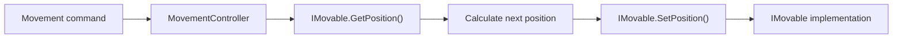
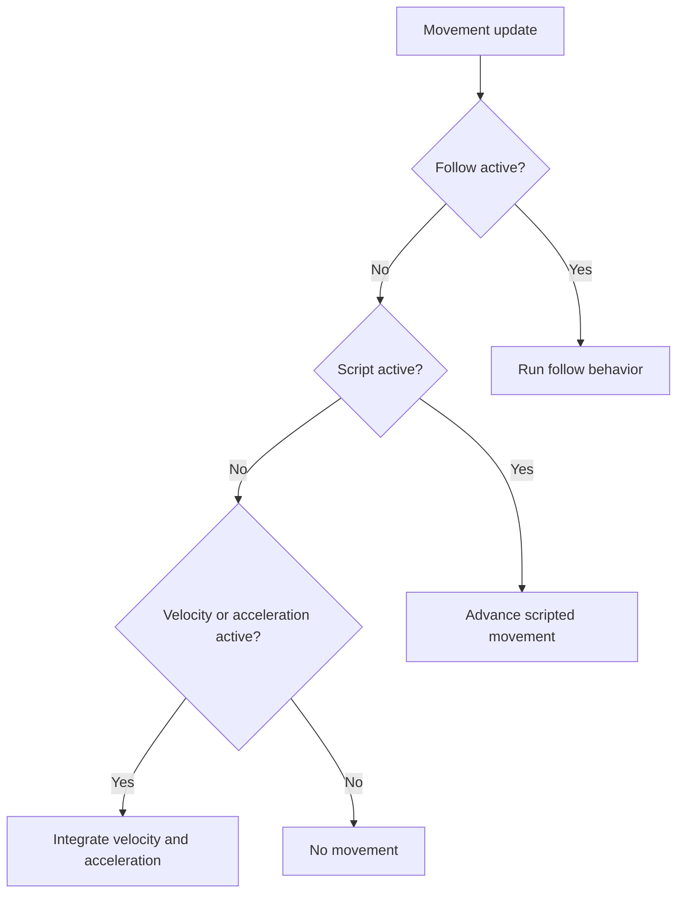

Gondwana's movement system centers on `MovementController`, which manages how an `IMovable` changes position over time.

> **Moving sprites or direct drawings?**
>
> This page explains the movement system itself. See [[Moving Sprites and Direct Drawings]] for the object-specific differences between grid-space sprites and pixel-space direct drawings.

---

## Table of Contents

- [The Mental Model](#the-mental-model)
- [Movement Spaces and Units](#movement-spaces-and-units)
- [The Three Movement Families](#the-three-movement-families)
- [Priority and Ownership](#priority-and-ownership)
- [Follow Movement](#follow-movement)
- [Scripted Movement](#scripted-movement)
- [Integrated Movement](#integrated-movement)
- [Switching and Stopping Movement](#switching-and-stopping-movement)
- [Status and Events](#status-and-events)
- [World Wrapping](#world-wrapping)
- [Update Timing](#update-timing)
- [Common Recipes](#common-recipes)
- [Movement, Collision, and Pathfinding](#movement-collision-and-pathfinding)
- [Common Mistakes](#common-mistakes)
- [Troubleshooting](#troubleshooting)
- [Quick Reference](#quick-reference)
- [Related Documentation](#related-documentation)
- [Related Source Files](#related-source-files)

---

## The Mental Model

`MovementController` does not decide what a position means.

The movable object does.

Every movable implements `IMovable`:

```csharp
MovementSpace PositionSpace { get; }

Vector2 GetPosition();

void SetPosition(Vector2 pos);
```

The controller:

1. reads the object's current position;
2. calculates a new position;
3. writes that position back through `SetPosition`;
4. lets the movable object update its rendering, collision state, events, or other object-specific systems.



This is why the same movement API can drive objects that use different position systems.

For example:

```csharp
sprite.Movement.MoveTo(...);

directDrawing.Movement.MoveTo(...);
```

The method is the same.

The units may not be.

> **Always interpret movement values in the movable object's `PositionSpace`.**

---

## Movement Spaces and Units

Gondwana currently exposes two movement spaces:

```csharp
MovementSpace.Grid
MovementSpace.Pixel
```

### Grid space

Grid-space position and movement values use scene-layer coordinates.

For an orthogonal map, that normally means:

```text
X = column
Y = row
```

Grid coordinates may be fractional:

```csharp
new Vector2(5.25f, 3.5f)
```

This allows smooth movement between logical cells while retaining a grid-aware position.

Velocity is measured in grid units per second:

```csharp
mover.Movement.SetVelocity(
    new Vector2(2f, 0f));
```

For a grid-space mover, this means approximately two grid units per second horizontally.

It does **not** mean two pixels per second.

### Pixel space

Pixel-space positions and movement values are measured in pixels.

The exact meaning of those pixels belongs to the mover. For Gondwana's built-in movable direct drawings, for example:

- scene-layer direct drawings use world pixels;
- view-mode direct drawings use absolute screen/backbuffer pixels.

See [[Moving Sprites and Direct Drawings]] for those object-specific rules.

### Per-second values

Movement APIs are time-based.

Typical units are:

| Value | Grid mover | Pixel mover |
|---|---|---|
| Position | grid units | pixels |
| Velocity | grid units/sec | pixels/sec |
| Acceleration | grid units/sec² | pixels/sec² |
| Follow speed | interpreted in the follower's space | interpreted in the follower's space |
| Script speed | position-space units/sec | position-space units/sec |

Do not multiply movement values by FPS. The engine supplies elapsed time to the controller.

---

## The Three Movement Families

Every `MovementController` supports three movement families.

| Family | Primary APIs | Purpose | Typical examples |
|---|---|---|---|
| **Follow** | `FollowPixelSoft`, `FollowPixelHard`, `FollowTileSoft`, `FollowTileHard` | Track a live target | name tags, companions, attached effects |
| **Scripted** | `MoveTo`, `MoveBy`, `MoveToward` | Execute an authored move | doors, cutscenes, UI-like motion |
| **Integrated** | `SetVelocity`, `SetAcceleration`, `SetMaxSpeed`, `SetLinearDamping` | Continuous velocity/acceleration motion | players, projectiles, momentum |

The important distinction is not just which API you call.

It is **which movement family currently owns the object**.

---

## Priority and Ownership

Each movement update resolves in this order:

1. **Follow**
2. **Scripted**
3. **Integrated**



This priority is part of the public behavior you should design around.

### Follow has first claim

If follow state is active, it is evaluated first.

Hard follow can consume the frame immediately. Soft follow may schedule or refresh scripted motion toward the current live target, after which the scripted stage advances that move.

### Scripted movement comes next

An active `MoveTo`, `MoveBy`, or `MoveToward` owns movement before integrated velocity/acceleration runs.

Starting a script clears integrated velocity and acceleration.

### Integrated movement is the fallback

Velocity and acceleration run only when follow and scripted movement are not currently owning the object.

That makes integrated motion the normal "free movement" state.

---

## Follow Movement

Follow movement tracks a live target whose position may change every update.

It is useful for:

- a name tag following a sprite;
- a companion pursuing a player;
- a marker following a moving world object;
- a screen-space element following another screen-space element;
- an effect attached to a live point.

Gondwana supports:

- pixel targets;
- grid/tile targets;
- hard follow;
- soft follow;
- speed-based follow;
- duration/easing-based follow;
- grid and pixel offsets.

### Hard versus soft follow

| Type | Behavior |
|---|---|
| **Hard follow** | The follower snaps directly to the current target each update |
| **Soft follow** | The follower moves toward the target over time |

Hard follow is appropriate for rigid attachments.

Soft follow is appropriate for pursuit, lag, easing, or intentionally delayed motion.

### Follow a pixel target

Constant-speed soft follow:

```csharp
label.Movement.FollowPixelSoft(
    getPixelPos: () => target.GetPosition(),
    speed: 240f,
    snap: 0.5f,
    offsetPx: new Vector2(0, -24));
```

Hard follow:

```csharp
label.Movement.FollowPixelHard(
    getPixelPos: () => target.GetPosition(),
    offsetPx: new Vector2(0, -24));
```

The target delegate is evaluated repeatedly, so the target can keep moving.

### Follow a grid target

A grid-aware target implements `IMovableOnSceneLayer`.

Soft follow:

```csharp
nameTag.Movement.FollowTileSoft(
    tileTarget: player,
    speedTilesPerSec: 5f,
    snapTiles: 0.1f,
    gridOffset: new Vector2(0, -0.75f),
    pixelOffset: new Vector2(0, -8f));
```

Hard follow:

```csharp
nameTag.Movement.FollowTileHard(
    tileTarget: player,
    gridOffset: new Vector2(0, -0.75f),
    pixelOffset: new Vector2(0, -8f));
```

The controller converts between grid and pixel space when the follower and target use different movement spaces.

### Grid and pixel offsets

These offsets occur at different stages:

| Offset | Units | Applied |
|---|---|---|
| `gridOffset` | grid units | before grid-to-pixel conversion |
| `pixelOffset` / `offsetPx` | pixels | after conversion for pixel-space followers |

This is useful when the logical attachment point is tile-relative but the final artwork needs a small visual nudge.

### Duration and easing follow

Soft-follow overloads can use a duration and easing function or `EasingKind` instead of a constant speed.

That is useful when you want a live target to be approached with a consistent easing profile rather than a fixed units-per-second pursuit.

### Stop following

```csharp
mover.Movement.Unfollow();
```

`Unfollow()` clears follow targets, offsets, speed/easing state, and hard-follow state.

It also cancels an active scripted movement.

That last point matters when changing movement families.

---

## Scripted Movement

Scripted movement represents an explicit authored movement command.

Use it when you know the intended destination or relative move.

### Move to a position over a duration

```csharp
mover.Movement.MoveTo(
    target: destination,
    durationSec: 1.25f);
```

With easing:

```csharp
mover.Movement.MoveTo(
    target: destination,
    seconds: 1.25f,
    easingKind: EasingKind.EaseInOutQuad);
```

The target is expressed in the mover's own `PositionSpace`.

### Move by a relative amount

```csharp
mover.Movement.MoveBy(
    delta: new Vector2(3, 0),
    durationSec: 0.75f,
    easingKind: EasingKind.EaseInOutQuad);
```

`MoveBy` calculates its destination from the mover's current position.

### Move toward a destination at constant speed

```csharp
mover.Movement.MoveToward(
    target: destination,
    speedPerSec: 4f);
```

Unlike a duration-based tween, `MoveToward` advances at a position-space speed until it reaches the destination or is cancelled.

### Script callbacks

Duration/speed scripts can be configured fluently:

```csharp
mover.Movement
    .MoveTo(
        target: destination,
        durationSec: 1f)
    .OnBeginning(() =>
    {
        // Optional setup.
    })
    .OnComplete(() =>
    {
        // Runs only after normal completion.
    });
```

`OnBeginning(...)` runs immediately when it is registered against the active script. It is not a future notification.

Completion callbacks are discarded if the script is cancelled or replaced.

Starting a new scripted movement directly replaces the previous script state. The older script's `OnComplete(...)` callback is discarded; do not rely on completion callbacks for replacement cleanup.

### Starting a script replaces integrated motion

When a script begins, the controller clears integrated velocity and acceleration.

This prevents leftover free-motion state from fighting the authored move.

### Cancel a script

```csharp
mover.Movement.CancelScript();
```

Cancellation:

- clears the active script;
- raises `ScriptedMovementStopped` when a script was active;
- does **not** invoke registered completion callbacks.

---

## Integrated Movement

Integrated movement is the continuous physics-style mode.

It advances velocity and acceleration over elapsed time.

### Velocity

```csharp
mover.Movement.SetVelocity(
    new Vector2(3f, 0f));
```

### Acceleration

```csharp
mover.Movement.SetAcceleration(
    new Vector2(0f, 5f));
```

Velocity is advanced from acceleration, then position is advanced from velocity.

### Maximum speed

```csharp
mover.Movement.SetMaxSpeed(
    6f);
```

Use `null` to remove the cap:

```csharp
mover.Movement.SetMaxSpeed(
    null);
```

### Linear damping

```csharp
mover.Movement.SetLinearDamping(
    4f);
```

Damping reduces velocity over time in a frame-rate-independent way.

It applies to integrated movement, not scripted motion.

### Setting velocity or acceleration cancels scripts

Both:

```csharp
mover.Movement.SetVelocity(...);
```

and:

```csharp
mover.Movement.SetAcceleration(...);
```

cancel any active scripted movement before changing integrated state.

They **do not clear follow state**.

Because follow has higher priority, this can surprise you:

```csharp
mover.Movement.SetVelocity(
    new Vector2(3f, 0f));
```

may appear to do nothing if the mover is still following a target.

To explicitly switch from follow to integrated motion:

```csharp
mover.Movement.Unfollow();

mover.Movement.SetVelocity(
    new Vector2(3f, 0f));
```

---

## Switching and Stopping Movement

Because the movement families have priority, changing behavior is clearest when you explicitly clear the behavior that currently owns the mover.

### Follow → scripted

```csharp
mover.Movement.Unfollow();

mover.Movement.MoveTo(
    target: destination,
    durationSec: 1f);
```

### Follow → integrated

```csharp
mover.Movement.Unfollow();

mover.Movement.SetVelocity(
    velocity);
```

### Scripted → integrated

`SetVelocity` and `SetAcceleration` automatically cancel an active script:

```csharp
mover.Movement.SetVelocity(
    velocity);
```

### Cancel only the script

```csharp
mover.Movement.CancelScript();
```

### Stop everything

```csharp
mover.Movement.StopAllMovement();
```

`StopAllMovement()`:

- clears follow state;
- cancels scripted movement;
- zeros velocity;
- zeros acceleration.

This is the "make this mover stop now" API.

---

## Status and Events

### Status properties

```csharp
mover.Movement.IsFollowing

mover.Movement.IsScripted

mover.Movement.IsIntegratedActive

mover.Movement.MovementState
```

`IsIntegratedActive` is true only when:

- the mover is not following;
- no script is active;
- velocity or acceleration is non-zero.

### Script events

```csharp
mover.Movement.ScriptedMovementStarted +=
    script =>
    {
    };

mover.Movement.ScriptedMovementStopped +=
    script =>
    {
    };
```

`ScriptedMovementStopped` is raised for both normal completion and explicit cancellation.

Use your own state or completion callback when you need to distinguish a particular completion path.

### `MovementState` is a snapshot value

`MovementState` is a struct.

This:

```csharp
var state =
    mover.Movement.MovementState;
```

gives you a value copy.

Changing that local copy does not reconfigure the controller.

Use controller methods such as:

- `SetVelocity`;
- `SetAcceleration`;
- `SetMaxSpeed`;
- `SetLinearDamping`;
- `MoveTo`;
- `CancelScript`.

---

## World Wrapping

`MovementController` exposes:

```csharp
mover.Movement.WrapX = true;
mover.Movement.WrapY = true;
```

Wrapping is available only for grid-space movers that belong to a scene layer.

The controller applies wrapping through its physics-style movement step. Integrated movement uses that path, and constant-speed `MoveToward` also advances through it. Duration-based `MoveTo` interpolation and hard follow set positions directly and do not use the wrapping step.

When wrapping is applied, the controller asks the layer's coordinate system for an equivalent scene-layer coordinate after movement crosses a wrapped boundary.

Wrapping is ignored for pixel-space movers.

For scene-layer-level wrapping behavior and rendering implications, also see [[SceneLayer Wrapping]].

---

## Update Timing

In normal use, you do **not** call movement advancement yourself.

The engine updates registered movable objects and supplies elapsed time.

Your code configures movement:

```csharp
mover.Movement.SetVelocity(
    direction * unitsPerSecond);
```

The engine advances it.

### Use units per second

Do not write frame-rate-dependent movement such as:

```csharp
mover.Movement.SetVelocity(
    direction * fps);
```

Use stable units:

```csharp
mover.Movement.SetVelocity(
    direction * unitsPerSecond);
```

### Built-in movable types own their update integration

Sprites and movable direct drawings hook `MovementController` into different manager/update paths, but both ultimately advance movement from elapsed time.

See [[Moving Sprites and Direct Drawings]] for those object-specific details.

---

## Common Recipes

### Move three grid units to the right

For a grid-space mover:

```csharp
mover.Movement.Unfollow();

mover.Movement.MoveBy(
    delta: new Vector2(3, 0),
    durationSec: 0.75f,
    easingKind: EasingKind.EaseInOutQuad);
```

### Move 200 pixels upward

For a pixel-space mover:

```csharp
mover.Movement.Unfollow();

mover.Movement.MoveBy(
    delta: new Vector2(0, -200),
    durationSec: 0.5f,
    easingKind: EasingKind.EaseOutCubic);
```

### Companion follows a player

```csharp
companion.Movement.FollowTileSoft(
    tileTarget: player,
    speedTilesPerSec: 4f,
    snapTiles: 0.25f,
    gridOffset: new Vector2(-1, 0));
```

### Accelerated player movement

```csharp
void ApplyPlayerInput(
    IMovable player,
    MovementController movement,
    Vector2 input)
{
    const float acceleration = 10f;
    const float maxSpeed = 4f;
    const float damping = 6f;

    movement.Unfollow();

    movement.SetAcceleration(
        input * acceleration);

    movement.SetMaxSpeed(
        maxSpeed);

    movement.SetLinearDamping(
        damping);
}
```

When input is released:

```csharp
movement.SetAcceleration(
    Vector2.Zero);
```

### Constant-speed projectile

```csharp
projectile.Movement.Unfollow();

projectile.Movement.SetVelocity(
    direction * speed);

projectile.Movement.SetMaxSpeed(
    speed);

projectile.Movement.SetLinearDamping(
    0f);
```

### Interrupt a scripted move

```csharp
platform.Movement.CancelScript();

platform.Movement.MoveTo(
    target: closedPosition,
    seconds: 0.75f,
    easingKind: EasingKind.EaseOutQuad);
```

### Stop a mover immediately

```csharp
mover.Movement.StopAllMovement();
```

---

## Movement, Collision, and Pathfinding

`MovementController` calculates movement.

It is not a complete collision or navigation system.

### Collision is separate

A collision system may respond to movement by:

- cancelling one velocity component;
- preserving motion along an unblocked axis;
- stopping a scripted move;
- allowing an authored move to continue;
- applying game-specific response logic.

For example, collision resolution can zero horizontal velocity while preserving vertical velocity for wall sliding.

The movement controller does not by itself decide what the correct collision response should be.

### Scripted movement is not obstacle avoidance

`MoveTo` and `MoveToward` know the destination.

They do not calculate a route around walls.

### Follow is not pathfinding

A following companion continually pursues its target.

If it must navigate around obstacles, a pathfinding/navigation layer must supply that behavior.

See [[Collision Detection and Resolution]] for collision concepts.

---

## Common Mistakes

### Using the wrong units

The most common movement mistake is treating every vector as pixels.

Always check:

```csharp
mover.PositionSpace
```

A grid mover and a pixel mover can both accept:

```csharp
new Vector2(3, 0)
```

but the physical meaning is different.

### Starting a script while follow is still active

Follow has first priority.

Prefer:

```csharp
mover.Movement.Unfollow();

mover.Movement.MoveTo(...);
```

### Setting velocity while follow is still active

`SetVelocity` cancels scripts, but not follow.

Prefer:

```csharp
mover.Movement.Unfollow();

mover.Movement.SetVelocity(...);
```

### Expecting `OnComplete` after cancellation

Completion callbacks run only on normal completion.

Use `ScriptedMovementStopped` if you need to observe cancellation too.

### Confusing duration and speed overloads

Prefer named arguments when the overloads are visually similar:

```csharp
mover.Movement.MoveBy(
    delta: offset,
    durationSec: 1f);
```

or:

```csharp
mover.Movement.MoveBy(
    delta: offset,
    speedPerSec: 120f);
```

### Manually advancing movement

Do not call internal movement advancement from game code.

Configure the controller and let the engine update it.

### Assuming movement implies collision or pathfinding

It does not.

Those are separate concerns.

### Mutating a copied `MovementState`

A retrieved `MovementState` is a value copy.

Use controller methods to change movement.

---

## Troubleshooting

### The object does not move

Check:

1. Is follow active?
2. Is a script active?
3. Are velocity and acceleration both zero?
4. Is the object registered with its normal engine manager/update path?
5. Has the engine started?
6. Is the movement speed appropriate for the mover's units?
7. Is object-specific rendering/visibility hiding the result?

### Velocity has no visible effect

Check:

```csharp
mover.Movement.IsFollowing
```

Follow may still own movement.

Then check:

```csharp
mover.Movement.IsScripted

mover.Movement.IsIntegratedActive
```

### A scripted move never seems to run

A follow target may still be active.

```csharp
mover.Movement.Unfollow();

mover.Movement.MoveTo(...);
```

### The mover goes far too fast or barely moves

You likely supplied values in the wrong unit scale.

Check:

```csharp
mover.PositionSpace
```

and convert the desired speed into that mover's native units.

### `OnComplete` did not run

The script may have been:

- cancelled;
- replaced;
- superseded as part of a movement-family change.

Completion callbacks are intentionally not invoked after cancellation.

### Follow is offset incorrectly

Check whether the offset should be:

- a grid offset applied before conversion;
- a pixel offset applied after conversion.

For sprite/direct-drawing attachment details, see [[Moving Sprites and Direct Drawings]].

---

## Quick Reference

### Follow

```csharp
mover.Movement.FollowPixelSoft(
    getPixelPos,
    speed: unitsPerSecond);

mover.Movement.FollowPixelHard(
    getPixelPos);

mover.Movement.FollowTileSoft(
    tileTarget,
    speedTilesPerSec);

mover.Movement.FollowTileHard(
    tileTarget);

mover.Movement.Unfollow();
```

### Scripted movement

```csharp
mover.Movement.MoveTo(
    target,
    durationSec: seconds);

mover.Movement.MoveTo(
    target,
    seconds,
    easingKind);

mover.Movement.MoveBy(
    delta,
    durationSec: seconds);

mover.Movement.MoveBy(
    delta,
    speedPerSec: speed);

mover.Movement.MoveToward(
    target,
    speedPerSec: speed);

mover.Movement.CancelScript();
```

### Integrated movement

```csharp
mover.Movement.SetVelocity(
    velocity);

mover.Movement.SetAcceleration(
    acceleration);

mover.Movement.SetMaxSpeed(
    maxSpeed);

mover.Movement.SetLinearDamping(
    dampingPerSecond);
```

### Stop movement

```csharp
mover.Movement.Unfollow();

mover.Movement.CancelScript();

mover.Movement.StopAllMovement();
```

### Status

```csharp
mover.Movement.IsFollowing

mover.Movement.IsScripted

mover.Movement.IsIntegratedActive

mover.Movement.MovementState
```

### Events

```csharp
mover.Movement.ScriptedMovementStarted +=
    script => { };

mover.Movement.ScriptedMovementStopped +=
    script => { };
```

---

## Related Documentation

- [[Moving Sprites and Direct Drawings]] — how movement differs for sprites, scene-layer direct drawings, and view-mode direct drawings
- [[Sprites]] — sprite creation, positioning, rendering, animation, and lifetime
- [[DirectDrawing]] — direct-drawing types and positioning models
- [[Using Views and Cameras]] — views, cameras, following, and presentation
- [[Coordinate Systems]] — scene-layer coordinate systems
- [[Collision Detection and Resolution]] — collision concepts separate from movement
- [[Input Handling]] — driving movement from keyboard, mouse, touch, or gamepad input

---

## Related Source Files

- [`Gondwana/Physics/Movement/MovementController.cs`](https://isthimius.github.io/Gondwana/api/latest/MovementController_8cs_source.html)
- [`Gondwana/Physics/Movement/MovementController.Follow.cs`](https://isthimius.github.io/Gondwana/api/latest/MovementController_8Follow_8cs_source.html)
- [`Gondwana/Physics/Movement/MovementController.Scripted.cs`](https://isthimius.github.io/Gondwana/api/latest/MovementController_8Scripted_8cs_source.html)
- [`Gondwana/Physics/Movement/MovementController.Integrated.cs`](https://isthimius.github.io/Gondwana/api/latest/MovementController_8Integrated_8cs_source.html)
- [`Gondwana/Physics/Movement/MovementState.cs`](https://isthimius.github.io/Gondwana/api/latest/MovementState_8cs_source.html)
- [`Gondwana/Physics/Movement/MovementSpace.cs`](https://isthimius.github.io/Gondwana/api/latest/MovementSpace_8cs_source.html)
- [`Gondwana/Physics/Movement/IMovable.cs`](https://isthimius.github.io/Gondwana/api/latest/IMovable_8cs_source.html)
- [`Gondwana/Physics/Movement/IMovableOnSceneLayer.cs`](https://isthimius.github.io/Gondwana/api/latest/IMovableOnSceneLayer_8cs_source.html)

---

## Final Mental Model

Keep these rules in mind:

> **`MovementController` moves an `IMovable` in that object's own units.**

> **Follow owns movement before scripted motion; scripted motion owns it before integrated motion.**

> **Clear higher-priority behavior explicitly when switching movement families.**

> **The engine supplies elapsed time; movement values are expressed per second.**

> **Movement changes position. Rendering, collision, and pathfinding remain separate concerns.**

Once those rules are clear, the same movement API remains predictable across Gondwana's different movable object types.
