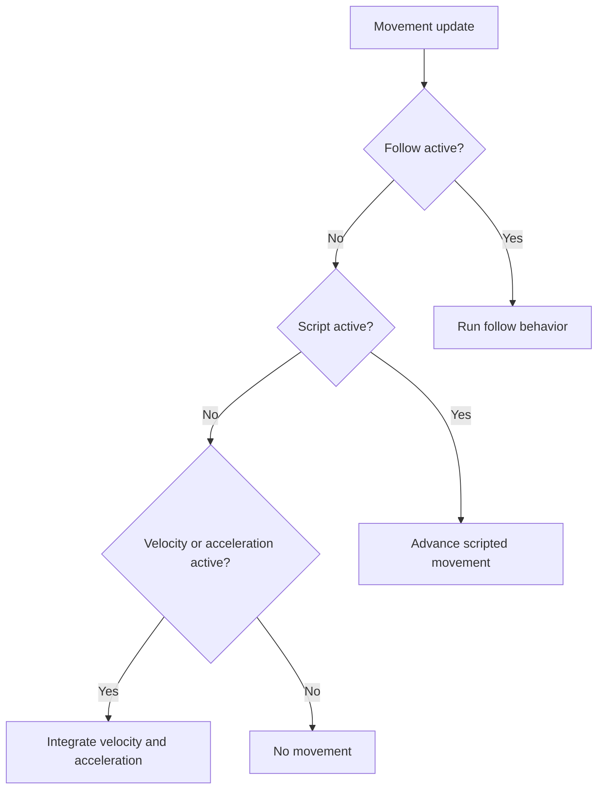

> **Movement and Controllers**
>
> A practical guide to using `MovementController` with Gondwana's two most common movable visual types.

---

## Table of Contents

- [What This Page Covers](#what-this-page-covers)
- [The Mental Model](#the-mental-model)
- [The Two Built-In Mover Models](#the-two-built-in-mover-models)
- [How Movement Is Attached](#how-movement-is-attached)
- [Movement Spaces and Units](#movement-spaces-and-units)
- [Moving Sprites](#moving-sprites)
- [Moving Direct Drawings](#moving-direct-drawings)
- [The Three Movement Families](#the-three-movement-families)
- [Follow Movement](#follow-movement)
- [Scripted Movement](#scripted-movement)
- [Integrated Movement](#integrated-movement)
- [Priority, Ownership, and Cancellation](#priority-ownership-and-cancellation)
- [Status and Events](#status-and-events)
- [Update Timing](#update-timing)
- [Common Recipes](#common-recipes)
- [Movement and Rendering](#movement-and-rendering)
- [Movement and Collision](#movement-and-collision)
- [Common Mistakes](#common-mistakes)
- [Troubleshooting](#troubleshooting)
- [Quick Reference](#quick-reference)
- [Glossary](#glossary)
- [Related Source Files](#related-source-files)

---

## What This Page Covers

The parent page, [[Movement and Controllers]], introduces Gondwana's three movement styles:

- follow;
- scripted;
- integrated.

This page explains how those styles are used by:

- `Sprite`;
- classes derived from `DirectDrawingMovableBase`, including movable direct images, rectangles, text blocks, SVG drawings, particle surfaces, and related direct-drawing types.

The focus is practical:

- what coordinate units each object uses;
- how to start and stop movement;
- how follow differs from scripted motion;
- how velocity and acceleration work;
- how movement interacts with rendering;
- how a sprite differs from a direct drawing even though both expose `.Movement`.

This page does not explain the internal design of `MovementController` in detail. It explains the public behavior a game or tool developer needs to use it correctly.

---

## The Mental Model

A `MovementController` does not decide what a position means.

The movable object decides that.

Every movable supplies three pieces of information through the `IMovable` contract:

```csharp
MovementSpace PositionSpace { get; }

Vector2 GetPosition();

void SetPosition(Vector2 position);
```

The controller:

1. reads the object's current position;
2. calculates a new position;
3. gives the new position back to the object;
4. lets the object update its own bounds, rendering state, and related systems.

```mermaid
flowchart LR
    Command["Movement command"]
    Controller["MovementController"]
    Read["IMovable.GetPosition()"]
    Calculate["Calculate next position"]
    Write["IMovable.SetPosition()"]
    Object["Sprite or DirectDrawing"]
    Render["Rendering refresh"]

    Command --> Controller
    Controller --> Read
    Read --> Calculate
    Calculate --> Write
    Write --> Object
    Object --> Render
```



That shared contract allows the same high-level movement APIs to work with objects that use very different coordinate systems.

For example:

```csharp
sprite.Movement.MoveTo(...);

directDrawing.Movement.MoveTo(...);
```

The method name is the same.

The units are not necessarily the same.

> **Always interpret movement values in the movable object's position space.**

---

## The Two Built-In Mover Models

Sprites and movable direct drawings are both movable, but they represent position differently.

| Behavior | `Sprite` | `DirectDrawingMovableBase` |
|---|---|---|
| Position space | `MovementSpace.Grid` | `MovementSpace.Pixel` |
| Stored position | Scene-layer coordinates | Pixel top-left |
| Rendering space | Converted from grid to world pixels | World or screen pixels depending on mode |
| Belongs to scene layer | Always | Only in `SceneLayer` mode |
| Can be view-bound | No | Yes |
| Camera affects it | Yes | Scene-layer mode: yes; view mode: no |
| Movement units | Grid units / tiles | Pixels |
| Position may be fractional | Yes | Yes internally |
| Rendering is pixel-aligned | Through layer conversion | Bounds rounded for rendering |
| Automatic movement updates | `SpriteManager` | Direct-drawing update cycle |
| Built-in collision participation | Sprite collision system | Not implied by movement alone |

The most important distinction is:

```text
Sprite position
    = scene-layer grid coordinates

DirectDrawing position
    = pixel coordinates
```

A sprite at `(5, 3)` is normally at grid coordinate `(5, 3)`.

A direct drawing at `(5, 3)` is normally five pixels from its applicable origin.

---

## How Movement Is Attached

You normally do not create a `MovementController` yourself.

Gondwana creates and exposes one through each movable object.

### Sprite

```csharp
Sprite sprite =
    SpriteManager.Instance.CreateSprite(
        sceneLayer,
        frame,
        "player");

MovementController movement =
    sprite.Movement;
```

A sprite's controller is configured for:

```csharp
MovementSpace.Grid
```

and is given the sprite's `SceneLayer`, allowing it to perform grid/pixel conversions when required.

### Movable direct drawing

Concrete movable direct drawings inherit their controller from `DirectDrawingMovableBase`.

```csharp
var marker =
    new DirectRectangle(
        Color.Gold,
        renderSurfaceHost,
        sceneLayer,
        new Rectangle(300, 200, 64, 64),
        "objective-marker");

MovementController movement =
    marker.Movement;
```

The controller is configured for:

```csharp
MovementSpace.Pixel
```

The direct drawing's mode determines what those pixels mean:

- `SceneLayer` mode → world pixels;
- `View` mode → absolute screen pixels.

### No manual update call is required

You do not normally call:

```csharp
movement.AdvanceMovement(...)
```

yourself.

The engine updates registered sprites and direct drawings as part of its normal cycle.

Your code configures the movement:

```csharp
sprite.Movement.SetVelocity(...);
```

The engine advances it.

---

## Movement Spaces and Units

Gondwana currently exposes two movement spaces:

```csharp
MovementSpace.Grid
MovementSpace.Pixel
```

### Grid space

Grid-space values use the owning layer's coordinate system.

For an orthogonal map:

```text
X = column
Y = row
```

For other coordinate systems, the values are interpreted by that layer's coordinate implementation.

Grid positions can be fractional:

```csharp
new Vector2(5.25f, 3.5f)
```

This allows smooth movement between cells.

Grid-space speed is measured in grid units per second.

```csharp
sprite.Movement.SetVelocity(
    new Vector2(2f, 0f));
```

For a sprite, that means approximately two grid units per second horizontally.

It does **not** mean two screen pixels per second.

### Pixel space

Pixel-space values are measured in pixels, but context still matters.

| Direct drawing mode | Pixel meaning |
|---|---|
| `DirectDrawingMode.SceneLayer` | World pixels |
| `DirectDrawingMode.View` | Absolute screen/adapter pixels |

A scene-layer direct drawing moving by:

```csharp
new Vector2(100, 0)
```

moves 100 world pixels.

A view-mode direct drawing moving by the same amount moves 100 screen pixels.

### Position meaning matters too

A sprite's position is its scene-layer coordinate.

A direct drawing's position is its bounds' upper-left.

```text
Sprite.GetPosition()
    → grid coordinate

DirectDrawing.GetPosition()
    → top-left pixel position
```

This becomes especially important when following another object.

---

## Moving Sprites

A sprite is:

- attached to one `SceneLayer`;
- stored in scene-layer coordinates;
- rendered after the layer converts those coordinates to world pixels;
- updated automatically by `SpriteManager`.

### Create and position a sprite

```csharp
var sprite =
    SpriteManager.Instance.CreateSprite(
        layer,
        frame,
        "guard");

sprite.SetPosition(
    new Vector2(8, 4));
```

The position `(8, 4)` is in the layer's grid coordinate space.

### The rendered rectangle is derived

A sprite's movement position is not necessarily the top-left pixel of its rendered image.

The final world drawing rectangle also accounts for:

- the layer's coordinate system;
- tile width and height;
- `HorizAlign`;
- `VertAlign`;
- `NudgeX`;
- `NudgeY`;
- `RenderSize`.

Conceptually:

```text
scene-layer coordinate
        ↓
coordinate-system world anchor
        ↓
alignment
        ↓
nudge
        ↓
rendered world rectangle
```

This separation is useful.

A sprite can remain logically attached to grid coordinate `(8, 4)` while its artwork is:

- centered within the tile;
- bottom-aligned;
- larger than the tile;
- nudged upward;
- rendered using a custom size.

### Movement changes the logical position

```csharp
sprite.Movement.MoveTo(
    target: new Vector2(12, 4),
    durationSec: 1.5f);
```

This moves the sprite's scene-layer coordinate toward `(12, 4)`.

The sprite then recalculates its world drawing location from that coordinate.

### Fractional grid movement

```csharp
sprite.Movement.SetVelocity(
    new Vector2(1.5f, 0));
```

The sprite can move through positions such as:

```text
(8.0, 4.0)
(8.1, 4.0)
(8.2, 4.0)
...
```

The layer's coordinate system determines how each fractional coordinate maps to a world location.

This allows smooth sprite movement without giving up grid-aware positioning.

### Alignment is not movement

This changes only rendering alignment:

```csharp
sprite.VertAlign =
    VerticalAlignment.Bottom;

sprite.NudgeY = -8;
```

It does not change:

```csharp
sprite.GetPosition()
```

Similarly, movement does not erase alignment settings.

Use movement for where the sprite exists in the layer.

Use alignment and nudges for how its visual frame is placed around that location.

### Sprite movement raises `SpriteMoved`

When `SetPosition` changes the coordinate, the sprite raises:

```csharp
sprite.SpriteMoved += args =>
{
    // Respond to logical sprite movement.
};
```

It also invalidates the union of its old and new world drawing regions so that bitmap rendering can redraw both places.

### Sprite setup example

```csharp
var guard =
    SpriteManager.Instance.CreateSprite(
        layer,
        guardFrame,
        "guard");

guard.SetPosition(
    new Vector2(4, 7));

guard.Movement.SetMaxSpeed(3f);
guard.Movement.SetLinearDamping(5f);
```

The speed and damping now apply to movement in grid-space units.

---

## Moving Direct Drawings

A direct drawing is a custom visual that may be attached to:

- a scene layer;
- a view.

Movable direct drawings derive from:

```csharp
DirectDrawingMovableBase
```

Common examples include:

- `DirectImage`;
- `DirectSvg`;
- `DirectRectangle`;
- `TextBlock`;
- `ParticleSurface`;
- other movable direct-drawing types.

### Scene-layer direct drawing

```csharp
var marker =
    new DirectRectangle(
        Color.Gold,
        renderSurfaceHost,
        sceneLayer,
        new Rectangle(
            x: 300,
            y: 200,
            width: 64,
            height: 64),
        "marker");
```

The rectangle's position is:

```text
(300, 200) world pixels
```

Moving it by 100 X units means 100 world pixels.

The camera and layer parallax affect where it appears on screen.

### View-mode direct drawing

```csharp
var panel =
    new DirectRectangle(
        Color.Black,
        renderSurfaceHost,
        view,
        new Rectangle(
            x: 20,
            y: 20,
            width: 300,
            height: 80),
        "status-panel");
```

The position is in absolute screen pixels.

The camera does not affect it.

> [!IMPORTANT]
> View-mode screen bounds are final adapter/backbuffer coordinates. They are not automatically relative to the viewport's upper-left.

For a view beginning at screen `(800, 0)`, a panel intended to appear 20 pixels inside that view should begin at approximately:

```csharp
new Rectangle(
    view.Viewport.TargetRectPx.Left + 20,
    view.Viewport.TargetRectPx.Top + 20,
    300,
    80);
```

### Movement uses the bounds' upper-left

For a direct drawing:

```csharp
Vector2 position =
    drawing.GetPosition();
```

returns the precise upper-left position.

Movement changes that upper-left while preserving the drawing's width and height.

### Precise movement and pixel-aligned rendering

`DirectDrawingMovableBase` stores its movement position as a `Vector2`.

That internal position can remain fractional:

```text
100.25
100.50
100.75
```

When updating render bounds, the X and Y values are rounded to integer pixels.

This provides:

- smooth movement calculations;
- stable pixel-aligned drawing bounds;
- fewer rendering artifacts from unintentionally fractional screen rectangles.

### Dirty-region updates are automatic

When a direct drawing changes position, it refreshes:

- the old area;
- the new area.

You do not normally need to manually enqueue dirty rectangles when moving through `.Movement`.

### Scene-layer and view-mode example

The same movement call has different coordinate meaning:

```csharp
worldMarker.Movement.MoveBy(
    delta: new Vector2(100, 0),
    durationSec: 1f);

hudPanel.Movement.MoveBy(
    delta: new Vector2(100, 0),
    durationSec: 1f);
```

For `worldMarker`:

```text
100 world pixels
```

For `hudPanel`:

```text
100 absolute screen pixels
```

---

## The Three Movement Families

Every `MovementController` supports the same three families.

| Family | Purpose | Typical examples |
|---|---|---|
| **Follow** | Track a live target | Name tag, companion, attached marker |
| **Scripted** | Execute an explicit movement command | Tween, move to destination, authored transition |
| **Integrated** | Advance velocity and acceleration | Player input, momentum, projectiles |

The controller resolves them in this priority order:



This priority is not merely an implementation detail.

It determines which behavior owns the object at a given time.

---

## Follow Movement

Follow movement continuously tracks a live target.

It is useful for:

- a name tag attached to a sprite;
- a world marker attached to a moving unit;
- a companion tracking a player;
- a UI element following another screen-space element;
- an effect tracking a live point.

Gondwana supports:

- pixel targets;
- tile/grid targets;
- hard follow;
- soft follow;
- speed-based follow;
- duration/easing-based follow;
- offsets.

### Hard versus soft follow

| Type | Behavior |
|---|---|
| Hard follow | Follower snaps to the current target each update |
| Soft follow | Follower moves toward the current target |

Hard follow is rigid.

Soft follow produces lag, pursuit, or easing.

### Follow a pixel target at constant speed

```csharp
label.Movement.FollowPixelSoft(
    getPixelPos: () => target.GetPosition(),
    speed: 240f,
    snap: 0.5f,
    offsetPx: new Vector2(0, -24));
```

For a pixel-space follower, `speed` is pixels per second.

The delegate is evaluated repeatedly so the target can move.

### Hard-follow a pixel target

```csharp
label.Movement.FollowPixelHard(
    getPixelPos: () => target.GetPosition(),
    offsetPx: new Vector2(0, -24));
```

The follower jumps directly to the target plus offset each update.

### Follow a tile target

```csharp
nameTag.Movement.FollowTileSoft(
    tileTarget: player,
    speedTilesPerSec: 5f,
    snapTiles: 0.1f,
    gridOffset: new Vector2(0, -0.75f));
```

This is particularly useful for a pixel-space direct drawing following a grid-space sprite.

The controller:

1. reads the sprite's grid coordinate;
2. applies the grid offset;
3. converts the result to a world-pixel anchor using the sprite's layer;
4. applies any pixel offset;
5. moves the direct drawing.

### Hard-follow a tile target

```csharp
nameTag.Movement.FollowTileHard(
    tileTarget: player,
    gridOffset: new Vector2(0, -0.75f));
```

### Grid and pixel offsets

These offsets are applied in different stages.

| Offset | Units | Applied when |
|---|---|---|
| `gridOffset` | Grid units | Before grid-to-pixel conversion |
| `pixelOffset` | Pixels | After conversion, for pixel followers |

Example:

```csharp
nameTag.Movement.FollowTileSoft(
    tileTarget: player,
    speedTilesPerSec: 8f,
    snapTiles: 0.05f,
    gridOffset: new Vector2(0, -0.5f),
    pixelOffset: new Vector2(0, -8f));
```

This follows half a tile above the target, then nudges the visual another eight pixels upward.

### Duration and easing follow

Soft follow overloads can use a duration and easing function.

```csharp
label.Movement.FollowPixelSoft(
    getPixelPos: () => target.GetPosition(),
    durationSec: 0.25f,
    easingKind: EasingKind.EaseOutCubic,
    snap: 0.5f,
    offsetPx: new Vector2(0, -24));
```

For tile targets:

```csharp
marker.Movement.FollowTileSoft(
    tileTarget: player,
    durationSec: 0.3f,
    easingKind: EasingKind.EaseOutQuad,
    snap: 0.1f,
    gridOffset: new Vector2(0, -1));
```

### Stop following

```csharp
mover.Movement.Unfollow();
```

`Unfollow` clears:

- pixel follow target;
- tile follow target;
- follow offsets;
- follow speed;
- easing state;
- hard-follow state.

It also cancels the current scripted movement.

### Follow remains active

Follow is continuous.

The follower does not stop owning follow state merely because it has caught up.

To transition from follow to another movement style:

```csharp
mover.Movement.Unfollow();

mover.Movement.MoveTo(...);
```

---

## Scripted Movement

Scripted movement moves the object according to an explicit command.

Use it for:

- authored transitions;
- UI animation;
- doors and platforms;
- cutscene movement;
- predictable object travel;
- moving to a known destination.

### `MoveTo`

`MoveTo` moves to an absolute position over a duration.

Sprite:

```csharp
sprite.Movement.MoveTo(
    target: new Vector2(12, 6),
    durationSec: 1.5f);
```

The target is in grid coordinates.

Scene-layer direct drawing:

```csharp
marker.Movement.MoveTo(
    target: new Vector2(900, 480),
    durationSec: 1.5f);
```

The target is in world pixels.

View-mode direct drawing:

```csharp
panel.Movement.MoveTo(
    target: new Vector2(40, 40),
    durationSec: 0.4f);
```

The target is in absolute screen pixels.

### Easing

```csharp
panel.Movement.MoveTo(
    target: new Vector2(40, 40),
    seconds: 0.4f,
    easingKind: EasingKind.EaseOutCubic);
```

Built-in easing choices include:

- `Linear`;
- `EaseInQuad`;
- `EaseOutQuad`;
- `EaseInOutQuad`;
- cubic, quartic, and quintic variants;
- `SmoothStep`;
- `SmootherStep`.

### `MoveBy`

`MoveBy` moves relative to the current position.

Duration-based:

```csharp
sprite.Movement.MoveBy(
    delta: new Vector2(3, 0),
    durationSec: 0.75f);
```

Constant-speed:

```csharp
sprite.Movement.MoveBy(
    delta: new Vector2(3, 0),
    speedPerSec: 4f);
```

Use named arguments here.

The duration-based and speed-based overloads intentionally accept similar value types, so names make the intended behavior clear and avoid ambiguous-looking code.

### `MoveToward`

`MoveToward` moves toward an absolute target at constant speed.

```csharp
sprite.Movement.MoveToward(
    target: new Vector2(20, 8),
    speedPerSec: 3f,
    snapEpsilon: 0.05f);
```

Unlike a duration tween, the travel time depends on distance.

### Snap tolerance

`snapEpsilon` is interpreted in the mover's own units.

For a sprite:

```text
0.1 = one tenth of a grid unit
```

For a direct drawing:

```text
0.5 = half a pixel
```

The controller snaps to the exact target when sufficiently close.

### Beginning callback

```csharp
panel.Movement
    .MoveTo(
        target: new Vector2(40, 40),
        durationSec: 0.4f)
    .OnBeginning(() =>
    {
        PlayPanelSound();
    });
```

`OnBeginning` runs immediately when registered against the active script.

It is not a future notification.

### Completion callback

```csharp
panel.Movement
    .MoveTo(
        target: new Vector2(40, 40),
        durationSec: 0.4f)
    .OnComplete(() =>
    {
        EnablePanelInput();
    });
```

The completion callback runs only when the script completes normally.

It does not run when the script is:

- cancelled;
- replaced.

### Cancel a script

```csharp
mover.Movement.CancelScript();
```

This clears the active scripted movement and discards its completion callbacks.

### Replacing a script

Starting a new scripted movement replaces the previous script state.

```csharp
mover.Movement.MoveTo(...);

// Before it finishes:
mover.Movement.MoveTo(...);
```

The second command becomes current.

The first script's `.OnComplete(...)` callback is discarded.

---

## Integrated Movement

Integrated movement advances:

- velocity;
- acceleration;
- maximum speed;
- damping.

Use it for ordinary gameplay movement where direction or force changes over time.

### Set velocity

Sprite:

```csharp
sprite.Movement.SetVelocity(
    new Vector2(2f, 0));
```

This means two grid units per second to the right.

Direct drawing:

```csharp
drawing.Movement.SetVelocity(
    new Vector2(180f, 0));
```

This means 180 pixels per second.

### Set acceleration

```csharp
sprite.Movement.SetAcceleration(
    new Vector2(0, 4f));
```

For a sprite, the units are grid units per second squared.

For a direct drawing:

```csharp
particleMarker.Movement.SetAcceleration(
    new Vector2(0, 600f));
```

the units are pixels per second squared.

### Maximum speed

```csharp
mover.Movement.SetMaxSpeed(
    6f);
```

The maximum applies to the total velocity magnitude.

Remove the cap:

```csharp
mover.Movement.SetMaxSpeed(
    null);
```

### Linear damping

```csharp
mover.Movement.SetLinearDamping(
    5f);
```

Damping gradually reduces velocity.

Higher values stop movement more aggressively.

Zero disables damping:

```csharp
mover.Movement.SetLinearDamping(
    0f);
```

Damping affects integrated movement, not scripted movement.

### Input-driven movement

```csharp
Vector2 acceleration =
    new Vector2(inputX, inputY) * 8f;

sprite.Movement.SetAcceleration(
    acceleration);

sprite.Movement.SetMaxSpeed(
    4f);

sprite.Movement.SetLinearDamping(
    6f);
```

When input stops:

```csharp
sprite.Movement.SetAcceleration(
    Vector2.Zero);
```

Damping slows the remaining velocity.

### Setters cancel scripts, not follow

`SetVelocity` and `SetAcceleration` cancel the active scripted movement.

They do not automatically clear follow state.

Therefore this may not produce visible integrated movement:

```csharp
mover.Movement.SetVelocity(...);
```

when follow is still active.

Use:

```csharp
mover.Movement.Unfollow();
mover.Movement.SetVelocity(...);
```

when switching from follow to manual or physics-style movement.

---

## Priority, Ownership, and Cancellation

The priority order is:

```text
Follow
  ↓
Scripted
  ↓
Integrated
```

A higher-priority behavior can prevent a lower-priority behavior from controlling the frame.

### Practical ownership table

| Active state | What normally controls position? |
|---|---|
| Follow target active | Follow |
| No follow, script active | Scripted movement |
| No follow or script, velocity/acceleration active | Integrated movement |
| None active | Position remains unchanged |

### Switch from follow to scripted

```csharp
mover.Movement.Unfollow();

mover.Movement.MoveTo(
    target,
    durationSec: 1f);
```

### Switch from follow to integrated

```csharp
mover.Movement.Unfollow();

mover.Movement.SetVelocity(
    velocity);
```

### Switch from scripted to integrated

```csharp
mover.Movement.SetVelocity(
    velocity);
```

`SetVelocity` cancels the current script.

### Stop all movement

```csharp
mover.Movement.StopAllMovement();
```

This:

- clears follow;
- cancels scripted movement;
- zeros velocity;
- zeros acceleration.

The object remains at its current position.

### `CancelScript` versus `StopAllMovement`

| Method | Follow | Script | Velocity | Acceleration |
|---|:---:|:---:|:---:|:---:|
| `CancelScript()` | Preserved | Cleared | Preserved unless script already zeroed it | Preserved unless script already zeroed it |
| `Unfollow()` | Cleared | Cleared | Preserved | Preserved |
| `StopAllMovement()` | Cleared | Cleared | Zeroed | Zeroed |

Use the narrowest method that matches the intended transition.

---

## Status and Events

### Status properties

```csharp
bool following =
    mover.Movement.IsFollowing;

bool scripted =
    mover.Movement.IsScripted;

bool integrated =
    mover.Movement.IsIntegratedActive;
```

These are useful for:

- gameplay state;
- debugging;
- editor property panels;
- animation selection;
- deciding whether a new command should replace an old one.

### Movement state

```csharp
MovementState state =
    mover.Movement.MovementState;
```

The state exposes values such as:

- velocity;
- acceleration;
- maximum speed;
- linear damping;
- whether integrated motion exists.

`MovementState` is returned as a value. Treat it as a readable snapshot of current controller state rather than an object to mutate directly.

Use controller methods to change movement.

### Script events

```csharp
mover.Movement.ScriptedMovementStarted += script =>
{
    // A scripted command began.
};

mover.Movement.ScriptedMovementStopped += script =>
{
    // A script completed or was explicitly cancelled.
};
```

`ScriptedMovementStopped` is raised for normal completion and explicit `CancelScript()`.

When a script is directly replaced by another script, the older completion callback is discarded. Do not rely on `.OnComplete(...)` for replacement cleanup.

### Sprite movement event

Sprites also expose:

```csharp
sprite.SpriteMoved += args =>
{
    // Sprite grid position changed.
};
```

This is a sprite-level position event, not a controller-family event.

It can fire during:

- follow;
- scripted movement;
- integrated movement;
- direct calls to `SetPosition`.

---

## Update Timing

Sprites and movable direct drawings both advance movement automatically using the actual elapsed time since the previous engine update.

Neither type requires game code to call `AdvanceMovement(...)` manually.

### Sprite timing

`SpriteManager` calculates one elapsed duration for its update and passes that duration to each active sprite's controller:

```csharp
float duration =
    HighResTimer.GetDuration(
        _lastTick,
        tick);

sprite.Movement.AdvanceMovement(
    duration);
```

The same duration is also used for sprite resize and jiggle updates during that manager cycle.

### Direct-drawing timing

Each `DirectDrawingMovableBase` calculates the elapsed duration from its inherited `_lastTick` and advances its controller once:

```csharp
public override void Update(long tick)
{
    if (tick <= _lastTick)
        return;

    float dt =
        HighResTimer.GetDuration(
            _lastTick,
            tick);

    Movement.AdvanceMovement(dt);

    base.Update(tick);
}
```

The call to `base.Update(tick)` then advances inherited direct-drawing behavior such as fade and reveal animations and records the current tick for the next update.

There is no separate fixed-timestep accumulator, substep loop, or independent movement frequency for movable direct drawings.

### What this means for users

In normal use:

- both movement systems are time-based;
- movement values should be expressed per second;
- the engine supplies elapsed time automatically;
- you do not multiply speeds by frame rate;
- you do not call the controller manually.

Do not write:

```csharp
drawing.Movement.SetVelocity(
    input * frameCount);
```

Use stable units:

```csharp
drawing.Movement.SetVelocity(
    input * pixelsPerSecond);
```

### Do not expect identical raw position values

A sprite and direct drawing given numerically similar movement settings may still produce different position values or visual paths because:

- their units differ;
- one is grid-based;
- one is pixel-based;
- grid-to-world conversion may be nonlinear for some coordinate systems;
- sprite alignment and nudges affect rendered placement;
- direct-drawing render bounds are pixel-aligned.

Compare the intended visual behavior after converting values into each object's native movement space rather than copying the same raw vectors between them.

---

## Common Recipes

### Move a sprite three tiles to the right

```csharp
sprite.Movement.Unfollow();

sprite.Movement.MoveBy(
    delta: new Vector2(3, 0),
    durationSec: 0.75f,
    easingKind: EasingKind.EaseInOutQuad);
```

### Move a world-space marker 200 pixels upward

```csharp
marker.Movement.Unfollow();

marker.Movement.MoveBy(
    delta: new Vector2(0, -200),
    durationSec: 0.5f,
    easingKind: EasingKind.EaseOutCubic);
```

### Slide a HUD panel onto the screen

```csharp
var panel =
    new DirectRectangle(
        Color.Black,
        renderSurfaceHost,
        view,
        new Rectangle(
            x: -320,
            y: 20,
            width: 300,
            height: 80),
        "status-panel");

panel.Movement.MoveTo(
    target: new Vector2(20, 20),
    seconds: 0.35f,
    easingKind: EasingKind.EaseOutCubic);
```

For a viewport that does not begin at screen X zero, include its absolute screen origin in both the starting and target positions.

### Attach a name tag to a sprite

```csharp
nameTag.Movement.FollowTileSoft(
    tileTarget: player,
    speedTilesPerSec: 10f,
    snapTiles: 0.02f,
    gridOffset: new Vector2(0, -0.75f),
    pixelOffset: new Vector2(0, -6f));
```

For perfectly rigid attachment:

```csharp
nameTag.Movement.FollowTileHard(
    tileTarget: player,
    gridOffset: new Vector2(0, -0.75f),
    pixelOffset: new Vector2(0, -6f));
```

### Make a companion pursue the player

For a grid-space sprite companion:

```csharp
companion.Movement.FollowTileSoft(
    tileTarget: player,
    speedTilesPerSec: 4f,
    snapTiles: 0.25f,
    gridOffset: new Vector2(-1, 0));
```

### Accelerated player movement

```csharp
void ApplyPlayerInput(
    Sprite player,
    Vector2 input)
{
    const float acceleration = 10f;
    const float maxSpeed = 4f;
    const float damping = 6f;

    player.Movement.Unfollow();

    player.Movement.SetAcceleration(
        input * acceleration);

    player.Movement.SetMaxSpeed(
        maxSpeed);

    player.Movement.SetLinearDamping(
        damping);
}
```

When input is released:

```csharp
player.Movement.SetAcceleration(
    Vector2.Zero);
```

### Constant-speed projectile-like direct drawing

```csharp
projectile.Movement.Unfollow();

projectile.Movement.SetVelocity(
    direction * 500f);

projectile.Movement.SetMaxSpeed(
    500f);

projectile.Movement.SetLinearDamping(
    0f);
```

This moves 500 pixels per second in the direct drawing's pixel space.

### Door or platform movement

```csharp
platform.Movement
    .MoveTo(
        target: openPosition,
        seconds: 1.25f,
        easingKind: EasingKind.SmoothStep)
    .OnComplete(() =>
    {
        platformIsOpen = true;
    });
```

### Interrupt a move and reverse it

```csharp
platform.Movement.CancelScript();

platform.Movement.MoveTo(
    target: closedPosition,
    seconds: 0.75f,
    easingKind: EasingKind.EaseOutQuad);
```

### Stop a moving object immediately

```csharp
mover.Movement.StopAllMovement();
```

---

## Movement and Rendering

Movement changes position.

The movable object is responsible for making that position visible.

### Sprite rendering refresh

When a sprite position changes, it:

1. remembers its old world drawing rectangle;
2. updates its scene-layer coordinate;
3. calculates its new world drawing rectangle;
4. invalidates the union of both regions;
5. raises `SpriteMoved`.

This prevents trails when using the bitmap dirty-region renderer.

### Direct-drawing rendering refresh

When a direct drawing position changes, it refreshes its old bounds and new bounds.

For scene-layer mode, those are world bounds.

For view mode, those are screen bounds.

### Movement values are not draw rectangles

For a sprite:

```csharp
sprite.GetPosition()
```

returns grid coordinates.

It does not return:

```csharp
sprite.DrawLocationWorld.Location
```

For a direct drawing, the movement position does correspond to the bounds' top-left, but the complete drawing rectangle also includes width and height.

### Camera behavior

Scene-layer movers are projected through views and cameras.

View-mode movers remain in absolute screen space.

| Mover | Camera movement changes its screen position? |
|---|:---:|
| Sprite | Yes |
| Scene-layer direct drawing | Yes |
| View-mode direct drawing | No |

A view-mode direct drawing can move because of its own `MovementController`, but it does not move merely because the camera moved.

---

## Movement and Collision

`MovementController` calculates movement.

It is not, by itself, a complete collision system.

### Sprites

Sprites participate in Gondwana's sprite/tile collision architecture and expose collision-related behavior separately from movement.

Collision resolution may cancel one velocity component while preserving another.

Example concept:

```text
horizontal collision
    → cancel X velocity
    → preserve Y velocity
```

This allows behaviors such as:

- wall sliding;
- floor contact;
- ceiling contact;
- movement along an unblocked axis.

### Direct drawings

A movable direct drawing has movement because it derives from `DirectDrawingMovableBase`.

That does not automatically mean it participates in sprite collision detection.

Use a direct drawing for:

- visuals;
- overlays;
- effects;
- indicators;
- custom engine-native drawing.

Use a sprite or an explicit collision component when collision semantics are required.

### Scripted movement and collision

A scripted movement has an authored target.

Whether collision should:

- stop it;
- redirect it;
- allow it to pass through;
- cancel the script;

is a game or subsystem decision.

Do not assume that selecting `MoveTo` automatically gives the object pathfinding or obstacle avoidance.

### Follow and collision

Follow behavior continually pursues a target.

Collision may prevent the follower from reaching it.

If a companion must navigate around walls, follow movement alone is not pathfinding.

---

## Common Mistakes

### Treating sprite movement as pixels

Wrong:

```csharp
sprite.Movement.SetVelocity(
    new Vector2(200, 0));
```

unless 200 grid units per second is genuinely intended.

For a sprite, use grid-scale values:

```csharp
sprite.Movement.SetVelocity(
    new Vector2(3, 0));
```

### Treating a scene-layer direct drawing as grid-space

Wrong:

```csharp
marker.Movement.MoveTo(
    new Vector2(10, 5),
    durationSec: 1f);
```

when the intention is tile `(10, 5)`.

A direct drawing uses pixels.

Convert the tile to world pixels first, or use tile-follow helpers when following a live grid target.

### Treating view-mode coordinates as viewport-local

View-mode direct drawings use absolute screen coordinates.

For a viewport beginning at `(800, 0)`, screen X `20` is near the adapter's left edge—not 20 pixels inside that viewport.

### Forgetting the difference between anchor and center

A direct drawing follows its top-left position.

A sprite's reported position is its grid coordinate.

Offsets should account for the desired visual attachment point.

### Starting a script while follow is active

Follow has priority.

Use:

```csharp
mover.Movement.Unfollow();

mover.Movement.MoveTo(...);
```

### Setting velocity while follow is active

`SetVelocity` cancels a script, but does not clear follow.

Use:

```csharp
mover.Movement.Unfollow();
mover.Movement.SetVelocity(...);
```

### Expecting `OnComplete` after cancellation

Completion callbacks run only on normal completion.

They are discarded when the script is cancelled or replaced.

### Using an unnamed `MoveBy` float

These calls are much clearer:

```csharp
MoveBy(
    delta: offset,
    durationSec: 1f);
```

```csharp
MoveBy(
    delta: offset,
    speedPerSec: 120f);
```

Avoid relying on positional arguments where duration and speed overloads look similar.

### Manually updating movement every frame

Do not call internal movement advancement yourself.

Configure the controller and let the engine update it.

### Applying frame rate to per-second values

Wrong:

```csharp
SetVelocity(direction * fps);
```

Correct:

```csharp
SetVelocity(direction * unitsPerSecond);
```

### Assuming movement implies pathfinding

`MoveToward` moves toward a destination.

It does not find a route around obstacles.

### Assuming movement implies collision

A movable direct drawing is not automatically a collidable sprite.

### Mutating a copied `MovementState`

This does not reconfigure the controller:

```csharp
var state = mover.Movement.MovementState;
```

Use controller methods to change velocity, acceleration, damping, or scripts.

---

## Troubleshooting

### The object does not move

Check:

1. Is follow active and returning the current position?
2. Is the object's script active?
3. Are velocity and acceleration both zero?
4. Is the object registered with the appropriate manager?
5. Has the engine started?
6. Is the direct drawing visible?
7. Is the sprite pending disposal?
8. Is the movement speed appropriate for its units?

### A sprite moves far too quickly

The speed may have been supplied as pixels per second even though sprites use grid units.

Inspect:

```csharp
sprite.PositionSpace
```

It should be:

```csharp
MovementSpace.Grid
```

### A direct drawing barely moves

The value may have been chosen as though it were tiles per second.

A pixel mover with velocity `(3, 0)` moves only three pixels per second.

### A scripted move never seems to run

Check:

```csharp
mover.Movement.IsFollowing
```

A follow target may still own movement.

Call:

```csharp
mover.Movement.Unfollow();
```

before starting the script.

### Velocity has no visible effect

Again, inspect follow state first.

Also check:

```csharp
mover.Movement.IsIntegratedActive
```

### The object reaches the wrong location

Confirm:

- sprite target → grid coordinates;
- scene-layer direct target → world pixels;
- view direct target → absolute screen pixels;
- direct drawing target refers to upper-left, not center.

### A name tag is offset incorrectly

Separate the two offset types:

```text
gridOffset  → before grid-to-pixel conversion
pixelOffset → after conversion
```

Also check whether the target's grid anchor corresponds to the desired visual point.

### A sprite appears visually offset from its movement position

Inspect:

```csharp
HorizAlign
VertAlign
NudgeX
NudgeY
RenderSize
```

Those affect rendering without changing the logical grid coordinate.

### A direct drawing jitters by one pixel

The controller stores fractional position, but rendering rounds bounds to integer pixels.

At very low speeds, the visual position may remain on one pixel for several steps and then advance.

That is expected pixel-aligned rendering behavior.

### Movement differs between a sprite and direct drawing

They use different:

- units;
- coordinate conversion;
- update timing;
- render alignment.

Convert the desired behavior into each object's native units rather than copying the same raw vector.

### `OnComplete` did not run

The script may have been:

- cancelled;
- replaced;
- superseded by follow behavior before normal completion.

Use `ScriptedMovementStopped` when you need to observe both completion and explicit cancellation, then inspect your own game state to distinguish the reason if necessary.

---

## Quick Reference

### Sprite position and movement

```csharp
sprite.PositionSpace
// MovementSpace.Grid

sprite.GetPosition()
// Scene-layer coordinates

sprite.SetPosition(
    new Vector2(column, row));
```

### Direct-drawing position and movement

```csharp
drawing.PositionSpace
// MovementSpace.Pixel

drawing.GetPosition()
// Bounds upper-left

drawing.SetPosition(
    new Vector2(xPx, yPx));
```

### Follow

```csharp
mover.Movement.FollowPixelSoft(
    getPixelPos,
    speed: pixelsPerSecond);

mover.Movement.FollowPixelHard(
    getPixelPos);

mover.Movement.FollowTileSoft(
    tileTarget,
    speedTilesPerSec);

mover.Movement.FollowTileHard(
    tileTarget);

mover.Movement.Unfollow();
```

### Scripted movement

```csharp
mover.Movement.MoveTo(
    target,
    durationSec: seconds);

mover.Movement.MoveTo(
    target,
    seconds,
    easingKind);

mover.Movement.MoveBy(
    delta,
    durationSec: seconds);

mover.Movement.MoveBy(
    delta,
    speedPerSec: speed);

mover.Movement.MoveToward(
    target,
    speedPerSec: speed);

mover.Movement.CancelScript();
```

### Script callbacks

```csharp
mover.Movement
    .MoveTo(
        target,
        durationSec: seconds)
    .OnBeginning(() =>
    {
    })
    .OnComplete(() =>
    {
    });
```

### Integrated movement

```csharp
mover.Movement.SetVelocity(
    velocity);

mover.Movement.SetAcceleration(
    acceleration);

mover.Movement.SetMaxSpeed(
    maxSpeed);

mover.Movement.SetLinearDamping(
    dampingPerSecond);
```

### Stop movement

```csharp
mover.Movement.Unfollow();

mover.Movement.CancelScript();

mover.Movement.StopAllMovement();
```

### Status

```csharp
mover.Movement.IsFollowing

mover.Movement.IsScripted

mover.Movement.IsIntegratedActive

mover.Movement.MovementState
```

### Events

```csharp
mover.Movement.ScriptedMovementStarted +=
    script => { };

mover.Movement.ScriptedMovementStopped +=
    script => { };

sprite.SpriteMoved +=
    args => { };
```

---

## Glossary

| Term | Meaning |
|---|---|
| **Direct drawing** | Engine-managed custom visual outside the normal tile/sprite model |
| **Follow movement** | Continuous tracking of a live target |
| **Grid movement** | Movement expressed in scene-layer coordinates |
| **Hard follow** | Immediate target matching each update |
| **Integrated movement** | Velocity/acceleration-based motion |
| **`IMovable`** | Contract allowing `MovementController` to read and write an object's position |
| **`IMovableOnSceneLayer`** | Movable that also exposes its owning `SceneLayer` |
| **Movement space** | Unit system used by a movable's position |
| **Pixel movement** | Movement expressed in context-specific pixels |
| **Scene-layer direct drawing** | Direct drawing positioned in world pixels and affected by a view/camera |
| **Scripted movement** | Authored motion toward an explicit target |
| **Snap epsilon** | Arrival tolerance before exact target placement |
| **Soft follow** | Smoothed or speed-based pursuit |
| **Sprite position** | Scene-layer coordinate, not necessarily rendered pixel top-left |
| **View-mode direct drawing** | Direct drawing positioned in absolute screen pixels |
| **World pixels** | Pixel-like units within scene/layer space |

---

## Related Source Files

- [`Gondwana/Physics/Movement/MovementController.cs`](https://github.com/Isthimius/Gondwana/blob/master/Gondwana/Physics/Movement/MovementController.cs)
- [`Gondwana/Physics/Movement/MovementController.Follow.cs`](https://github.com/Isthimius/Gondwana/blob/master/Gondwana/Physics/Movement/MovementController.Follow.cs)
- [`Gondwana/Physics/Movement/MovementController.Scripted.cs`](https://github.com/Isthimius/Gondwana/blob/master/Gondwana/Physics/Movement/MovementController.Scripted.cs)
- [`Gondwana/Physics/Movement/MovementController.Integrated.cs`](https://github.com/Isthimius/Gondwana/blob/master/Gondwana/Physics/Movement/MovementController.Integrated.cs)
- [`Gondwana/Physics/Movement/MovementState.cs`](https://github.com/Isthimius/Gondwana/blob/master/Gondwana/Physics/Movement/MovementState.cs)
- [`Gondwana/Physics/Movement/MovementSpace.cs`](https://github.com/Isthimius/Gondwana/blob/master/Gondwana/Physics/Movement/MovementSpace.cs)
- [`Gondwana/Physics/Movement/IMovable.cs`](https://github.com/Isthimius/Gondwana/blob/master/Gondwana/Physics/Movement/IMovable.cs)
- [`Gondwana/Physics/Movement/IMovableOnSceneLayer.cs`](https://github.com/Isthimius/Gondwana/blob/master/Gondwana/Physics/Movement/IMovableOnSceneLayer.cs)
- [`Gondwana/Drawing/Sprites/Sprite.cs`](https://github.com/Isthimius/Gondwana/blob/master/Gondwana/Drawing/Sprites/Sprite.cs)
- [`Gondwana/Drawing/Sprites/SpriteManager.cs`](https://github.com/Isthimius/Gondwana/blob/master/Gondwana/Drawing/Sprites/SpriteManager.cs)
- [`Gondwana/Drawing/Direct/DirectDrawingMovableBase.cs`](https://github.com/Isthimius/Gondwana/blob/master/Gondwana/Drawing/Direct/DirectDrawingMovableBase.cs)
- [`Gondwana/Physics/Movement/Easing/EasingKind.cs`](https://github.com/Isthimius/Gondwana/blob/master/Gondwana/Physics/Movement/Easing/EasingKind.cs)

Related wiki pages:

- [[Movement and Controllers]]
- [[Using Views and Cameras]]
- [[DirectDrawing]]
- [[Sprites]]
- [[Coordinate Systems]]
- [[Collision Detection and Resolution]]

---

## Final Mental Model

Keep these rules in mind:

> **`MovementController` moves an `IMovable` in that object's own units.**

> **Sprites move in scene-layer grid coordinates.**

> **Movable direct drawings move in pixels.**

> **Scene-layer direct-drawing pixels are world pixels. View-mode pixels are absolute screen pixels.**

> **Follow owns movement before scripted motion; scripted motion owns it before integrated motion.**

> **Switch movement families explicitly by clearing the behavior that currently owns the object.**

> **Movement changes position. Rendering, collision, and pathfinding remain separate concerns.**

Once those distinctions are clear, the same controller API becomes predictable across both sprites and direct drawings.
