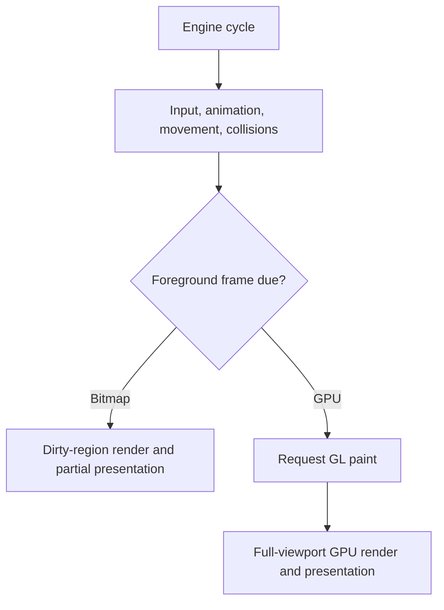

Performance tuning in Gondwana starts with one question:

> **Which part of the engine is doing too much work?**

A slow game is not automatically a rendering problem. Time may be spent advancing the engine cycle, resolving collisions, drawing scene content, or presenting the completed backbuffer through the platform adapter. Each kind of bottleneck has a different remedy.

The most useful approach is therefore:

1. reproduce the problem consistently
2. identify the busy stage
3. change one variable at a time
4. measure again

This article explains Gondwana-specific performance behavior and provides a practical path for diagnosing common problems.

---

## The performance model

At a high level, Gondwana divides runtime work into three stages:

1. **Engine-cycle work** — timers, input, animation, movement, collisions, cameras, and game logic
2. **Rendering work** — selecting and drawing tiles, sprites, DirectDrawings, overlays, and effects
3. **Presentation work** — transferring or blitting the completed backbuffer through the platform adapter



These stages are related, but they are not interchangeable. Reducing rendering work will not repair an expensive collision pass, and raising `TargetFPS` will not make a platform adapter present frames faster than it can handle.

---

## Establish a useful baseline

Before changing engine or game settings, measure a representative gameplay scenario under repeatable conditions.

For a useful baseline:

- use a Release build when evaluating final performance
- test without a debugger attached when possible
- disable grid lines and collision-box overlays unless they are part of the test
- avoid writing log messages every cycle or frame
- keep the window or canvas at a consistent size
- test the same scene, camera motion, and gameplay activity each time
- change only one performance-related setting between runs

Debug builds, active profilers, development overlays, and console output are valuable diagnostic tools, but they all affect the thing being measured. Use them deliberately.

---

## Understand Gondwana's runtime metrics

Gondwana periodically raises `Engine.CPSCalculated` with a `CyclesPerSecondCalculatedEventArgs` snapshot. The default sampling interval is 1.5 seconds and is controlled by `EngineConfiguration.SamplingTimeForCPS`. Setting that value to `0` disables sampling.

```csharp
Engine.Instance.CPSCalculated += sample =>
{
    Debug.WriteLine($"Gross CPS: {sample.GrossCPS:N1}");
    Debug.WriteLine($"Foreground rate: {sample.NetCPS:N1}");

    if (sample.GpuFps.HasValue)
        Debug.WriteLine($"GPU FPS: {sample.GpuFps.Value:N1}");
};
```

Do not log this information every cycle. Consume the sampled event, display it in a diagnostic overlay, or collect it for later analysis.

### What each value means

| Metric | Meaning |
| --- | --- |
| `GrossCPS` | Total engine cycles per second, including cycles that perform no foreground rendering |
| `NetCPS` | Cycles per second that entered Gondwana's foreground-frame work after `TargetFPS` pacing |
| `Engine.FramesPerSecond` | The most recently sampled `NetCPS` value |
| `GpuFps` | Completed GPU paint frames during the sample window; `null` when no GPU backbuffer is registered |

`NetCPS` is best understood as the **foreground scheduling rate**. It does not guarantee that a new image was ultimately presented. A bitmap scene may be clean and skip rendering, while GPU rendering completes separately on the GL thread.

`GpuFps` is the better measure of completed GPU frames. When an application has more than one registered GPU surface, the current value may combine frames from those surfaces rather than representing a single display.

### Reading the symptoms

The following patterns are useful starting points, not absolute proof:

| Symptom | First place to investigate |
| --- | --- |
| `GrossCPS` falls sharply as sprites or colliders are added | movement, collisions, animation, or custom cycle handlers |
| `NetCPS` cannot reach `TargetFPS` on a bitmap surface | rendering or presentation cost on the engine thread |
| `NetCPS` reaches its target but `GpuFps` remains lower | GPU drawing, VSync, the UI message loop, or compositor behavior |
| A stationary bitmap scene rarely reports render no-ops | something is continually invalidating scene content |
| Performance drops after adding another view | repeated projection, culling, clipping, and drawing per view |
| Desktop is healthy but browser performance is poor | canvas resolution, pixel transfer, JavaScript interop, or browser scheduling |

For deeper instrumentation techniques, see **Debugging and Instrumentation**.

---

## Choose the appropriate backbuffer

Gondwana's bitmap and GPU backbuffers use intentionally different rendering models. Neither is universally faster.

| Workload | Recommended starting point |
| --- | --- |
| Mostly static scene with small, localized changes | Bitmap backbuffer |
| Board game, puzzle, editor, or turn-based game | Bitmap backbuffer |
| Continuously scrolling platformer or action game | GPU backbuffer |
| Many moving sprites, particles, rotations, or fullscreen effects | GPU backbuffer |
| Browser/WASM application using the current Canvas 2D adapter | Bitmap backbuffer, with tightly controlled presentation area and resolution |

Measure the actual game rather than selecting a backbuffer by reputation. A bitmap backbuffer can be excellent when most pixels remain unchanged. A GPU backbuffer is usually a better fit when nearly everything changes anyway.

---

## Bitmap rendering and dirty regions

A bitmap backbuffer maintains a persistent CPU-side Skia surface. When scene content changes, Gondwana records world-space refresh regions on the affected `SceneLayer`.

During a foreground frame, Gondwana:

1. gathers the dirty world regions from visible layers
2. projects those regions through each `View`
3. clips them to the view's viewport
4. redraws intersecting tiles, sprites, and DirectDrawings
5. presents the resulting clamped screen-space area through the adapter

When nothing has changed, bitmap rendering can return without drawing or presenting a new image. `RenderSurfaceHost.RenderBackbufferNoOp` is raised for that case and is useful for confirming that a mostly static scene is benefiting from the dirty-region model.

### When bitmap rendering works well

Bitmap rendering is strongest when:

- the camera remains stationary for meaningful periods
- only a few sprites or tiles change at once
- moving objects remain near one another on screen
- overlays have small, accurate bounds
- the application contains long stretches of unchanged content

### When the advantage diminishes

Bitmap rendering must do substantially more work when:

- the camera moves continuously
- the viewport is resized or zoomed
- large portions of the scene animate
- fullscreen DirectDrawings or effects change frequently
- several distant screen regions change during the same frame
- multiple views project the same dirty world regions differently

The final bitmap presentation area is a single screen-space union of the redrawn content. Several small changes that are widely separated on screen can therefore produce a large presentation area even when the drawing operations themselves were localized.

`RenderSurfaceHost.RedrawDirtyRectangleOnly` defaults to `true`. Disabling it causes the complete bitmap backbuffer to be presented and is primarily useful when diagnosing adapter or rendering artifacts.

---

## GPU rendering

A GPU backbuffer does not consume `SceneLayer` refresh queues. Rendering occurs on the GL thread from the platform adapter's paint callback, and Gondwana redraws the complete viewport before presenting it.

This model is appropriate when most of the viewport is changing already. It avoids CPU-to-GPU transfer of the completed backbuffer and allows Skia to render directly into a GPU-backed surface.

GPU cost is influenced primarily by:

- backbuffer width and height
- the number and size of views
- the number of visible tiles, sprites, and DirectDrawings
- particle and effect complexity
- image filtering and blending
- MSAA sample count
- driver, compositor, and VSync behavior

Dirty-region micro-optimization does not improve the GPU path because that path deliberately performs a full-viewport redraw. Concentrate instead on reducing the number or complexity of drawables, limiting expensive effects, and avoiding unnecessarily large render targets.

---

## Cameras, zoom, and views

Camera movement changes the relationship between world pixels and screen pixels. On a bitmap backbuffer, that requires a full refresh of the visible scene. A camera that follows the player continuously will therefore cause full redraws while it is moving.

That is not a reason to make the camera jerky or artificially stationary. It is a workload characteristic. A game built around continuous camera motion should normally be tested with a GPU backbuffer.

The following changes request a full scene refresh:

- camera position changes
- viewport size or location changes
- viewport zoom changes
- render-surface resize
- adding or removing views
- layer visibility changes
- layer z-order changes
- layer parallax changes
- layer origin changes
- layer tile-size changes
- toggling grid lines or collision boxes

These are **changes that invalidate the scene**. A static layer does not continually request a full refresh merely because it has non-default parallax or because a debug overlay remains enabled. The overlay still adds drawing work whenever affected content is rendered, however.

### Multiple views

Each view is a separate projection of the scene.

For bitmap rendering, dirty world regions must be transformed and processed for every applicable view. For GPU rendering, every view redraws its visible layers across its viewport. Split-screen, picture-in-picture views, and minimaps should therefore be treated as additional rendering workloads rather than nearly free compositing features.

Overlapping views also require clipping regions covered by higher-z-order views. Keep view layouts as simple as the game permits.

### Zoom

Zoom changes more than the apparent size of the image:

- zooming out exposes more world space and may select many more tiles and sprites
- zooming in exposes fewer world objects but still fills the view's screen pixels
- animating zoom requests repeated full scene refreshes

Test the widest expected field of view, not only the game's default zoom.

---

## DirectDrawings and effects

`DirectDrawingManager.UpdateAll()` updates every registered DirectDrawing during foreground work. DirectDrawings automatically register when constructed and unregister when disposed.

Dispose drawings that are no longer used. Hiding or losing the last application reference to a drawing does not replace proper lifecycle cleanup.

### View-based DirectDrawings

View-mode DirectDrawings are screen-space overlays such as HUD elements, menus, and fullscreen effects. When a bitmap view is redrawn, its overlays are refreshed and drawn on top of the scene.

Keep overlay bounds as tight as correctness allows. A frequently changing fullscreen overlay naturally turns a localized bitmap update into a fullscreen workload.

### Scene-layer DirectDrawings

Scene-layer-mode drawings live in world space and participate in camera projection and layer parallax. When they move, the old and new bounds must both be refreshed so the previous image is erased and the new image appears.

Prefer targeted bounds changes over forcing an entire scene refresh.

### `ParticleSurface`

An active `ParticleSurface` calls `ForceRefresh()` as its simulation changes. That is expected: a particle field is continuously changing visual content.

To control its cost:

- keep its bounds no larger than the effect requires
- set a sensible maximum particle count
- limit emitter rates and particle lifetime
- avoid covering the entire screen with a small localized effect
- prefer a GPU backbuffer for large or persistent particle systems

### `ImageInstanceLayer`

`ImageInstanceLayer` tracks the old and new bounds of moving instances and invalidates those regions individually. This can preserve localized bitmap redraws more effectively than a DirectDrawing that refreshes its entire surface.

It remains important to control instance count. Targeted invalidation reduces drawing and presentation area; it does not make per-instance updating or drawing free.

---

## Engine-cycle performance

The engine's background cycle performs work whether or not a visual frame is due. The main sequence includes:

1. timer and input processing
2. animated-tile advancement
3. sprite movement
4. collision resolution for scene layers
5. camera updates
6. application and plugin cycle hooks

Foreground work then updates DirectDrawings and processes bitmap rendering when `TargetFPS` pacing allows it. GPU surfaces are rendered later on the GL thread after the platform adapter receives the frame request.

If `GrossCPS` deteriorates as gameplay complexity increases, begin with engine-cycle work rather than backbuffer tuning.

### Game-loop handlers

Events such as `BeforeBackgroundTasksExecute`, `AfterBackgroundTasksExecute`, `BeforeFrameRender`, and `AfterFrameRender` are convenient extension points, but their handlers run in hot paths.

Avoid performing the following directly inside repeated cycle or frame handlers:

- synchronous file or network I/O
- asset loading or image decoding
- large collection reconstruction
- blocking waits
- repeated logging
- unnecessary temporary allocations

Move infrequent work to initialization, scene transitions, timers, or queued background operations as appropriate.

---

## Animation and sprite movement

Gondwana advances registered animated tiles during every engine cycle. A tile can be outside the current viewport and still participate in animation timing.

Likewise, the sprite manager advances registered sprite movement independently of whether a particular sprite is visible in a given view.

Practical guidance:

- animate only tiles that genuinely need animation
- avoid thousands of independently animated decorative tiles
- remove or dispose sprites that have permanently left the game
- pause or unregister inactive gameplay systems where the design permits it
- use elapsed-time movement rather than assuming a particular cycle rate

Rendering culling reduces drawing work; it does not automatically eliminate all simulation work for off-screen objects.

---

## Collision performance

Collision resolution runs once per engine cycle for each scene layer. For every dynamic collider, the current registry query examines registered static and dynamic colliders, applies collision masks, and then performs AABB overlap checks on matching candidates.

The rough workload therefore grows with both the number of dynamic movers and the number of registered colliders on their layer.

To keep collision work intentional:

- use `TileCollisionType.None` for decorative tiles
- leave `CollisionsEnabled` off for objects that do not participate in collision detection
- mark immovable geometry as static
- use collision profiles and masks to reject irrelevant pair processing
- remove colliders when their owners leave the scene
- avoid placing unrelated collision worlds on the same `SceneLayer`

Collision masks reduce unnecessary overlap and resolution work, but they should not be treated as a substitute for keeping the registry itself clean.

When diagnosing a cycle-rate drop, compare the same scene with selected collision groups temporarily disabled. A large recovery strongly suggests that collider count or collision callbacks deserve closer profiling.

---

## `TargetFPS`, VSync, and MSAA

### `TargetFPS`

`EngineConfiguration.TargetFPS` controls how frequently Gondwana enters foreground-frame work.

- the default is `60`
- values greater than `0` cap foreground scheduling
- `0` means no upper limit
- negative values are clamped to `0`

`TargetFPS` is not a fixed update rate. Background engine cycles continue independently between foreground frames. Lowering `TargetFPS` can reduce rendering work, but it does not automatically throttle all simulation work or guarantee proportionally lower CPU usage.

Do not set `TargetFPS` to `0` merely to chase the highest displayed number. Unbounded foreground rendering can waste CPU or GPU time without producing a visible benefit.

### VSync

`EngineConfiguration.VSync` applies to GPU backbuffers. When enabled, presentation is synchronized to the display and actual GPU FPS may be capped by the monitor's refresh rate.

If `NetCPS` is near 120 but `GpuFps` remains near 60 on a 60 Hz display, that can be normal VSync behavior rather than a rendering defect.

Disable VSync only when testing uncapped throughput or when the application deliberately accepts the risk of screen tearing.

### MSAA

`EngineConfiguration.MsaaSampleCount` controls multisample anti-aliasing for GPU render targets.

- `1` disables MSAA
- common higher values are `2`, `4`, and `8`
- support depends on the graphics hardware and driver
- unsupported values fall back to `1`

Higher sample counts improve edge quality but increase GPU memory and fill work. Test them at the game's actual output resolution.

---

## Logging without distorting performance

Gondwana uses asynchronous logging by default. This keeps most log writes out of the engine's hot path. When the asynchronous queue is saturated, records may be dropped rather than blocking the engine.

Synchronous logging preserves immediate ordering and delivery, but console and file output can materially reduce cycle and frame rates.

For performance-sensitive gameplay:

- retain asynchronous logging for normal operation
- do not log every cycle, frame, sprite movement, or collision candidate
- aggregate counts and report them at a sampling interval
- increase logging temporarily to reproduce a specific problem
- repeat the performance test after verbose logging is removed

A diagnostic system that changes the result beyond recognition is just a very diligent new bug.

---

## Blazor and WebAssembly

The current browser host uses a different execution and presentation model from desktop hosts:

- JavaScript `requestAnimationFrame` calls into `.NET`
- `Engine.Tick()` advances the timer-driven engine
- the bitmap surface is presented to an HTML Canvas 2D context through `putImageData`

Pixel transfer cost grows with the presented region:

```text
bytes transferred = width × height × 4
```

A large canvas or frequently changing fullscreen scene can therefore spend substantial time crossing the .NET/JavaScript boundary and uploading RGBA pixels even when game logic is inexpensive.

For the current browser adapter:

- keep the canvas backing resolution no larger than necessary
- preserve localized bitmap updates where the game permits it
- avoid per-frame JavaScript interop from game code
- avoid browser console output in the animation loop
- test without browser developer tools actively recording
- compare engine-cycle rate separately from visible browser frame rate

Desktop and browser results should not be expected to match exactly. They use different scheduling, threading, and presentation mechanisms.

---

## Common troubleshooting paths

### A mostly static bitmap scene remains busy

Check for:

- an animated DirectDrawing or particle surface
- a camera that is still moving by small amounts
- repeated changes to overlay bounds or visibility
- game code setting `FullRefreshNeeded`
- an animation or sprite that never becomes inactive

Use `RenderBackbufferNoOp` to confirm whether clean frames are actually being skipped.

### A scrolling platformer is slow with a bitmap backbuffer

Continuous camera motion requires continuous full scene refreshes. Test the same workload with a GPU backbuffer before attempting to suppress valid camera invalidation.

### GPU rendering stops at the display refresh rate

Check `VSync` and compare `NetCPS` with `GpuFps`. A 60 Hz display commonly produces approximately 60 completed GPU frames per second with VSync enabled.

### Performance falls as enemies are added, even when they are off-screen

Investigate sprite movement, AI or game-cycle handlers, dynamic colliders, collision callbacks, and object lifecycle. Rendering culling does not automatically stop their simulation.

### Performance falls after enabling split-screen

Each view adds projection, selection, clipping, and drawing work. Profile the views separately and verify that each viewport and zoom level exposes only the world area it needs.

### Browser performance is much lower than desktop

Check canvas pixel dimensions, fullscreen invalidation, pixel-transfer area, JavaScript interop, console logging, and browser scheduling before assuming that the underlying game logic is slow.

---

## Practical tuning checklist

When performance is poor, ask these questions in order:

1. Is the test repeatable and free from diagnostic noise?
2. Is `GrossCPS`, foreground rate, or presentation rate the first value to deteriorate?
3. Is the workload mostly static or continuously changing?
4. Does the selected backbuffer match that workload?
5. Is the camera moving or zooming continuously?
6. How many views are rendering the scene?
7. Are fullscreen overlays or particle systems active?
8. Are unused sprites, DirectDrawings, or colliders still registered?
9. Is collision work growing with dynamic object count?
10. Are VSync, MSAA, resolution, or platform presentation imposing the limit?
11. Does verbose or synchronous logging change the result?
12. Does one controlled change improve the same measured scenario?

Performance tuning works best when it remains boring and methodical. Guessing is faster only until the first wrong guess.

---

## Where to read next

- **Debugging and Instrumentation**
- **Refresh Queues**
- **Dirty Rectangles**
- **Bitmap Rendering Path**
- **GL Rendering Path**
- **Views and Cameras**
- **DirectDrawing**
- **Particles**
- **ImageInstanceLayer**
- **Engine Configuration**
- **Configuration Settings**

Relevant source files include:

- [`Gondwana/Engine.cs`](https://isthimius.github.io/Gondwana/api/latest/Engine_8cs_source.html)
- [`Gondwana/Configuration/EngineConfiguration.cs`](https://isthimius.github.io/Gondwana/api/latest/EngineConfiguration_8cs_source.html)
- [`Gondwana/Rendering/RefreshQueue.cs`](https://isthimius.github.io/Gondwana/api/latest/RefreshQueue_8cs_source.html)
- [`Gondwana/Rendering/RenderSurfaceHost.cs`](https://isthimius.github.io/Gondwana/api/latest/RenderSurfaceHost_8cs_source.html)
- [`Gondwana/Rendering/Backbuffers/BackbufferBase.cs`](https://isthimius.github.io/Gondwana/api/latest/BackbufferBase_8cs_source.html)
- [`Gondwana/Rendering/Backbuffers/BitmapBackbuffer.cs`](https://isthimius.github.io/Gondwana/api/latest/BitmapBackbuffer_8cs_source.html)
- [`Gondwana/Rendering/Backbuffers/GpuBackbuffer.cs`](https://isthimius.github.io/Gondwana/api/latest/GpuBackbuffer_8cs_source.html)
- [`Gondwana/Drawing/Direct/DirectDrawingManager.cs`](https://isthimius.github.io/Gondwana/api/latest/DirectDrawingManager_8cs_source.html)
- [`Gondwana/Physics/Collisions/CollisionResolver.cs`](https://isthimius.github.io/Gondwana/api/latest/CollisionResolver_8cs_source.html)
- [`Gondwana/Physics/Collisions/ColliderRegistry.cs`](https://isthimius.github.io/Gondwana/api/latest/ColliderRegistry_8cs_source.html)
- [`Gondwana.Blazor/wwwroot/gondwana-blazor.js`](https://github.com/Isthimius/Gondwana/blob/master/Gondwana.Blazor/wwwroot/gondwana-blazor.js)
