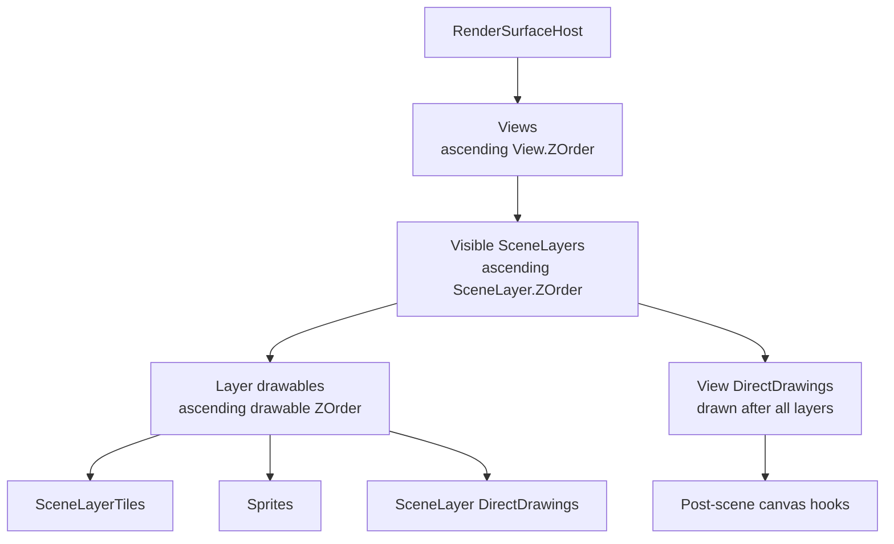
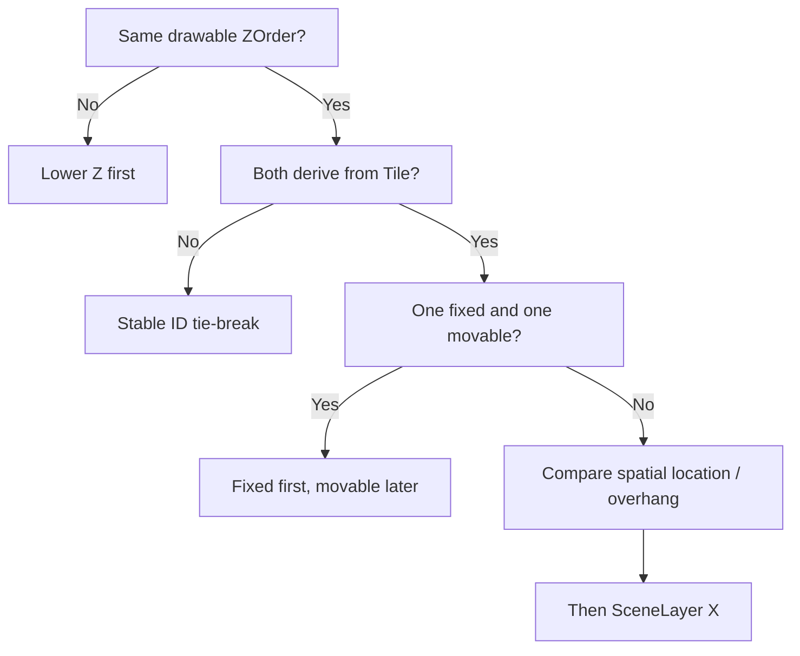

Gondwana uses Z-order at several levels of the rendering hierarchy. The important point is that these are **not one global stack of integers**.

A sprite's `ZOrder` is meaningful among drawables on its `SceneLayer`. A `SceneLayer` has its own Z-order among other layers. A `View` has another Z-order among views. View-bound DirectDrawings form an overlay stage above the scene content rendered into that view.

Once those scopes are separated mentally, draw-order behavior becomes predictable.

---

## The short version

Gondwana renders from back to front: lower Z-order values first, higher values later.

But it applies that rule inside a hierarchy:



The practical rule is:

> **Z-order only compares objects that participate in the same ordering stage.**

A sprite with `ZOrder = 10000` on a background layer does not leap in front of a foreground `SceneLayer`. The foreground layer is rendered later as a whole.

---

## The Z-order domains

| Scope | Property | What it orders |
| --- | --- | --- |
| Render surface | `View.ZOrder` | Overlapping views |
| Scene | `SceneLayer.ZOrder` | Visible layers inside each view |
| SceneLayer | `IDrawable.ZOrder` | Tiles, sprites, and layer-bound DirectDrawings on that layer |
| View overlay | `DirectDrawingBase.ZOrder` | View-bound DirectDrawings drawn after the scene layers |

These values can use similar numbers without interacting with one another.

For example, all of the following can legitimately have `ZOrder = 10`:

- a `View`
- a `SceneLayer`
- a sprite on that layer
- a view-bound `TextBlock`

They are not tied at one global depth of 10. Each belongs to a different ordering scope.

---

## 1. Views are ordered first

A render surface can contain one or more `View` objects. `ViewManager` keeps them sorted by `View.ZOrder`:

```csharp
host.ViewManager.AddView(
    targetRectPx: new Rectangle(0, 0, 1280, 720),
    zoom: 1f,
    zOrder: 0);

host.ViewManager.AddView(
    targetRectPx: new Rectangle(900, 20, 340, 220),
    zoom: 0.5f,
    zOrder: 10);
```

If those viewports overlap, the higher-Z view is the later/front view.

Each view then renders its own scene-layer stack. A view's Z-order does not alter the Z-order of a sprite, tile, or layer inside that view.

See [[Views, Cameras, and Viewports]] and [[Using Views and Cameras]].

---

## 2. SceneLayers are rendered back to front

For each view, Gondwana obtains `Scene.VisibleSceneLayers`. That collection contains only visible layers and is sorted by ascending `SceneLayer.ZOrder`.

A common arrangement might be:

```csharp
SceneLayer farBackground = scene.AddLayer(
    100, 50, 32, 32,
    zOrder: 0,
    parallax: 0.25f);

SceneLayer world = scene.AddLayer(
    100, 50, 32, 32,
    zOrder: 10,
    parallax: 1f);

SceneLayer foreground = scene.AddLayer(
    100, 50, 32, 32,
    zOrder: 20,
    parallax: 1f);
```

The render order is:

```text
farBackground -> world -> foreground
```

Everything rendered as part of `foreground` is drawn after everything rendered as part of `world`.

### A layer is an ordering boundary

This is one of the most important rules in the system.

Suppose:

```csharp
player.ZOrder = 5000;       // player belongs to world, Z = 10
foreground.ZOrder = 20;
```

The player's 5000 is **not compared** to the layer's 20. First the entire `world` layer is rendered, using its own internal ordering. Then the `foreground` layer is rendered.

If artwork must always cover actors, putting that artwork on a higher SceneLayer is often cleaner than assigning extreme drawable Z values.

---

## 3. Drawables are sorted within each SceneLayer

For each visible world region on a layer, Gondwana gathers the participating drawables:

- visible `SceneLayerTile` objects
- sprites on the layer
- `DirectDrawingMode.SceneLayer` DirectDrawings on the layer

It merges them into one list and sorts that list before drawing.

The first comparison is always the drawable's `ZOrder`:

```text
smaller Z -> drawn earlier -> farther back
larger Z  -> drawn later   -> farther front
```

For example:

```csharp
player.ZOrder = 10;
enemy.ZOrder = 10;
shadow.ZOrder = 5;
nameTagDrawing.ZOrder = 20;
```

Within that layer, the shadow is considered before the actors and the name-tag drawing later.

A newly created `Sprite` starts with `ZOrder = 1`. That is a default, not a minimum enforced by the property.

Fixed `SceneLayerTile` objects normally use their grid-tile Z-order of `0`.

---

## Equal Z-order for tiles and sprites

When two `Tile`-derived objects have the same drawable Z-order, Gondwana applies additional tile-style sorting rather than relying on creation order.

`SceneLayerTile` and `Sprite` both derive from `Tile`, so the tie-breaking rules are shared.

### Fixed tiles before movable tiles

If one tied `Tile` is position-fixed and the other is movable, the fixed tile sorts first.

In practice, a fixed `SceneLayerTile` at the same Z-order is drawn before a `Sprite`.

### Spatial depth for the same kind of tile

When the fixed/movable category is the same, Gondwana compares a projection-aware vertical location derived from the draw bounds and overhang, followed by X position as a further tie-breaker.

For movable sprites, the effective lower edge is important. This gives conventional top-down/isometric behavior where an actor standing lower in the world can be drawn in front of another actor standing higher up when both use the same Z-order.



### Do not over-engineer unique Z values for every actor

For actors that should depth-sort naturally against one another, giving them the same Z-order allows Gondwana's spatial tile ordering to do the useful work.

Use different Z values when you mean a real categorical depth difference, not merely because two actors happen to overlap.

---

## Equal Z-order involving DirectDrawing

A SceneLayer-bound DirectDrawing participates in the same merged layer list, so its `ZOrder` can place it before or after tiles and sprites on that layer.

When equal-Z objects are **not both `Tile` objects**, Gondwana uses a stable ID comparison as the final tie-breaker.

Therefore, do not rely on accidental creation order when a DirectDrawing and a tile/sprite must have a particular relationship. Assign distinct Z values.

For example:

```csharp
worldMarker.ZOrder = 50;
player.ZOrder = 40;
```

That expresses the intent directly.

See [[DirectDrawing]].

---

## SceneLayer DirectDrawing versus View DirectDrawing

DirectDrawing has two important placement modes, and they participate in different render stages.

### `DirectDrawingMode.SceneLayer`

A SceneLayer drawing:

- uses world coordinates
- is transformed through the camera and layer parallax
- is gathered with that layer's tiles and sprites
- participates in that layer's drawable Z-order

Use it for world-space graphics that belong to a particular plane of the scene.

### `DirectDrawingMode.View`

A View drawing:

- uses view/screen coordinates
- is not part of any SceneLayer's drawable list
- is rendered **after all visible SceneLayers for that view**
- is ordered relative to the other View-mode DirectDrawings for that view

This makes View-mode drawings appropriate for:

- HUD text
- menus
- screen-space widgets
- overlays
- debug information that should remain above world content

A View-mode drawing with `ZOrder = 0` can still appear above a SceneLayer-bound sprite with `ZOrder = 1000`, because the overlay stage itself runs later.

Again: the integers live in different ordering domains.

---

## View overlay tie-breaking

`DirectDrawingManager.GetDrawingsForView()` orders View-mode drawings by:

1. `ZOrder`
2. `Nickname` using ordinal comparison when Z-order ties

That produces deterministic overlay ordering, but it is usually clearer to assign different Z values when the visual relationship matters.

Widgets built on DirectDrawing ultimately participate in these same drawing rules according to whether their backing drawing is view- or layer-bound.

---

## Post-scene drawing happens later still

`RenderSurfaceHost.RenderBackbufferPostScene` and engine plugin post-render hooks execute after the normal scene content has been drawn to the backbuffer for the frame.

They are not ordinary Z-ordered drawables.

Use post-scene hooks for genuine post-processing or final-canvas work such as:

- color grading
- vignettes
- bloom composites
- specialized debug annotations

Do not use a post-scene callback merely to avoid understanding the normal layer/drawable hierarchy. If an object is normal game or UI content, it generally belongs in a SceneLayer or View drawing stage.

See [[Rendering Pipeline]].

---

## A practical depth scheme

You do not need enormous Z-order values. Leaving gaps makes later insertion easier and keeps the intent readable.

For example, SceneLayers might use:

```text
0    far background
10   near background
20   world
30   foreground
```

Within the world layer, game code might use another independent convention:

```text
0    fixed map tiles
5    shadows / underlays
10   ordinary actors
20   world-space labels or effects
```

And View-mode HUD content can use its own independent range.

These numbers are conventions for your game, not Gondwana requirements. The important part is to treat each ordering scope separately.

---

## Choosing between Z-order and a separate SceneLayer

Use **drawable Z-order** when objects:

- belong to the same world plane
- should share the same camera/parallax behavior
- need local ordering among one another

Use a **separate SceneLayer** when content needs a distinct:

- foreground/background plane
- parallax value
- visibility switch
- presentation effect
- coordinate system
- world origin
- layer-wide rendering relationship

A foreground tree canopy is a good example. If its canopy must always cover actors while its trunk/terrain relationship belongs to the map, a separate foreground layer can express that much more clearly than a collection of giant sprite Z values.

---

## Changing Z-order at runtime

Z-order can be changed while the game is running.

For `Tile`-derived drawables such as sprites, setting `ZOrder` invalidates the object's world rectangle so the bitmap renderer knows that the area needs to be reconsidered.

Changing a `SceneLayer.ZOrder` causes the scene's visible-layer ordering to be refreshed so the next render uses the new layer stack.

Runtime Z changes are useful for real state transitions, but avoid continuously changing Z to emulate positional depth when Gondwana's normal spatial tile sorting already covers that case.

---

## Common mistakes

### Treating every Z-order as global

A drawable Z does not compete with a SceneLayer Z or View Z. Compare values only within their ordering scope.

### Giving a background-layer sprite a huge Z to reach the foreground

It cannot cross the SceneLayer boundary. Move the content to the appropriate layer if it belongs on another plane.

### Assigning unique Z values to every top-down actor

Actors intended to spatially depth-sort can usually share a Z-order and let Gondwana compare their effective world location.

### Depending on equal-Z DirectDrawing creation order

Use explicit Z values when a DirectDrawing must have a predictable relationship with another layer drawable.

### Using View-mode drawings for world objects

View drawings render after the scene and do not move with the camera like SceneLayer content. Use SceneLayer mode for world-space graphics.

### Using post-render hooks as a general-purpose foreground layer

Post-scene hooks are for final-canvas work. Normal content should use normal scene/view ordering.

---

## Where to read next

- [[Scenes and SceneLayers]] — the layer stack
- [[Tiles and Tile-Based SceneLayers]] — fixed tiles and layer content
- [[Sprites]] — movable tile drawables
- [[DirectDrawing]] — SceneLayer and View placement modes
- [[Views, Cameras, and Viewports]] — multi-view rendering
- [[Rendering Pipeline]] — render stages and backbuffer flow
- [[Parallax and Multi-View Rendering]] — layer/view composition in practice
