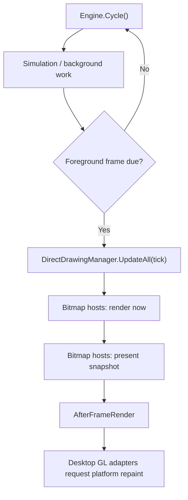

Gondwana separates **scene rendering** from **platform presentation**. A `RenderSurfaceHost<TBackbuffer>` owns the logical Backbuffer, Views, and bound Scene; a platform-specific `RenderSurfaceAdapterBase` owns the destination surface and the mapping from Backbuffer pixels to adapter pixels.

That common architecture supports three practical rendering paths:

- **Bitmap** — CPU-backed Skia rendering with dirty-region redraw and platform-specific presentation.
- **Desktop GL** — GPU-backed rendering for WinForms and Avalonia, performed inside the platform's OpenGL callback.
- **WebGL** — GPU-backed Blazor rendering driven by the browser animation loop, with scene rendering decoupled from browser presentation cadence.

See [[Bitmap Rendering Path]], [[GL Rendering Path]], and [[WebGL Rendering Path]] for the path-specific details.

---

## The important separation: Backbuffer vs adapter

The Backbuffer is Gondwana's logical rendering surface. The adapter is the window, control, framebuffer, or browser canvas that displays it.

These sizes are intentionally independent.

`Engine.Instance.Configuration.RenderScale` establishes the logical Backbuffer resolution from the adapter size when the resolution is first established. For example, a `RenderScale` of `0.5f` creates a Backbuffer at half the adapter dimensions, while values above `1f` can be used for supersampling.

After that, ordinary window or canvas resizing changes **presentation only**. It does not resize the Backbuffer. Gondwana calculates an aspect-preserving `PresentationTransform`, centers the Backbuffer in the available destination, and exposes the derived scale through `RenderSurfaceHostBase.PresentationScale`.

Changing `RenderScale` explicitly requests a new logical resolution from the current adapter size.

`RenderScalingFilter` controls presentation sampling:

- `Linear` — smooth scaling; the default.
- `NearestNeighbor` — useful for pixel-art presentation.

Pointer input follows the inverse of the same presentation transform, so adapter coordinates are normalized into logical Backbuffer `ScreenPx` before normal Gondwana input routing.

---

## Common scene-rendering model

Regardless of presentation backend, scene rendering still flows through `RenderSurfaceHost<TBackbuffer>`.

A View determines:

- the Backbuffer viewport to render into;
- the Camera and world region visible through that viewport;
- projection, zoom, and per-layer transforms; and
- View-bound DirectDrawings rendered above scene layers.

For each View, Gondwana renders visible SceneLayers in order, then View overlays. Post-scene surface hooks and engine-plugin canvas hooks run after normal scene composition and before the frame is finalized.

The major divergence is **how Gondwana decides what portion of the scene to redraw**.

### Bitmap Backbuffers

`BitmapBackbuffer` uses the SceneLayer `RefreshQueue` system. Dirty world rectangles are projected into View screen space, changed areas are pre-cleared, and only affected drawables are redrawn. The Backbuffer also tracks an aggregate dirty rectangle for presentation.

### GPU Backbuffers

`GpuBackbuffer` bypasses RefreshQueues and dirty-rectangle presentation. Whenever a new GPU scene frame is requested, Gondwana redraws the complete Backbuffer View composition. This avoids cross-thread RefreshQueue races and matches the GPU path's full-surface presentation model.

A full GPU scene redraw does **not** necessarily mean every platform paint rerenders the scene. The Blazor WebGL path can present the existing GPU Backbuffer on browser animation frames where `TargetFPS` does not require a new Gondwana scene frame.

---

## Desktop engine cycle

On the normal desktop engine loop, `Engine.Cycle()` performs simulation/background work and then, when the foreground interval is due, enters `DoForegroundTasks(tick)`.

Typical simulation work includes input polling, timers, animation advancement, sprite movement, collision handling, and camera updates.

Foreground work performs the rendering-state update and then treats CPU and GPU surfaces differently:



Bitmap hosts are rendered and presented directly by the engine foreground pass.

Desktop GL hosts are deliberately skipped by those direct render/present loops. `AfterFrameRender` causes the platform adapter to request a GL paint, and actual GPU rendering then occurs while the native GL context is current.

---

## Bitmap path at a glance

For a CPU-backed surface:

```text
Engine foreground pass
  -> RenderSurfaceHost.RenderToBackbuffer(tick)
     -> RenderToBackbufferBitmap(tick)
        -> consume SceneLayer RefreshQueues
        -> project dirty world regions into each View
        -> pre-clear changed screen areas
        -> redraw affected drawables
        -> draw View overlays
        -> invoke post-scene canvas hooks
  -> RenderSurfaceHost.PresentBackbufferToAdapter()
     -> EndFrame()
     -> Snapshot()
     -> post adapter presentation to the UI/platform thread
```

The exact final presentation differs by platform. WinForms and Avalonia display the CPU snapshot through their UI controls; Blazor's bitmap compatibility path converts the requested image region into browser-compatible RGBA pixel data.

See [[Bitmap Rendering Path]].

---

## Desktop GL path at a glance

For WinForms and Avalonia GPU surfaces, the engine prepares state and requests a repaint, but the platform callback owns the actual render:

```text
Engine foreground pass
  -> AfterFrameRender
     -> adapter requests native GL repaint
        -> platform GL callback
           -> GpuBackbuffer.EnsureInitialized(current GRContext)
           -> RenderSurfaceHost.GlRenderAndSnapshot()
              -> RenderToBackbufferGpuFull(tick)
              -> EndFrame()
              -> GPU-backed snapshot
              -> BeginFrame()
           -> apply PresentationTransform
           -> GPU-to-GPU draw into native framebuffer
           -> RecordFrame()
```

Ordinary adapter resize changes the presentation transform only. It does not recreate the logical `GpuBackbuffer`. An explicit logical resolution change, such as a `RenderScale` change, is queued and applied by `GpuBackbuffer.EnsureInitialized()` on the owning GL callback.

See [[GL Rendering Path]].

---

## WebGL path at a glance

Blazor's GPU path uses the same `GpuBackbuffer` and full-scene GPU renderer, but its pacing model is different from desktop GL.

`SKGLView` owns the browser `requestAnimationFrame` loop. Inside each WebGL paint callback Gondwana:

```text
SKGLView / browser requestAnimationFrame
  -> WebGL paint callback
     -> ensure GpuBackbuffer is initialized on current GRContext
     -> Engine.Tick()
     -> consume pending engine foreground-frame request
     -> if a new scene frame is due:
          RenderSurfaceHost.GlRenderToCanvas()
        else:
          RenderSurfaceHost.GlDrawCurrentFrameToCanvas()
     -> RecordFrame()
```

This gives Gondwana two related but distinct cadences:

- **scene-render cadence** — governed by Gondwana's `TargetFPS` foreground timing;
- **browser presentation cadence** — governed by `requestAnimationFrame`, the browser compositor, and the display.

A browser paint can therefore re-blit the current GPU Backbuffer without rerendering the Scene. No frame pixels are read back to JavaScript.

See [[WebGL Rendering Path]].

---

## Post-scene drawing hooks

`RenderSurfaceHost.RenderBackbufferPostScene` and `IEnginePlugin.OnPostRenderCanvas` operate on the fully composed Backbuffer canvas.

Thread ownership depends on the path:

| Path | Hook execution context |
| --- | --- |
| Bitmap desktop | Engine/render thread |
| Bitmap browser | The timer-driven browser execution context that called `Engine.Tick()` |
| Desktop GL | Native UI/GL callback thread |
| WebGL | Browser `SKGLView` WebGL paint callback |

For GPU paths, GL/WebGL canvas work must remain inside the callback where the `GRContext` is current.

For bitmap paths, Gondwana marks the complete Backbuffer dirty when post-scene handlers or plugins are present so arbitrary post-scene drawing is included in presentation.

---

## RefreshQueues and dirty rectangles

RefreshQueues answer **what world content changed**. They are a bitmap-rendering optimization.

The Backbuffer dirty rectangle answers **what logical Backbuffer pixels must be presented**. It is likewise used by the bitmap path.

GPU paths intentionally skip both mechanisms for scene rendering/presentation. Viewport clipping still applies, but clipping a View is not the same thing as dirty-region optimization.

See [[Refresh Queues]] and [[Dirty Rectangles]].

---

## Mental model

The cleanest way to think about Gondwana rendering is:

```text
Scene state
   -> View + Camera transform
   -> RenderSurfaceHost
   -> logical Backbuffer (ScreenPx)
   -> PresentationTransform
   -> platform adapter pixels
```

The bitmap, desktop GL, and WebGL paths differ mainly in **who owns the render callback**, **whether scene rendering is dirty-region or full-frame**, and **how the completed Backbuffer reaches the platform surface**.

The Scene/View model above those differences remains shared.

---

## Where to read next

- [[Backbuffers]]
- [[Bitmap Rendering Path]]
- [[GL Rendering Path]]
- [[WebGL Rendering Path]]
- [[Refresh Queues]]
- [[Dirty Rectangles]]
- [[Coordinate Spaces]]
- [[Understanding Skia Rendering in Gondwana]]

Relevant source files include:

- [`Gondwana/Engine.cs`](https://isthimius.github.io/Gondwana/api/latest/Engine_8cs_source.html)
- [`Gondwana/Rendering/RenderSurfaceHost.cs`](https://isthimius.github.io/Gondwana/api/latest/RenderSurfaceHost_8cs_source.html)
- [`Gondwana/Rendering/RenderSurfaceHostBase.cs`](https://isthimius.github.io/Gondwana/api/latest/RenderSurfaceHostBase_8cs_source.html)
- [`Gondwana/Rendering/RenderSurfaceAdapterBase.cs`](https://isthimius.github.io/Gondwana/api/latest/RenderSurfaceAdapterBase_8cs_source.html)
- [`Gondwana/Rendering/PresentationTransform.cs`](https://isthimius.github.io/Gondwana/api/latest/PresentationTransform_8cs_source.html)
- [`Gondwana/Rendering/Backbuffers/`](https://github.com/Isthimius/Gondwana/tree/master/Gondwana/Rendering/Backbuffers)
