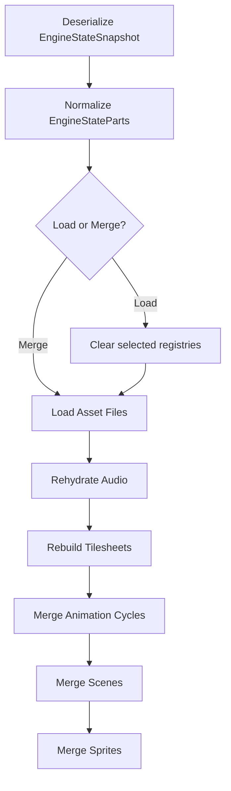

`EngineState` is Gondwana's snapshot-and-restore mechanism for engine-managed runtime content.

It can capture selected portions of the engine's live registries, serialize them to JSON, and later either:

- restore them as replacement state
- merge them into existing state
- layer multiple state files during engine initialization

It is important to understand what `EngineState` **is not**.

It is not a binary memory dump of the engine, and an `EngineState` instance is not a completely detached copy of the engine.

Most of its public collections are facades over the engine's live registries.

---

## Contents

- [What EngineState can contain](#what-enginestate-can-contain)
- [EngineState is a facade over live state](#enginestate-is-a-facade-over-live-state)
- [The internal snapshot DTO](#the-internal-snapshot-dto)
- [Saving state](#saving-state)
  - [Selective saves](#selective-saves)
  - [Dependency normalization](#dependency-normalization)
  - [Restore order matters](#restore-order-matters)
- [LoadFromFile vs MergeFromFile](#loadfromfile-vs-mergefromfile)
  - [LoadFromFile](#loadfromfile)
  - [MergeFromFile](#mergefromfile)
  - [Identity during merge](#identity-during-merge)
- [Tilesheets receive special handling](#tilesheets-receive-special-handling)
  - [Inline tilesheets](#inline-tilesheets)
  - [Separate GTS files](#separate-gts-files)
  - [Relative paths](#relative-paths)
- [Animation cycles receive special handling](#animation-cycles-receive-special-handling)
  - [Inline GANI definitions](#inline-gani-definitions)
  - [Separate GANI files](#separate-gani-files)
  - [Animation dependencies](#animation-dependencies)
- [Scenes receive special handling](#scenes-receive-special-handling)
  - [Inline GSCN definitions](#inline-gscn-definitions)
  - [Separate GSCN files](#separate-gscn-files)
  - [Sprite scene-layer identity](#sprite-scene-layer-identity)
- [Audio receives special handling](#audio-receives-special-handling)
  - [Inline GSND definitions](#inline-gsnd-definitions)
  - [Separate GSND files](#separate-gsnd-files)
  - [Legacy audio state](#legacy-audio-state)
- [Asset files are references, not embedded archives](#asset-files-are-references-not-embedded-archives)
- [Compression](#compression)
  - [Compression is not encryption](#compression-is-not-encryption)
- [Serializer configuration](#serializer-configuration)
  - [Reference preservation](#reference-preservation)
  - [Type metadata](#type-metadata)
- [ValueBag is not persisted](#valuebag-is-not-persisted)
- [What EngineState does not capture](#what-enginestate-does-not-capture)
- [Configured state-file mounts](#configured-state-file-mounts)
  - [Layered state files](#layered-state-files)
  - [StateFileMount](#statefilemount)
  - [Load, merge, and mount: three mental models](#load-merge-and-mount-three-mental-models)
- [Failure behavior](#failure-behavior)
- [Why explicit rehydration exists](#why-explicit-rehydration-exists)
- [Design implications](#design-implications)
- [Examples](#examples)
- [Mental model](#mental-model)
- [Where to read next](#where-to-read-next)

---

## What EngineState can contain

State selection is controlled by the `[Flags]` enum `EngineStateParts`.

The currently supported parts are:

| Part | Runtime source |
|---|---|
| `AssetsFiles` | `AssetsFile.AllAssetsFiles` |
| `Tilesheets` | `TilesheetRegistry` |
| `Cycles` | global animation-cycle registry |
| `Scenes` | global scene collection |
| `Sprites` | `SpriteManager` |
| `Audio` | `AudioResourceManager` |

They can be combined:

```csharp
var parts =
    EngineStateParts.AssetsFiles |
    EngineStateParts.Tilesheets |
    EngineStateParts.Cycles;
```

Or the complete supported set can be selected with:

```csharp
EngineStateParts.All
```

`EngineStateParts.None` selects nothing.

---

## EngineState is a facade over live state

Properties such as:

```csharp
engineState.Scenes
engineState.Cycles
engineState.Sprites
```

do not represent private collections owned exclusively by that `EngineState` object.

For example, the public properties ultimately expose things such as:

```text
Scene._allScenes
Cycle._cycles
SpriteManager.Instance._spriteList
AudioResourceManager.Instance
TilesheetRegistry.Instance
```

This makes `EngineState` better understood as a **serialization facade over engine registries**.

Conceptually:

```text
                 EngineState
                     |
          +----------+----------+
          |          |          |
          v          v          v
       Scenes     Sprites    Tilesheets
          |          |          |
          v          v          v
      live engine registries / managers
```

Creating:

```csharp
var state = new EngineState();
```

does not immediately clone all engine state into a disconnected object graph.

The actual serializable snapshot is assembled when the state is saved.

---

## The internal snapshot DTO

There is an important distinction between the public `EngineState` facade and the object actually serialized.

Internally, Gondwana builds an `EngineStateSnapshot` containing writable collections:

```text
EngineState
     |
     | BuildSnapshot(...)
     v
EngineStateSnapshot
     |
     | JsonConvert.SerializeObject(...)
     v
JSON
```

The snapshot contains:

```text
AssetsFiles
Tilesheets
Cycles
Scenes
Sprites
Audio
SoundResources    (legacy read compatibility only)
```

The DTO is also used during deserialization.

This exists because many of the public `EngineState` properties are getter-only proxies over global registries. Deserializing JSON directly into those properties would not provide a clean way to reconstruct the live engine collections.

The restore path is therefore:

```text
JSON
  |
  v
EngineStateSnapshot
  |
  | ApplySnapshot(...)
  v
live Gondwana registries
```

That separation is a central part of the design.

---

## Saving state

The primary save method is:

```csharp
var state = new EngineState();

state.SaveToFile("game-state.json");
```

Its full set of options includes:

```csharp
state.SaveToFile(
    path,
    compress: false,
    separateGtsFiles: false,
    parts: EngineStateParts.All,
    separateGscnFiles: false,
    separateGaniFiles: false,
    separateGsndFile: false);
```

The save process is approximately:

```text
live registries
      |
      v
BuildSnapshot(parts)
      |
      v
EngineStateSnapshot
      |
      v
Newtonsoft.Json
      |
      +---- plain JSON ----> file
      |
      +---- GZip ----------> file
```

Only the requested `EngineStateParts` are placed in the snapshot.

Parts that are not selected are represented internally as `null` rather than being populated unnecessarily.

---

### Selective saves

A state file does not have to represent the whole engine.

For example:

```csharp
var state = new EngineState();

state.SaveToFile(
    "world.state",
    parts:
        EngineStateParts.Scenes |
        EngineStateParts.Sprites);
```

Or:

```csharp
state.SaveToFile(
    "resources.state",
    parts:
        EngineStateParts.AssetsFiles |
        EngineStateParts.Tilesheets |
        EngineStateParts.Cycles |
        EngineStateParts.Audio);
```

This allows state files to be used for more than traditional "save game" behavior.

They can also represent:

- content bundles
- world definitions
- level data
- resource layers
- test fixtures
- runtime snapshots
- optional content

---

### Dependency normalization

Some state parts depend on others.

Currently:

```text
Cycles / GANI
     |
     v
Tilesheets / GTS
     |
     +---- may depend on AssetsFiles

Audio
     |
     +---- may depend on AssetsFiles
```

When a snapshot is **applied**, Gondwana normalizes the requested parts.

Requesting:

```csharp
EngineStateParts.Cycles
```

effectively selects:

```text
Cycles + Tilesheets + AssetsFiles
```

because GANI frame references require registered tilesheets.

Requesting:

```csharp
EngineStateParts.Tilesheets
```

becomes:

```text
Tilesheets + AssetsFiles
```

Likewise:

```csharp
EngineStateParts.Audio
```

becomes:

```text
Audio + AssetsFiles
```

This is necessary because a tilesheet or audio resource may refer to data stored in an `AssetsFile`.

#### Important distinction

Dependency expansion occurs when state is **loaded or merged**.

It does not make an incomplete saved file magically self-contained.

If you are creating a partial state file that must later restore animations, asset-backed tilesheets, or audio independently, explicitly save the required dependency chain as well:

```csharp
var parts =
    EngineStateParts.AssetsFiles |
    EngineStateParts.Tilesheets |
    EngineStateParts.Cycles;

state.SaveToFile(
    "tiles.state",
    parts: parts);
```

---

### Restore order matters

When applying a snapshot, Gondwana restores the selected state in a deliberate order:

```text
1. AssetsFiles
2. Audio
3. Tilesheets
4. Cycles
5. Scenes
6. Sprites
```

This is not arbitrary.

Resources need to exist before higher-level objects attempt to resolve them.

A simplified restore pipeline is:



This ordering is one reason `EngineState` performs an explicit rehydration phase instead of relying entirely on automatic JSON deserialization.

---

## LoadFromFile vs MergeFromFile

There are two fundamentally different restore operations.

### LoadFromFile

```csharp
EngineState.LoadFromFile(
    "game-state.json");
```

`LoadFromFile` treats the selected portions of the saved state as replacements.

Internally it applies the snapshot with:

```text
clearExisting = true
overwriteExisting = true
```

#### Partial loads

A subtle but important point:

```csharp
EngineState.LoadFromFile(
    "world.state",
    parts: EngineStateParts.Scenes);
```

does **not** clear every engine registry.

It clears the selected state categories before loading them.

So, conceptually:

```text
requested: Scenes

clear:
    Scenes

preserve:
    Tilesheets
    Cycles
    Sprites
    Audio
    etc.
```

Dependency normalization can expand this set.

For example, requesting `Tilesheets` also selects `AssetsFiles`, so both categories participate in the replacement operation.

Use `LoadFromFile` when the state in the file should be authoritative for the selected categories.

---

### MergeFromFile

`MergeFromFile` leaves existing state in place:

```csharp
EngineState.MergeFromFile(
    "extra-content.state");
```

By default:

```text
clearExisting     = false
overwriteExisting = false
```

Existing entries generally win when an incoming object has the same identity.

To make the incoming file take precedence:

```csharp
EngineState.MergeFromFile(
    "patch.state",
    overwriteExisting: true);
```

That makes merge useful for:

- layered content
- DLC-style resources
- patches
- editor workflows
- test data
- runtime extensions

---

### Identity during merge

Different engine systems use their natural registry identities.

#### Tilesheets

Tilesheets are matched by registry key.

Without overwrite:

```text
existing key -> keep existing tilesheet
new key      -> add incoming tilesheet
```

With overwrite:

```text
existing key -> rebuild and replace
```

The replaced tilesheet is disposed when appropriate.

#### Animation cycles

GANI definitions are matched by their cycle/registry key.

Without overwrite, an already registered key is retained. With overwrite, the incoming GANI definition is materialized under that key.

#### Scenes

Scenes are matched by:

```text
Scene.ID
```

If an incoming scene has no ID, Gondwana generates one.

#### Sprites

Sprites are matched by:

```text
Sprite.Nickname
```

If an incoming sprite has no nickname, one is generated.

#### Audio

Audio has slightly different merge behavior.

Configure the appropriate audio backend before restoration (`UseNAudio()` on Windows
or `UseBrowserAudio()` in WASM). Core persists source metadata and portable settings,
not backend handles. File/asset sources require a byte-capable backend; browser URI
sources reload through Browser Audio. Stream-only sources without a persisted file,
asset identifier, or URI cannot be restored from JSON.

Asset-backed audio is loaded from the mounted asset files first, after which serialized audio specifications are applied.

When an existing audio resource is encountered with:

```csharp
overwriteExisting: false
```

the existing resource itself is retained, but persisted settings such as:

```text
Volume
Pan
PlaybackSpeed
IsLooping
```

are still applied.

So "do not overwrite" for audio does not mean "do not touch any property."

---

## Tilesheets receive special handling

Tilesheets are not simply handed to Newtonsoft.Json and hoped for the best.

Gondwana converts them through the GTS serialization layer.

When saving, a tilesheet can be represented in one of two forms:

```text
TilesheetStateEntry
    |
    +-- inline TilesheetDefinition
    |
    +-- external .gts path
```

This is controlled by:

```csharp
separateGtsFiles
```

---

### Inline tilesheets

The default is:

```csharp
state.SaveToFile(
    "game.state",
    separateGtsFiles: false);
```

Each registered tilesheet is converted into a `TilesheetDefinition` and embedded inside the state JSON.

Conceptually:

```text
game.state
|
+-- AssetsFiles
+-- Tilesheets
|     |
|     +-- grass -> Definition
|     +-- player -> Definition
|     +-- dungeon -> Definition
|
+-- Cycles
+-- Scenes
+-- ...
```

This gives you a single logical state file for the tilesheet metadata.

External image/resource dependencies may still exist depending on how the tilesheet itself is defined.

---

### Separate GTS files

For a more resource-oriented layout:

```csharp
state.SaveToFile(
    "game.state",
    separateGtsFiles: true);
```

Gondwana creates a sibling directory based on the state filename.

For:

```text
game.state
```

the layout becomes approximately:

```text
game.state

game.tilesheets/
    terrain.gts
    player.gts
    objects.gts
```

The main state file stores references to those `.gts` files instead of embedding each complete definition.

The state stores the paths relative to the state file directory whenever possible.

#### Why use real GTS files?

When `separateGtsFiles` is enabled, Gondwana deliberately uses:

```text
TilesheetDefinitionSerializer
```

rather than the normal `EngineState.JsonSerializerSettings`.

That matters because normal EngineState JSON uses object-reference preservation and type metadata.

A standalone `.gts` should remain a proper GTS document rather than acquiring EngineState-specific structures such as:

```text
$id
$ref
$values
```

This keeps GTS files independently usable by:

- Gondwana
- tooling
- editors
- source control
- future Gondwana Studio resource editors

---

### Relative paths

Portable state files depend heavily on relative path handling.

When an engine state path is known, Gondwana treats its directory as the base directory for related resources.

For example:

```text
Game/
    save.state

    save.tilesheets/
        terrain.gts

    assets/
        terrain.png
```

The state can store paths relative to `Game/` rather than embedding a machine-specific absolute path.

During loading, relative paths are resolved against the directory containing the state file.

This is particularly important for:

- checked-in game data
- distributable content
- test fixtures
- moving a project between machines
- Gondwana Studio projects

---

## Animation cycles receive special handling

Animation cycles are persisted through the GANI definition layer rather than serializing runtime `Cycle -> FrameSequence -> Frame` graphs in new EngineState files.

Each registered cycle is represented as:

```text
AnimationStateEntry
    |
    +-- inline AnimationDefinition
    |
    +-- external .gani path
```

This is controlled by `separateGaniFiles`.

### Inline GANI definitions

The default is:

```csharp
state.SaveToFile(
    "game.state",
    separateGaniFiles: false);
```

Each registered cycle is converted with `AnimationDefinitionSerializer.FromCycle` and embedded as clean definition data inside the EngineState snapshot.

### Separate GANI files

To externalize animation definitions:

```csharp
state.SaveToFile(
    "game.state",
    separateGaniFiles: true);
```

For:

```text
game.state
```

the layout becomes:

```text
game.state

game.animations/
    actor.walk.gani
    actor.idle.gani
    world.water.gani
```

The state stores relative `GaniPath` values whenever possible.

External files are written through `AnimationDefinitionSerializer`, so they remain standalone GANI documents without EngineState `$id` / `$ref` metadata.

### Animation dependencies

GANI frame references resolve through `TilesheetRegistry`. Applying `EngineStateParts.Cycles` therefore expands the dependency selection to include `Tilesheets`, which in turn may include `AssetsFiles`.

The restore order remains:

```text
AssetsFiles
Audio
Tilesheets
Cycles
Scenes
Sprites
```

EngineState materializes all selected animation definitions before applying their `NextCycleKey` relationships. This two-pass step permits definitions to reference one another in either order, including circular relationships such as `idle -> blink -> idle`.

For the standalone format, see [[GANI Files]].

---

## Scenes receive special handling

Scenes now use the GSCN definition layer during EngineState persistence rather than serializing the runtime `Scene -> SceneLayer -> SceneLayerTile` object graph directly.

Each scene is represented by a state entry with one of two forms:

```text
SceneStateEntry
    |
    +-- inline SceneDefinition
    |
    +-- external .gscn path
```

This is controlled by `separateGscnFiles`.

### Inline GSCN definitions

Inline scene definitions are the default:

```csharp
state.SaveToFile(
    "game.state",
    separateGscnFiles: false);
```

The EngineState JSON contains the GSCN definition data under each scene entry. The scene itself is still reconstructed through `SceneDefinitionSerializer`, so parent ownership references and other runtime-only relationships are rebuilt rather than persisted as back-references.

### Separate GSCN files

To externalize scenes:

```csharp
state.SaveToFile(
    "game.state",
    separateGscnFiles: true);
```

For a state file named:

```text
game.state
```

Gondwana writes scene definitions beneath:

```text
game.state
game.scenes/
    <scene-id>.gscn
    <scene-id>.gscn
```

The main EngineState file stores the corresponding relative `GscnPath` values when possible.

Standalone files are written through `SceneDefinitionSerializer`, not the general EngineState serializer. As a result, external `.gscn` files remain clean definition documents without EngineState-specific `$id`/`$ref` reference metadata.

GSCN tile definitions may also carry an `AnimationKey` that points to a registered
GANI/cycle definition. EngineState restores `Cycles` before `Scenes`, so a state
that contains both categories materializes those references deterministically:

```text
Tilesheets -> Cycles/GANI -> Scenes/GSCN
```

Saving `Scenes` alone does not automatically include `Cycles`, just as GSCN does
not embed its GTS dependencies. If a scene depends on GANI definitions that are not
already registered, include `EngineStateParts.Cycles` when saving/loading that
content. Loading `Cycles` continues to normalize its own Tilesheets/AssetsFiles
dependencies.

The restore order remains important: tilesheets are restored before scenes, allowing GSCN frame references to resolve registered tilesheets as the scene is materialized.

### Sprite scene-layer identity

New saves persist one GSPR `SpriteDefinition` collection, inline or via one external `GsprPath`. They do not serialize runtime Sprite graphs. Each `SpriteInstanceDefinition` identifies the canonical SceneLayer that owns it. See [[.gspr Files|GSPR-Files]].

New EngineState files therefore persist stable identifiers on each sprite:

```text
SceneId
SceneLayerId
```

After GSCN scenes are restored, the sprite is rebound to the canonical runtime layer with those IDs. This avoids embedding a duplicate `SceneLayer` object graph beneath the sprite merely to preserve an object reference.

Older EngineState files that contain the previous raw Scene/SceneLayer reference graph remain readable.

For the standalone scene-definition format itself, see [[GSCN Files]].

---

## Audio receives special handling

New EngineState saves use the GSND definition layer rather than serializing runtime `AudioResource` objects directly. One audio state entry contains either an inline `AudioDefinition` or a reference to an external `.gsnd` file.

GSND captures the source needed to recreate each resource—loose file, packed GAF entry, or URI—plus portable playback settings. Backend handles, current playback position, and device state remain runtime-only.

### Inline GSND definitions

Inline GSND is the default:

```csharp
state.SaveToFile(
    "game.state",
    parts: EngineStateParts.Audio,
    separateGsndFile: false);
```

Loose file and GAF references are made relative to the EngineState location when practical.

### Separate GSND files

To externalize audio:

```csharp
state.SaveToFile(
    "game.state",
    parts: EngineStateParts.Audio,
    separateGsndFile: true);
```

For `game.state`, Gondwana writes:

```text
game.state
game.audio/
    audio.gsnd
```

The main state file stores a relative `GsndPath` when possible. The external document is written through `AudioDefinitionSerializer`, so it remains a clean standalone GSND file rather than acquiring EngineState reference metadata.

Audio restoration occurs after `AssetsFiles` and before tilesheets/cycles/scenes. This allows packed GAF audio references to resolve before an audio backend materializes the resources. The application must configure a compatible backend before restoring Audio.

### Legacy audio state

Older EngineState files stored serialized `AudioResource` values under `SoundResources`. That member remains readable for backward compatibility, but new saves write the GSND-based `Audio` entry instead.

For the standalone format, see [[GSND Files]].

---

## Asset files are references, not embedded archives

An `AssetsFile` entry in EngineState stores metadata including:

```text
FilePath
Password
UseEncryption
```

When state is restored, Gondwana calls:

```csharp
AssetsFile.LoadOrCreate(
    raw.FilePath,
    raw.Password,
    raw.UseEncryption);
```

The asset archive itself is therefore not copied into the EngineState JSON.

The state file tells Gondwana **which asset file to reopen**.

That means an EngineState containing `AssetsFiles` is not automatically a standalone package containing all asset bytes.

The referenced asset archive must still exist where Gondwana expects it.

---

## Compression

EngineState JSON can optionally be wrapped in GZip:

```csharp
state.SaveToFile(
    "game.state.gz",
    compress: true);
```

And restored with:

```csharp
EngineState.LoadFromFile(
    "game.state.gz",
    compressed: true);
```

Or:

```csharp
EngineState.MergeFromFile(
    "game.state.gz",
    compressed: true);
```

Compression is explicit.

Gondwana does not infer compression from the filename extension.

Therefore these two flags must agree:

```text
SaveToFile(compress: true)
LoadFromFile(compressed: true)
```

GZip reduces disk size but does not change the underlying serialization model.

---

### Compression is not encryption

GZip provides compression only.

It provides no confidentiality.

This is especially important because serialized `AssetsFile` metadata can include its configured:

```text
Password
```

A compressed state file should therefore not be treated as secret or encrypted data.

If a state file contains credentials or other sensitive information, GZip does not protect them.

---

## Serializer configuration

EngineState currently uses Newtonsoft.Json.

The global serializer settings are exposed through:

```csharp
EngineState.JsonSerializerSettings
```

The defaults include:

```csharp
TypeNameHandling.Auto
Formatting.Indented
PreserveReferencesHandling.All
```

along with Gondwana's:

```csharp
FrameJsonConverter
```

These settings exist because EngineState can contain complex, interconnected object graphs.

---

### Reference preservation

Consider two serialized objects that both refer to the same underlying object.

Without reference preservation, a serializer might produce two independent copies when the file is loaded.

EngineState instead allows Newtonsoft.Json to emit object identities and references.

That may produce JSON structures containing metadata such as:

```json
{
  "$id": "1"
}
```

and later:

```json
{
  "$ref": "1"
}
```

This allows object identity to survive serialization where required.

It also means EngineState JSON is primarily an engine serialization format rather than a hand-authored configuration format.

---

### Type metadata

`TypeNameHandling.Auto` allows Newtonsoft.Json to include runtime type information where needed to reconstruct polymorphic data.

This is useful for engine object graphs, but it also means EngineState files should be treated as **trusted application data**.

Do not accept arbitrary EngineState JSON from untrusted sources and deserialize it blindly.

Applications that need to consume untrusted state should use appropriately restricted serializer settings and type-binding rules.

---

## ValueBag is not persisted

`EngineState` exposes:

```csharp
ValueBag
```

but it currently has:

```csharp
[JsonIgnore]
```

It is therefore **not written into EngineState JSON**.

This distinction is worth emphasizing because `ValueBag` may look like an obvious location for application-specific save-game data.

At present it is runtime-only.

For example:

```csharp
state.ValueBag.Set(
    PlayerScore,
    5000);
```

does not cause that value to appear in:

```csharp
state.SaveToFile(...);
```

Application-specific persistent game data therefore needs its own serialization strategy unless and until EngineState explicitly incorporates it.

---

## What EngineState does not capture

EngineState should not be thought of as "everything currently inside the process."

The snapshot currently contains only its explicit state categories.

It does not directly serialize such runtime infrastructure as:

- `EngineConfiguration`
- render surface hosts
- backbuffers
- adapters
- views
- cameras
- input adapters
- active input monitoring
- timers
- engine-loop timing
- DirectDrawing registry contents
- widget state
- plugin runtime state
- arbitrary application objects
- `EngineState.ValueBag`

Some serialized scene or sprite objects may themselves contain references to other serializable engine objects, but that is different from EngineState explicitly snapshotting every subsystem.

---

## Configured state-file mounts

EngineState can also participate directly in engine startup.

`EngineConfiguration` contains:

```csharp
List<StateFileMount>? StateFiles
```

Each `StateFileMount` specifies:

```text
File
IsCompressed
OverwriteExisting
EngineStateParts
```

During:

```csharp
Engine.Initialize()
```

Gondwana processes the configured files in order.

Each one is applied through:

```csharp
EngineState.MergeFromFile(...)
```

Conceptually:

```text
Engine.Initialize()
      |
      v
load EngineConfiguration
      |
      v
StateFiles[0] ---- merge ----+
                              |
StateFiles[1] ---- merge -----+--> live registries
                              |
StateFiles[2] ---- merge -----+
```

Because these are merge operations, this creates a built-in state-layering mechanism.

---

### Layered state files

Suppose configuration defines three state mounts:

```text
base.state
expansion.state
user-mod.state
```

They are processed in that order.

This makes architectures such as the following possible:

```text
base.state
    |
    +-- core assets
    +-- standard tilesheets
    +-- shared cycles

expansion.state
    |
    +-- additional tilesheets
    +-- additional scenes
    +-- new audio

user-mod.state
    |
    +-- replacements
    +-- additional content
```

Whether later files replace matching entries depends on their individual:

```csharp
OverwriteExisting
```

setting.

This allows EngineState to act as more than a save-game format.

It can also be used as a content composition mechanism.

---

### StateFileMount

A mount is represented by:

```csharp
public sealed record StateFileMount
```

with values equivalent to:

```csharp
new StateFileMount
{
    File = "content/base.state",

    IsCompressed = false,

    OverwriteExisting = false,

    EngineStateParts =
        EngineStateParts.AssetsFiles |
        EngineStateParts.Tilesheets |
        EngineStateParts.Cycles
};
```

Another layer could then deliberately override it:

```csharp
new StateFileMount
{
    File = "content/patch.state",

    OverwriteExisting = true,

    EngineStateParts =
        EngineStateParts.Tilesheets |
        EngineStateParts.Cycles
};
```

The order of the configured `StateFiles` collection therefore has semantic meaning.

---

### Load, merge, and mount: three mental models

The three main workflows can be summarized as:

```text
LoadFromFile
    "replace the selected live state with this file"

MergeFromFile
    "add this file to what already exists"

StateFileMount
    "merge this file automatically during Engine.Initialize"
```

Or:

| Operation | Clears selected state? | Can preserve conflicts? | Typical use |
|---|---:|---:|---|
| `LoadFromFile` | yes | no | authoritative restore |
| `MergeFromFile` | no | yes | patch/layer/import |
| `StateFileMount` | no | yes | startup content composition |

---

## Failure behavior

State loading is not transactional.

Gondwana performs the restore in dependency order and mutates the live registries as it goes.

For example:

```text
AssetsFiles      loaded
Audio            loaded
Tilesheets       loading...
                 |
                 X exception
```

At that point the earlier operations have already occurred.

There is currently no automatic rollback to the state that existed before the load began.

This is especially important with:

```csharp
LoadFromFile(...)
```

because selected registries may already have been cleared before a later rehydration step fails.

For production save-game systems, applications should therefore consider:

- validating files before replacing live state
- keeping recoverable checkpoints
- handling load exceptions explicitly
- avoiding destructive load operations on untrusted or unverified state

---

## Why explicit rehydration exists

A naive persistence implementation might simply deserialize an object graph and assume the engine is restored.

That is not sufficient for registry-driven systems.

Objects need to be reintroduced to things such as:

```text
TilesheetRegistry
AudioResourceManager
SpriteManager
Scene collections
asset managers
```

They may also need to reopen files or reconstruct runtime resources.

EngineState therefore performs two distinct jobs:

```text
serialization
    |
    +-- represent state as data

rehydration
    |
    +-- rebuild that data into live engine systems
```

That distinction is one of the most important architectural ideas in the class.

---

## Design implications

The current architecture gives EngineState several useful properties.

### Selective

Only chosen portions of the engine need to be saved or restored.

### Registry-aware

Restoration reconstructs the engine's actual global managers rather than leaving an isolated deserialized object graph.

### Layerable

`MergeFromFile` and configured `StateFileMount` objects allow multiple state sources to contribute content.

### Resource-aware

Tilesheets and asset-backed resources receive explicit rehydration rather than generic JSON treatment.

### Portable

Relative resource paths allow state layouts to move between machines when their directory structure is preserved.

### Extensible — but deliberately bounded

The serializer settings can be changed, and future `EngineStateParts` can extend the snapshot schema, but EngineState does not attempt to serialize arbitrary engine memory.

---

## Examples

### Complete state

```csharp
var state = new EngineState();

state.SaveToFile(
    "savegame.state",
    compress: false,
    separateGtsFiles: false,
    parts: EngineStateParts.All);
```

Restore it:

```csharp
EngineState.LoadFromFile(
    "savegame.state");
```

### Compressed complete state

```csharp
var state = new EngineState();

state.SaveToFile(
    "savegame.state.gz",
    compress: true);
```

Restore:

```csharp
EngineState.LoadFromFile(
    "savegame.state.gz",
    compressed: true);
```

### Resource-oriented state

```csharp
var state = new EngineState();

state.SaveToFile(
    "content.state",
    separateGtsFiles: true,
    separateGaniFiles: true,
    separateGsndFile: true,
    parts:
        EngineStateParts.AssetsFiles |
        EngineStateParts.Tilesheets |
        EngineStateParts.Cycles |
        EngineStateParts.Audio);
```

Possible output:

```text
content.state

content.tilesheets/
    terrain.gts
    characters.gts
    effects.gts

content.animations/
    actor.walk.gani
    world.water.gani

content.audio/
    audio.gsnd
```

### Merge an expansion

```csharp
EngineState.MergeFromFile(
    "expansion.state",
    overwriteExisting: false);
```

Existing identifiers are generally preserved and new content is added.

For a patch:

```csharp
EngineState.MergeFromFile(
    "patch.state",
    overwriteExisting: true);
```

Incoming definitions are allowed to replace existing ones.

---

## Mental model

A useful way to think about EngineState is:

```text
EngineState
    != engine memory dump

EngineState
    = selected registry snapshot
    + JSON representation
    + dependency-aware rehydration
    + merge semantics
```

And:

```text
SaveToFile
    live registries -> snapshot -> JSON

LoadFromFile
    JSON -> snapshot -> clear selected state -> registries

MergeFromFile
    JSON -> snapshot -> merge into registries

StateFileMount
    startup-configured MergeFromFile
```

That is the core architecture.

---

## Where to read next

Core implementation:

- [`Gondwana/EngineState.cs`](https://isthimius.github.io/Gondwana/api/latest/EngineState_8cs_source.html)
- [`Gondwana/EngineStateParts.cs`](https://isthimius.github.io/Gondwana/api/latest/EngineStateParts_8cs_source.html)

Related resource serialization:

- [`Gondwana/Drawing/Tilesheets/GTS/*`](https://github.com/Isthimius/Gondwana/tree/master/Gondwana/Drawing/Tilesheets/GTS)
- [`Gondwana/Drawing/Animation/GANI/*`](https://github.com/Isthimius/Gondwana/tree/master/Gondwana/Drawing/Animation/GANI)
- [`Gondwana/Scenes/GSCN/*`](https://github.com/Isthimius/Gondwana/tree/master/Gondwana/Scenes/GSCN)
- [`Gondwana/Audio/GSND/*`](https://github.com/Isthimius/Gondwana/tree/master/Gondwana/Audio/GSND)
- [`Gondwana/Assets/AssetsFile.cs`](https://isthimius.github.io/Gondwana/api/latest/AssetsFile_8cs_source.html)
- [`Gondwana/Audio/*`](https://github.com/Isthimius/Gondwana/tree/master/Gondwana/Audio)

Startup state mounting:

- [`Gondwana/Configuration/StateFileMount.cs`](https://isthimius.github.io/Gondwana/api/latest/StateFileMount_8cs_source.html)
- [`Gondwana/Configuration/EngineConfiguration.cs`](https://isthimius.github.io/Gondwana/api/latest/EngineConfiguration_8cs_source.html)
- [`Gondwana/Engine.cs`](https://isthimius.github.io/Gondwana/api/latest/Engine_8cs_source.html)

For a practical introduction to creating, loading, and organizing state files, see [[Game State Files]].

