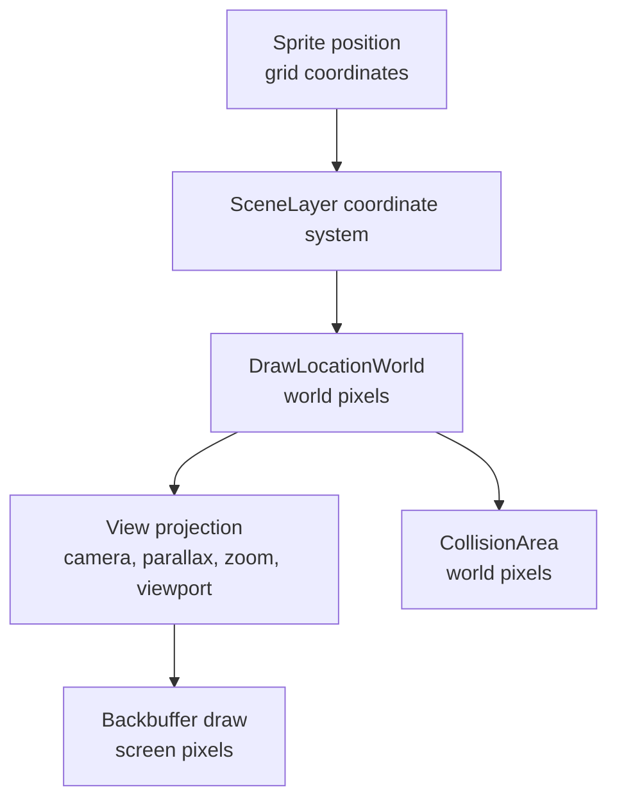

A `Sprite` is Gondwana's engine-managed, movable visual actor.

Sprites are attached to a single `SceneLayer`, positioned in that layer's grid coordinate space, rendered from a `Frame`, and automatically integrated with Gondwana's animation, movement, collision, depth-sorting, dirty-region, and serialization systems.

Use a sprite for things such as:

- players and NPCs
- enemies and projectiles
- movable puzzle pieces
- pickups and interactive objects
- animated environmental actors
- any image-based object that belongs to a scene layer and moves through the game world

Sprites are not an ECS entity type, and they are not generic screen-space images. They are concrete, object-oriented scene actors with engine-managed behavior.

---

## Contents

- [The short version](#the-short-version)
- [Creating a sprite](#creating-a-sprite)
- [The sprite mental model](#the-sprite-mental-model)
- [Position and coordinate spaces](#position-and-coordinate-spaces)
- [Render size, alignment, and nudging](#render-size-alignment-and-nudging)
- [Frames and tilesheets](#frames-and-tilesheets)
- [Animation](#animation)
- [Movement](#movement)
- [Collisions](#collisions)
- [Rendering and depth order](#rendering-and-depth-order)
- [Finding and querying sprites](#finding-and-querying-sprites)
- [Built-in visual effects](#built-in-visual-effects)
- [Cloning sprites](#cloning-sprites)
- [Composite sprites](#composite-sprites)
- [Events and lifecycle](#events-and-lifecycle)
- [Saving sprites with EngineState](#saving-sprites-with-enginestate)
- [Common mistakes](#common-mistakes)
- [Quick reference](#quick-reference)
- [Where to read next](#where-to-read-next)

---

## The short version

The usual sprite setup is:

1. Load or obtain a `Tilesheet`.
2. Select a `Frame` from it.
3. Create the sprite through `SpriteManager`.
4. Set its grid position.
5. Make it visible.

```csharp
using System.Drawing;
using System.Numerics;
using Gondwana.Drawing;
using Gondwana.Drawing.Sprites;
using Gondwana.Drawing.Tilesheets;

var actors = TilesheetRegistry.Instance.LoadFromImageFile(
    "actors",
    "assets/actors.png");

actors.DefaultRegion.TileSize = new Size(32, 48);

var standingFrame = new Frame(actors, xTile: 0, yTile: 0);

Sprite player = SpriteManager.Instance.CreateSprite(
    sceneLayer: actorLayer,
    frame: standingFrame,
    id: "player");

player.SetPosition(new Vector2(5, 3));
player.RenderSize = standingFrame.TileSize;
player.Visible = true;
```

The `id` argument sets the sprite's `Nickname`. It does not replace the sprite's automatically generated `Guid Id`.

Also note that a newly created sprite is not visible by default. Forgetting `Visible = true` is the classic first-sprite rite of passage.

---

## Creating a sprite

`Sprite` constructors are not part of the normal public creation path. Create sprites through the singleton `SpriteManager`:

```csharp
var sprite = SpriteManager.Instance.CreateSprite(
    actorLayer,
    new Frame(actors, 0, 0),
    "guard-01");
```

Creation does several things automatically:

- attaches the sprite to the supplied `SceneLayer`
- creates an `Animator`
- creates a grid-space `MovementController`
- creates a dynamic `TileCollider`
- gives the sprite a default `ZOrder` of `1`
- registers it with `SpriteManager`
- invalidates its initial world rectangle for bitmap dirty-region rendering
- raises `SpriteManager.SpriteCreated`

The sprite begins at grid position `(0, 0)` and remains managed until it is disposed.

### Default render sizing

`SpriteManager.SizeNewSpritesToSceneLayer` controls the initial `RenderSize` of subsequently created sprites.

Its default value is `true`:

```csharp
SpriteManager.Instance.SizeNewSpritesToSceneLayer = true;
```

With that setting, a new sprite begins at the layer's tile size. If it is `false`, the sprite begins at its frame's `TileSize` instead.

This is a manager-wide creation policy, not a permanent lock. You can always set an individual sprite's `RenderSize` afterward:

```csharp
sprite.RenderSize = new Size(32, 48);
```

---

## The sprite mental model

A sprite has several related representations, and keeping them separate prevents a great many mysterious offsets:

| Concept | Stored as | Meaning |
| --- | --- | --- |
| Position | `Vector2` / `PointF` | Fractional grid coordinates on one `SceneLayer` |
| Frame | `Frame` | A source cell in a tilesheet region |
| Draw rectangle | `Rectangle` | The sprite's destination bounds in world pixels |
| Collision area | `Rectangle` | An adjusted world-pixel rectangle |
| Screen rectangle | `RectangleF` | The world rectangle projected through a particular `View` |

The conversion pipeline is:



The most important rule is:

> A sprite's position is not its rendered pixel location.

`GetPosition()` returns grid coordinates. `DrawLocationWorld` returns the derived world-pixel rectangle. `GetDrawLocationScreen(view)` returns the final rectangle for one particular view.

---

## Position and coordinate spaces

Every sprite reports:

```csharp
sprite.PositionSpace == MovementSpace.Grid
```

Its logical position is stored in the coordinate system of its `SceneLayer`:

```csharp
sprite.SetPosition(new Vector2(4.5f, 7.25f));

Vector2 gridPosition = sprite.GetPosition();
PointF samePosition = sprite.SceneLayerCoordinates;
```

Fractional coordinates are valid and important for smooth movement. A sprite can move through grid space without jumping from one whole tile to another.

The layer decides how that grid position becomes a world-pixel anchor:

```csharp
PointF anchorWorldPx = sprite.SceneLayer.GridToWorldPx(
    sprite.SceneLayerCoordinates);
```

That conversion automatically follows the layer's coordinate system, including orthogonal, isometric, hexagonal, and oblique projections.

### Getting the rendered rectangles

```csharp
Rectangle worldRect = sprite.DrawLocationWorld;
RectangleF screenRect = sprite.GetDrawLocationScreen(view);
```

- `DrawLocationWorld` is suitable for world-space intersection and rendering logic.
- `GetDrawLocationScreen(view)` is suitable for screen hit-testing or UI interaction tied to a particular view.

Do not manually subtract the camera position from `DrawLocationWorld`. The `View` projection already applies the camera, viewport, zoom, and layer parallax.

### Moving by world pixels

Most gameplay movement should use `SetPosition`, `MoveTo`, `MoveBy`, or velocity in grid units. Gondwana also exposes `TranslateWorldPx` for the narrower case where a world-space correction must be translated back into the sprite's grid coordinates:

```csharp
sprite.TranslateWorldPx(dx: -2, dy: 0);
```

This is particularly useful to collision response code. It preserves fractional position on the unaffected axis instead of rebuilding the sprite position from a rounded rectangle.

---

## Render size, alignment, and nudging

The sprite's grid position produces an anchor tile in world space. Gondwana then places the sprite's `RenderSize` within that tile using horizontal alignment, vertical alignment, and pixel nudges.

The defaults are:

- `HorizAlign = HorizontalAlignment.Center`
- `VertAlign = VerticalAlignment.Bottom`
- `NudgeX = 0`
- `NudgeY = 0`

This is a useful default for characters: a narrow or tall actor remains centered horizontally and stands on the bottom of its logical tile.

```csharp
sprite.RenderSize = new Size(32, 48);
sprite.HorizAlign = HorizontalAlignment.Center;
sprite.VertAlign = VerticalAlignment.Bottom;
sprite.NudgeX = 0;
sprite.NudgeY = -2;
```

Conceptually, `DrawLocationWorld` is calculated as:

1. convert the sprite's grid coordinate to the layer's world-pixel anchor
2. align `RenderSize` within the layer tile's width and height
3. add `NudgeX` and `NudgeY`

Changing any of these values invalidates both the old and new draw areas so bitmap-backed rendering can erase the old image and redraw the new one.

### Alignment is not movement

Alignment and nudges change where the sprite is drawn relative to its logical grid position. They do not change `GetPosition()`.

Use them for stable visual placement, such as:

- centering a character over a tile
- placing feet on a tile baseline
- correcting transparent padding in source art
- making a held item sit a few pixels above its actor

Do not use a growing sequence of nudges as a replacement for movement. That road ends in a swamp.

---

## Frames and tilesheets

A sprite renders one `CurrentFrame` at a time. A `Frame` is a lightweight reference to:

- a `Tilesheet`
- a tilesheet region name
- an X tile index
- a Y tile index

```csharp
sprite.CurrentFrame = new Frame(
    actors,
    regionName: "player",
    xTile: 1,
    yTile: 0);
```

Changing `CurrentFrame` invalidates the sprite's draw area before and after the change. This matters when animation frames use different source art, overhang, or collision metadata.

The frame supplies:

- the source bitmap or image
- the region's `TileSize`
- the region's `Overhang`
- the effective per-frame `CollisionAdjust`

`RenderSize` is the destination size. It does not have to equal `CurrentFrame.TileSize`; Gondwana will scale the frame to the requested destination rectangle.

```csharp
sprite.RenderSize = sprite.CurrentFrame.TileSize; // natural size
```

For the full source-image model, regions, margins, padding, overhang, provenance, and `.gts` persistence, see [[Tilesheets]] and [[.gts Files]].

---

## Animation

Every sprite owns an `Animator`, exposed through `TileAnimator`. The animation system itself belongs to the `Tile` base model, so fixed `SceneLayerTile` cells can use the same machinery when their animator is enabled. This section focuses on sprite usage; see [[Tile Animation]] for the shared model and animated map-tile examples.

Animation is built from three pieces:

| Type | Responsibility |
| --- | --- |
| `FrameSequence` | The ordered collection of frames and its cycle pattern |
| `Cycle` | The sequence, frame timing, key, and next-cycle behavior |
| `Animator` | Playback state for one tile or sprite |

### Creating and playing a repeating animation

```csharp
using Gondwana.Drawing.Animation;

var walkFrames = new FrameSequence(new List<Frame>
{
    new(actors, "player", 0, 1),
    new(actors, "player", 1, 1),
    new(actors, "player", 2, 1),
    new(actors, "player", 3, 1)
})
{
    SequenceCycleType = CycleType.Repeating
};

var walkCycle = new Cycle(
    sequence: walkFrames,
    throttleTime: 0.10,
    cycleKey: "player.walk");

player.TileAnimator.StartAnimation("player.walk");
```

`throttleTime` is the number of seconds between frame transitions.

The available sequence patterns are:

- `CycleType.Simple` — advance once and stop on the final frame
- `CycleType.Repeating` — loop from the last frame back to the first
- `CycleType.PingPong` — travel forward and backward through the sequence

Cycles are registered globally by `CycleKey`. Starting an animation by key gives the animator a cloned cycle, allowing each sprite to maintain independent playback state.

### Pausing and stopping

```csharp
player.PauseAnimation = true;
player.PauseAnimation = false;

player.TileAnimator.StopAnimation();
```

Pausing prevents the frame from advancing without discarding the current cycle. Stopping removes the sprite from the engine's active animation list and applies any configured next-cycle behavior.

### Animation events

```csharp
player.TileAnimator.Started += args =>
    Console.WriteLine("Walk animation started.");

player.TileAnimator.Cycled += args =>
    Console.WriteLine("Advanced one frame.");

player.TileAnimator.Stopped += args =>
    Console.WriteLine("Walk animation stopped.");
```

### Animation and collision bounds

The initial frame supplies the sprite's default collision adjustment. After that, collision bounds remain stable across frame changes unless you opt in:

```csharp
player.AdjustCollisionAreaByFrame = true;
```

When enabled, each new `CurrentFrame` replaces the sprite's collision adjustment with that frame's effective collision metadata. Leave it `false` when the animation should retain one stable gameplay body despite visually different frames.

---

## Movement

Each sprite owns a `MovementController`:

```csharp
MovementController movement = sprite.Movement;
```

For sprites, movement values are interpreted in grid units, not pixels.

For example, a velocity of `(3, 0)` means three grid units per second along the layer's X axis. The active coordinate system determines how that motion is projected into world pixels.

### Move to a destination over time

```csharp
player.Movement
    .MoveTo(
        target: new Vector2(10, 6),
        durationSec: 0.75f,
        snapEpsilon: 0.01f)
    .OnComplete(() =>
    {
        Console.WriteLine("Player arrived.");
    });
```

### Move by a relative amount

```csharp
player.Movement.MoveBy(
    delta: new Vector2(1, 0),
    durationSec: 0.20f,
    snapEpsilon: 0.01f);
```

### Move at a constant speed toward a target

```csharp
player.Movement.MoveToward(
    target: new Vector2(12, 8),
    speedPerSec: 4f,
    snapEpsilon: 0.01f);
```

### Integrated velocity and acceleration

```csharp
player.Movement.SetVelocity(new Vector2(3f, 0f));
player.Movement.SetAcceleration(new Vector2(0f, 1.5f));
player.Movement.SetMaxSpeed(6f);
player.Movement.SetLinearDamping(0.8f);
```

Stop everything with:

```csharp
player.Movement.StopAllMovement();
```

The controller evaluates movement modes in this order:

1. follow behavior
2. scripted movement
3. integrated velocity and acceleration

Only one mode owns a given movement update. See [[MovementController]] for the complete API and mode interactions.

### Sprite movement events

`SetPosition` invalidates the union of the old and new draw bounds and raises `SpriteMoved`:

```csharp
player.SpriteMoved += args =>
{
    Console.WriteLine(
        $"{args.oldPt} -> {args.newPt}");
};
```

The event points are grid coordinates.

---

## Collisions

Every sprite is constructed with a dynamic `TileCollider`, but collision participation is disabled by default.

The collider's bounds come from:

```text
DrawLocationWorld + AdjustCollisionArea = CollisionArea
```

Both `DrawLocationWorld` and `CollisionArea` are world-pixel rectangles.

### Enabling and filtering collisions

Collision groups are bitmasks. A simple setup might be:

```csharp
using Gondwana.Physics.Collisions;

const int PlayerMask = 1 << 0;
const int WorldMask  = 1 << 1;
const int EnemyMask  = 1 << 2;

player.Collider!.CollisionGroup = PlayerMask;
player.Collider.CollidesWith = WorldMask | EnemyMask;
player.Collider.ResponseType = CollisionResponseType.Solid;

player.CollisionsEnabled = true;
```

`CollisionGroup` answers “what is this?” `CollidesWith` answers “what should it interact with?” Both sides must pass the registry's mask checks.

Set `ResponseType` to the behavior appropriate for the object:

- `Solid` participates in blocking collision response
- `Trigger` reports overlap without acting as a solid obstacle

### Adjusting the collision rectangle

```csharp
player.AdjustCollisionArea = new CollisionAdjust(
    top: 6,
    bottom: 2,
    left: 5,
    right: 5);
```

Positive values inset that side toward the center. This lets a large character image use a smaller gameplay body—often only the feet and lower torso.

```csharp
Rectangle collisionWorldPx = player.CollisionArea;
RectangleF collisionScreenPx = player.GetCollisionAreaScreen(view);
```

For debugging:

```csharp
actorLayer.ShowCollisionBoxes = true;
```

### Update order

During the engine's background cycle:

1. animation frames advance
2. sprite movement, resize, and jiggle advance
3. each layer resolves collisions
4. cameras update
5. rendering consumes the resulting state

This keeps movement and collision separate: the movement controller proposes motion; the collision system evaluates and resolves world-space bounds afterward.

---

## Rendering and depth order

Sprites render as part of their owning `SceneLayer`. For each world region being drawn, the layer gathers:

- visible grid tiles
- sprites intersecting the region
- layer-bound direct drawings intersecting the region

It then sorts the combined drawable list.

The primary key is `ZOrder`: lower values draw first and higher values draw later. A newly created sprite starts with `ZOrder = 1`, and the property clamps assigned values to a minimum of `1`.

```csharp
player.ZOrder = 10;
```

When tiles or sprites share a Z-order, Gondwana retains tile-style depth ordering based on their effective vertical location, overhang, and X position, with fixed tiles ordered before movable tiles when a fixed/movable pair ties. This allows actors sharing a Z-order to depth-sort by their world position without requiring a unique Z-order for every row.

For the complete hierarchy—including SceneLayer Z-order, View Z-order, and View-bound overlays—see [[Rendering Order and Z-Order]].

### Visibility

```csharp
player.Visible = false;
player.Visible = true;
```

Changing visibility invalidates the sprite's draw area. Invisible sprites remain registered and can still be found by manager queries; they are skipped when the backbuffer draws the collected list.

### Bitmap and GPU paths

The sprite model is the same on both rendering paths:

- bitmap backbuffers redraw world regions placed in each layer's `RefreshQueue`
- GPU backbuffers gather and render the visible world extent every GL frame

Movement, frame changes, visibility, alignment, nudging, and resizing all invalidate the correct world bounds for the bitmap path. The GPU path performs a full viewport render and does not depend on those queued dirty rectangles.

---

## Finding and querying sprites

`SpriteManager` is both the creation service and the global sprite registry.

### Enumerate all managed sprites

```csharp
foreach (Sprite sprite in SpriteManager.Instance.AllSprites)
{
    Console.WriteLine(sprite.Nickname);
}
```

`AllSprites` returns a read-only snapshot, so callers cannot directly modify the manager's internal list.

### Find by nickname

```csharp
Sprite? player = SpriteManager.Instance.GetSpriteByID("player");
```

Despite the method name, `GetSpriteByID` compares the supplied string to `Nickname`, not to the sprite's `Guid Id`.

Nicknames are optional. If you rely on manager lookup, assign unique, stable names in game code.

### Query a world rectangle

```csharp
var nearby = SpriteManager.Instance.GetSpritesInWorldRectRange(
    worldRect,
    sceneLayer: actorLayer,
    fullEnclosures: false);
```

With `fullEnclosures: false`, intersecting sprites are returned. With `true`, the supplied rectangle must fully contain the sprite's `DrawLocationWorld`.

### Query a view or screen point

```csharp
var visibleCandidates = SpriteManager.Instance.GetSpritesInViewRectRange(
    view,
    viewRectPx,
    sceneLayer: actorLayer);

var clicked = SpriteManager.Instance
    .GetSpritesAtViewPixel(view, mousePointPx, actorLayer)
    .Where(sprite => sprite.Visible)
    .OrderByDescending(sprite => sprite.ZOrder)
    .FirstOrDefault();
```

The view-based methods compare against each sprite's projected screen draw rectangle. They are rectangle tests, not per-pixel alpha tests.

Manager range queries do not automatically exclude invisible sprites and do not promise that the first result is the visually topmost one. Filter and choose according to your interaction rules.

---

## Built-in visual effects

Sprites include lightweight effects that advance through the normal sprite update path.

### Jiggle

Jiggle is a visual-only offset and optional scale wobble. It does not change the sprite's grid position, `RenderSize`, or collision bounds.

```csharp
player.JiggleOnce(
    intensityX: 3f,
    intensityY: 2f,
    speed: 14f,
    durationSeconds: 0.20f,
    affectsScale: true,
    scaleIntensity: 0.02f);
```

For a continuing effect:

```csharp
player.StartJiggle(
    intensityX: 1.5f,
    intensityY: 1.5f,
    speed: 8f,
    loop: true,
    affectsScale: false);

// Later:
player.StopJiggle();
```

Useful cases include hits, rejected input, magical vibration, or a selected puzzle piece.

### Resize and scale

```csharp
player.ResizeTo(
    targetSize: new Size(48, 72),
    durationSeconds: 0.25f);

player.ScaleBy(
    factor: 1.25f,
    durationSeconds: 0.20f);
```

Resizing changes the real `RenderSize`. Gondwana also scales the current collision adjustment as the resize progresses.

### Pulse

```csharp
player.PulseBy(
    factor: 1.15f,
    growDurationSeconds: 0.10f,
    shrinkDurationSeconds: 0.15f,
    loop: false);
```

Stop a looping pulse with:

```csharp
player.StopPulse(snapBack: true);
```

You can observe resize or pulse completion:

```csharp
player.ResizeComplete += () =>
    Console.WriteLine("Resize effect complete.");
```

`CancelResize()` stops at the current size. `StopPulse(snapBack: true)` is the convenient choice when the sprite should return to its pre-pulse size.

---

## Cloning sprites

Clone an existing sprite when several actors share the same visual and placement configuration:

```csharp
Sprite secondGuard = SpriteManager.Instance.CloneSprite(firstGuard);

secondGuard.Nickname = "guard-02";
secondGuard.SetPosition(new Vector2(8, 4));
secondGuard.Visible = true;
```

You can also request a target layer:

```csharp
Sprite secondGuard = SpriteManager.Instance.CloneSprite(
    firstGuard,
    anotherActorLayer);
```

A cross-layer clone is attached to the requested layer from construction onward. Its new `MovementController` therefore uses the destination layer's coordinate system, dimensions, and wrapping rules.

A clone receives a new sprite identity and fresh manager registration. Treat cloning as a visual-and-placement template, then explicitly configure the clone's nickname, movement, animation playback, event subscriptions, and collision policy.

`SpriteManager` also provides:

```csharp
Sprite? clone = SpriteManager.Instance.CloneSprite(
    "guard-01",
    actorLayer);
```

That overload looks up the source by `Nickname` and returns `null` when it cannot be found.

---

## Composite sprites

`CompositeSprite` groups existing sprites so they can be positioned or translated as one unit while each child remains an ordinary managed sprite.

```csharp
var cart = new CompositeSprite(cartBody, leftWheel, rightWheel);

cart.AnchorMode = CompositeAnchorMode.TopLeft;
cart.SetPosition(new Vector2(10, 6));
cart.Translate(new Vector2(1, 0));
```

`CompositeSprite.PositionSpace` is `MovementSpace.Grid`. `GetPosition()`, `SetPosition(...)`, `Translate(...)`, and child offsets therefore all use the owning layer's grid coordinate space.

The composite anchor is derived from the children's combined world-pixel `Range`, then converted back through `SceneLayer.WorldPxToGrid(...)`:

- `TopLeft` uses the top-left of the combined visual bounds
- `Center` uses the center of the combined visual bounds

This preserves a visual-bounds anchor while keeping the public movement contract in grid units.

### Adding children

Add a sprite without changing its current position:

```csharp
cart.Add(cargo);
```

Add a sprite at an absolute grid position:

```csharp
cart.AddChildAtPosition(
    flag,
    absolutePosition: new Vector2(10, 5));
```

Add a sprite at a grid offset from the composite's current anchor:

```csharp
cart.AddChildWithOffset(
    lantern,
    offsetFromCompositeAnchor: new Vector2(0.5f, -1f));
```

Important characteristics:

- every child must belong to the same `SceneLayer`
- `Add(sprite)` preserves the child's current position
- `Remove(sprite)` removes it from the composite but does not dispose it
- disposing a child automatically removes it from the composite
- `Children` is read-only
- `Range` is the union of child `DrawLocationWorld` rectangles
- the composite itself is not drawn or registered with `SpriteManager`
- children remain independently visible, animated, collidable, and depth-sorted

Use a composite when an object is genuinely made from several sprites but should move as a group. Use a single animated sprite when the parts do not need independent frames, depth, collision, or visibility.

---

## Events and lifecycle

The main sprite-related events are:

| Event | Raised when |
| --- | --- |
| `SpriteManager.SpriteCreated` | A sprite is created or cloned |
| `Sprite.SpriteMoved` | `SetPosition` changes the grid position |
| `Sprite.Disposing` | Deferred disposal is swept by the manager |
| `Animator.Started` | Animation playback begins |
| `Animator.Cycled` | The animator advances a frame |
| `Animator.Stopped` | Animation playback stops |
| `Movement.ScriptedMovementStarted` | Scripted movement begins |
| `Movement.ScriptedMovementStopped` | Scripted movement completes or is cancelled |
| `ResizeComplete` | A resize/pulse finishes or is cancelled |

### Removing a sprite

All of these request disposal:

```csharp
sprite.Dispose();

SpriteManager.Instance.Remove(sprite);

SpriteManager.Instance.Remove("guard-01");
```

Disposal is deferred. `Dispose()` marks the sprite as pending, and `SpriteManager` performs the immediate cleanup during its next sprite update sweep. This prevents the manager from tearing apart its collection while it is being updated.

Consequences of deferred disposal:

- a just-disposed sprite may remain in `AllSprites` until the next update sweep
- it no longer advances movement, resize, or jiggle while pending
- final cleanup invalidates its old draw rectangle
- `Disposing` is raised during the sweep
- animator resources, collision registration, and event handlers are released

Remove every sprite with:

```csharp
SpriteManager.Instance.Clear();
```

---

## Saving sprites with EngineState

Sprites are included when `EngineStateParts.Sprites` is selected:

```csharp
Engine.Instance.State.SaveToFile(
    "savegame.json",
    parts:
        EngineStateParts.Tilesheets |
        EngineStateParts.Cycles |
        EngineStateParts.Scenes |
        EngineStateParts.Sprites);
```

Include the related scenes, tilesheets, and cycles when the saved sprites refer to them. A sprite is not a self-contained image file; its frame and layer belong to the larger engine object graph.

Serialized sprite state includes its layer reference, frame, grid position, alignment, nudges, render size, visibility, Z-order, and supported collision settings. Runtime helpers such as the animator, movement controller, and collider are rebuilt after deserialization.

Active movement commands, event subscriptions, and live animation playback should be treated as transient runtime state and re-established by game logic when needed.

`Sprite.ValueBag` is marked `JsonIgnore` and is not included in EngineState JSON.

See [[Serialization and EngineState]] for load-versus-merge behavior and state dependency details.

---

## Common mistakes

### The sprite does not appear

Check:

```csharp
sprite.Visible = true;
```

Then verify that its `SceneLayer` is visible, belongs to the bound scene, and its grid position projects inside the active view.

### The sprite is the wrong size

New sprites normally inherit the layer tile size because `SizeNewSpritesToSceneLayer` defaults to `true`.

Set `RenderSize` explicitly or change the manager policy before creating sprites that should begin at their frame size.

### The position looks nothing like the pixel location

That is expected. `GetPosition()` is grid space; `DrawLocationWorld` is world-pixel space; `GetDrawLocationScreen(view)` is screen space.

### The camera offset seems to be applied twice

Do not subtract the camera yourself. Pass the sprite's world bounds through the `View` conversion methods.

### Collision does nothing

Creating a sprite creates its collider but does not register it for collision handling. Configure its masks and set:

```csharp
sprite.CollisionsEnabled = true;
```

### Animated collision bounds keep changing—or do not change

Choose the intended policy explicitly:

```csharp
sprite.AdjustCollisionAreaByFrame = true;  // follow every frame
sprite.AdjustCollisionAreaByFrame = false; // keep one stable adjustment
```

### `GetSpriteByID` does not find a `Guid`

It searches `Nickname`. Use the `Id` property directly when your own code is tracking the sprite's `Guid`.

### An invisible sprite still appears in a query

Manager range and point queries are geometric registry queries. Filter `Visible` when visibility matters.

### A disposed sprite is still in `AllSprites`

Disposal is swept on the next sprite update. Do not use the registry count as proof of immediate destruction within the same update callback.

### Jiggle does not move the collision box

Correct. Jiggle is deliberately visual-only. Use actual movement when gameplay geometry should move.

---

## Quick reference

| Task | API |
| --- | --- |
| Create | `SpriteManager.Instance.CreateSprite(layer, frame, nickname)` |
| Clone | `SpriteManager.Instance.CloneSprite(sprite)` |
| Position in grid space | `SetPosition(Vector2)` / `GetPosition()` |
| World draw bounds | `DrawLocationWorld` |
| Screen draw bounds | `GetDrawLocationScreen(view)` |
| Change image | `CurrentFrame` |
| Change destination size | `RenderSize` |
| Align within logical tile | `HorizAlign` / `VertAlign` |
| Apply visual pixel offset | `NudgeX` / `NudgeY` |
| Show or hide | `Visible` |
| Control depth | `ZOrder` |
| Start named animation | `TileAnimator.StartAnimation(key)` |
| Pause frame cycling | `PauseAnimation` |
| Script movement | `Movement.MoveTo`, `MoveBy`, `MoveToward` |
| Integrated movement | `Movement.SetVelocity`, `SetAcceleration` |
| Stop movement | `Movement.StopAllMovement()` |
| Enable collisions | `CollisionsEnabled = true` |
| Collision bounds | `CollisionArea` |
| Tune bounds | `AdjustCollisionArea` |
| Follow frame collision metadata | `AdjustCollisionAreaByFrame` |
| Find by nickname | `SpriteManager.Instance.GetSpriteByID(...)` |
| Query world area | `GetSpritesInWorldRectRange(...)` |
| Query screen point | `GetSpritesAtViewPixel(...)` |
| One-shot feedback | `JiggleOnce(...)` |
| Animate size | `ResizeTo`, `ScaleBy`, `PulseBy` |
| Remove | `Dispose()` or `SpriteManager.Instance.Remove(...)` |

---

## Final mental model

A Gondwana sprite is:

- one movable `Tile`
- attached to one `SceneLayer`
- positioned in fractional grid coordinates
- rendered from one tilesheet `Frame` at a time
- converted to world pixels by the layer's coordinate system
- converted to screen pixels by each `View`
- updated by its animator and movement controller
- optionally registered with the layer's collision system
- depth-sorted alongside tiles and layer-bound direct drawings
- centrally managed by `SpriteManager`

If you remember only one distinction, remember this one:

> The sprite owns a grid-space gameplay position; Gondwana derives its world-space draw and collision rectangles, then each view derives its screen-space rectangle.

---

## Where to read next

- [[Tilesheets]] — source images, regions, frames, sizing, margins, and overhang
- [[.gts Files]] — serializing tilesheet layout and provenance
- [[Tile Animation]] — the shared `Tile` animation model for sprites and fixed grid tiles
- [[Coordinate Spaces]] — grid, world, screen, and projection spaces
- [[Using Views and Cameras]] — cameras, viewports, zoom, and screen projection
- [[MovementController]] — follow, scripted, and integrated movement
- [[DirectDrawing]] — engine-managed visuals that are not sprites or layer tiles
- [[Rendering Order and Z-Order]] — layer, drawable, view, and overlay ordering
- [[Refresh Queues]] — bitmap dirty-region invalidation
- [[Serialization and EngineState]] — saving and restoring engine registries

Relevant source files:

- [`Gondwana/Drawing/Sprites/Sprite.cs`](https://isthimius.github.io/Gondwana/api/latest/Sprite_8cs_source.html)
- [`Gondwana/Drawing/Sprites/Sprite.Jiggle.cs`](https://isthimius.github.io/Gondwana/api/latest/Sprite_8Jiggle_8cs_source.html)
- [`Gondwana/Drawing/Sprites/Sprite.Resize.cs`](https://isthimius.github.io/Gondwana/api/latest/Sprite_8Resize_8cs_source.html)
- [`Gondwana/Drawing/Sprites/SpriteManager.cs`](https://isthimius.github.io/Gondwana/api/latest/SpriteManager_8cs_source.html)
- [`Gondwana/Drawing/Sprites/CompositeSprite.cs`](https://isthimius.github.io/Gondwana/api/latest/CompositeSprite_8cs_source.html)
- [`Gondwana/Drawing/Tile.cs`](https://isthimius.github.io/Gondwana/api/latest/Tile_8cs_source.html)
- [`Gondwana/Drawing/Frame.cs`](https://isthimius.github.io/Gondwana/api/latest/Frame_8cs_source.html)
- [`Gondwana/Drawing/Animation/Animator.cs`](https://isthimius.github.io/Gondwana/api/latest/Animator_8cs_source.html)
- [`Gondwana/Drawing/Animation/Cycle.cs`](https://isthimius.github.io/Gondwana/api/latest/Cycle_8cs_source.html)
- [`Gondwana/Drawing/Animation/FrameSequence.cs`](https://isthimius.github.io/Gondwana/api/latest/FrameSequence_8cs_source.html)
- [`Gondwana/Drawing/Collisions/TileCollider.cs`](https://isthimius.github.io/Gondwana/api/latest/TileCollider_8cs_source.html)
- [`Gondwana/Physics/Movement/MovementController.cs`](https://isthimius.github.io/Gondwana/api/latest/MovementController_8cs_source.html)
- [`Gondwana/Scenes/SceneLayer.cs`](https://isthimius.github.io/Gondwana/api/latest/SceneLayer_8cs_source.html)
