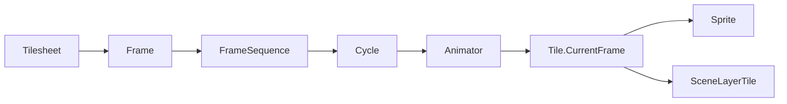
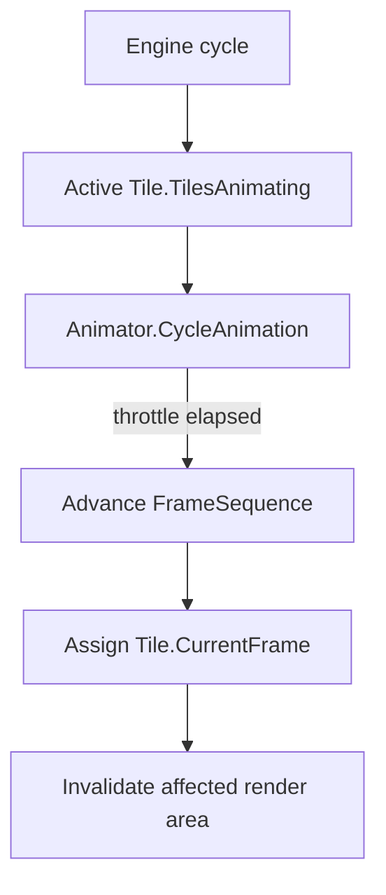

Animation in Gondwana belongs to the `Tile` model, not specifically to `Sprite`.

That distinction is intentional and useful in a tile-based engine. A walking character can animate, but so can a fixed water tile, a torch in a wall, a tree blowing in the wind, or a machine embedded directly in a tile grid. Those objects do not need to become sprites merely because their image changes over time.

Both of Gondwana's principal image-based world objects derive from `Tile`:

- `Sprite` — movable, fractional-position actors
- `SceneLayerTile` — fixed cells in a `SceneLayer` grid

Both therefore use the same frame and animation machinery.

---

## The short version

Animation changes a `Tile.CurrentFrame` over time:



The main types are:

| Type | Responsibility |
| --- | --- |
| `Frame` | Identifies one drawable frame from a tilesheet region |
| `FrameSequence` | Holds the ordered frames and the sequence pattern |
| `Cycle` | Gives a sequence its timing, key, and follow-on behavior |
| `Animator` | Holds playback state for one `Tile` |
| `Tile` | Owns `CurrentFrame`, which is what actually changes on screen |

A `Sprite` gets an `Animator` automatically when it is created. A fixed `SceneLayerTile` does not, because most map cells are static; enable one only when that cell needs to animate.

---

## Why animation belongs to `Tile`

A common engine design attaches animation only to movable sprite or actor objects. Gondwana instead treats frame animation as a capability of a drawable tile.

That means these are all the same basic operation:

- animate a player's walking frames
- animate an enemy
- animate water in a tile grid
- animate a tree without turning it into a sprite
- animate a wall-mounted torch
- animate a conveyor belt or machine tile

The object changes `CurrentFrame`; whether its position is movable is a separate concern.

This keeps the tile-grid model useful for environmental animation and avoids maintaining one animation system for sprites and another for map tiles.

---

## Defining an animation cycle

Animation definitions are normally created after their tilesheets are available. In a `GameHostBase` game, `LoadAnimationCycles()` runs after `LoadTilesheets()`, which makes it a natural place to define them.

```csharp
using Gondwana.Drawing;
using Gondwana.Drawing.Animation;

protected override void LoadAnimationCycles()
{
    var waterFrames = new FrameSequence(new List<Frame>
    {
        new(_worldSheet, "water", 0, 0),
        new(_worldSheet, "water", 1, 0),
        new(_worldSheet, "water", 2, 0),
        new(_worldSheet, "water", 3, 0)
    })
    {
        SequenceCycleType = CycleType.Repeating
    };

    _ = new Cycle(
        sequence: waterFrames,
        throttleTime: 0.18,
        cycleKey: "world.water");
}
```

`throttleTime` is the number of seconds between frame transitions.

`CycleType` controls how the sequence advances:

- `Simple` — advance through the sequence once and stop
- `Repeating` — loop back to the first frame
- `PingPong` — advance forward and then backward

### Cycle keys are definitions, not per-object state

A `Cycle` is registered by its `CycleKey`. When an animator starts a cycle by key, Gondwana retrieves a clone of that cycle.

That lets many tiles use the same definition while keeping independent playback state:

```csharp
player.TileAnimator.StartAnimation("actor.walk");
enemy.TileAnimator.StartAnimation("actor.walk");
```

The two animators can be on different frames even though they started from the same registered cycle definition.

Use descriptive, game-wide keys such as:

```text
actor.player.walk
actor.goblin.walk
world.water
world.torch
```

---

## Persisting cycles with GANI

The programmatic `FrameSequence` / `Cycle` API remains valid, but reusable animation definitions can also be stored as `.gani` files.

A GANI definition stores the cycle's key, timing, playback type, ordered frame references, and follow-on cycle identity without embedding runtime tilesheet graphs.

For example:

```json
{
  "Key": "world.water",
  "ThrottleTime": 0.18,
  "CycleType": "Repeating",
  "Frames": [
    {
      "Tilesheet": "world",
      "RegionName": "water",
      "XTile": 0,
      "YTile": 0
    },
    {
      "Tilesheet": "world",
      "RegionName": "water",
      "XTile": 1,
      "YTile": 0
    }
  ]
}
```

Load the referenced tilesheet first, then materialize the animation:

```csharp
using Gondwana.Drawing.Animation.GANI;

Cycle water =
    AnimationDefinitionSerializer.LoadCycle(
        "animations/world.water.gani");
```

The runtime cycle is registered under the GANI definition's `Key`, so ordinary animator code does not change:

```csharp
waterTile.TileAnimator.StartAnimation("world.water");
```

GANI frame references are logical references into registered tilesheets. The animation file does not embed GTS data.

See [[.gani Files|GANI-Files]] for the complete format, validation, assets-file support, and EngineState integration.

---

## Animating a sprite

Sprites always create their animator during construction, so no separate enable step is required:

```csharp
Sprite player = SpriteManager.Instance.CreateSprite(
    actorLayer,
    new Frame(_actorSheet, "player", 0, 0),
    "player");

player.Visible = true;
player.TileAnimator.StartAnimation("actor.player.walk");
```

To pause without discarding the current cycle:

```csharp
player.PauseAnimation = true;
```

Resume with:

```csharp
player.PauseAnimation = false;
```

To stop playback:

```csharp
player.TileAnimator.StopAnimation();
```

For the rest of the sprite model, see [[Sprites]].

---

## Animating a fixed tile-grid cell

Every cell in a `SceneLayer` is already a `SceneLayerTile`. You do not create a sprite simply to animate that location.

Enable the tile's animator, assign its initial frame, and start the same kind of cycle used by a sprite:

```csharp
SceneLayerTile water = worldLayer[12, 7]!;

water.CurrentFrame = new Frame(_worldSheet, "water", 0, 0);
water.EnableAnimator = true;
water.TileAnimator.StartAnimation("world.water");
```

The tile remains fixed at grid coordinate `(12, 7)`. Only its frame changes.

That makes fixed-tile animation a good fit for environmental details that logically belong to the map itself.

### Do not enable animators on every tile by default

`SceneLayerTile.EnableAnimator` exists because most tile-grid cells do not need an `Animator`.

For static terrain, leave it disabled. Enable it only for cells that actually animate. A sprite already owns an animator and requires no equivalent opt-in.

---

## How animation advances

When an animation starts, the owning tile is added to Gondwana's active `Tile.TilesAnimating` collection. During the engine update cycle, Gondwana advances each active tile's animator using the simulation clock.



The important consequence is that animation timing is based on engine simulation time, not on a promise that one animation frame equals one rendered video frame.

If more than one animation interval has elapsed, the animator can advance through the required transitions to catch up with the current simulation tick.

For the engine timing model, see [[Timers and Engine Timing]].

---

## Animation and collision metadata

Changing `CurrentFrame` can also matter to collision metadata.

The first assigned frame supplies a tile's initial effective collision adjustment and collision type. After that, Gondwana keeps those values stable by default even while animation changes the visual frame.

That default is useful for characters: a walking animation normally should not make the gameplay body expand and contract with every pose.

If the collision shape is intentionally frame-dependent, opt in:

```csharp
player.AdjustCollisionAreaByFrame = true;
player.CollisionTypeByFrame = true;
```

The same rule applies to fixed `SceneLayerTile` instances because the behavior belongs to `Tile`.

Use per-frame collision changes deliberately. A waving tree probably wants a stable collision trunk; a trap whose active frame changes its dangerous area may not.

See [[Collision Detection]] and [[.gts Files|GTS-Files]] for the collision metadata model.

---

## Animator events

Each animator exposes three lifecycle events:

```csharp
player.TileAnimator.Started += args =>
{
    // Animation began.
};

player.TileAnimator.Cycled += args =>
{
    // The tile advanced to another frame.
};

player.TileAnimator.Stopped += args =>
{
    // Animation stopped.
};
```

`Cycled` is useful when gameplay or audio must react to a specific frame transition, but avoid turning ordinary frame animation into a large event-driven gameplay state machine. Animation should generally display gameplay state rather than own it.

---

## `Cycle.NextCycle`

A `Cycle` can reference another cycle through `NextCycle`. This allows one animation to transition into another after completion.

Typical uses include:

- attack -> idle
- spawn -> idle
- open -> opened/idle
- one-shot effect -> hidden or follow-on state

For simple repeating environmental animation, the default repeating cycle is usually enough and no explicit transition is needed.

---

## Common mistakes

### Treating animation as sprite-only

If an object is a fixed part of the map, keep it in the tile grid and enable its animator. Do not promote it to a `Sprite` merely because it has multiple frames.

### Creating a separate `Cycle` for every object

Define reusable cycles by key and let each animator clone the cycle for its own playback state.

### Forgetting `EnableAnimator` on `SceneLayerTile`

Sprites create an animator automatically. Fixed scene-layer tiles do not.

### Using frame-dependent collision accidentally

Visual frames can change without changing collision bounds. Opt into `AdjustCollisionAreaByFrame` or `CollisionTypeByFrame` only when gameplay requires it.

### Confusing frame timing with render FPS

`ThrottleTime` is simulation-time spacing between frame transitions. It is not a request to display exactly one animation frame per rendered frame.

---

## Where to read next

- [[Tilesheets]] — source images, regions, tile size, overhang, and frames
- [[.gts Files|GTS-Files]] — persisted tilesheet and frame metadata
- [[.gani Files|GANI-Files]] — persisted animation definitions
- [[Tiles and Tile-Based SceneLayers]] — fixed map cells and tile-grid behavior
- [[Sprites]] — movable `Tile` objects
- [[Timers and Engine Timing]] — simulation timing and engine cycles
- [[Collision Detection]] — collision behavior and frame-dependent collision metadata
