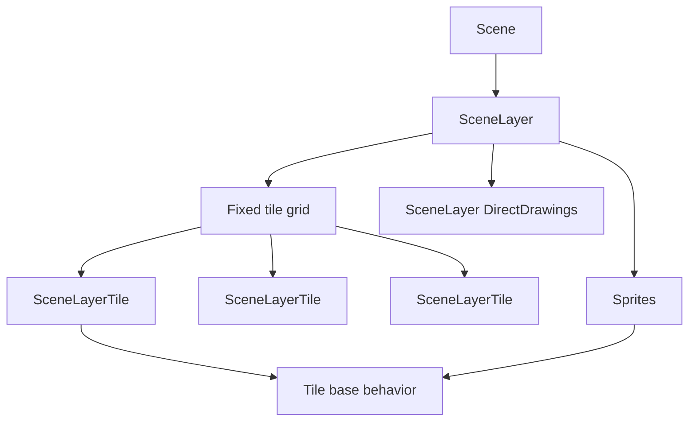
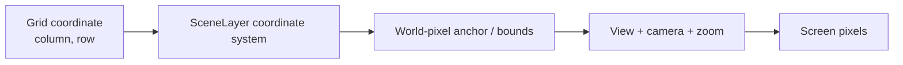
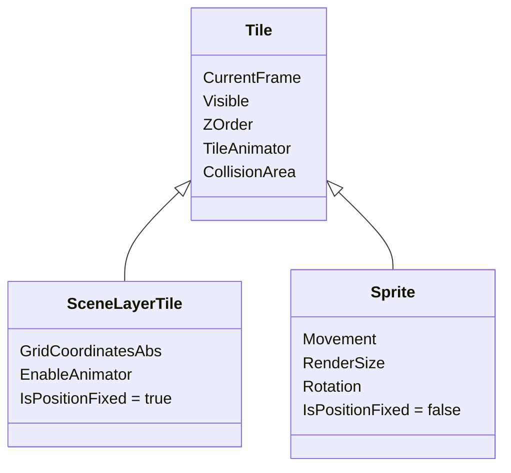

A `SceneLayer` is both a rendering layer and a fixed tile grid.

When Gondwana creates a layer, it creates a `SceneLayerTile` for every grid cell. Those fixed tiles form the map-like part of the layer. Sprites and SceneLayer-bound DirectDrawings can then occupy the same layer without becoming part of that fixed grid.

Understanding that distinction makes several Gondwana systems easier to reason about: coordinates, animation, collision, depth sorting, wrapping, and dirty-region rendering all build on it.

---

## The short version

A layer combines a fixed grid with other world-space drawables:



A `SceneLayerTile` and a `Sprite` are both `Tile` objects, but they solve different problems:

| | `SceneLayerTile` | `Sprite` |
| --- | --- | --- |
| Position | Fixed integer grid cell | Movable fractional grid position |
| Created by | `SceneLayer` | `SpriteManager` |
| Main use | Terrain and map content | Actors and movable objects |
| Frame | Yes | Yes |
| Animation | Optional | Animator created automatically |
| Collision | Supported | Supported |
| Movement controller | No | Yes |

The important design rule is:

> If something is fundamentally part of the map, it can remain a `SceneLayerTile` even when it animates or collides.

---

## Creating a tile-based layer

Layers are normally created through `Scene.AddLayer()`:

```csharp
using Gondwana.Drawing.Coordinates;
using Gondwana.Scenes;

var scene = new Scene();

SceneLayer worldLayer = scene.AddLayer(
    columnCount: 80,
    rowCount: 45,
    width: 32,
    height: 32,
    zOrder: 10,
    parallax: 1f,
    coordinateSystem: CoordinateSystemTypes.Orthogonal);
```

This establishes:

- an 80 x 45 tile grid
- a logical tile size of 32 x 32 pixels
- the layer's scene-level Z-order
- normal camera parallax
- an orthogonal grid-to-world projection

The grid dimensions are structural. Each cell already contains a `SceneLayerTile` after layer creation.

You do not normally allocate tile objects and insert them into cells.

---

## Accessing a tile cell

Use the layer indexer:

```csharp
SceneLayerTile? tile = worldLayer[12, 7];
```

Coordinates are zero-based:

- X is the column
- Y is the row

The layer also accepts `Point` and `PointF` indexers:

```csharp
SceneLayerTile? a = worldLayer[new Point(12, 7)];
SceneLayerTile? b = worldLayer[new PointF(12.8f, 7.2f)];
```

The `PointF` indexer truncates the fractional values to integer grid coordinates.

Out-of-range access returns `null` rather than wrapping automatically:

```csharp
SceneLayerTile? outside = worldLayer[-1, 0]; // null
```

This is deliberate. Wrapping and direct array-style access are separate concepts.

---

## Populating the grid

A fixed tile displays whatever `Frame` is assigned to its `CurrentFrame`:

```csharp
var grassFrame = new Frame(_worldSheet, "terrain", 0, 0);
var stoneFrame = new Frame(_worldSheet, "terrain", 1, 0);

for (int x = 0; x < worldLayer.GridColumnCount; x++)
{
    for (int y = 0; y < worldLayer.GridRowCount; y++)
    {
        SceneLayerTile tile = worldLayer[x, y]!;
        tile.CurrentFrame = grassFrame;
    }
}

worldLayer[10, 8]!.CurrentFrame = stoneFrame;
```

A `Frame` points into a `Tilesheet` region. The layer determines where the frame is drawn in the world.

This separation is important:

```text
SceneLayer grid cell   = where the tile lives
Frame                  = what the tile currently looks like
Tilesheet               = where the source image comes from
```

See [[Tilesheets]] for the source-image model.

---

## Grid coordinates are not pixel coordinates

A `SceneLayerTile` stores an integer grid coordinate:

```csharp
Point grid = tile.GridCoordinatesAbs;
```

Its world-pixel rectangle is derived from the layer's coordinate system:

```csharp
Rectangle worldRect = tile.DrawLocationWorld;
```

The conversion is conceptually:



This is why the same tile-grid API can drive very different projections.

A grid cell `(10, 8)` is still `(10, 8)` whether the layer is:

- orthogonal
- isometric rhombic
- isometric axial
- hex axial flat-top
- hex axial pointed-top
- oblique right
- oblique left

Only the projection from grid space to world pixels changes.

See [[Coordinate Systems]] and [[Coordinate Spaces]].

---

## Fixed does not mean visually confined to one cell

A tile's logical grid cell and its rendered image bounds are related, but they are not required to be the same rectangle.

Tilesheet regions and frames can define overhang. This lets a tile contain artwork that extends beyond its nominal cell, such as:

- a tree canopy
- a tall wall
- a building facade
- vegetation
- a cliff edge

The tile remains fixed at one grid coordinate while `DrawLocationWorld` includes the artwork's effective extent.

Gondwana's rendering and dirty-region selection account for tile overhang so a tall tile is not treated as though its pixels stop at the logical cell boundary.

This is also one reason to keep map objects as tiles when they logically belong to the grid: the tile model is not limited to flat 32 x 32 squares.

---

## `SceneLayerTile` and `Sprite` share the `Tile` base

The fixed-grid and movable-actor models meet at `Tile`:



Because the common image behavior lives in `Tile`, both object types participate in the same broad systems:

- frame rendering
- tilesheet metadata
- collision metadata
- animation
- layer-local drawable ordering
- world-to-screen projection

Movement is where they intentionally diverge.

---

## When to use a fixed tile versus a sprite

Use a `SceneLayerTile` when the object is fundamentally anchored to the map grid:

- floor and terrain
- walls
- water
- trees and vegetation
- doors that do not move between cells
- decorative machinery
- fixed hazards
- map scenery

Use a `Sprite` when the object needs an independent position or movement lifecycle:

- player characters
- NPCs
- enemies
- projectiles
- pickups that move
- vehicles
- physics/movement actors

Animation alone is not a reason to choose `Sprite`.

A tree blowing in the wind can remain a fixed tile. Water can animate in the grid. A torch can cycle frames without becoming an actor.

See [[Tile Animation]].

---

## Animated grid tiles

A fixed tile does not create an animator by default. Enable one only where needed:

```csharp
SceneLayerTile water = worldLayer[20, 12]!;

water.CurrentFrame = new Frame(_worldSheet, "water", 0, 0);
water.EnableAnimator = true;
water.TileAnimator.StartAnimation("world.water");
```

The animation changes `CurrentFrame`; it does not change `GridCoordinatesAbs`.

That gives tile maps environmental animation without creating hundreds of unnecessary sprite actors.

For the complete animation model, see [[Tile Animation]].

---

## Collision on fixed tiles

Every fixed grid tile has access to Gondwana's tile-collision model.

A tile can derive initial collision metadata from its frame and can then be configured as non-colliding, blocking, or a trigger according to the collision APIs.

Typical map uses include:

- solid walls
- floors and platforms
- spikes or hazards
- trigger areas represented by map cells

The layer also has a `DefaultTileCollisionProfile`, which defaults to Gondwana's world collision profile and can be used to keep fixed-world collision filtering consistent across the grid.

Frame changes do **not** automatically make the effective collision shape dance with every animation frame after the initial defaults are established. If that behavior is desired, opt in through the tile's frame-following collision settings.

See [[Collision Detection]] and [[Tile Animation]].

---

## Adjacency

Use `GetAdjacentTile()` when game logic needs the neighboring tile according to the layer's active coordinate system:

```csharp
SceneLayerTile? east = worldLayer.GetAdjacentTile(
    tile,
    CardinalDirections.E);
```

This is preferable to assuming that every projection interprets neighboring cells exactly like an orthogonal square grid.

The active coordinate system owns the meaning of adjacency.

This becomes especially important with isometric and hexagonal maps.

---

## Layer wrapping

Enable `WrapHorizontally` and/or `WrapVertically` to repeat the layer along its column and row axes. Rendering, collision queries, layer-bound drawings, and world-space widgets share the same canonical content at translated positions.

```csharp
worldLayer.WrapHorizontally = true;
SceneLayerTile? tile = worldLayer.ResolveWrappedTile(-1, 5);
```

The normal indexer remains bounds-checked: `worldLayer[-1, 5]` returns `null`. `WrapGrid` normalizes only enabled axes, and adjacency can cross enabled seams. Sprite movement wrapping remains a separate opt-in.

See [[SceneLayer Wrapping]] for projected-grid constraints, cameras, collision instances, UI behavior, and performance considerations.

---

## Multiple tile layers

Do not force every kind of world content into one giant grid layer.

Separate `SceneLayer` instances are useful when content needs different:

- scene-level Z-order
- parallax
- coordinate system
- origin
- visibility
- effects
- collision organization
- refresh behavior

A conventional 2D game might use layers such as:

```text
far background     Z = 0,  Parallax = 0.25
near background    Z = 10, Parallax = 0.60
world              Z = 20, Parallax = 1.00
foreground         Z = 30, Parallax = 1.00
```

Sprites can then belong to whichever layer represents their world plane.

For layer stacking and parallax, see [[Scenes and SceneLayers]] and [[Parallax and Multi-View Rendering]].

---

## Tile-grid rendering is still depth-aware

A SceneLayer is not rendered as a naive array dump.

For the world region being redrawn, Gondwana gathers the visible:

- `SceneLayerTile` objects
- sprites on that layer
- SceneLayer-bound DirectDrawings

It then sorts those drawables before rendering them.

That matters for tall map art, sprites walking behind or in front of scenery, and other overlapping content.

The rules are covered in [[Rendering Order and Z-Order]].

---

## Dirty regions and tile changes

On the bitmap rendering path, changes to tile-visible state and frames add affected world rectangles to the layer's `RefreshQueue`. Gondwana can then redraw the changed regions rather than treating every tile modification as a reason to rebuild the entire frame.

GPU rendering uses full-frame redraws, but the game-level tile model stays the same.

This is why game code should change tile properties through the engine APIs rather than drawing directly into a platform surface and expecting Gondwana to infer what changed.

See [[Refresh Queues]], [[Dirty Rectangles]], and [[Rendering Pipeline]].

---

## Common mistakes

### Creating a sprite for every animated map object

If the object does not move independently, consider leaving it as a `SceneLayerTile` and enabling its animator.

### Treating grid coordinates as pixels

`(10, 8)` means column 10, row 8. The coordinate system decides where that appears in world pixels.

### Assuming the indexer wraps

Out-of-range indexer access returns `null`. Wrap explicitly when that is the intended behavior.

### Assuming tile art cannot extend outside its cell

Overhang exists specifically to support artwork such as trees and buildings whose visible pixels exceed the logical tile footprint.

### Assuming one SceneLayer must contain the entire world

Use multiple layers when content needs distinct depth, parallax, visibility, or projection behavior.

---

## Where to read next

- [[Scenes and SceneLayers]] — scene/layer architecture
- [[Tilesheets]] — frames, regions, tile sizes, and overhang
- [[.gts Files|GTS-Files]] — persisted tilesheet metadata
- [[Tile Animation]] — shared animation for sprites and fixed grid tiles
- [[Sprites]] — movable `Tile` actors
- [[Coordinate Systems]] — grid projections
- [[Coordinate Spaces]] — grid, world, and screen spaces
- [[Rendering Order and Z-Order]] — how overlapping layer content is sorted
- [[Collision Detection]] — tile and sprite collision behavior
