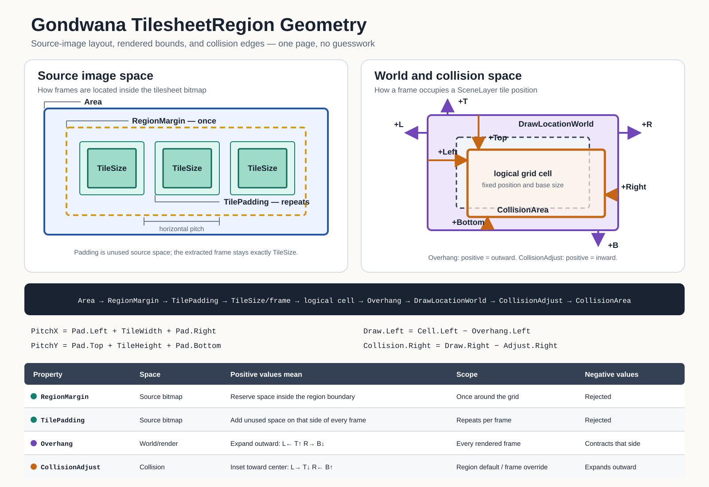

A **tilesheet** is an image source plus the rules Gondwana uses to turn parts of that image into reusable [`Frame`](#working-with-frames) values. A frame can then be assigned to a scene tile, a sprite, or any other drawable object that accepts one.

Tilesheets are useful whenever one image contains several graphics: terrain tiles, animation poses, UI icons, characters, effects, and similar art.

> A tilesheet is not a tile map. The tilesheet supplies graphics; a `SceneLayer` decides where those graphics appear in the game world.

## On this page

- [The basic model](#the-basic-model)
- [Quick start](#quick-start)
- [Source image and world geometry](#source-image-and-world-geometry)
- [Regions](#regions)
- [Working with frames](#working-with-frames)
- [Overhang and collision](#overhang-and-collision)
- [Loading and managing tilesheets](#loading-and-managing-tilesheets)
- [Common mistakes](#common-mistakes)

## The basic model

The main pieces fit together like this:

`source image` → `Tilesheet` → `TilesheetRegion` → `Frame` → `Tile` or `Sprite`

| Type | What it represents |
| --- | --- |
| `Tilesheet` | The source image and the collection of regions defined over it. |
| `TilesheetRegion` | A rectangular area of the source image, divided into a grid of frames. It owns the grid geometry and its default collision settings. |
| `Frame` | A lightweight address: tilesheet + region name + zero-based column and row. It does not copy the source image. |
| `Tile` / `Sprite` | Something in the world that displays a frame. |

One tilesheet always has a region named `default` when it is loaded directly from an image. The default region initially covers the entire image, but it does not know the frame size until you set `TileSize`.

## Quick start

This example loads a PNG whose frames are arranged in a regular 32 × 32-pixel grid:

```csharp
using System.Drawing;
using Gondwana;
using Gondwana.Drawing;
using Gondwana.Drawing.Tilesheets;

Tilesheet terrain = TilesheetRegistry.Instance.LoadFromImageFile(
    "terrain",
    "Content/Tilesheets/terrain.png");

terrain.DefaultRegion.TileSize = new Size(32, 32);

Frame grass = terrain[0, 0];
Frame stone = terrain[1, 0];

worldLayer[5, 3].CurrentFrame = grass;
worldLayer[6, 3].CurrentFrame = stone;
```

The frame coordinates are **grid coordinates**, not pixel coordinates:

- `terrain[0, 0]` is the first column of the first row.
- `terrain[1, 0]` is the second column of the first row.
- `terrain[0, 1]` is the first column of the second row.

After setting `TileSize`, you can inspect `terrain.DefaultRegion.Columns` and `Rows` to see how many complete frames were found. Any leftover pixels that do not form a complete grid cell are ignored.

The engine manager exposes the same registry when you already have an `Engine` reference:

```csharp
Tilesheet terrain = Engine.Instance.Managers.Tilesheets.LoadFromImageFile(
    "terrain",
    "Content/Tilesheets/terrain.png");
```

## Source image and world geometry

The most important distinction is **where** each setting operates.



The left side describes how Gondwana locates frames inside the source bitmap. The right side describes what happens after one of those frames is used in the world.

| Setting | Space | Meaning of a positive value |
| --- | --- | --- |
| `Area` | Source image | Selects the rectangular part of the image owned by the region. |
| `RegionMargin` | Source image | Reserves pixels once, around the outside of the region's frame grid. |
| `TilePadding` | Source image | Reserves pixels around every frame and increases the distance from one frame to the next. It does not enlarge the extracted frame. |
| `TileSize` | Source image | Sets the fixed width and height of each extracted frame. |
| `Overhang` | World/rendering | Extends the rendered frame outward beyond its logical tile cell on the named side. |
| `CollisionAdjust` | Collision | Moves the named collision edge inward, toward the center. Negative values move it outward. |

`RegionMargin` and `TilePadding` cannot be negative. `Overhang` and `CollisionAdjust` are signed because they intentionally describe outward/inward geometry.

The horizontal and vertical distance between frame origins is:

```text
PitchX = TilePadding.Left + TileSize.Width  + TilePadding.Right
PitchY = TilePadding.Top  + TileSize.Height + TilePadding.Bottom
```

For example, a 16 × 16 frame with one pixel of padding on every side has an 18 × 18 source-image pitch. The extracted frame is still 16 × 16.

## Regions

A region lets one source image contain grids with different meanings or geometry. A character sheet might contain 32 × 48 actors in one area and 16 × 16 effects in another. Each region has its own area, tile size, padding, margin, overhang, and collision default.

```csharp
using System.Drawing;
using Gondwana.Drawing;
using Gondwana.Drawing.Tilesheets;
using Gondwana.Physics.Collisions;

Tilesheet actorsSheet = TilesheetRegistry.Instance.LoadFromImageFile(
    "actors",
    "Content/Tilesheets/actors.png");

TilesheetRegion actors = actorsSheet.AddRegion(
    name: "walking",
    area: new Rectangle(0, 0, 256, 128),
    tileSize: new Size(32, 32),
    tilePadding: Spacing.None,
    regionMargin: Spacing.None,
    overhangPixels: new Spacing(Left: 0, Top: 8, Right: 0, Bottom: 0),
    collisionAdjust: new CollisionAdjust(
        top: 8,
        bottom: 2,
        left: 4,
        right: 4));

Frame walkLeft0 = actorsSheet["walking", 0, 0];
Frame walkLeft1 = actorsSheet["walking", 1, 0];
```

Named arguments are especially helpful here. `Spacing` is ordered **left, top, right, bottom**, while the `CollisionAdjust` constructor is ordered **top, bottom, left, right**.

Regions may overlap if that is useful. A region does not modify or take ownership of those pixels; it describes how to interpret them.

You can also configure the automatically-created default region instead of adding a named one:

```csharp
TilesheetRegion region = actorsSheet.DefaultRegion;

region.Area = new Rectangle(0, 0, 256, 128);
region.TileSize = new Size(32, 32);
region.TilePadding = new Spacing(Left: 1, Top: 1, Right: 1, Bottom: 1);
region.RegionMargin = new Spacing(Left: 2, Top: 2, Right: 2, Bottom: 2);
```

Changing source-image geometry causes Gondwana to rebuild that region's frame slices automatically.

## Working with frames

A `Frame` identifies one grid position in one region. These forms are equivalent for the default region:

```csharp
Frame frame1 = terrain.GetFrame(2, 1);
Frame frame2 = terrain[2, 1];
```

Use the region name when addressing a named region:

```csharp
Frame frame = actorsSheet.GetFrame("walking", 2, 1);
Frame sameFrame = actorsSheet["walking", 2, 1];
```

Because `Frame` is a lightweight struct, it is inexpensive to store in animation definitions or assign to multiple scene tiles. Its `SkBitmap` and `SkImage` properties resolve the cached image slice from the owning region when needed.

You can inspect the effective frame geometry directly:

```csharp
Size frameSize = frame.TileSize;
Spacing overhang = frame.Overhang;
Rectangle collisionArea = frame.CollisionArea;
```

## Overhang and collision

`Overhang` and `CollisionAdjust` solve different problems:

- `Overhang` changes **where and how large the frame is drawn** relative to its logical tile cell.
- `CollisionAdjust` changes the **collision rectangle** derived from that frame's tile size.

A positive overhang grows outward. A positive collision adjustment moves inward.

For a 32 × 32 frame:

```csharp
actors.Overhang = new Spacing(
    Left: 4,
    Top: 8,
    Right: 4,
    Bottom: 0);

actors.CollisionAdjust = new CollisionAdjust(
    top: 10,
    bottom: 2,
    left: 5,
    right: 5);
```

The rendered image can extend above and beside its tile cell, while its collision rectangle remains smaller and centered around the part that should physically block movement.

### Per-frame collision overrides

The region's `CollisionAdjust` is the default for every frame in that region. An individual frame can override it—for example, when one animation pose holds a weapon or leans farther to one side.

```csharp
Frame widePose = actorsSheet["walking", 3, 1];

widePose.CollisionAdjust = new CollisionAdjust(
    top: 8,
    bottom: 2,
    left: 1,
    right: 1);

bool isOverridden = widePose.HasCollisionAdjustOverride; // true

widePose.ClearCollisionAdjustOverride();
// The frame now inherits actors.CollisionAdjust again.
```

Assigning `Frame.CollisionAdjust` creates an explicit override even when the assigned value happens to equal the current region default. Clearing the override is a separate operation.

> Since `Frame` is a struct, assign it to a local variable before changing `CollisionAdjust`, as shown above.

## Loading and managing tilesheets

`TilesheetRegistry` is the normal entry point for live tilesheets. It can load from several sources:

| Source | Registry method |
| --- | --- |
| Image file | `LoadFromImageFile(name, path)` |
| `SKBitmap` | `LoadFromBitmap(name, bitmap)` |
| Image stream | `LoadFromStream(name, stream)` |
| Image in an `AssetsFile` | `LoadFromAssetsFile(assetsFile, entryName)` |
| `.gts` file | `LoadFromDefinitionFile(gtsPath)` |
| `.gts` entry in an `AssetsFile` | `LoadFromDefinitionAsset(assetsFile, entryName)` |

Loading through the registry registers the resulting tilesheet by name:

```csharp
if (TilesheetRegistry.Instance.TryGet("terrain", out var registeredTerrain) &&
    registeredTerrain is not null)
{
    Frame grass = registeredTerrain[0, 0];
}

var names = TilesheetRegistry.Instance.Names;
```

Names are registry keys. Loading another tilesheet with the same name replaces and disposes the previous registered instance, so use stable, unique names for simultaneously-live sheets.

Disposing a registered tilesheet releases its SkiaSharp resources and automatically removes it from the registry. Do not dispose a tilesheet while tiles, sprites, or stored frames still depend on it.

### Masks and premultiplied alpha

For older art that uses a solid color as transparency, a tilesheet can apply an alpha mask:

```csharp
using SkiaSharp;

terrain.ApplyMask(SKColors.Magenta, tolerance: 5);
```

For images that already contain transparency but need premultiplied alpha:

```csharp
terrain.ApplyPremultiplyAlpha();
```

These operations rebuild the frame slices after changing the source bitmap.

### Saving the setup

A `.gts` file stores the tilesheet definition: image source, regions, slicing geometry, rendering metadata, collision defaults, and frame overrides. It lets tooling and the engine reconstruct the same tilesheet later without repeating the setup code.

See **[[.gts Files|GTS-Files]]** for the file format, serialization examples, image persistence, and path behavior.

## Common mistakes

| Symptom | Likely cause |
| --- | --- |
| `Columns` and `Rows` are zero | `TileSize` was not set, or the region is too small for one complete frame. |
| The wrong graphic is selected | Frame coordinates are `(column, row)`, or `(x, y)`, and are zero-based. |
| Frames drift across the source image | `TilePadding` or `RegionMargin` does not match the artwork. |
| The frame itself is unexpectedly large | Padding was treated as part of `TileSize`; padding changes pitch, not extracted size. |
| Art is clipped at a tile boundary | The graphic needs `Overhang`; overhang affects rendering, not source slicing. |
| Collision became smaller with positive values | This is expected: positive `CollisionAdjust` values inset edges toward the center. |
| A frame stopped following region collision changes | It has an explicit frame collision override; call `ClearCollisionAdjustOverride()`. |
| Existing frames suddenly reference disposed resources | Another tilesheet was loaded with the same registry name, replacing the old one. |

## In short

1. Load an image or `.gts` definition into the tilesheet registry.
2. Define the frame grid with `Area`, `TileSize`, `RegionMargin`, and `TilePadding`.
3. Use zero-based `(x, y)` coordinates to obtain `Frame` values.
4. Use `Overhang` for drawing outside the logical cell.
5. Use positive `CollisionAdjust` values to inset collision edges, with optional per-frame overrides.
6. Assign frames to scene tiles or sprites.

That is the core tilesheet workflow. Regions, frame metadata, and `.gts` files build on it without changing the basic model.
