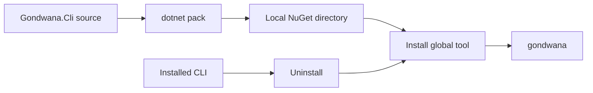
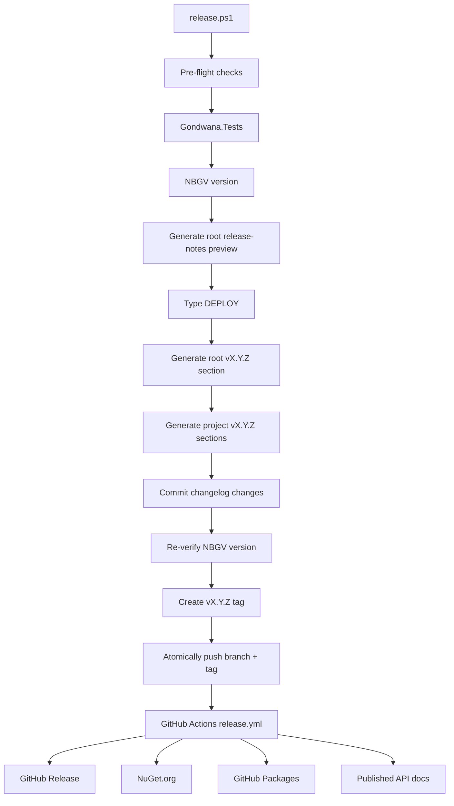

Gondwana includes a small set of PowerShell scripts for repository maintenance, local development, changelog generation, and releases.

They live under:

```text
Tooling/scripts/
├── Changelog-ProjectGroups.ps1
├── Generate-Project-Changelogs.ps1
├── Generate-Root-Changelog.ps1
├── Reinstall-Gondwana-Cli.ps1
├── Reinstall-Gondwana-Templates.ps1
├── Setup-Gondwana-Dev.ps1
└── release.ps1
```

These are **maintainer and contributor tools**. They are not part of the Gondwana runtime and are not required by games that consume Gondwana through NuGet.

Their purpose is to make common repository operations repeatable instead of relying on somebody remembering the right sequence of `dotnet`, Git, NuGet, `git-cliff`, and other commands.

---

## Contents

- [Which script should I use?](#which-script-should-i-use)
- [Running the scripts](#running-the-scripts)
- [Setup-Gondwana-Dev.ps1](#setup-gondwana-devps1)
- [Reinstall-Gondwana-Cli.ps1](#reinstall-gondwana-clips1)
- [Reinstall-Gondwana-Templates.ps1](#reinstall-gondwana-templatesps1)
- [Generate-Project-Changelogs.ps1](#generate-project-changelogsps1)
- [Generate-Root-Changelog.ps1](#generate-root-changelogps1)
- [Changelog-ProjectGroups.ps1](#changelog-projectgroupsps1)
- [release.ps1](#releaseps1)
- [How the release scripts fit together](#how-the-release-scripts-fit-together)
- [Local packages and caching](#local-packages-and-caching)
- [Safety and failure behavior](#safety-and-failure-behavior)
- [Mental model](#mental-model)

---

# Which script should I use?

| Goal | Script |
|---|---|
| Set up a new Gondwana development machine | `Setup-Gondwana-Dev.ps1` |
| Test changes to the `gondwana` CLI locally | `Reinstall-Gondwana-Cli.ps1` |
| Test changes to Gondwana `dotnet new` templates locally | `Reinstall-Gondwana-Templates.ps1` |
| Generate or preview project-specific changelogs | `Generate-Project-Changelogs.ps1` |
| Generate or preview the grouped root changelog | `Generate-Root-Changelog.ps1` |
| Define the project/area groups used by the root changelog | `Changelog-ProjectGroups.ps1` |
| Prepare and start an official Gondwana release | `release.ps1` |

A useful distinction is:

```text
Setup-Gondwana-Dev.ps1
        │
        └── prepares a machine

Reinstall-*.ps1
        │
        └── supports local development

Generate-Project-Changelogs.ps1
        │
        └── maintains per-project changelogs

Generate-Root-Changelog.ps1
        │
        └── maintains the grouped repository changelog

Changelog-ProjectGroups.ps1
        │
        └── supplies shared root-changelog grouping rules

release.ps1
        │
        └── freezes current changelogs into a release and creates the tag
```

`Changelog-ProjectGroups.ps1` is a support file rather than a script a maintainer normally runs directly.

---

# Running the scripts

From the repository root, a script can be invoked with its repository-relative path:

```powershell
.\Tooling\scripts\Setup-Gondwana-Dev.ps1
```

or:

```powershell
.\Tooling\scripts\release.ps1 -PreviewOnly
```

The scripts resolve the Gondwana repository root from their own location, so they do not depend heavily on the shell's current working directory.

That is intentional.

A maintenance script should know where the repository is because of where **the script lives**, rather than assuming the user happened to open PowerShell in exactly the right directory.

Most of the scripts explicitly require PowerShell 5.1 or later.

---

# `Setup-Gondwana-Dev.ps1`

This is the **bootstrap script** for a Gondwana development environment.

Its intended use is:

> Clone Gondwana, run one script, and get the machine as close as possible to ready for development.

It is designed to be **idempotent**: running it again should update, restore, or verify existing tools rather than assuming the machine is empty.

Basic usage:

```powershell
.\Tooling\scripts\Setup-Gondwana-Dev.ps1
```

---

## What it sets up

The script performs thirteen numbered checks or setup operations.

### 1. Git

It first verifies that:

```text
git
```

is available on `PATH`.

Git is a hard prerequisite. If it cannot be found, setup stops.

---

### 2. .NET 8 SDK

The script verifies that a .NET 8 SDK is installed.

On Windows, if it is missing and `winget` is available, the script attempts to install:

```text
Microsoft.DotNet.SDK.8
```

automatically.

On other platforms, it reports that .NET 8 must be installed through the platform's normal package-management mechanism or the .NET installer.

---

### 3. Local .NET tools

Gondwana contains a .NET tool manifest.

The setup script restores those tools using:

```powershell
dotnet tool restore
```

This includes tooling such as Nerdbank.GitVersioning (`nbgv`).

---

### 4. NuGet restore

The complete Gondwana solution is restored in Release configuration with:

```text
EnableWindowsTargeting=true
```

This is important because the solution contains Windows-targeted projects even when some development or CI work occurs outside Windows.

The restore also forces dependency reevaluation rather than simply trusting a potentially stale local cache.

---

### 5. Build

Unless disabled, the script builds:

```text
Gondwana.sln
```

in:

```text
Release
```

configuration.

This turns setup into more than a dependency installer.

It also provides an immediate sanity check:

> Can this machine actually build Gondwana?

To skip this step:

```powershell
.\Tooling\scripts\Setup-Gondwana-Dev.ps1 -SkipBuild
```

---

### 6. Gondwana CLI

The script checks for the global:

```text
Gondwana.Cli
```

.NET tool.

If it is missing, it installs it.

If it already exists, the script attempts to update it.

It also handles the case where the configured package source contains an **older** version than the version already installed. In that situation, setup keeps the newer installed version rather than treating the attempted downgrade as fatal.

The global command provided by the package is:

```text
gondwana
```

---

### 7. Gondwana project templates

The script similarly checks for:

```text
Gondwana.Templates
```

and installs or updates the template package.

These are the templates used by commands such as Gondwana's `dotnet new` project templates.

If a newer local template package is already installed than the configured source provides, setup is intended to preserve the current installation rather than blindly downgrade it.

---

## Optional development dependencies

Steps 8 through 12 can be skipped with:

```powershell
.\Tooling\scripts\Setup-Gondwana-Dev.ps1 -SkipOptional
```

This is useful when only the core repository dependencies are needed.

---

### 8. WebAssembly tools

The script checks for the .NET:

```text
wasm-tools
```

workload.

If missing, it installs it.

If already present, installed workloads are updated.

This supports Gondwana's Blazor/WebAssembly development path.

---

### 9. SDL2

The script checks for SDL2 native binaries used by:

```text
Gondwana.Input.SDL2
```

If SDL2 is not detected, setup prints guidance rather than treating it as a fatal error.

That is because SDL2 is only required when using the SDL2 input package.

---

### 10. LibVLC

The script checks for LibVLC, used by:

```text
Gondwana.Video
```

On Windows, when LibVLC is missing and `winget` is available, setup attempts to install VLC:

```text
VideoLAN.VLC
```

If automatic installation is unavailable or fails, the script reports manual installation guidance.

Again, this is an optional subsystem dependency rather than a requirement for the Gondwana core engine.

---

### 11. `git-cliff`

Gondwana uses:

```text
git-cliff
```

for changelog generation.

Setup verifies that it exists.

On Windows, it can install or update it through:

```text
winget
```

using the `orhun.git-cliff` package.

`git-cliff` is especially important to the release scripts described later on this page.

---

### 12. `butler`

`butler` is itch.io's command-line publishing tool.

If it is missing, the script attempts to download the appropriate current binary from itch.io's Broth CDN.

The script supports platform-specific packages for:

- Windows
- Linux
- macOS

and installs Butler under a user-local itch directory.

Typical locations are:

```text
%LOCALAPPDATA%\itch\butler
```

on Windows and:

```text
~/.itch/butler
```

on Unix-like systems.

The installation directory is added to `PATH` for the **current PowerShell session**.

The script also reminds the developer that it should be added permanently if Butler is expected to be available in future shells.

Authentication is then performed separately with:

```powershell
butler login
```

---

### 13. `gondwana doctor`

Finally, setup runs:

```powershell
gondwana doctor
```

when the command is available.

This provides an end-of-setup health check rather than simply assuming that every preceding installation produced a usable environment.

Conceptually:

```text
install / restore / verify
          ↓
      build Gondwana
          ↓
  check optional tools
          ↓
    gondwana doctor
```

---

## Setup parameters

| Parameter | Purpose |
|---|---|
| `-SkipBuild` | Skip the Release build |
| `-SkipOptional` | Skip WASM, SDL2, LibVLC, git-cliff, and Butler setup |

For a minimal bootstrap:

```powershell
.\Tooling\scripts\Setup-Gondwana-Dev.ps1 -SkipBuild -SkipOptional
```

For a complete development environment:

```powershell
.\Tooling\scripts\Setup-Gondwana-Dev.ps1
```

---

# `Reinstall-Gondwana-Cli.ps1`

This script exists for **local CLI development**.

Normally, installing the Gondwana CLI looks something like:

```powershell
dotnet tool install --global Gondwana.Cli
```

That obtains a package from a configured package source.

That is not what you want while actively editing:

```text
Tooling/Gondwana.Cli
```

because your newest changes have not necessarily been published anywhere.

`Reinstall-Gondwana-Cli.ps1` solves that problem.

---

## What it does

The script:

1. packs the local `Gondwana.Cli` project
2. places the resulting package in a local package directory
3. detects whether `Gondwana.Cli` is currently installed globally
4. uninstalls the existing global tool if necessary
5. clears the cached `gondwana.cli` package
6. installs the newly packed local package globally
7. attempts to display the installed `gondwana --version`

Conceptually:



---

## Why the cache is cleared

NuGet caching is normally a good thing.

During local package development, however, repeatedly producing packages with the **same version number** can cause an older cached package to be reused.

The CLI reinstall script explicitly removes the local cached:

```text
gondwana.cli
```

package before installing.

That helps ensure:

> "Install my local CLI" actually means the CLI that was just packed.

---

## Basic usage

```powershell
.\Tooling\scripts\Reinstall-Gondwana-Cli.ps1
```

The default configuration is:

```text
Release
```

and the default local package directory is:

```text
.local-nuget
```

at the repository root.

---

## Parameters

### `-Configuration`

Select the build configuration used by `dotnet pack`.

For example:

```powershell
.\Tooling\scripts\Reinstall-Gondwana-Cli.ps1 -Configuration Debug
```

---

### `-PackageOutput`

Select another local package directory:

```powershell
.\Tooling\scripts\Reinstall-Gondwana-Cli.ps1 `
    -PackageOutput artifacts\local-tools
```

Relative paths are resolved from the Gondwana repository root.

---

## When to use it

Use this script when changing things such as:

- Gondwana CLI commands
- `gondwana doctor`
- CLI argument handling
- CLI output
- CLI project creation or utility behavior

It is a development loop:

```text
edit CLI
   ↓
run Reinstall-Gondwana-Cli.ps1
   ↓
run gondwana ...
   ↓
inspect result
   ↓
edit again
```

No public NuGet release is required.

---

# `Reinstall-Gondwana-Templates.ps1`

This is the template equivalent of the CLI reinstall script.

It exists for development of:

```text
Tooling/Gondwana.Templates
```

without publishing a new template package first.

---

## What it does

The script:

1. packs `Gondwana.Templates`
2. identifies the exact `.nupkg` it just produced
3. determines that package's version
4. detects and uninstalls any currently installed `Gondwana.Templates`
5. creates an isolated temporary NuGet package cache
6. installs the freshly packed package directly
7. verifies the installed template package
8. lists available Gondwana templates
9. restores the caller's original `NUGET_PACKAGES` environment
10. removes its temporary cache

The temporary cache is particularly important.

It isolates the reinstall operation from whatever versions NuGet may already have stored globally.

---

## Basic usage

```powershell
.\Tooling\scripts\Reinstall-Gondwana-Templates.ps1
```

After installation, the script runs the equivalent of:

```powershell
dotnet new list gondwana
```

so the developer can immediately see the Gondwana templates currently registered with the .NET template system.

---

## Parameters

The same two main development parameters are available as the CLI script.

### Configuration

```powershell
.\Tooling\scripts\Reinstall-Gondwana-Templates.ps1 `
    -Configuration Debug
```

### Package output

```powershell
.\Tooling\scripts\Reinstall-Gondwana-Templates.ps1 `
    -PackageOutput artifacts\local-templates
```

The default package directory is again:

```text
.local-nuget
```

---

## CLI reinstall vs template reinstall

They solve similar problems but target two different .NET mechanisms.

| Script | Installation mechanism |
|---|---|
| `Reinstall-Gondwana-Cli.ps1` | `dotnet tool` |
| `Reinstall-Gondwana-Templates.ps1` | `dotnet new` |

The CLI becomes a command:

```text
gondwana
```

The templates become entries available to:

```text
dotnet new
```

---

# `Generate-Project-Changelogs.ps1`

Gondwana is a repository containing many separately meaningful projects.

A root changelog answers:

> What changed in Gondwana as a whole?

But somebody consuming only:

```text
Gondwana.WinForms
```

may instead want to know:

> What changed in Gondwana.WinForms?

`Generate-Project-Changelogs.ps1` creates and maintains those project-specific histories.

---

## `git-cliff`

The script uses:

```text
git-cliff
```

with Gondwana's repository-level:

```text
cliff.toml
```

configuration.

Each project is processed with an `--include-path` filter.

Conceptually:

```text
all repository commits
          │
          ├── touched Gondwana/** ?
          │       └── Gondwana/CHANGELOG.md
          │
          ├── touched Gondwana.Widgets/** ?
          │       └── Gondwana.Widgets/CHANGELOG.md
          │
          └── touched Gondwana.WinForms/** ?
                  └── Gondwana.WinForms/CHANGELOG.md
```

---

## One commit may appear more than once

This is intentional.

Suppose a commit changes both:

```text
Gondwana/**
```

and:

```text
Gondwana.WinForms/**
```

That commit may legitimately appear in both project changelogs.

This is not duplication in the bookkeeping sense.

Each changelog answers a different question:

> Did this change affect this project?

For both projects, the answer is yes.

---

## Default projects

The script contains a default project list covering Gondwana library and tooling projects.

Demos and test-only projects are intentionally excluded from per-project changelog generation.

The repository-level `CHANGELOG.md` remains the canonical repository-wide history, while the project changelogs provide package- and component-specific views of the same Git history.

---

## Released history vs generated current state

`Generate-Project-Changelogs.ps1` treats **released history in an existing changelog as authoritative** and the current development section as **generated state**.

When a project has no `CHANGELOG.md` yet, or the file is empty, the script bootstraps the complete project history from Git:

```text
no CHANGELOG.md
      ↓
generate complete tagged history
      +
generate current untagged changes
      ↓
create CHANGELOG.md
```

Without `-Tag`, the current commits appear under:

```markdown
# [Unreleased]
```

If `-Tag vX.Y.Z` is supplied during bootstrap, those current commits are written under that version instead, while older Git tags remain as historical version sections.

For an existing changelog, the script does **not** regenerate released sections. It removes only a leading `[Unreleased]` section, regenerates the current commit range from Git, and joins that generated section back to the untouched released history:

```text
existing CHANGELOG.md
      ↓
preserve released history exactly
      ↓
remove leading [Unreleased]
      ↓
regenerate commits since latest tag
      ↓
insert fresh [Unreleased] or -Tag section
```

This makes normal `[Unreleased]` refreshes idempotent: running the generator repeatedly against unchanged Git history should produce the same changelog rather than stacking duplicate current sections.

---

## Previewing changes

The safest way to inspect what the script would generate is:

```powershell
.\Tooling\scripts\Generate-Project-Changelogs.ps1 -PreviewOnly
```

`-PreviewOnly` prints the complete resulting changelogs and does not modify files on disk.

---

## Generating unreleased changelogs

Unreleased generation is the script's normal behavior. There is no caller-facing `-Unreleased` switch.

To refresh the current project changelogs:

```powershell
.\Tooling\scripts\Generate-Project-Changelogs.ps1
```

For each existing project changelog, the leading `[Unreleased]` section is regenerated from commits since the latest Git tag while released history remains untouched.

---

## Generating for a release tag

A version can be supplied explicitly:

```powershell
.\Tooling\scripts\Generate-Project-Changelogs.ps1 -Tag v1.2.3
```

When `-Tag` is supplied, the current unreleased commit range is written under that release version rather than `[Unreleased]`.

`release.ps1` uses this behavior when preparing an official Gondwana release.

---

## Limiting the project set

For development or testing, a subset can be requested:

```powershell
.\Tooling\scripts\Generate-Project-Changelogs.ps1 `
    -Projects @(
        "Gondwana",
        "Gondwana.WinForms"
    )
```

---

## Parameters

| Parameter | Purpose |
|---|---|
| `-Tag` | Stamp the current unreleased commits with a version such as `v1.2.3` |
| `-PreviewOnly` | Print the complete resulting changelogs without changing files |
| `-Projects` | Override the default project list |
| `-CliffConfigPath` | Use a different `cliff.toml` configuration |

The script writes generated content through temporary files. A failed `git-cliff` invocation therefore does not need to overwrite an existing project changelog first.

If any `git-cliff` operations fail, the script collects the failed project names and reports them when processing finishes.

---

# `Generate-Root-Changelog.ps1`

The root changelog has a different job from an individual project changelog.

It answers:

> What has changed across Gondwana as a repository, organized by project or repository area?

`Generate-Root-Changelog.ps1` maintains the leading derived section of the canonical root:

```text
CHANGELOG.md
```

while preserving all existing released history.

---

## Grouped root output

The root generator loads its project and repository-area definitions from:

```text
Tooling/scripts/Changelog-ProjectGroups.ps1
```

It then asks `git-cliff` for the current commits matching each group's include paths.

The result is grouped beneath the current release heading:

```markdown
# [Unreleased]

## Gondwana

### Added
- ...

## Gondwana.WinForms

### Fixed
- ...

## Build / Repository

### Maintenance
- ...
```

A commit may intentionally appear under multiple groups when it changes multiple areas.

---

## Refreshing the root `[Unreleased]` section

Normal usage is:

```powershell
.\Tooling\scripts\Generate-Root-Changelog.ps1
```

The script:

1. reads the existing root `CHANGELOG.md`
2. generates the grouped current commit range since the latest Git tag
3. replaces any leading `[Unreleased]` section
4. preserves the existing versioned release history

Conceptually:

```text
existing root CHANGELOG.md
        ↓
preserve released history
        ↓
regenerate grouped current range
        ↓
replace leading [Unreleased]
```

Unlike the project generator, the root generator deliberately does **not** bootstrap a missing changelog. The canonical root `CHANGELOG.md` must already exist and contain a recognized `[Unreleased]` or versioned release heading.

---

## Previewing the root changelog

To preview the complete resulting file without writing it:

```powershell
.\Tooling\scripts\Generate-Root-Changelog.ps1 -PreviewOnly
```

For release orchestration, `release.ps1` also uses the internal:

```text
-SectionOnly
```

mode to obtain only the generated current section for the pre-deployment release-notes preview.

---

## Converting the root section to a release

Supplying a tag converts the current grouped range into a versioned release section:

```powershell
.\Tooling\scripts\Generate-Root-Changelog.ps1 -Tag v1.2.3
```

The heading becomes conceptually:

```markdown
# [v1.2.3] - 2026-09-01
```

and the grouped project/area structure remains the same.

When a previous tag exists, a tagged root section also includes a GitHub comparison link for the full changelog range.

---

## Root changelog parameters

| Parameter | Purpose |
|---|---|
| `-Tag` | Stamp the generated current section with a release version |
| `-PreviewOnly` | Print the complete resulting root changelog without modifying it |
| `-SectionOnly` | Return only the generated current section; used internally by `release.ps1` |
| `-ChangelogPath` | Use a different root changelog path |
| `-CliffConfigPath` | Use a different `cliff.toml` configuration |

---

# `Changelog-ProjectGroups.ps1`

`Changelog-ProjectGroups.ps1` is a shared support file for grouped root changelog generation.

It defines:

```text
project / area name
        +
one or more git-cliff include paths
```

for entries such as:

- Gondwana
- audio packages
- Avalonia
- Blazor
- hosting
- SDL2 input
- video
- widgets
- WinForms
- CLI, MCP, templates, Studio, and other tooling
- Build / Repository

The `Build / Repository` group includes repository infrastructure such as GitHub workflows, `Tooling/scripts`, shared build files, versioning files, solution files, and the repository README.

The file is dot-sourced by `Generate-Root-Changelog.ps1`; it is **not intended to be run directly**.

Keeping the group definitions in one place matters because both running `[Unreleased]` generation and tagged release generation must use the same grouping rules.

---

# `release.ps1`

`release.ps1` is the **local release orchestrator**.

It is deliberately more conservative than the development scripts because running it can lead to packages being published publicly.

The critical distinction is:

> `release.ps1` prepares and pushes the release tag.

It does **not** directly publish Gondwana to NuGet.

Pushing the version tag triggers Gondwana's GitHub Actions `release.yml` workflow, which performs the actual remote release build and publication.

---

## Release architecture



The local script and the GitHub workflow therefore form two halves of one release system.

The atomic push is important: the versioned changelog commit and its Git tag are published to the remote as one transaction. If either ref is rejected, neither remote ref is updated.

---

## Pre-flight checks

Before allowing a normal release, the script verifies several conditions.

These include:

- Git is installed
- .NET is installed
- `nbgv` is installed
- `git-cliff` is installed
- `cliff.toml` exists
- the current directory belongs to a Git repository
- the required release branch is checked out
- local repository state has been refreshed from the remote
- local `master` matches remote `master`
- there are no unstaged changes
- there are no staged-but-uncommitted changes

By default, the required branch is:

```text
master
```

and the remote is:

```text
origin
```

---

## Tests happen before release preparation

Before creating the release, the script runs:

```text
Testing/Gondwana.Tests/Gondwana.Tests.csproj
```

in Release configuration.

If the tests fail:

```text
release stops
```

There is no "publish it anyway" path built into the normal script.

That is exactly where a release script should be stubborn.

---

## Versioning with NBGV

The script asks Nerdbank.GitVersioning for:

```text
NuGetPackageVersion
```

and constructs the Git tag from that version.

For example:

```text
NuGetPackageVersion = 1.4.2
              ↓
          v1.4.2
```

The release version is therefore derived from the repository's versioning configuration rather than being manually typed into the release command.

---

# Release changelogs

The root release section is generated by:

```text
Generate-Root-Changelog.ps1
```

using the shared groups defined in:

```text
Changelog-ProjectGroups.ps1
```

It organizes changes by project or repository area, including sections such as:

- Gondwana
- audio projects
- Avalonia
- Blazor
- hosting
- SDL2 input
- video
- widgets
- WinForms
- tooling projects
- build/repository changes

Each group asks `git-cliff` for changes touching the paths assigned to that group.

Groups are deliberately allowed to overlap.

A commit affecting two components can belong under both component headings.

The same root generator and group definitions are used for both the running `[Unreleased]` section and the eventual tagged release section. This prevents development-time and release-time changelog grouping from drifting apart.

---

## Heading adjustment

`git-cliff` generates category headings of its own.

Because `release.ps1` places those beneath project headings, it demotes the generated Markdown headings by one level.

Conceptually:

```markdown
## Gondwana.WinForms

### Added

### Fixed
```

rather than having the project's heading and the changelog category compete at the same Markdown level.

---

## Full changelog link

When a previous release tag exists, the generated root section ends with a comparison link conceptually equivalent to:

```text
previous tag ... new tag
```

on GitHub.

That provides a direct path from the human-readable changelog to the complete Git diff.

---

# Preview mode

Before doing a real release, use:

```powershell
.\Tooling\scripts\release.ps1 -PreviewOnly
```

Preview mode still performs meaningful validation and changelog generation so the proposed release can be inspected.

But it does **not**:

- write the changelogs
- create a changelog commit
- create a Git tag
- push anything
- trigger deployment

This should normally be the first release command run.

---

# Hard deployment confirmation

A real release requires an explicit confirmation.

The script asks the maintainer to type:

```text
DEPLOY
```

exactly.

Anything else cancels the operation.

That is intentionally harder to trigger than a simple `Y`.

The command sits immediately before operations that can ultimately result in an immutable public NuGet release.

---

# Root and project changelogs

After confirmation, `release.ps1` invokes both changelog generators with the resolved version tag.

First:

```text
Generate-Root-Changelog.ps1 -Tag vX.Y.Z
```

replaces the root `[Unreleased]` block with the grouped versioned release section.

Then:

```text
Generate-Project-Changelogs.ps1 -Tag vX.Y.Z
```

replaces each project's running `[Unreleased]` section with its project-specific versioned release section.

The root and project changelogs therefore provide complementary views:

```text
root CHANGELOG.md
    └── canonical repository-wide grouped history

project CHANGELOG.md files
    └── project/package-specific histories
```

The script stages the root changelog and discovered project changelogs, then creates a commit with a message of the form:

```text
docs: update changelog for vX.Y.Z
```

If generation produces no changelog changes, no changelog commit is created.

The release commit is **not pushed by itself**. The branch update and release tag are pushed together later as one atomic Git operation.

---

## Version verification after the changelog commit

After committing the changelog, the script asks NBGV for the version **again**.

The value is expected to remain unchanged.

If the changelog commit unexpectedly changes the calculated version, the script aborts before tagging.

This protects against releasing:

```text
version calculated before commit
```

while the actual tag points at a commit whose calculated version is something different.

---

# Tag handling

The final local release operation is the version tag.

The tag follows:

```text
v<version>
```

For example:

```text
v1.4.2
```

Before creating it, the script refreshes local knowledge of remote tags and checks both local and remote state.

If the same version tag already exists, the script recreates the local tag at the current release commit and uses a forced tag refspec when the remote tag must be replaced.

The branch and tag are then pushed together with an atomic Git push:

```text
release commit at HEAD
        +
vX.Y.Z tag at HEAD
        ↓
git push --atomic
```

If either ref update is rejected, the remote branch and remote tag are both left unchanged. This prevents a versioned changelog commit from reaching `master` without its corresponding release tag, or vice versa.

Once the atomic push succeeds:

```text
GitHub receives vX.Y.Z
        ↓
.github/workflows/release.yml runs
```

At that point, publication is handed off to GitHub Actions.

---

## Release parameters

| Parameter | Default | Purpose |
|---|---|---|
| `-Remote` | `origin` | Git remote used for synchronization and push |
| `-RequiredBranch` | `master` | Branch required for a normal release |
| `-ChangelogPath` | `CHANGELOG.md` | Root changelog location |
| `-CliffConfigPath` | `cliff.toml` | `git-cliff` configuration |
| `-PreviewOnly` | off | Validate and preview without deployment |

For almost all normal Gondwana releases, the intended sequence is simply:

```powershell
.\Tooling\scripts\release.ps1 -PreviewOnly
```

inspect the result, then:

```powershell
.\Tooling\scripts\release.ps1
```

and type:

```text
DEPLOY
```

when satisfied.

---

# How the release scripts fit together

Gondwana's changelog/release system now has several cooperating pieces:

```text
Changelog-ProjectGroups.ps1
Generate-Root-Changelog.ps1
Generate-Project-Changelogs.ps1
.github/workflows/changelog-master.yml
release.ps1
.github/workflows/release.yml
```

Their responsibilities are deliberately separated.

### `Changelog-ProjectGroups.ps1`

Answers:

> Which project and repository areas should appear in the grouped root changelog, and which paths belong to each one?

It provides shared grouping configuration and is not run directly.

### `Generate-Root-Changelog.ps1`

Answers:

> What changed across Gondwana as a whole since the latest tag?

It maintains the grouped root `[Unreleased]` section during development and converts that same current range into a versioned root release section when `-Tag` is supplied.

### `Generate-Project-Changelogs.ps1`

Answers:

> What changed in each individual project?

It maintains the corresponding project changelogs, preserving released history and regenerating the current development range.

### GitHub Actions `changelog-master.yml`

Answers:

> New development changes reached `master`. Do the running changelogs need to be refreshed?

After a non-changelog push to `master`, it runs both changelog generators.

If the generated files changed, the workflow opens or updates an automation pull request on:

```text
automation/update-changelogs
```

containing only `CHANGELOG.md` files and enables auto-merge for that PR.

Changelog-only pushes are ignored, which prevents the automation from recursively triggering itself. The update job is also concurrency-grouped so a newer master update can supersede an older in-progress changelog refresh.

The same workflow also validates changelog behavior on relevant pull requests, including preview safety, idempotence, root grouping, missing project changelog bootstrap, and tagged generation.

### `release.ps1`

Answers:

> Is the repository ready to release, what version is it, and what release tag should be pushed?

It performs local validation, previews the root release notes, freezes root and project current sections under the NBGV-derived version, commits them, creates the tag, and atomically pushes the branch and tag.

### GitHub Actions `release.yml`

Answers:

> A release tag now exists. How do we build and publish it?

It performs the remote release build and publication.

During normal development:

```text
commit reaches master
       ↓
changelog-master.yml
       ↓
Generate-Root-Changelog.ps1
       +
Generate-Project-Changelogs.ps1
       ↓
automation changelog PR
       ↓
auto-merge
       ↓
root + project [Unreleased] sections stay current
```

During a release:

```text
release.ps1
    ├── root vX.Y.Z section
    ├── project vX.Y.Z sections
    ├── changelog commit
    └── vX.Y.Z tag
             ↓
       atomic push
             ↓
        release.yml
             ├── GitHub Release
             ├── NuGet
             ├── GitHub Packages
             └── API documentation
```

The central distinction is:

```text
normal development → refresh derived [Unreleased] state
release            → freeze that state into vX.Y.Z and publish it
```

---

# Local packages and caching

The two `Reinstall-*` scripts exist partly because package caches are designed for released packages, not rapid iteration.

Normally:

```text
package ID + package version
```

should uniquely identify package contents.

During development, however, it is convenient to repeatedly build:

```text
Gondwana.Cli 1.2.3
```

without incrementing the version after every edit.

That creates a problem:

```text
same package ID
+ same version
+ different local contents
```

NuGet may reasonably assume it already has that package.

The development scripts therefore take explicit measures to avoid stale package reuse.

The CLI script clears the cached CLI package before reinstalling.

The template script goes further and temporarily points:

```text
NUGET_PACKAGES
```

at an isolated temporary directory.

After installation, it restores the previous environment and deletes the temporary cache.

This behavior is development-specific.

Published package versions should remain immutable.

---

# Safety and failure behavior

These scripts generally use:

```powershell
$ErrorActionPreference = 'Stop'
```

and command wrappers that inspect:

```text
$LASTEXITCODE
```

for external programs.

That means failures are intended to stop the operation rather than quietly allowing later steps to continue from an invalid state.

This is particularly important for:

- builds
- tests
- Git operations
- package installation
- changelog generation
- releases

---

## Development scripts are relatively disposable

The reinstall scripts modify local developer state:

```text
global .NET tool installation
template installation
local package caches
```

If something goes wrong, the operation can normally be repeated.

---

## Release operations are not disposable

A release can ultimately create:

- Git commits
- remote Git tags
- GitHub Releases
- NuGet packages

A published NuGet package version cannot simply be overwritten with different contents later.

For that reason:

```text
release.ps1
```

contains substantially more validation and confirmation than the local development scripts.

Use:

```powershell
-PreviewOnly
```

before a real deployment.

---

# Mental model

The scripts fall into three main layers, with GitHub Actions automating the changelog and publication boundaries.

```text
DEVELOPMENT ENVIRONMENT
└── Setup-Gondwana-Dev.ps1
        prepares the machine

LOCAL ITERATION
├── Reinstall-Gondwana-Cli.ps1
└── Reinstall-Gondwana-Templates.ps1
        test unpublished local packages

CHANGELOG / RELEASE MANAGEMENT
├── Changelog-ProjectGroups.ps1
│       defines root changelog grouping
├── Generate-Root-Changelog.ps1
│       maintains repository-wide history
├── Generate-Project-Changelogs.ps1
│       maintains project-specific history
└── release.ps1
        freezes current history into a version and starts deployment
```

Around those scripts, GitHub Actions provides two automation boundaries:

```text
master commit
    ↓
changelog-master.yml
    ↓
refresh root + project [Unreleased]
    ↓
automation PR / auto-merge

release tag
    ↓
release.yml
    ↓
build and publish the release
```

Or, even more simply:

> **Setup** prepares the developer.  
> **Reinstall** scripts test local tooling.  
> **Changelog** keeps current development history derived from Git.  
> **Release** freezes that history into a versioned deployment.

None of these scripts are required to run a Gondwana game.

They exist to make development and release engineering around the engine predictable, repeatable, and considerably less dependent on somebody remembering seventeen shell commands in exactly the right order.
