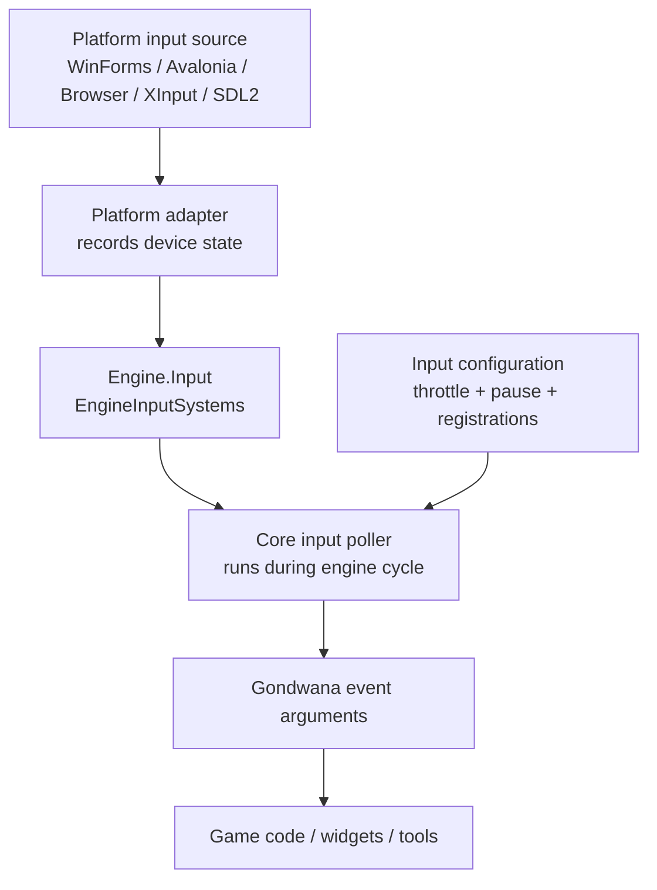
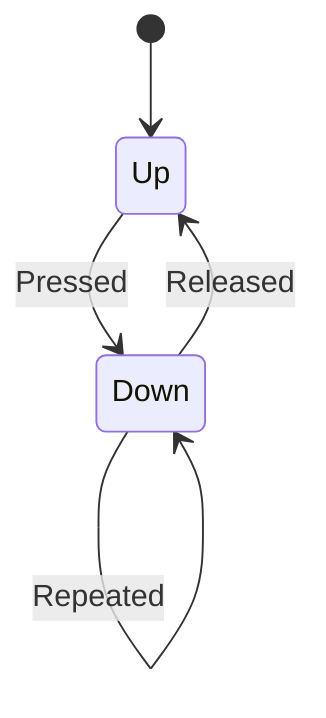

> A technical guide to the architecture, engine-cycle integration, and device-specific behavior of the `Gondwana.Input` namespace.

---

## Contents

- [What This Page Covers](#what-this-page-covers)
- [The Core Mental Model](#the-core-mental-model)
- [Architecture at a Glance](#architecture-at-a-glance)
- [The Four Layers of Input](#the-four-layers-of-input)
- [Engine.Input](#engineinput)
- [The Engine Cycle](#the-engine-cycle)
- [Common Event Configuration](#common-event-configuration)
- [Keyboard Architecture](#keyboard-architecture)
- [Mouse Architecture](#mouse-architecture)
- [Gamepad Architecture](#gamepad-architecture)
- [Touch Architecture](#touch-architecture)
- [Gesture Recognition](#gesture-recognition)
- [Platform Adapters](#platform-adapters)
- [GameHost Lifecycle Integration](#gamehost-lifecycle-integration)
- [Threading and State Ownership](#threading-and-state-ownership)
- [Polling, Events, and Continuous State](#polling-events-and-continuous-state)
- [Pausing and Reconfiguring Input](#pausing-and-reconfiguring-input)
- [Input and Widgets](#input-and-widgets)
- [Designing Game-Specific Bindings](#designing-game-specific-bindings)
- [Common Mistakes](#common-mistakes)
- [Troubleshooting](#troubleshooting)
- [Quick Reference](#quick-reference)
- [Glossary](#glossary)
- [Related Source Files](#related-source-files)
- [Where to Read Next](#where-to-read-next)
- [Final Mental Model](#final-mental-model)

---

# What This Page Covers

Gondwana input is built around one consistent idea:

> Platform code collects device state; the engine polls that state; core pollers translate it into stable Gondwana events.

The `Gondwana.Input` namespace defines the platform-neutral contracts and pollers for four input families:

| Input family | Core adapter contract | Core poller |
|---|---|---|
| Keyboard | `IKeyboardAdapter` | `KeyboardEventPoller` |
| Mouse | `IMouseAdapter` | `MouseEventPoller` |
| Gamepad | `IGamepadAdapter` and `IGamepadManager<T>` | `GamepadEventPoller` |
| Touch | `ITouchAdapter` and `ITouchInput` | `TouchEventPoller` |

The platform packages provide concrete adapters:

- `Gondwana.WinForms`
- `Gondwana.Avalonia`
- `Gondwana.Blazor`
- `Gondwana.Input.SDL2`
- XInput support in `Gondwana.WinForms`

This page explains both the common architecture and the places where the four device families intentionally differ.

---

# The Core Mental Model

A Gondwana input device is not normally consumed directly by game code.

Instead, input flows through these stages:

```text
Platform event or native device API
        ↓
Platform adapter records current state
        ↓
Engine input poller reads that state
        ↓
Poller detects transitions or configured conditions
        ↓
Gondwana event is raised
        ↓
Game code responds
```

That division keeps the engine core independent of WinForms, Avalonia, browser DOM events, XInput, SDL2, and other platform APIs.

The adapter answers questions such as:

- Is this key currently down?
- Which mouse buttons are currently down?
- Where is the pointer?
- Which controller buttons are pressed?
- Which touch contacts are active?

The poller adds engine behavior:

- transition detection
- event throttling
- pause state
- explicit registration
- normalized event arguments
- engine-thread delivery
- gesture recognition for touch

---

# Architecture at a Glance



The core is deliberately device-neutral. The platform edge is deliberately device-specific.

---

# The Four Layers of Input

## 1. Platform source

This is the native mechanism that knows about physical or browser input.

Examples:

- WinForms window messages
- Avalonia pointer and keyboard events
- browser keyboard, pointer, and touch events
- XInput controller state
- SDL2 game-controller state

## 2. Adapter

An adapter converts platform-specific state into a small Gondwana interface.

Examples:

```csharp
public interface IKeyboardAdapter
{
    bool IsDown(int keyCode);
    KeyboardModifierState CurrentKeyboardModifiers { get; }
}
```

```csharp
public interface IMouseAdapter
{
    Point CurrentPosition { get; }
    HashSet<MouseButton> PressedButtons { get; }
    KeyboardModifierState CurrentKeyboardModifiers { get; }
    int ScrollDelta { get; }
}
```

Adapters are intentionally thin. They are not where game rules belong.

## 3. Poller

A poller runs as part of Gondwana's engine cycle and interprets adapter state.

Depending on the device, it may:

- compare current and previous state
- detect presses and releases
- enforce registration rules
- throttle repeated events
- package state into event arguments
- feed gesture recognizers

## 4. Consumer

The final consumer can be:

- game logic
- a camera controller
- a menu
- a debug tool
- a widget
- a game-specific input-binding layer

Game code normally subscribes to the poller exposed through `Engine.Input`.

---

# `Engine.Input`

`Engine.Input` is an `EngineInputSystems` instance and is the central gateway to all configured input subsystems.

```csharp
var input = Engine.Instance.Input;

var keyboard = input.KeyboardEventPoller;
var mouse = input.MouseEventPoller;
var gamepads = input.GamepadManager;
var gamepadEvents = input.GamepadEventPoller;
var touch = input.TouchEventPoller;
```

Its responsibilities are intentionally small:

- expose initialized pollers
- own the selected gamepad manager
- initialize the gamepad poller when a manager is assigned
- initialize or reset touch input when `TouchAdapter` changes

It does not interpret game actions such as **Jump**, **Open Inventory**, or **Select Unit**. Those remain game-specific.

---

# The Engine Cycle

Input polling occurs in `Engine.DoBackgroundTasks()`.

The current order is:

```text
Pre-cycle timers
    ↓
Keyboard polling
    ↓
Mouse polling
    ↓
Touch polling
    ↓
Gamepad button-event polling
    ↓
Animation
    ↓
Sprite movement
    ↓
Collision resolution
    ↓
Camera/view updates
```

This ordering has a useful consequence:

> Input handlers can modify movement, camera targets, gameplay state, or scene objects before movement and collision work occurs for that cycle.

The engine polls the four input event systems with the same high-resolution `tick` value:

```csharp
KeyboardEventPoller.Instance?.PollForEvents(tick);
MouseEventPoller.Instance?.PollForEvents(tick);
TouchEventPoller.Instance?.PollForEvents(tick);
GamepadEventPoller.Instance?.PollForEvents(tick);
```

Gamepad device state has one additional layer: the active `IGamepadManager` refreshes connected adapters during foreground processing. The event poller consumes the latest state stored by those adapters.

## Why adapters and pollers are separate

A native input event may occur on a UI thread at any time. Gondwana does not run arbitrary game code directly from every native callback.

Instead:

1. The adapter records state.
2. The engine reaches its next input-polling phase.
3. The poller raises a Gondwana event in engine-cycle order.

This gives game logic a predictable place in the runtime pipeline.

---

# Common Event Configuration

Keyboard, mouse, gamepad, and touch configurations derive from `InputEventConfigurationBase`.

That base class supplies:

```csharp
public double TimeBetweenEvents { get; set; }
public bool IsPaused { get; set; }
```

Internally, it tracks the last event tick and determines whether the configured interval has elapsed.

The engine-wide defaults are:

| Setting | Default |
|---|---:|
| `TimeBetweenKeyboardEvents` | `0.03` seconds |
| `TimeBetweenMouseEvents` | `0.03` seconds |
| `TimeBetweenGamepadEvents` | `0.03` seconds |
| `TimeBetweenTouchEvents` | `0.03` seconds |

A negative `timeBetweenEvents` argument generally means:

> Use the corresponding value from `Engine.Configuration`.

A value of `0` means:

> Do not add interval-based throttling.

## Throttling is device-specific

The shared configuration mechanism does **not** mean every device applies throttling identically.

| Device | What is throttled |
|---|---|
| Keyboard | Held-key `Repeated` events |
| Mouse | The consolidated mouse poll/event stream |
| Gamepad | Repeated button-down events while held |
| Touch | Movement events only; lifecycle transitions are preserved |

That distinction matters when choosing configuration values.

---

# Keyboard Architecture

## Adapter contract

`IKeyboardAdapter` exposes two things:

```csharp
bool IsDown(int keyCode);
KeyboardModifierState CurrentKeyboardModifiers { get; }
```

A key code is an integer whose meaning is agreed upon by the platform adapter and the game.

Examples:

- WinForms: `(int)System.Windows.Forms.Keys.A`
- Avalonia: `(int)Avalonia.Input.Key.A`
- Blazor: `(int)BlazorKey.KeyA`

The core engine does not impose one universal keyboard enumeration.

## Explicit monitoring

Keyboard input is opt-in per key.

```csharp
keyboard.StartMonitoringKey(
    keyCode: (int)Keys.A,
    displayName: nameof(Keys.A));
```

Only registered keys are checked by `KeyboardEventPoller`.

This keeps the hot path small and makes each game's active bindings explicit.

## Keyboard transitions

For every monitored key, the poller compares current and previous state.



The event exposes a `KeyAction`:

```csharp
public enum KeyAction
{
    Pressed,
    Released,
    Repeated
}
```

Typical usage:

```csharp
private void OnKeyDown(KeyDownEventArgs e)
{
    switch (e.KeyAction)
    {
        case KeyAction.Pressed:
            // One-time action.
            break;

        case KeyAction.Repeated:
            // Held-key action.
            break;

        case KeyAction.Released:
            // Stop or finalize an action.
            break;
    }
}
```

## Display names matter

`StartMonitoringKey()` accepts both a numeric code and an optional display name.

```csharp
keyboard.StartMonitoringKey(
    (int)Keys.A,
    nameof(Keys.A));
```

The event exposes the configured display value through:

```csharp
e.KeyConfig.Key
```

When no display name is supplied, the poller falls back to the numeric code converted to text. Therefore, supply a display name when handlers need human-readable key identity.

## Modifier keys

`KeyDownEventArgs` includes:

```csharp
e.Modifiers
e.IsShift
e.IsCtrl
e.IsAlt
```

Example:

```csharp
if (e.KeyAction == KeyAction.Pressed &&
    e.KeyConfig.Key == nameof(Keys.S) &&
    e.IsCtrl)
{
    SaveGame();
}
```

## Thread-safe registration

Keyboard monitoring changes are queued and applied on the engine thread.

Calls such as:

```csharp
keyboard.StartMonitoringKey(...);
keyboard.StopMonitoringKey(...);
keyboard.StopMonitoringAllKeys();
```

do not directly mutate the poller's hot-path dictionaries from an arbitrary caller thread.

## Keyboard pause behavior

`PauseAllKeyEvents` is the global stop switch:

```csharp
keyboard.PauseAllKeyEvents = true;
```

Per-key `KeyEventConfiguration.IsPaused` currently gates held-key repeat generation. For complete suppression of a key, use one of these:

```csharp
keyboard.StopMonitoringKey(keyCode);
```

or:

```csharp
keyboard.PauseAllKeyEvents = true;
```

That distinction is worth remembering when implementing modal input modes.

---

# Mouse Architecture

## Adapter contract

`IMouseAdapter` supplies a complete mouse-state snapshot:

```csharp
Point CurrentPosition { get; }
HashSet<MouseButton> PressedButtons { get; }
KeyboardModifierState CurrentKeyboardModifiers { get; }
int ScrollDelta { get; }
```

The core mouse buttons are:

```csharp
MouseButton.Left
MouseButton.Right
MouseButton.Middle
```

## One consolidated event

Unlike keyboard and gamepad input, mouse input does not require button-by-button registration.

The poller raises one event:

```csharp
mouse.MouseEvent += OnMouseEvent;
```

That event contains:

- current and previous cursor position
- all button states
- press and release transitions
- scroll delta
- modifier keys
- the engine tick

## Button state model

Each button has:

```csharp
public struct MouseButtonState
{
    public bool IsDown;
    public bool JustPressed;
    public bool JustReleased;
}
```

Convenience properties make common checks compact:

```csharp
e.LeftButtonDown
e.LeftButtonJustPressed
e.LeftButtonJustReleased

e.RightButtonDown
e.RightButtonJustPressed
e.RightButtonJustReleased
```

Generic helpers are available too:

```csharp
e.IsButtonDown(MouseButton.Middle);
e.IsButtonJustPressed(MouseButton.Middle);
e.IsButtonJustReleased(MouseButton.Middle);
```

## When a mouse event is emitted

The poller raises an event when at least one of these is true:

- a button changed state
- the pointer moved and movement tracking is enabled
- the wheel produced a nonzero changed delta
- any button remains held

This supports clicks, drags, hover tracking, and continuous held-button behavior through one payload.

## Movement tracking

Configure mouse monitoring with:

```csharp
mouse.StartMonitoringMouse(
    trackMouseMovement: true,
    timeBetweenEvents: -1,
    isPaused: false);
```

Set `trackMouseMovement: false` when hover or free pointer movement is not needed.

## Coordinates

Mouse positions are client or render-surface coordinates supplied by the platform adapter.

For world interaction, convert through a `View`:

```csharp
var view = RenderSurface.Host.ViewManager.Views[0];
var layer = Scene![0];

var worldPx = view.ScreenPxToWorldPx(
    layer,
    e.CurrentPosition);
```

For tile picking:

```csharp
var grid = view.ScreenPxToGrid(
    layer,
    e.CurrentPosition);
```

The mouse system itself does not know which view or scene layer the game intends to target.

---

# Gamepad Architecture

Gamepad input has one extra abstraction because multiple controllers may be connected.

```text
IGamepadManager
    └── ConnectedAdapters
            ├── IGamepadAdapter
            ├── IGamepadAdapter
            └── ...
```

## Gamepad manager

`IGamepadManager<T>` owns discovery and state refresh:

```csharp
IReadOnlyCollection<T> ConnectedAdapters { get; }
void Update();
```

Concrete managers include:

- `XInputGamepadManager` on Windows
- `SdlGamepadManager` for cross-platform SDL2 input

Assigning a manager through `Engine.Input.GamepadManager` also initializes `GamepadEventPoller` against its adapter collection.

## Gamepad adapter

Each `IGamepadAdapter` exposes:

```csharp
string GamepadId { get; }
IReadOnlyCollection<string> PressedButtons { get; }

GamepadStickState? LeftStick { get; }
GamepadStickState? RightStick { get; }

float LeftTrigger { get; }
float RightTrigger { get; }
```

Buttons are strings because native naming differs between backends.

Examples:

| Backend | Example A-button name |
|---|---|
| XInput | `"A"` |
| SDL2 | `"SDL_CONTROLLER_BUTTON_A"` |

Do not assume button names are portable without a game-specific mapping layer.

## Button monitoring

Gamepad buttons are registered per controller ID:

```csharp
poller.StartMonitoringButton(
    gamepadId,
    button: "A");
```

The event supplies both the button configuration and the originating adapter:

```csharp
private void OnButtonDown(GamepadButtonDownEventArgs e)
{
    string button = e.Config.Button;
    string controller = e.Adapter.GamepadId;
}
```

## Button-down means held-compatible

`GamepadEventPoller.ButtonDown` is not an edge-only event.

While a monitored button remains in `PressedButtons`, it can fire again whenever the configured throttle interval permits.

This is useful for:

- menu navigation repeat
- continuous firing
- held acceleration
- repeated inventory scrolling

For a one-shot action, guard it in game code or use a sufficiently deliberate binding strategy.

## Analog state is polled directly

Sticks and triggers are continuous state rather than discrete button events.

```csharp
var stick = adapter.LeftStick?
    .WithDeadzone(0.20f);

if (stick is { } left && left.IsEngaged())
{
    player.Movement.SetVelocity(
        new Vector2(left.X, -left.Y));
}
```

`GamepadStickState` provides:

- normalized `X` and `Y`
- raw values
- `Magnitude`
- `Angle`
- `IsEngaged()`
- `Direction()`
- `WithDeadzone()`

## Connection timing

A gamepad manager discovers devices during `Update()`.

At host initialization time, `ConnectedAdapters` may still be empty. A setup routine may perform one explicit initial update before registering existing controllers:

```csharp
manager.Update();

foreach (var adapter in manager.ConnectedAdapters)
{
    poller.StartMonitoringButton(
        adapter.GamepadId,
        "A");
}
```

Do not call `Update()` in an unbounded custom loop. The engine already refreshes the manager as part of its runtime cycle.

Hot-plugged devices also need game-specific registration for whichever buttons the game wants to monitor.

---

# Touch Architecture

Touch input is built around contact lifecycles and gesture recognition.

## Passive adapter

`ITouchAdapter` is a passive state source:

```csharp
IReadOnlyList<TouchPoint> ConsumeBeganTouches();
IReadOnlyList<TouchPoint> ActiveTouches { get; }
IReadOnlyList<TouchPoint> ConsumeEndedTouches();
```

The adapter does not raise Gondwana touch events directly.

The beginning and ending queues prevent a short contact from disappearing when it begins and ends between two engine polls.

## Touch point

A touch contact is represented by:

```csharp
public readonly record struct TouchPoint(
    int Id,
    Point Position,
    TouchPhase Phase);
```

The same contact ID is retained throughout its lifecycle.

The phases are:

```csharp
TouchPhase.Began
TouchPhase.Moved
TouchPhase.Stationary
TouchPhase.Ended
TouchPhase.Cancelled
```

`Stationary` exists for compatibility, but `TouchEventPoller` does not raise a separate stationary event.

## Raw lifecycle events

`TouchEventPoller` implements `ITouchInput` and exposes:

```csharp
TouchBegan
TouchMoved
TouchEnded
```

Each `TouchEventArgs` contains:

```csharp
e.Touch
e.Tick
```

Example:

```csharp
private void OnTouchBegan(
    object? sender,
    TouchEventArgs e)
{
    Console.WriteLine(
        $"Touch {e.Touch.Id} began at {e.Touch.Position}");
}
```

## Lossless lifecycle, throttled movement

Touch deliberately treats lifecycle and movement differently:

- beginnings are never throttled
- endings and cancellations are never throttled
- movement may be throttled

This preserves a valid contact lifecycle even when movement events are rate-limited.

During movement throttling, `TouchEventPoller.ActiveTouches` reflects the poller's last emitted positions and can intentionally lag the adapter's newest internal positions.

## Pause semantics

Pausing or stopping touch input creates a new logical contact boundary.

The poller:

- drains transient queues
- clears active-contact state
- resets gesture recognizers

That prevents a contact that began before a modal pause from unexpectedly completing a gesture after input resumes.

---

# Gesture Recognition

`TouchEventPoller` owns three recognizers:

```text
TapGestureRecognizer
SwipeGestureRecognizer
PinchGestureRecognizer
```

It also exposes one unified event:

```csharp
touch.TouchEvent += OnTouchGesture;
```

The event payload is `GestureEventArgs`.

```csharp
private void OnTouchGesture(GestureEventArgs e)
{
    if (e.IsTap)
        HandleTap(e.Tap!);

    if (e.IsSwipe)
        HandleSwipe(e.Swipe!);

    if (e.IsPinch)
        HandlePinch(e.Pinch!);
}
```

## Tap

A default tap must:

- use one contact
- finish within `0.3` seconds
- move no more than `20` pixels
- not qualify as a competing swipe

Tune it with:

```csharp
touch.TapRecognizer.MaxTapDurationSeconds = 0.25;
touch.TapRecognizer.MaxTapMovementPixels = 15;
```

## Swipe

A default swipe must:

- use one contact
- travel at least `30` pixels
- average at least `200` pixels per second

Tune it with:

```csharp
touch.SwipeRecognizer.MinimumSwipeDistancePixels = 40;
touch.SwipeRecognizer.MinimumSwipeSpeedPixelsPerSecond = 250;
```

The event reports:

- direction
- start position
- end position
- speed

## Pinch

Pinch recognition requires exactly two active contacts.

It provides a complete lifecycle:

```csharp
PinchPhase.Began
PinchPhase.Updated
PinchPhase.Ended
```

Important values include:

```csharp
e.Pinch.Center
e.Pinch.ScaleDelta
e.Pinch.TotalScale
e.Pinch.CurrentDistance
```

Interpretation:

| Value | Meaning |
|---|---|
| `ScaleDelta > 1` | Fingers moved apart |
| `ScaleDelta < 1` | Fingers moved together |
| `TotalScale > 1` | Gesture is larger than its starting distance |
| `TotalScale < 1` | Gesture is smaller than its starting distance |

When a third contact appears, two-contact pinch updates pause and the baseline is safely re-established when exactly two contacts remain.

---

# Platform Adapters

## Keyboard and mouse

| Platform package | Keyboard | Mouse |
|---|---:|---:|
| `Gondwana.WinForms` | Yes | Yes |
| `Gondwana.Avalonia` | Yes | Yes |
| `Gondwana.Blazor` | Yes | Yes |

Initialization helpers include:

```csharp
Engine.InitializeWinFormsKeyboardAdapter(control);
Engine.InitializeWinFormsMouseAdapter(control);
```

```csharp
Engine.InitializeAvaloniaKeyboardAdapter(control);
Engine.InitializeAvaloniaMouseAdapter(control);
```

```csharp
Engine.InitializeBlazorKeyboardAdapter(component);
Engine.InitializeBlazorMouseAdapter(component);
```

## Touch

| Platform package | Touch adapter |
|---|---:|
| `Gondwana.Avalonia` | Yes |
| `Gondwana.Blazor` | Yes |
| `Gondwana.WinForms` | No built-in adapter |

Avalonia initialization:

```csharp
Engine.InitializeAvaloniaTouchAdapter(
    control,
    emulateMouse: false);
```

Physical touch and mouse are distinct by default. Set `emulateMouse: true` only when desktop mouse input should also become touch ID `0`.

Blazor initialization:

```csharp
Engine.InitializeBlazorTouchAdapter(component);
```

## Gamepad

| Backend | Package / platform | Initialization |
|---|---|---|
| XInput | `Gondwana.WinForms` | `InitializeXInputGamepadManager()` |
| SDL2 | `Gondwana.Input.SDL2` | `InitializeSdlGamepadManager()` |

XInput is a good Windows default. SDL2 is the portable choice when the additional package and native dependency are appropriate.

---

# GameHost Lifecycle Integration

`GameHostBase` configures input in this order:

```text
ConfigureKeyboard
    ↓
ConfigureMouse
    ↓
ConfigureGamepads
    ↓
ConfigureTouch
    ↓
OnInputConfigured
```

Platform hosts initialize their adapters and then invoke device-specific hooks.

Typical hooks are:

```csharp
OnKeyboardAdapterInitialized()
OnMouseAdapterInitialized()
OnGamepadManagerInitialized()   // WinForms
OnConfigureGamepads()           // Avalonia / Blazor
OnTouchAdapterInitialized()
```

Use these hooks to:

- subscribe to poller events
- register keys or buttons
- tune recognizers
- start or reconfigure monitoring

Use `UnhookEvents()` to detach custom handlers.

```csharp
protected override void UnhookEvents()
{
    if (Engine.Input.KeyboardEventPoller is { } keyboard)
        keyboard.KeyDown -= OnKeyDown;

    if (Engine.Input.MouseEventPoller is { } mouse)
        mouse.MouseEvent -= OnMouseEvent;

    if (Engine.Input.GamepadEventPoller is { } gamepad)
        gamepad.ButtonDown -= OnGamepadButtonDown;

    if (Engine.Input.TouchEventPoller is { } touch)
        touch.TouchEvent -= OnTouchGesture;
}
```

`GameHostBase.Dispose()` invokes `UnhookEvents()` before stopping and disposing the engine.

---

# Threading and State Ownership

## Desktop hosts

On WinForms and Avalonia, platform callbacks normally occur on the UI thread.

The adapters record state in forms that can be safely consumed by the engine thread:

- volatile or synchronized key state
- snapshot collections
- concurrent queues for touch transitions
- accumulated wheel values
- immutable event payloads

The pollers are called from the engine cycle and raise game-facing input events there.

Therefore:

> Input handlers should normally treat themselves as engine-thread callbacks.

It is appropriate to modify Gondwana game state there.

It is not generally appropriate to mutate a WinForms or Avalonia control directly without dispatching back to the UI thread.

```csharp
Engine.UiDispatcher?.Post(() =>
{
    statusLabel.Text = "Input received";
});
```

## Blazor WASM

Browser/WASM uses timer-driven engine ticks rather than the ordinary background-thread loop. The same adapter/poller architecture still applies, even when platform and engine work share one runtime thread.

## Do not put game logic in adapters

Adapters should remain translation and state-storage layers.

Avoid embedding:

- movement rules
- menu navigation
- camera behavior
- action binding
- game-state transitions

That logic belongs in game code or a game-specific binding/controller layer.

---

# Polling, Events, and Continuous State

Gondwana deliberately supports both event-style and state-style consumption.

## Event-style input

Use events for discrete or throttled actions:

```text
Key pressed
Mouse button transitioned
Gamepad button is active
Touch began
Tap recognized
Swipe recognized
```

## State-style input

Read state for continuous control:

```text
Mouse position
Mouse button held
Gamepad stick vector
Gamepad trigger pressure
Active touch contacts
Keyboard adapter IsDown
```

A common pattern is:

- use events to start or stop an action
- use state during updates to control its magnitude

Example:

```csharp
private bool _accelerating;

private void OnKeyDown(KeyDownEventArgs e)
{
    if (e.KeyConfig.Key != nameof(Keys.W))
        return;

    _accelerating =
        e.KeyAction != KeyAction.Released;
}
```

Then apply acceleration from the game's update path.

---

# Pausing and Reconfiguring Input

## Keyboard

```csharp
keyboard.PauseAllKeyEvents = true;
keyboard.StopMonitoringKey((int)Keys.A);
keyboard.StopMonitoringAllKeys();
```

## Mouse

```csharp
mouse.Configuration!.IsPaused = true;
mouse.StopMonitoringMouse();
mouse.StartMonitoringMouse();
```

## Gamepad

```csharp
gamepad.PauseAllInput = true;
gamepad.StopMonitoringButton(gamepadId, "A");
gamepad.StopMonitoringAllButtons(gamepadId);
```

## Touch

```csharp
touch.Configuration!.IsPaused = true;
touch.StopMonitoringTouch();
touch.StartMonitoringTouch();
```

Use pause when a binding should be temporarily inactive.

Use stop/unregister when a binding is no longer part of the active game mode.

---

# Input and Widgets

`WidgetInputRouter` can consume:

- keyboard
- mouse
- touch

The host initializes it after input adapters are available.

The router adds widget-specific concerns:

- hit testing
- hover
- pointer capture
- click routing
- drag routing
- keyboard focus

That does not replace the core input pollers.

A game can simultaneously use:

- `WidgetInputRouter` for menus and controls
- direct mouse input for world selection
- keyboard input for gameplay
- touch gestures for camera manipulation

The key design question is ownership:

> Decide whether the widget, the world, or a game-level controller owns a particular gesture.

Avoid letting two consumers independently execute the same action unless that overlap is intentional.

---

# Designing Game-Specific Bindings

The core APIs expose physical input. Larger games usually benefit from a game-specific action layer.

Instead of spreading this everywhere:

```csharp
if (key == Keys.Space)
    player.Jump();
```

define an action:

```csharp
public enum GameAction
{
    MoveLeft,
    MoveRight,
    Jump,
    Pause,
    Confirm,
    Cancel
}
```

Then map physical inputs:

```text
Keyboard Space       ─┐
Gamepad A             ├── Jump
Touch upward swipe    ┘
```

A binding layer can provide:

- remapping
- multiple devices for one action
- player-specific controllers
- accessibility alternatives
- conflict detection
- serialized control settings

Gondwana does not force one action-binding architecture because the right model is game-specific.

---

# Common Mistakes

## Forgetting to initialize the platform adapter

A poller property is `null` until its adapter has been initialized.

Use the platform host hooks or explicit extension methods.

## Forgetting to start monitoring

Keyboard requires explicit key registration.

Mouse and touch need an active configuration.

Gamepad requires per-controller, per-button registration.

## Omitting the keyboard display name

This:

```csharp
keyboard.StartMonitoringKey((int)Keys.A);
```

uses the numeric key code converted to a string as the event's key identity.

This is easier to consume:

```csharp
keyboard.StartMonitoringKey(
    (int)Keys.A,
    nameof(Keys.A));
```

## Treating gamepad `ButtonDown` as a one-time edge

It can repeat while held.

Use throttling or game-level edge tracking for one-shot actions.

## Assuming gamepad button names are universal

XInput and SDL2 use different string names.

Map backend names to game actions.

## Reading touch adapter state instead of poller state

Game code should usually consume `TouchEventPoller`, not the platform adapter.

The poller owns transitions, throttling, and gestures.

## Treating screen coordinates as world coordinates

Mouse and touch positions are surface-local pixels.

Use `View.ScreenPxToWorldPx()` or `View.ScreenPxToGrid()` for scene interaction.

## Updating UI controls from an engine-thread input handler

Dispatch UI work through `Engine.UiDispatcher`.

## Forgetting to unsubscribe

Detach handlers in `UnhookEvents()`.

---

# Troubleshooting

## Keyboard events never fire

Check:

1. Was the platform keyboard adapter initialized?
2. Is `KeyboardEventPoller` non-null?
3. Was the specific key registered?
4. Does the key code match the active platform adapter?
5. Is `PauseAllKeyEvents` false?
6. Did the host start the engine?

## The key name is a number

Supply `displayName`:

```csharp
StartMonitoringKey(
    (int)Keys.A,
    nameof(Keys.A));
```

## Mouse clicks work, but movement does not

Ensure:

```csharp
mouse.StartMonitoringMouse(
    trackMouseMovement: true);
```

## Mouse events feel delayed

Reduce the mouse throttle:

```csharp
mouse.StartMonitoringMouse(
    trackMouseMovement: true,
    timeBetweenEvents: 0);
```

Use zero selectively; high-frequency pointer movement can produce substantial work.

## A gamepad is connected but has no button events

Check:

1. Is the manager initialized?
2. Has the manager discovered the controller?
3. Is the button registered for the correct `GamepadId`?
4. Does the button string match the backend?
5. Is the poller or button configuration paused?

## Gamepad stick values drift

Apply a deadzone:

```csharp
var stick = adapter.LeftStick?
    .WithDeadzone(0.20f);
```

## Touch works on hardware but not with a desktop mouse

Avalonia ignores mouse pointers for touch by default.

Initialize with:

```csharp
Engine.InitializeAvaloniaTouchAdapter(
    control,
    emulateMouse: true);
```

Do this only when duplicate mouse and touch input is not a problem.

## Tap also becomes swipe

Tune the competing thresholds:

```csharp
touch.TapRecognizer.MaxTapMovementPixels = 15;
touch.SwipeRecognizer.MinimumSwipeDistancePixels = 40;
```

## Pinch jumps when contact count changes

Use the built-in `PinchRecognizer`. It re-establishes its baseline when exactly two contacts become active again.

---

# Quick Reference

## Keyboard

```csharp
keyboard.KeyDown += OnKeyDown;

keyboard.StartMonitoringKey(
    (int)Keys.A,
    nameof(Keys.A));
```

```csharp
if (e.KeyAction == KeyAction.Pressed)
{
}
```

## Mouse

```csharp
mouse.MouseEvent += OnMouseEvent;
mouse.StartMonitoringMouse();
```

```csharp
if (e.LeftButtonJustPressed)
{
}
```

## Gamepad

```csharp
poller.ButtonDown += OnButtonDown;

poller.StartMonitoringButton(
    adapter.GamepadId,
    "A");
```

## Touch

```csharp
touch.TouchEvent += OnGesture;
touch.StartMonitoringTouch();
```

```csharp
if (e.IsTap)
{
}
```

---

# Glossary

| Term | Meaning |
|---|---|
| Adapter | Platform-specific object that exposes current device state through a Gondwana interface |
| Poller | Engine-side object that reads an adapter and raises normalized Gondwana events |
| Transition | A change such as up → down or down → up |
| Throttling | Limiting how frequently an event may be emitted |
| Repeat | Continued event generation while an input remains held |
| Contact | One active touch pointer or finger |
| Gesture recognizer | State machine that converts raw touch lifecycles into tap, swipe, or pinch events |
| Deadzone | Analog range near zero treated as neutral |
| Binding | Mapping from a physical input to a game-specific action |
| Engine thread | The thread on which the normal Gondwana cycle and poller callbacks execute |

---

# Related Source Files

## Common

- `Gondwana/EngineInputSystems.cs`
- `Gondwana/Engine.cs`
- `Gondwana/Input/InputEventConfigurationBase.cs`
- `Gondwana/Configuration/EngineConfiguration.cs`

## Keyboard

- `Gondwana/Input/Keyboard/IKeyboardAdapter.cs`
- `Gondwana/Input/Keyboard/KeyboardEventPoller.cs`
- `Gondwana/Input/Keyboard/KeyDownEventArgs.cs`
- `Gondwana/Input/Keyboard/KeyEventConfiguration.cs`
- `Gondwana/Input/Keyboard/KeyAction.cs`
- `Gondwana/Input/Keyboard/KeyboardModifierState.cs`

## Mouse

- `Gondwana/Input/Mouse/IMouseAdapter.cs`
- `Gondwana/Input/Mouse/MouseEventPoller.cs`
- `Gondwana/Input/Mouse/MouseEventArgs.cs`
- `Gondwana/Input/Mouse/MouseEventConfiguration.cs`
- `Gondwana/Input/Mouse/MouseButton.cs`
- `Gondwana/Input/Mouse/MouseButtonState.cs`

## Gamepad

- `Gondwana/Input/Gamepad/IGamepadAdapter.cs`
- `Gondwana/Input/Gamepad/IGamepadManager.cs`
- `Gondwana/Input/Gamepad/GamepadEventPoller.cs`
- `Gondwana/Input/Gamepad/GamepadButtonDownEventArgs.cs`
- `Gondwana/Input/Gamepad/GamepadStickState.cs`
- `Gondwana.WinForms/Input/Gamepad/XInput/`
- `Gondwana.Input.SDL2/Gamepad/SDL2/`

## Touch

- `Gondwana/Input/Touch/ITouchAdapter.cs`
- `Gondwana/Input/Touch/ITouchInput.cs`
- `Gondwana/Input/Touch/TouchEventPoller.cs`
- `Gondwana/Input/Touch/TouchPoint.cs`
- `Gondwana/Input/Touch/TouchEventArgs.cs`
- `Gondwana/Input/Touch/Gestures/`

---

# Where to Read Next

- [[Keyboard Input Quick Start]]
- [[Mouse Input Quick Start]]
- [[Gamepad Input Quick Start]]
- [[Touch Input Quick Start]]
- [[Make Your First Game in 30 Minutes]]
- [[Creating Your Own Custom Widget]]

---

# Final Mental Model

```text
The platform adapter knows the device.

The poller knows timing and transitions.

Engine.Input exposes the configured subsystem.

The GameHost wires lifecycle and cleanup.

The game decides what the input means.
```

That separation is the center of Gondwana's input architecture.
