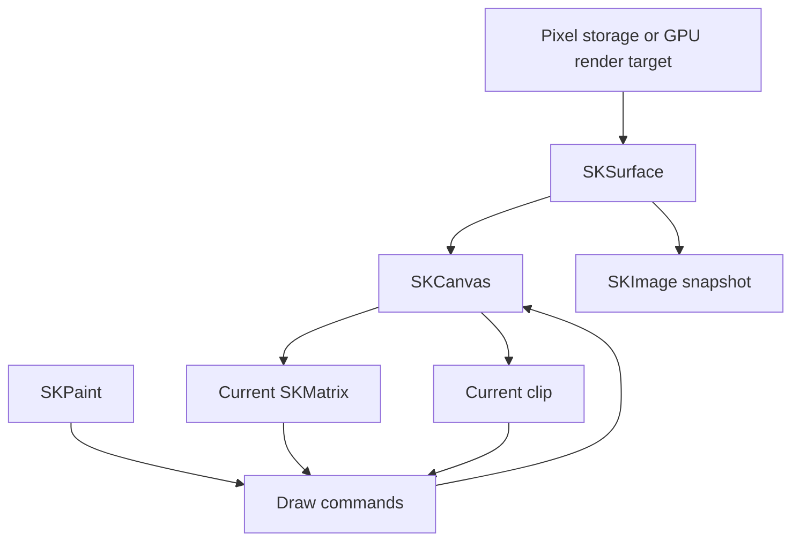
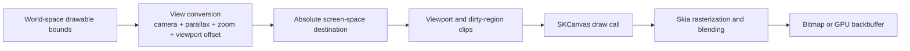
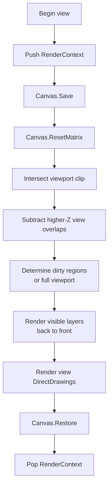
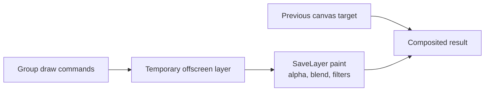
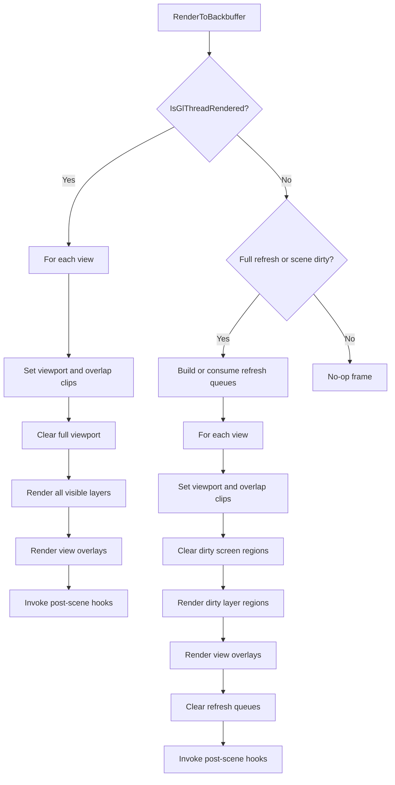

> **Advanced Topics**
>
> A reference and tutorial for contributors working in Gondwana's rendering pipeline.

> [!NOTE]
> This page was verified against the `master` branch on **July 31, 2026**, where the core project targets .NET 8 and references **SkiaSharp 3.119.2**. Names and implementation details may evolve, but the underlying rendering model should remain valid.

---

## Table of Contents

- [Why This Page Exists](#why-this-page-exists)
- [The Central Mental Model](#the-central-mental-model)
- [What Actually Exists](#what-actually-exists)
- [Where Skia Fits](#where-skia-fits)
- [The Core Skia Objects](#the-core-skia-objects)
- [Coordinate Spaces in Gondwana](#coordinate-spaces-in-gondwana)
- [Two Ways to Implement a Camera](#two-ways-to-implement-a-camera)
- [How Gondwana Currently Projects the World](#how-gondwana-currently-projects-the-world)
- [The Render Pipeline at a Glance](#the-render-pipeline-at-a-glance)
- [SKCanvas Reference](#skcanvas-reference)
- [Save and Restore](#save-and-restore)
- [SaveLayer](#savelayer)
- [Clipping](#clipping)
- [SKMatrix Reference](#skmatrix-reference)
- [Camera, Zoom, and Parallax](#camera-zoom-and-parallax)
- [Multiple Views](#multiple-views)
- [Bitmap and GPU Rendering Paths](#bitmap-and-gpu-rendering-paths)
- [DirectDrawing Rendering](#directdrawing-rendering)
- [Clearing and Compositing](#clearing-and-compositing)
- [Common Failure Modes](#common-failure-modes)
- [Debugging the Pipeline](#debugging-the-pipeline)
- [Gondwana Rendering Contracts](#gondwana-rendering-contracts)
- [Glossary](#glossary)
- [Related Source Files](#related-source-files)
- [Further Reading](#further-reading)

---

## Why This Page Exists

Most rendering documentation explains individual calls:

```csharp
canvas.Save();
canvas.ClipRect(rect);
canvas.DrawImage(image, destination);
canvas.Restore();
```

That tells you what to type. It does not necessarily tell you what is happening.

When the engine contains cameras, zoom, parallax, dirty rectangles, overlapping views, bitmap backbuffers, GPU backbuffers, reveal animations, compositing layers, and screen-space overlays, memorizing individual calls is no longer enough. You need a model that answers questions such as:

- What owns the pixels?
- What does `SKCanvas` actually contain?
- What changes when `Translate`, `Scale`, or `SetMatrix` is called?
- Does a clip move when the matrix changes?
- What exactly does `Save()` save?
- Why is `SaveLayer()` more expensive than `Save()`?
- Does Gondwana use the canvas matrix as its camera?
- Why are viewport rectangles always screen-space?
- How can one world layer render differently through two views?
- Why does the bitmap path use dirty rectangles while the GL path redraws the full surface?

This page builds that model from the physical pixel buffer upward.

It is meant for anyone brave enough to work in:

- `Gondwana/Rendering`
- `Gondwana/Rendering/Backbuffers`
- `Gondwana/Rendering/Views`
- `Gondwana/Drawing/Direct`
- lower-level sprite, tile, overlay, or post-render code

No advanced linear algebra is required. The relevant operations are mostly addition, subtraction, multiplication, and division. A matrix is simply a compact way to store those operations.

---

## The Central Mental Model

The most important rendering fact in this page is:

> **The backing image does not move.**

The bitmap or surface has a fixed pixel grid. Cameras do not physically slide that grid. Zoom does not physically stretch it. Parallax does not create another universe behind it.

Instead, Gondwana calculates where an object should appear on that fixed grid.

At the end of the pipeline, every visible object becomes some combination of:

- a screen-space point;
- a screen-space rectangle;
- a screen-space path; or
- a screen-space collection of pixels.

Skia then rasterizes that geometry into the backing surface.

A useful summary is:

```text
engine coordinates
    ↓
coordinate conversion
    ↓
screen/device coordinates
    ↓
clip test
    ↓
rasterization and blending
    ↓
backbuffer pixels
```

The backing pixels remain where they have always been. Only the destination coordinates change.

---

## What Actually Exists

It is helpful to separate physical resources from engine concepts.

| Thing | Exists as an object or memory resource? | Engine or mathematical construct? | Notes |
|---|:---:|:---:|---|
| `SKBitmap` | Yes |  | Raster pixel storage |
| `SKSurface` | Yes |  | A render target that exposes an `SKCanvas` |
| `SKCanvas` | Yes |  | Drawing context and drawing state |
| `SKImage` | Yes |  | Immutable image representation or snapshot |
| `SKPaint` | Yes |  | Drawing and compositing parameters |
| `SKMatrix` | Yes | Yes | A data structure encoding coordinate mathematics |
| Device pixels | Yes |  | Actual pixels in the render target |
| World space |  | Yes | A Gondwana coordinate convention |
| World pixels |  | Yes | World-space units expressed in pixel-like units |
| Camera |  | Yes | A position used by coordinate conversion |
| View | Yes | Yes | Engine object combining camera and viewport |
| Viewport | Yes | Yes | Engine object describing screen placement and zoom |
| Zoom |  | Yes | A scale relationship between world and screen |
| Parallax |  | Yes | A multiplier applied to camera displacement |
| Clip region | Yes | Yes | Canvas state ultimately represented in device space |

### About "world pixels"

Gondwana commonly expresses world dimensions in pixels. A tile might be 64 world pixels wide, and a sprite might occupy a world rectangle measured in pixels.

Those units are useful and intentional, but they are not physical pixels in memory.

They are values in an engine-defined coordinate system. At a particular camera position and zoom, one world pixel may happen to map to one screen pixel. Change the zoom and that relationship changes immediately.

A reliable test is:

> If the zoom changes, does the `SKBitmap` acquire more pixels?

No. Therefore the bitmap is not made of world pixels.

---

## Where Skia Fits

Skia is a high-level, immediate-mode 2D graphics library.

"Immediate-mode" here means that Skia does not own Gondwana's scene graph. It does not retain the game's tiles, sprites, cameras, layers, or widgets as engine objects. Gondwana decides what should be drawn and issues drawing commands to the canvas.

### Comparison with other APIs

| API or technology | Main abstraction | Typical 2D workflow | State and transforms | How close is it to Gondwana's use of Skia? |
|---|---|---|---|---|
| GDI / GDI+ | Device context plus bitmap or window target | Select resources, issue drawing commands | Stateful drawing context | Conceptually close; `SKCanvas` is broadly analogous to an `HDC` |
| DirectDraw | Surfaces and blitting | Copy bitmap regions between surfaces | Limited compared with modern APIs | Similar in its emphasis on 2D surfaces, but far older and less capable |
| Skia | Canvas drawing into a surface | Draw images, text, paths, and shapes | Matrix, clip, save stack, paint | Gondwana's primary rendering abstraction |
| OpenGL | GPU state machine and geometry pipeline | Upload textures and vertices, configure shaders, draw triangles | Explicit GPU pipeline state | Lower level than Gondwana needs for most 2D work |
| Direct3D 11 | GPU resources, shaders, input layouts, render targets | Build textured quads and submit draw calls | Explicit pipeline state | Lower level; a 2D engine must build its own canvas-like layer |
| Direct3D 12 / Vulkan | Command lists, synchronization, explicit resource state | Fully manage GPU work and memory transitions | Very explicit | Much lower level and substantially more complex |

### The practical distinction

With Skia, Gondwana can say:

```csharp
canvas.DrawImage(image, destinationRect);
```

With a lower-level graphics API, the engine would usually need to:

1. define quad vertices;
2. create or update vertex and index buffers;
3. bind a texture;
4. bind shaders;
5. configure blending;
6. configure scissoring;
7. issue a draw call;
8. manage synchronization and resource lifetime.

Skia is not merely "GDI with nicer methods." It can render through CPU or GPU backends, supports vector paths, text shaping, image filters, compositing, and sophisticated clipping. It simply exposes those capabilities through a higher-level 2D drawing model.

---

## The Core Skia Objects

### Ownership overview



### `SKBitmap`

`SKBitmap` is mutable raster pixel storage.

In Gondwana's `BitmapBackbuffer`, an `SKBitmap` is allocated with a specific `SKImageInfo`, and an `SKSurface` is created over its pixel memory. The bitmap is the backing storage; the surface and canvas provide the means to draw into it.

Think:

> A fixed rectangular array of pixels in memory.

### `SKSurface`

`SKSurface` is a render target.

Depending on how it was created, it may be:

- raster-backed by CPU memory;
- backed by an `SKBitmap`;
- backed by a GPU context and render target.

The surface exposes its drawing context through:

```csharp
SKCanvas canvas = surface.Canvas;
```

It can also produce an immutable snapshot:

```csharp
using SKImage image = surface.Snapshot();
```

### `SKCanvas`

`SKCanvas` is the drawing context.

It contains or refers to:

- the destination surface;
- the current transform matrix;
- the current clip;
- a private save stack;
- backend-specific drawing machinery.

It does **not** own Gondwana's world and does **not** inherently understand cameras, views, sprites, tiles, or parallax.

A useful old GDI analogy is:

| GDI | Skia |
|---|---|
| `HBITMAP` | `SKBitmap` or raster backing |
| `HDC` | `SKCanvas` |
| selected pen/brush/font | `SKPaint`, typeface, shader, and related objects |
| clipping region | canvas clip |
| world transform | canvas matrix |

The analogy is not perfect, but it is good enough to prevent the most common category error:

> `SKCanvas` is analogous to the drawing context, not to the bitmap.

### `SKImage`

`SKImage` is an immutable image representation.

In Gondwana:

- the bitmap backbuffer creates an `SKImage` snapshot for presentation;
- the GPU backbuffer can return a lightweight GPU-backed snapshot;
- GPU tile rendering uses `SKImage`;
- bitmap tile rendering uses `SKBitmap`.

An image may share underlying resources with its source, depending on backend and creation method. Treat it as an immutable view and dispose it according to the ownership contract of the method that returned it.

### `SKPaint`

`SKPaint` describes how geometry or images are rasterized or composited.

It can control:

- color;
- alpha;
- fill versus stroke;
- stroke width;
- blend mode;
- antialiasing;
- filtering;
- shaders;
- color filters;
- image filters;
- path effects.

`SKPaint` is not part of the canvas save stack merely because it is passed to a draw call. It is a separate object. The paint passed to `SaveLayer` is copied for use when the layer is composited back.

### `SKMatrix`

`SKMatrix` stores a 3×3 transformation.

It can represent:

- translation;
- scaling;
- rotation;
- skew;
- perspective;
- combinations of those operations.

Skia does not know that a particular translation represents a camera. That meaning belongs to the caller.

---

## Coordinate Spaces in Gondwana

Often, coordinate-space bugs can be mistaken for rendering issues.

Gondwana uses several related coordinate concepts. The names matter.

### World space

World space is the engine's logical scene coordinate system.

Examples:

- tile positions;
- sprite bounds;
- collision rectangles;
- scene-layer direct drawings;
- camera position.

Gondwana commonly expresses world coordinates in `PointF`, `RectangleF`, or `Rectangle` values suffixed with `World`, `WorldPx`, or similar names.

### Screen space

Screen space is the absolute pixel coordinate system of the render surface or backbuffer.

Examples:

- `Viewport.TargetRectPx`;
- dirty rectangles passed to the adapter;
- final destination rectangles passed to `IDrawable.Draw`;
- view-mode `DirectDrawing` bounds;
- pointer positions from a host control.

The top-left of the backbuffer is normally `(0, 0)`.

### Device space

In this page, "device space" means the pixel coordinate system of the current Skia render target.

For Gondwana's ordinary backbuffer rendering, device space and absolute screen/backbuffer space are effectively the same coordinate system.

The distinction becomes useful when discussing Skia's internal rules:

- input geometry is transformed by the current matrix;
- clips are represented and enforced in device space;
- pixels are written in device space.

### View-local space

A viewport has an absolute screen rectangle:

```csharp
view.Viewport.TargetRectPx
```

A point relative to the viewport's top-left can be described as view-local, but Gondwana's final rendering contract generally uses **absolute screen coordinates**.

This matters. A drawable located 20 pixels from the left edge of a viewport at screen X = 400 ultimately draws at screen X = 420, not X = 20.

### Grid space

Grid space is the coordinate system of a scene layer's tile arrangement:

- orthogonal columns and rows;
- isometric coordinates;
- hex axial coordinates;
- other supported coordinate systems.

Grid conversion is a layer concern. Rendering ultimately converts:

```text
grid → world → screen
```

### Naming rule

When working in the pipeline, names should reveal the coordinate space:

```csharp
worldRect
worldPositionPx
screenRect
destRectScreen
viewportRectPx
dirtyScreenRect
```

A variable named merely `rect` is inexpensive to type and expensive to debug.

---

## Two Ways to Implement a Camera

There are two common ways to implement world-to-screen rendering.

### Strategy A: matrix-driven rendering

The engine configures the canvas matrix and submits world coordinates:

```csharp
canvas.Save();

canvas.Translate(viewportOffsetX, viewportOffsetY);
canvas.Scale(inverseZoom);
canvas.Translate(
    -cameraX * parallax,
    -cameraY * parallax);

canvas.DrawImage(image, worldDestination);

canvas.Restore();
```

In this model:

- draw calls receive world coordinates;
- the canvas matrix converts them to device coordinates;
- camera, zoom, and parallax are encoded in the active matrix.

This is a perfectly valid architecture.

### Strategy B: preprojected screen rendering

The engine performs coordinate conversion itself and submits screen coordinates:

```csharp
RectangleF destRectScreen =
    view.WorldRectToScreenRect(layer, worldRect);

canvas.DrawImage(image, destRectScreen.ToSKRect());
```

In this model:

- Gondwana performs the camera, parallax, zoom, and viewport arithmetic;
- the canvas normally remains at the identity matrix;
- draw calls receive absolute screen-space destinations.

This is also a perfectly valid architecture.

### Gondwana currently uses Strategy B

This point is important enough to state plainly:

> **Gondwana's current drawable contract projects world geometry into screen coordinates before the drawable draws.**

`IDrawable.GetDrawLocationScreen(View)` returns an absolute screen-space rectangle, and `IDrawable.Draw(BackbufferBase, RectangleF)` receives that already-projected rectangle.

Therefore, statements such as "the camera lives in the canvas matrix" describe one possible Skia architecture, but not the main architecture currently used by Gondwana.

In current Gondwana:

> The camera primarily lives in `View` coordinate-conversion mathematics.

The canvas matrix is still important for:

- establishing a known identity state;
- defining screen-space clips;
- local custom drawing transforms;
- rotation or scaling within a particular drawable;
- future or specialized render passes.

But the engine's normal camera projection is explicit C# arithmetic.

---

## How Gondwana Currently Projects the World

The core formula in `View.WorldPxToScreenPx` is:

```text
screen = offset + (world - camera × parallax) / zoom
```

Where:

```text
offset =
    viewport.TargetRectPx location
    + viewport.ScreenOffsetPx
```

The inverse formula is:

```text
world = camera × parallax + (screen - offset) × zoom
```

### World to screen

For each axis:

```csharp
screenX =
    offsetX
    + (worldX - cameraX * parallax)
    / zoom;
```

```csharp
screenY =
    offsetY
    + (worldY - cameraY * parallax)
    / zoom;
```

### Screen to world

For each axis:

```csharp
worldX =
    cameraX * parallax
    + (screenX - offsetX)
    * zoom;
```

```csharp
worldY =
    cameraY * parallax
    + (screenY - offsetY)
    * zoom;
```

### A numerical example

Assume:

```text
world point:       (500, 300)
camera position:   (200, 100)
layer parallax:    0.5
zoom:              2.0
viewport origin:   (400, 50)
screen offset:     (10, 5)
```

First calculate the effective offset:

```text
offsetX = 400 + 10 = 410
offsetY =  50 +  5 =  55
```

Apply parallax to the camera:

```text
cameraX × parallax = 200 × 0.5 = 100
cameraY × parallax = 100 × 0.5 =  50
```

Subtract the parallax-adjusted camera:

```text
localX = 500 - 100 = 400
localY = 300 -  50 = 250
```

Apply the zoom convention:

```text
scaledX = 400 / 2 = 200
scaledY = 250 / 2 = 125
```

Add viewport placement:

```text
screenX = 410 + 200 = 610
screenY =  55 + 125 = 180
```

The world point is drawn at screen position:

```text
(610, 180)
```

### Gondwana's zoom convention

In the current formulas:

- larger `Viewport.Zoom` values show a smaller portion of the world;
- the world-to-screen displacement is divided by zoom;
- `VisibleWorldSizePx` is calculated as viewport size divided by zoom.

When changing zoom behavior, verify all three of these stay consistent:

- `WorldPxToScreenPx`;
- `ScreenPxToWorldPx`;
- `Viewport.VisibleWorldSizePx`.

---

## The Render Pipeline at a Glance

The current pipeline performs most world projection before calling Skia draw methods.



A more concrete view pass is:



The exact dirty-region behavior differs between bitmap and GPU backbuffers; that distinction is covered later.

---

## SKCanvas Reference

The following tables focus on methods and members relevant to Gondwana's rendering code and likely custom extensions.

### Canvas state and layer management

| Member | Affects | What it actually does | Typical Gondwana use | Important cautions |
|---|---|---|---|---|
| `Save()` | Canvas state | Pushes the current matrix, clip, and related drawing state onto a private stack | Isolating a viewport, local transform, reveal clip, or custom draw routine | Does not copy or save pixels |
| `Restore()` | Canvas state | Pops the most recent saved state | Ends a `Save` or `SaveLayer` scope | Restores both matrix and clip; it is not "matrix only" |
| `RestoreToCount(count)` | Canvas state stack | Pops states until the requested save depth is reached | Returning a backbuffer to a known frame baseline | Make sure the count belongs to the same canvas |
| `SaveCount` | Canvas state stack | Reports the current save-stack depth | Diagnostics and defensive state cleanup | Useful for assertions; not a substitute for clear ownership |
| `SaveLayer()` | State and destination | Saves state and redirects subsequent drawing into an offscreen layer | Group opacity, blend modes, filters | Potentially expensive |
| `SaveLayer(SKPaint?)` | State and destination | Creates an offscreen layer and applies the paint when restored | Fading a composite drawing as one unit | The paint affects compositing, not each individual child draw |
| `SaveLayer(SKRect, SKPaint?)` | State and destination | Same, with a bounds hint for the temporary layer | Bounded group opacity or effects | Bounds are a sizing hint, not a guaranteed exact clip |
| `SKAutoCanvasRestore` | Canvas state | RAII/`using` wrapper around save and restore | Optional defensive helper in custom code | Do not manually over-restore inside the same scope |

### Matrix and transform operations

| Member | Affects | Mathematical meaning | Possible Gondwana use | Important cautions |
|---|---|---|---|---|
| `TotalMatrix` | Read-only current matrix | Returns the complete active transformation | Capturing state before a temporary identity switch | It is a value snapshot, not a live reference |
| `ResetMatrix()` | Matrix only | Sets current matrix to identity | Screen-space clips and absolute pixel drawing | Does not reset the clip |
| `SetMatrix(matrix)` | Matrix only | Replaces the current matrix | Restoring a captured transform without restoring the clip | Replaces rather than appends |
| `Concat(matrix)` | Matrix only | Combines another transform with the current transform | Advanced local transforms | Multiplication order matters |
| `Translate(dx, dy)` | Matrix only | Adds an offset to future geometry | Local drawable offsets or matrix-driven camera code | Does not move pixels already drawn |
| `Scale(sx, sy)` | Matrix only | Multiplies future geometry | Local scaling or matrix-driven zoom | Scales stroke widths, paths, and text geometry as well |
| `Scale(scale)` | Matrix only | Uniform scaling | Local zoom effect | Same order concerns as two-axis scaling |
| `RotateDegrees(degrees)` | Matrix only | Rotates future geometry around the origin | Rotating sprites or custom visuals | Translate to a pivot before rotating around that pivot |
| `RotateRadians(radians)` | Matrix only | Same in radians | Specialized drawing | Do not mix units |
| `Skew(sx, sy)` | Matrix only | Shears future geometry | Oblique or special effects | Easy to confuse with coordinate-system projection |

### Clipping operations

| Member | Affects | What it does | Typical Gondwana use | Important cautions |
|---|---|---|---|---|
| `ClipRect(rect)` | Clip | Intersects the current clip with a rectangle | Viewport clips and dirty rectangles | Rectangle is transformed by the current matrix when the clip is established |
| `ClipRect(rect, Intersect, aa)` | Clip | Keeps only overlap with the rectangle | Inclusive viewport clipping | `antialias: false` is normally appropriate for pixel-aligned engine bounds |
| `ClipRect(rect, Difference, aa)` | Clip | Removes the rectangle from the current clip | Excluding regions occupied by higher-Z views | Difference clips can become more complex than a simple rectangle |
| `ClipPath(path, operation, aa)` | Clip | Applies an arbitrary path clip | Masks or nonrectangular UI | Usually more expensive than a rectangular clip |
| `ClipRoundRect(...)` | Clip | Applies a rounded rectangle | Rounded panels or masks | Anti-aliased edges may be desirable for UI but not for viewport seams |
| `LocalClipBounds` | Read-only clip information | Gets clip bounds in local coordinates | Diagnostics and culling | Bounds may be conservative |
| `DeviceClipBounds` | Read-only clip information | Gets clip bounds in device coordinates | Debugging viewport and dirty clips | Particularly useful after matrix changes |

### Drawing methods

| Member | Draws | Matrix and clip apply? | Typical Gondwana use | Notes |
|---|---|:---:|---|---|
| `DrawBitmap(...)` | Mutable raster bitmap | Yes | Bitmap backbuffer tile frames and images | Used with filtering and blend paint |
| `DrawImage(...)` | Immutable image | Yes | GPU backbuffer tile frames and snapshots | Often preferred for GPU-backed resources |
| `DrawRect(...)` | Rectangle | Yes | Clears, debug boxes, panels | Fill or stroke depends on paint |
| `DrawPath(...)` | Arbitrary path | Yes | Fog polygons, vector effects | Path ownership and disposal matter |
| `DrawPoints(...)` | Points, lines, polygons | Yes | Grid outlines and diagnostic geometry | Behavior depends on `SKPointMode` |
| `DrawText(...)` | Text glyphs | Yes | Simple text drawing | Complex shaping may use higher-level text APIs |
| `DrawColor(...)` | Whole current target or clip | Clip applies; matrix is irrelevant to coverage | Full-target fills and blend operations | Blend mode determines replacement versus compositing |
| `Clear(...)` | Target clear | Backend semantics are specialized | Full-surface clearing | For precise rectangular clears, Gondwana uses `DrawRect` with `Src` |
| `DrawPicture(...)` | Recorded command stream | Yes | Replaying recorded vector commands | Useful when drawing the same command set repeatedly |

### Submission and diagnostics

| Member | Purpose | Typical use | Caution |
|---|---|---|---|
| `Flush()` | Submits queued work to the backend | Explicit synchronization or completion | Frequent flushes can damage batching |
| `QuickReject(...)` | Tests whether geometry is outside the clip | Optional fast culling | A "not rejected" result does not guarantee visible pixels |
| `SaveCount` | Reports stack depth | Assertions and diagnostics | Balance state locally even when frame initialization repairs it |

---

## Save and Restore

### What `Save()` saves

`Save()` saves canvas state, including:

- current matrix;
- current clip;
- drawing-filter state tracked by the canvas.

It pushes that state onto a private stack and returns a save count that can be used with `RestoreToCount`.

It does not save:

- pixels already drawn;
- the contents of an `SKBitmap`;
- arbitrary `SKPaint` instances;
- Gondwana objects;
- the scene.

### What `Restore()` restores

`Restore()` balances the most recent `Save()` or `SaveLayer()`.

For a normal `Save()` scope, it restores:

- the previous matrix;
- the previous clip;
- related saved canvas state.

It does not undo drawing.

```csharp
canvas.Save();
canvas.Translate(100, 0);
canvas.DrawRect(rect, paint);
canvas.Restore();
```

The rectangle remains drawn at the translated position. Only future drawing returns to the previous matrix.

### Parentheses around state

A reliable mental model is:

```text
Save()     = open a parenthesis around canvas state
Restore()  = close that parenthesis
```

Example:

```csharp
canvas.Save();

canvas.Translate(10, 20);
canvas.ClipRect(localBounds);

DrawLocalContent(canvas);

canvas.Restore();
```

Nothing inside the block should affect later draw code except the pixels that were intentionally rendered.

### Save after drawing?

A draw call does not normally change canvas state.

This is pointless:

```csharp
canvas.DrawImage(image, destination);
canvas.Save();
```

A save belongs immediately before the state mutation it protects:

```csharp
canvas.Save();
canvas.RotateDegrees(angle);
canvas.DrawImage(image, destination);
canvas.Restore();
```

### `ResetMatrix()` is not a substitute for `Restore()`

`ResetMatrix()` changes only the matrix.

It does not:

- restore the prior matrix;
- restore the clip;
- pop the save stack;
- end a `SaveLayer`.

Wrong:

```csharp
canvas.Save();
canvas.ClipRect(rect);
canvas.Translate(10, 0);

// This does not undo the clip and does not balance Save().
canvas.ResetMatrix();
```

Correct:

```csharp
canvas.Save();
canvas.ClipRect(rect);
canvas.Translate(10, 0);

DrawSomething(canvas);

canvas.Restore();
```

### Frame-level defensive cleanup

Both Gondwana backbuffer implementations establish a known baseline at frame start:

```csharp
canvas.RestoreToCount(1);
canvas.Save();
canvas.ResetMatrix();
canvas.ClipRect(fullSurfaceRect);
```

This is valuable defensive infrastructure. It prevents an accidental leaked save from corrupting every subsequent frame.

It is not permission for local code to leave the stack unbalanced. A leaked state can still corrupt the remainder of the current frame before the next `BeginFrame()` repairs it.

### Recommended scope ownership

The method that calls `Save()` should normally own the matching `Restore()`.

Avoid this shape:

```csharp
BeginView(canvas);  // secretly calls Save()
DrawView(canvas);
EndView(canvas);    // secretly calls Restore()
```

unless the contract is extremely explicit and exception-safe.

Prefer visually local pairing:

```csharp
canvas.Save();
try
{
    ApplyViewState(canvas);
    DrawView(canvas);
}
finally
{
    canvas.Restore();
}
```

A `try/finally` is worth considering in infrastructure code when user-extensible drawing could throw.

---

## SaveLayer

`SaveLayer()` is related to `Save()`, but it is not merely a fancier spelling.

### What happens

Given:

```csharp
canvas.SaveLayer(layerPaint);

DrawGroup(canvas);

canvas.Restore();
```

Skia conceptually performs these steps:

1. Save the current canvas state.
2. Allocate or obtain a temporary offscreen layer.
3. Redirect subsequent draw commands into that layer.
4. On `Restore()`, composite the temporary layer onto the previous target.
5. Apply the `SaveLayer` paint during that compositing operation.
6. Discard or recycle the temporary layer.



### It composites; it does not blindly overwrite

For ordinary source-over alpha blending, the result is conceptually similar to:

```text
result =
    source × sourceAlpha
    + destination × (1 - sourceAlpha)
```

The real equations account for premultiplied alpha and the selected blend mode, but the essential idea is:

> The temporary layer is combined with what was already underneath it.

If the layer paint uses a replacement-oriented blend mode, the effect may resemble overwriting. That behavior comes from the blend mode, not from `Restore()` itself.

### Why group opacity needs a layer

Suppose three overlapping shapes each draw with 50% alpha.

Without a layer, each shape is individually blended against the background. Overlap areas may become darker or more opaque because blending occurs several times.

With a layer:

1. the shapes draw normally into a transparent temporary surface;
2. their internal overlaps are resolved there;
3. the completed group is composited once at 50% opacity.

That is the difference between:

- each child being translucent; and
- the group as a whole being translucent.

### `Save()` versus `SaveLayer()`

| Behavior | `Save()` | `SaveLayer()` |
|---|:---:|:---:|
| Saves matrix | Yes | Yes |
| Saves clip | Yes | Yes |
| Pushes canvas state | Yes | Yes |
| Redirects drawing | No | Yes |
| Allocates or uses an offscreen target | No | Usually |
| Supports group opacity | No | Yes |
| Supports group filters and blend composition | No | Yes |
| Typical cost | Low | Potentially significant |
| Balanced by `Restore()` | Yes | Yes |

### Bounds overload

```csharp
canvas.SaveLayer(bounds, paint);
```

The bounds help Skia limit the offscreen work.

However:

> The bounds are a layer-allocation hint, not a guaranteed exact clip.

When exact clipping is required, apply `ClipRect` explicitly.

A safe pattern is:

```csharp
canvas.Save();

canvas.ClipRect(exactBounds, SKClipOperation.Intersect, false);
canvas.SaveLayer(exactBounds, layerPaint);

DrawGroup(canvas);

canvas.Restore(); // composites layer
canvas.Restore(); // removes exact clip
```

### When to use `SaveLayer()`

Use it when the completed group requires:

- one opacity value;
- one blend mode;
- one color filter;
- one image filter;
- one compositing operation.

Do not use it merely because a drawing method has several children.

### Performance guidance

`SaveLayer()` may require:

- temporary pixel storage;
- GPU render-target allocation;
- an additional compositing pass;
- additional bandwidth;
- lost batching opportunities.

Practical rules:

- provide reasonable bounds;
- avoid full-surface layers for small effects;
- avoid deeply nested layers;
- do not use a layer when changing alpha on one draw paint would be equivalent;
- profile the GPU and bitmap paths separately.

The code can be perfectly correct and still be ruinously expensive at 4K. Pixels are tiny, but they travel in mobs.

---

## Clipping

A clip is a drawing permission region.

It answers:

> Is this destination pixel allowed to be modified?

It does not answer:

> Where should this geometry be drawn?

That is the matrix or the caller's coordinate conversion.

### Transform versus clip

| Mechanism | Question answered |
|---|---|
| Coordinate conversion or matrix | Where does this geometry land? |
| Clip | Is drawing allowed at that destination? |
| Paint and blend mode | How does the source combine with the destination? |

### Current matrix at clip time

When this executes:

```csharp
canvas.ClipRect(rect);
```

Skia interprets `rect` through the current matrix and incorporates the result into the current device-space clip.

Therefore:

```csharp
canvas.Translate(100, 0);
canvas.ClipRect(new SKRect(0, 0, 50, 50));
```

does not clip device pixels `(0..50, 0..50)`. The translation affects the rectangle used to establish the clip.

### Changing the matrix afterward

Once the clip has been established, changing the matrix does not drag the existing clip around.

```csharp
canvas.ResetMatrix();
canvas.ClipRect(screenRect);

canvas.SetMatrix(otherMatrix);
```

The clip remains in the device-space region established from `screenRect`. The new matrix affects future geometry, not the already-established clip.

This property makes the following pattern valid when a caller truly needs to define a screen clip and then resume an existing nonidentity matrix:

```csharp
canvas.Save();

SKMatrix previousMatrix = canvas.TotalMatrix;

canvas.ResetMatrix();
canvas.ClipRect(
    screenRect,
    SKClipOperation.Intersect,
    antialias: false);

canvas.SetMatrix(previousMatrix);

DrawUsingPreviousCoordinateContract(canvas);

canvas.Restore();
```

### Why Gondwana often needs only the simpler pattern

The current `IDrawable` contract passes screen-space destinations. Therefore normal view rendering can remain at identity:

```csharp
canvas.Save();
canvas.ResetMatrix();

canvas.ClipRect(
    viewportRect,
    SKClipOperation.Intersect,
    antialias: false);

DrawScreenSpaceDestinations(canvas);

canvas.Restore();
```

There is no need to reapply a world matrix when no world matrix is used for those draws.

### The double-save trap

This does **not** preserve the new clip:

```csharp
canvas.Save();        // outer
canvas.Save();        // inner
canvas.ResetMatrix();
canvas.ClipRect(rect);
canvas.Restore();     // restores matrix AND clip to inner save point

DrawSomething(canvas); // the newly applied clip is gone
canvas.Restore();
```

The inner `Restore()` undoes every matrix and clip change made after the inner `Save()`.

There are clever orderings involving multiple save points, but they are difficult to read and buy little here. Prefer one obvious state scope and explicit matrix capture when required.

### `Intersect`

```csharp
canvas.ClipRect(
    viewportRect,
    SKClipOperation.Intersect,
    false);
```

This keeps only the overlap between:

- the existing clip; and
- the new rectangle.

Clips are cumulative. Every intersection can only preserve or reduce the drawable region.

### `Difference`

```csharp
canvas.ClipRect(
    overlapRect,
    SKClipOperation.Difference,
    false);
```

This removes an area from the current clip.

Gondwana uses this when a higher-Z view overlaps a lower-Z view. The lower view is prevented from modifying the region that belongs to the view drawn above it.

### Antialiasing

For pixel-aligned viewport and dirty-region clips:

```csharp
antialias: false
```

is usually correct.

Benefits include:

- crisp boundaries;
- no partially covered edge pixels;
- fewer seams between adjacent views;
- more deterministic dirty-region behavior.

Anti-aliased clips are appropriate for visual masks such as rounded UI panels, not usually for engine scissor-like rectangles.

### Clip lifetime

A clip remains active until canvas state is restored to a point before that clip was applied.

```csharp
canvas.Save();
canvas.ClipRect(rect);

DrawInsideClip(canvas);

canvas.Restore(); // removes the clip introduced after Save()
```

`ResetMatrix()` does not remove it. Clipping to a larger rectangle does not reliably restore pixels previously excluded by an intersection. Restore the saved state.

---

## SKMatrix Reference

`SKMatrix` is a 3×3 matrix with affine and perspective components.

### Layout

The values are exposed in row-major order:

```text
| ScaleX  SkewX   TransX |
| SkewY   ScaleY  TransY |
| Persp0  Persp1  Persp2 |
```

For ordinary 2D affine rendering:

```text
Persp0 = 0
Persp1 = 0
Persp2 = 1
```

### How a point is mapped

Without perspective:

```text
mappedX = ScaleX × x + SkewX × y + TransX
mappedY = SkewY × x + ScaleY × y + TransY
```

With perspective, Skia also calculates a divisor:

```text
w = Persp0 × x + Persp1 × y + Persp2
```

and divides the mapped X and Y values by `w`.

Most Gondwana rendering should remain affine unless a specialized effect explicitly requires perspective.

### Fields and properties

| Member | Meaning | Identity value | Practical use |
|---|---|---:|---|
| `Identity` | Matrix that leaves coordinates unchanged | Entire identity matrix | Known no-transform value |
| `Empty` | Matrix with all values zero | All zero | Rarely useful for drawing; not the same as identity |
| `IsIdentity` | Whether the matrix is identity | `true` for identity | Diagnostics and fast paths |
| `IsInvertible` | Whether an inverse exists | `true` for ordinary valid transforms | Screen-to-local conversion |
| `ScaleX` | X contribution from input X | `1` | Horizontal scale and part of rotation |
| `ScaleY` | Y contribution from input Y | `1` | Vertical scale and part of rotation |
| `SkewX` | X contribution from input Y | `0` | Skew and part of rotation |
| `SkewY` | Y contribution from input X | `0` | Skew and part of rotation |
| `TransX` | X translation | `0` | Horizontal offset |
| `TransY` | Y translation | `0` | Vertical offset |
| `Persp0` | X contribution to perspective divisor | `0` | Perspective effects |
| `Persp1` | Y contribution to perspective divisor | `0` | Perspective effects |
| `Persp2` | Constant perspective divisor component | `1` | Normally left at one |
| `Values` | Flat array of all nine values | Identity sequence | Serialization, diagnostics, interop |

### Constructors and creation methods

| Member | Creates | Typical use |
|---|---|---|
| `new SKMatrix(a, b, c, d, e, f, g, h, i)` | Explicit matrix values | Low-level or imported transforms |
| `new SKMatrix(float[9])` | Matrix from row-major array | Interop and serialization |
| `CreateIdentity()` | Identity matrix | Explicit initialization |
| `CreateTranslation(dx, dy)` | Translation | Local placement |
| `CreateScale(sx, sy)` | Scale around origin | Zoom or local size changes |
| `CreateScale(sx, sy, px, py)` | Scale around pivot | Zoom around cursor or object center |
| `CreateScaleTranslation(sx, sy, tx, ty)` | Combined scale and translation | Efficient common transform |
| `CreateRotation(radians)` | Rotation around origin | Local rotation |
| `CreateRotation(radians, px, py)` | Rotation around pivot | Sprite or shape rotation |
| `CreateRotationDegrees(degrees)` | Degree-based rotation | Easier human-readable angles |
| `CreateRotationDegrees(degrees, px, py)` | Degree rotation around pivot | Local effects |
| `CreateSkew(sx, sy)` | Shear | Oblique or stylized rendering |

### Combination methods

| Member | Meaning | Caution |
|---|---|---|
| `Concat(first, second)` | Returns a combined matrix | Transform order matters |
| `Concat(ref result, first, second)` | Writes a combined matrix to a target | Verify argument order against intended application order |
| `PreConcat(matrix)` | Combines another transform before this matrix | Easy to reverse mentally |
| `PostConcat(matrix)` | Combines another transform after this matrix | Not interchangeable with `PreConcat` |

Matrix multiplication is not commutative:

```text
Translate × Scale ≠ Scale × Translate
```

A simple example:

1. scale point `(10, 0)` by 2, then translate by 100 → `120`;
2. translate it by 100, then scale by 2 → `220`.

Both use the same operations. The order changes the result.

### Mapping methods

| Member | Input | Translation included? | Use |
|---|---|:---:|---|
| `MapPoint(x, y)` | One point | Yes | Convert one coordinate |
| `MapPoint(SKPoint)` | One point | Yes | Same with Skia type |
| `MapPoints(...)` | Point arrays or spans | Yes | Batch coordinate conversion |
| `MapRect(rect)` | Rectangle | Yes | Transform rectangle bounds |
| `MapVector(x, y)` | Direction or delta | No | Convert movement or axis without position |
| `MapVectors(...)` | Vector arrays or spans | No | Batch delta conversion |
| `MapRadius(radius)` | Scalar radius | Scale-dependent | Approximate transformed circular radius |

The point/vector distinction matters:

- a point has a position and should be translated;
- a vector represents direction or displacement and should not be translated.

### Inversion

| Member | Behavior | Use |
|---|---|---|
| `IsInvertible` | Reports whether an inverse is possible | Guard before conversion |
| `Invert()` | Returns the inverse if available | Reverse a transform |
| `TryInvert(outMatrix)` | Attempts inversion | Safer explicit control |

Inversion allows:

```text
local → screen
```

to become:

```text
screen → local
```

It is commonly used for:

- pointer hit testing in transformed objects;
- editor gizmos;
- mapping screen positions into a rotated or scaled local coordinate system.

In current Gondwana camera conversion, `View` already supplies explicit inverse formulas for world and screen coordinates. Matrix inversion is most useful for custom local transforms.

### Practical matrix rules

1. Start from identity unless intentionally building on another transform.
2. Write the intended operation order in English before composing matrices.
3. Do not read `TransX` and assume it is "the camera X." It is only one coefficient in the final equation.
4. Use `MapVector` for deltas and `MapPoint` for positions.
5. Guard inversion.
6. Prefer Gondwana's established `View` conversion methods for camera and parallax instead of rebuilding the formula in arbitrary drawables.
7. Capture `canvas.TotalMatrix` before temporary changes when the prior coordinate contract must be resumed.

---

## Camera, Zoom, and Parallax

Skia has no camera object.

Gondwana has a `Camera`, but that camera ultimately affects rendering because its position is used in coordinate conversion.

### Camera

At parallax 1:

```text
screen displacement =
    world position - camera position
```

Moving the camera right causes world objects to appear farther left because more camera X is subtracted.

### Parallax

Parallax changes how much camera motion applies to a layer:

```text
effective camera displacement =
    camera position × layer parallax
```

Examples:

| Parallax | Visual behavior |
|---:|---|
| `0` | Layer ignores camera movement |
| `0.25` | Layer moves one quarter as much as normal |
| `0.5` | Layer moves half as much |
| `1` | Normal world movement |
| `2` | Layer reacts twice as strongly |

A parallax value of zero may be meaningful for a fixed background, but code that divides by parallax must handle zero explicitly. `ZoomAroundScreenPoint` currently substitutes a safe value when solving for a camera target.

### Zoom

Gondwana's conversion uses:

```text
screen delta = world delta / zoom
```

With that convention:

| Zoom | Effect |
|---:|---|
| `0.5` | World displacement occupies more screen pixels |
| `1` | One-to-one scale before other offsets |
| `2` | World displacement occupies fewer screen pixels |

The naming of "zoom in" and "zoom out" should always be checked against the actual equation. The code is the truth; labels are merely optimistic witnesses.

### Viewport placement

The viewport contributes an absolute screen offset:

```text
offsetX =
    viewport.TargetRectPx.Left
    + viewport.ScreenOffsetPx.X
```

This is what allows the same world point to render in different places for split-screen or picture-in-picture views.

### Why each layer needs its own projection

Parallax belongs to the scene layer, so the same world rectangle can map to different screen rectangles for two layers.

The engine must not calculate one universal world rectangle for a view and assume it applies equally to every layer.

For a full refresh, Gondwana converts the viewport into a layer-specific visible world rectangle:

```csharp
RectangleF layerWorldRect =
    view.ScreenRectToWorldRect(layer, viewportRect);
```

It expands the result by a tile to cover fractional camera movement and boundary rounding.

---

## Multiple Views

A `View` combines:

- one `Camera`;
- one `Viewport`;
- a `ZOrder`;
- zoom limits.

A viewport supplies:

- `TargetRectPx`;
- `Zoom`;
- `ScreenOffsetPx`;
- visible world size.

### Same world, different projections

Two views can render the same scene with:

- different camera positions;
- different zoom levels;
- different viewport rectangles;
- different Z-order.

Therefore a drawable cannot have one permanent screen rectangle. Its destination must be calculated for the view currently rendering it.

### Render context

Gondwana pushes the current view and tick into `RenderContext` before rendering that view and pops it afterward.

Conceptually:

```csharp
RenderContext.Push(view, tick);
try
{
    RenderTheView(view);
}
finally
{
    RenderContext.Pop();
}
```

This provides view-specific context to code that needs it while protecting nested or sequential view passes.

### Viewport clipping

Each view is clipped to its `TargetRectPx`.

```csharp
canvas.Save();
canvas.ResetMatrix();
canvas.ClipRect(
    viewportRect.ToSKRect(),
    SKClipOperation.Intersect,
    antialias: false);

DrawView(canvas);

canvas.Restore();
```

### Overlapping views

When a higher-Z view overlaps a lower-Z view, Gondwana subtracts that overlap from the lower view's clip:

```csharp
foreach (var blocker in ViewManager.GetViewsAbove(view))
{
    Rectangle overlap = Rectangle.Intersect(
        viewportRect,
        blocker.Viewport.TargetRectPx);

    if (!overlap.IsEmpty)
    {
        canvas.ClipRect(
            overlap.ToSKRect(),
            SKClipOperation.Difference,
            antialias: false);
    }
}
```

This prevents the lower view from clearing or drawing beneath a region owned by the higher view during that pass.

### Why this matters for dirty rendering

Without the difference clip:

1. a lower view could redraw an overlapping area;
2. a higher view might not be dirty that frame;
3. the lower view's pixels could overwrite part of the higher view;
4. the higher view would not repaint itself to repair the damage.

The clip is not merely an optimization. It preserves view ownership.

---

## Bitmap and GPU Rendering Paths

Gondwana currently has two materially different rendering paths.

### Bitmap backbuffer

`BitmapBackbuffer`:

- owns an `SKBitmap`;
- creates an `SKSurface` over the bitmap's pixels;
- renders on the engine/render thread;
- produces an immutable snapshot for presentation;
- tracks dirty screen rectangles;
- can present only the modified area.

### GPU backbuffer

`GpuBackbuffer`:

- uses a temporary raster surface before GL initialization;
- later creates a GPU-backed `SKSurface` from a `GRContext`;
- renders and presents on the GL thread;
- uses `SKImage` tile resources;
- redraws the full view every GL frame;
- does not use adapter dirty rectangles for partial presentation.

### Why the paths differ

The bitmap path benefits from preserving old backbuffer pixels and redrawing only changed regions.

The GL path is driven by the platform's paint callback and current GPU context. Its rendering and presentation occur as a full-frame GPU operation. The refresh queue's engine-thread posting behavior is not reliable as a same-frame source of partial GL work, so Gondwana bypasses it for GPU frames.

### Activity diagram



### Dirty rectangles are always screen-space

`BackbufferBase.DirtyRectangle` is explicitly an adapter/control screen-pixel rectangle.

This is an important contract:

> The adapter does not understand world space.

World dirty rectangles belong to a layer's refresh queue. Before presentation, they must be projected through each view into screen-space dirty rectangles.

### Bitmap dirty-region sequence

At a high level:

1. If a full refresh is required, calculate the visible world rectangle for each layer and view.
2. Add those world rectangles to layer refresh queues.
3. For each view, project queued world rectangles into screen rectangles.
4. Intersect them with the viewport.
5. Clear the affected screen regions.
6. Re-enqueue corresponding world regions for overlapping background layers when necessary.
7. Render drawables found in each dirty world rectangle.
8. Accumulate adapter dirty screen bounds.
9. Clear the consumed queues.
10. Snapshot and present the dirty adapter rectangle.

### GPU full-frame sequence

At a high level:

1. Enter the GL paint callback with a current `GRContext`.
2. For each view, establish its clip.
3. Clear the full viewport.
4. Convert the viewport into each layer's visible world rectangle.
5. Query drawables in that world rectangle.
6. Project each drawable into screen space and draw it.
7. Draw view-mode overlays.
8. Invoke post-scene canvas hooks.
9. Flush and present through the GPU path.

### Begin-frame baseline

Both backbuffers establish a clean canvas state:

```csharp
canvas.RestoreToCount(1);
canvas.Save();
canvas.ResetMatrix();
canvas.ClipRect(fullSurfaceRect);
```

This means normal frame rendering begins with:

- identity matrix;
- full-surface clip;
- a baseline saved state.

That baseline is why infrastructure code can safely assume screen-space coordinates unless it deliberately introduces a local transform.

---

## DirectDrawing Rendering

`DirectDrawingBase` supports two modes.

| Mode | Positioning | Camera and parallax | Typical use |
|---|---|---|---|
| `SceneLayer` | World-space bounds attached to a layer | Applied through view projection | Decorative world visuals, debug visuals, particles |
| `View` | Screen-space bounds attached to a view | Not applied | HUD, splash screen, overlays |

### Scene-layer mode

A scene-layer direct drawing participates in world queries and is projected through the active view.

Its world rectangle is converted into an absolute screen destination before `OnDraw` runs.

### View mode

A view direct drawing already has screen bounds and is associated with one view.

Its screen bounds should be constrained by the view's viewport as appropriate.

### Reveal clipping

A reveal effect calculates a screen-space clip rectangle from the current screen bounds.

Because the rectangle is already in screen space and normal Gondwana drawing is screen-space, the clearest pattern is one save scope:

```csharp
bool useClip = revealAmount < 0.999f;

if (useClip)
{
    SKRect clipRect = CalculateRevealClip(
        screenBounds,
        revealAmount,
        revealDirection);

    if (clipRect.Width <= 0f || clipRect.Height <= 0f)
        return;

    canvas.Save();
    canvas.ResetMatrix();
    canvas.ClipRect(
        clipRect,
        SKClipOperation.Intersect,
        antialias: false);
}

try
{
    DrawWithOptionalOpacity(backbuffer);
}
finally
{
    if (useClip)
        canvas.Restore();
}
```

No inner save is required merely to "restore the matrix while keeping the clip." The pipeline is already drawing absolute screen destinations.

### Reveal plus group opacity

A complete conceptual pattern is:

```csharp
bool useClip = revealAmount < 0.999f;
bool useLayer = opacity < 0.999f;

if (useClip)
{
    canvas.Save();
    canvas.ResetMatrix();
    canvas.ClipRect(
        revealClip,
        SKClipOperation.Intersect,
        antialias: false);
}

try
{
    if (!useLayer)
    {
        Draw(backbuffer);
        return;
    }

    using var layerPaint = new SKPaint
    {
        Color = SKColors.White.WithAlpha(
            (byte)Math.Clamp(opacity * 255f, 0f, 255f))
    };

    canvas.SaveLayer(screenBounds.ToSKRect(), layerPaint);
    try
    {
        Draw(backbuffer);
    }
    finally
    {
        canvas.Restore(); // composite opacity layer
    }
}
finally
{
    if (useClip)
        canvas.Restore(); // remove reveal clip
}
```

The nested state scopes have separate jobs:

```text
outer Save/Restore      reveal clip lifetime
inner SaveLayer/Restore opacity-group lifetime
```

The comments should describe those jobs directly. Avoid comments claiming that a restore affects "matrix only"; `Restore()` restores the full saved canvas state.

### When custom `OnDraw` code may use transforms

A derived direct drawing may use local transforms:

```csharp
canvas.Save();
try
{
    canvas.Translate(centerX, centerY);
    canvas.RotateDegrees(rotationDegrees);
    canvas.Translate(-centerX, -centerY);

    canvas.DrawImage(image, destination);
}
finally
{
    canvas.Restore();
}
```

That transform belongs to the drawable. It should not perform camera subtraction or parallax again because the destination rectangle has already been projected.

---

## Clearing and Compositing

### Clearing a full surface

A full clear may use:

```csharp
canvas.Clear(clearColor);
```

or a full-coverage draw with a replacement blend mode.

### Clearing a rectangle

Gondwana's `BackbufferBase.ClearRect` uses:

- `Save`;
- `ResetMatrix`;
- `DrawRect`;
- `SKBlendMode.Src`;
- `Restore`.

Conceptually:

```csharp
canvas.Save();
canvas.ResetMatrix();

fillPaint.Color = clearColor;
fillPaint.BlendMode = SKBlendMode.Src;

canvas.DrawRect(screenRect, fillPaint);

canvas.Restore();
```

### Why `Src` matters

The usual `SrcOver` blend mode combines source and destination.

For a true clear-to-color operation, Gondwana wants the source color to replace the destination pixels in the rectangle. `Src` expresses that directly.

This is especially important when the clear color contains alpha. A translucent source-over fill would leave some old destination content visible. A source replacement writes the intended cleared value.

### Premultiplied alpha

The backbuffers use premultiplied alpha formats.

In premultiplied alpha:

```text
stored RGB values are already multiplied by alpha
```

This is standard for efficient compositing. It also means arbitrary manual pixel manipulation must respect the premultiplied representation or colors will appear too bright, dark, or fringed.

### Filter quality

The bitmap backbuffer defaults bitmap filtering to `None`, which is appropriate for pixel-perfect tile and sprite graphics.

Higher filtering can smooth scaled images but may:

- blur pixel art;
- sample neighboring atlas pixels;
- create seams at tile edges;
- cost more.

Filtering is not inherently "better." It must match the art and scale behavior.

---

## Common Failure Modes

| Symptom | Likely cause | Check |
|---|---|---|
| Nothing draws after one render pass | A clip leaked or the save stack is unbalanced | `SaveCount`, `DeviceClipBounds`, matching restores |
| A viewport moves with the camera | Screen rectangle was transformed as though it were world geometry | Was the matrix identity when the clip was created? |
| A reveal effect does nothing | An inner `Restore()` removed the clip before drawing | Review save/clip/restore order |
| One view overwrites another | Missing `Difference` clip for higher-Z overlap | `GetViewsAbove` and overlap calculation |
| Parallax layer drifts | Camera applied twice, omitted, or applied with wrong factor | Use `View.WorldPxToScreenPx` and inspect `layer.Parallax` |
| Widgets move with the world | A screen-space drawable is being projected as world-space | `DirectDrawingMode`, bounds type, view association |
| World objects ignore camera movement | Destination is treated as screen-space too early | Confirm `GetDrawLocationScreen` uses the correct view and layer |
| Zoom around pointer jumps | Screen offset or parallax omitted from inverse equation | Compare forward and inverse formulas |
| Dirty rectangles leave trails | Old and new regions are not both invalidated | Refresh old bounds before changing position |
| Cleared foreground erases background | Cleared screen area not propagated to overlapping layers | `EnqueueForOverlappingSceneLayers` behavior |
| Thin seams between viewports | Anti-aliased clip or fractional rectangle boundaries | Pixel alignment and `antialias: false` |
| Pixel art is blurry | Image filtering enabled or fractional destination coordinates | Filter quality and pixel alignment |
| Opacity changes overlaps incorrectly | Alpha applied per child instead of to the completed group | Use `SaveLayer` for group opacity |
| GPU path misses updates | Dirty-queue logic incorrectly applied to GL-thread rendering | Confirm full-frame GPU path |
| CPU path redraws everything | Dirty rectangle is inflated excessively or full refresh stays set | Queue lifecycle and dirty accumulation |
| Post-render hook inherits strange state | Prior drawing leaked matrix or clip | Baseline contract and hook documentation |
| Rotation occurs around the wrong point | Rotation applied around origin | Translate to pivot, rotate, translate back |
| Hit testing disagrees with drawing | Forward and inverse transformations use different formulas | Centralize conversions in `View` |

### The most dangerous category: double conversion

Because Gondwana passes screen destinations to `Draw`, this is wrong:

```csharp
RectangleF screenRect =
    view.WorldRectToScreenRect(layer, worldRect);

canvas.Translate(-view.Camera.PositionPx.X, -view.Camera.PositionPx.Y);
canvas.DrawImage(image, screenRect.ToSKRect());
```

The camera has already been applied by `WorldRectToScreenRect`. The canvas translation applies it again.

The opposite mistake is also possible: passing world coordinates directly to a draw method while assuming a camera matrix is active when it is not.

Every draw call needs one—and only one—world-to-screen conversion.

---

## Debugging the Pipeline

When a rendering result is wrong, stop changing code for a moment and write down the spaces.

### The three-question test

For the failing value, ask:

1. What coordinate space is this value in?
2. What matrix is active when Skia sees it?
3. What clip is active when the resulting pixels are written?

If one answer is unclear, the code is unclear.

### Log the projection inputs

For one drawable and one view, capture:

```text
world rectangle
camera position
layer parallax
viewport target rectangle
viewport screen offset
zoom
calculated screen rectangle
canvas TotalMatrix
device clip bounds
```

The bug will often become obvious before the first pixel is examined.

### Verify forward and inverse conversion

Choose a point:

```csharp
PointF world = ...;

PointF screen =
    view.WorldPxToScreenPx(layer, world);

PointF roundTrip =
    view.ScreenPxToWorldPx(layer, screen);
```

Then verify `roundTrip` approximately equals `world`.

Use tolerance because floating-point arithmetic and pixel alignment can introduce small differences.

### Draw diagnostic anchors

Useful temporary overlays include:

- viewport border;
- viewport origin marker;
- camera world position projected to screen;
- world origin projected to screen;
- dirty screen rectangles;
- current device clip bounds;
- screen destination rectangle for one drawable.

Draw diagnostics in screen space after calling `ResetMatrix`, and contain them in their own `Save`/`Restore` scope.

### Inspect the state stack

At strategic boundaries:

```csharp
int before = canvas.SaveCount;

DrawCustomExtension(canvas);

int after = canvas.SaveCount;

Debug.Assert(before == after);
```

This is particularly valuable around plugin hooks and user-extensible direct drawing code.

### Compare bitmap and GPU paths

When a bug appears on only one backend, compare:

- resource type: `SKBitmap` versus `SKImage`;
- thread: engine thread versus GL thread;
- redraw policy: dirty region versus full viewport;
- surface format: BGRA versus RGBA;
- filtering and paint;
- snapshot and presentation behavior;
- whether a canvas operation requires a current GPU context.

Do not assume a shared high-level method guarantees identical backend timing.

### Use pen and paper

For transform-order bugs, write the equation before changing code.

Example:

```text
screen =
    viewportOffset
    + (world - camera × parallax)
    / zoom
```

Then substitute numbers. Rendering code rewards arithmetic and punishes vibes.

---

## Gondwana Rendering Contracts

The following rules summarize the intended architecture.

### Coordinate contracts

1. `Viewport.TargetRectPx` is always absolute screen/backbuffer pixels.
2. `BackbufferBase.DirtyRectangle` is always adapter/control screen pixels.
3. Layer refresh queues contain world-space rectangles.
4. `IDrawable.GetDrawLocationScreen(View)` returns absolute screen pixels.
5. `IDrawable.Draw(..., destRectScreen)` receives an already-projected screen rectangle.
6. View-mode direct drawings use screen bounds.
7. Scene-layer direct drawings use world bounds and are projected per view.
8. Camera, zoom, parallax, and viewport offset should be calculated through `View` conversion methods.
9. A drawable should not manually subtract camera position after receiving `destRectScreen`.

### Canvas-state contracts

1. A frame begins with a known identity matrix and full-surface clip.
2. The code that calls `Save` owns the balancing `Restore`.
3. `Restore` restores matrix and clip.
4. `ResetMatrix` changes only the matrix.
5. Screen-space viewport clips should be established with identity matrix.
6. Clips remain fixed in device space after they are established.
7. Every custom transform should be contained by `Save`/`Restore`.
8. `SaveLayer` is reserved for group compositing, not ordinary state isolation.
9. Exact layer clipping requires an explicit clip; `SaveLayer` bounds alone are not a clipping guarantee.
10. Plugin and callback boundaries should leave `SaveCount`, matrix, and clip unchanged.

### Rendering-order contracts

1. Views render according to their managed ordering.
2. Scene layers render back to front.
3. Higher-Z view overlaps are subtracted from lower-view clips.
4. View-mode direct drawings render over scene layers for that view.
5. Post-scene hooks run after scene content has rendered.
6. Clearing a dirty foreground region must cause obscured background content to be reconsidered.
7. GPU rendering is full-frame; bitmap rendering may be dirty-region-based.

### Resource and threading contracts

1. Dispose Skia resources according to ownership.
2. GPU canvas operations must remain on the GL thread while the context is current.
3. Bitmap backbuffer access follows its synchronization rules.
4. Do not marshal GPU-backed snapshots or canvas operations to arbitrary threads.
5. `SaveLayer` and image-filter use should be profiled on both backends.
6. Avoid unnecessary snapshots and CPU/GPU readbacks.

---

## Glossary

| Term | Definition |
|---|---|
| Affine transform | Translation, scale, rotation, and skew without perspective |
| Backbuffer | The render target holding the frame before presentation |
| Blend mode | Rule for combining source pixels with destination pixels |
| Camera | Gondwana position used to determine which world region a view observes |
| Canvas | Skia drawing context containing matrix, clip, and save state |
| Clip | Region in which pixels are allowed to be modified |
| Compositing | Combining one image or layer with another |
| Device space | Pixel coordinate system of the active render target |
| Dirty rectangle | Screen region that must be repainted or presented |
| Grid space | Tile or coordinate-system indices within a scene layer |
| Identity matrix | Transform that leaves coordinates unchanged |
| Matrix | Compact representation of coordinate transformation |
| Parallax | Multiplier controlling how strongly camera movement affects a layer |
| Premultiplied alpha | Pixel representation where color channels are multiplied by alpha |
| Projection | Conversion from one coordinate space to another |
| Rasterization | Conversion of geometry and images into destination pixels |
| Refresh queue | Layer collection of world regions that require redraw |
| Render context | Current per-view and per-frame rendering context |
| `Restore` | Pops saved canvas state or composites a saved layer |
| `Save` | Pushes canvas state without creating a pixel layer |
| `SaveLayer` | Pushes state and redirects drawing to an offscreen compositing layer |
| Screen space | Absolute pixel coordinates of the render surface/backbuffer |
| Surface | Skia render target that owns or refers to raster/GPU storage |
| View | Gondwana camera plus viewport and related rendering settings |
| View-local space | Coordinates relative to a viewport origin |
| Viewport | Screen rectangle, zoom, and offset through which a view is rendered |
| World pixel | Gondwana world-space unit expressed using pixel-like dimensions |
| World space | Engine-defined logical scene coordinate system |
| Zoom | Scale relationship between world displacement and screen displacement |

---

## Related Source Files

The following files are the best places to continue reading:

- [`Gondwana/Rendering/RenderSurfaceHost.cs`](https://isthimius.github.io/Gondwana/api/latest/RenderSurfaceHost_8cs_source.html)
- [`Gondwana/Rendering/RenderSurfaceHostBase.cs`](https://isthimius.github.io/Gondwana/api/latest/RenderSurfaceHostBase_8cs_source.html)
- [`Gondwana/Rendering/Backbuffers/BackbufferBase.cs`](https://isthimius.github.io/Gondwana/api/latest/BackbufferBase_8cs_source.html)
- [`Gondwana/Rendering/Backbuffers/BitmapBackbuffer.cs`](https://isthimius.github.io/Gondwana/api/latest/BitmapBackbuffer_8cs_source.html)
- [`Gondwana/Rendering/Backbuffers/GpuBackbuffer.cs`](https://isthimius.github.io/Gondwana/api/latest/GpuBackbuffer_8cs_source.html)
- [`Gondwana/Rendering/Views/View.cs`](https://isthimius.github.io/Gondwana/api/latest/View_8cs_source.html)
- [`Gondwana/Rendering/Views/Viewport.cs`](https://isthimius.github.io/Gondwana/api/latest/Viewport_8cs_source.html)
- [`Gondwana/Rendering/Views/Camera.cs`](https://isthimius.github.io/Gondwana/api/latest/Camera_8cs_source.html)
- [`Gondwana/Drawing/IDrawable.cs`](https://isthimius.github.io/Gondwana/api/latest/IDrawable_8cs_source.html)
- [`Gondwana/Drawing/Direct/DirectDrawingBase.cs`](https://isthimius.github.io/Gondwana/api/latest/DirectDrawingBase_8cs_source.html)
- [`Gondwana/Drawing/Direct/DirectDrawingManager.cs`](https://isthimius.github.io/Gondwana/api/latest/DirectDrawingManager_8cs_source.html)
- [`Gondwana/Rendering/RenderContext.cs`](https://isthimius.github.io/Gondwana/api/latest/RenderContext_8cs_source.html)

Related wiki topics:

- [[Backbuffers]]
  - [[GL Rendering Path]]
  - [[Bitmap Rendering Path]]
- [[Refresh Queues]]
- [[Dirty Rectangles]]
- [[Parallax and Multi-View Rendering]]
- [[DirectDrawing]]

---

## Further Reading

Official references:

- [Skia API overview](https://skia.org/docs/user/api/)
- [SkCanvas overview](https://skia.org/docs/user/api/skcanvas_overview/)
- [Skia coordinate spaces](https://skia.org/docs/user/coordinates/)
- [SkiaSharp `SKCanvas`](https://learn.microsoft.com/en-us/dotnet/api/skiasharp.skcanvas)
- [SkiaSharp `SKMatrix`](https://learn.microsoft.com/en-us/dotnet/api/skiasharp.skmatrix)
- [SkiaSharp `SKCanvas.Save`](https://learn.microsoft.com/en-us/dotnet/api/skiasharp.skcanvas.save)
- [SkiaSharp `SKCanvas.SaveLayer`](https://learn.microsoft.com/en-us/dotnet/api/skiasharp.skcanvas.savelayer)
- [SkiaSharp `SKCanvas.ClipRect`](https://learn.microsoft.com/en-us/dotnet/api/skiasharp.skcanvas.cliprect)

---

## Final Mental Model

When rendering code becomes confusing, return to these statements:

> **The backbuffer is a fixed grid of device pixels.**

> **World space is a Gondwana mathematical construct.**

> **Gondwana currently projects world geometry into screen coordinates before normal drawable rendering.**

> **The canvas matrix changes how future geometry is interpreted; it does not move pixels already drawn.**

> **The clip decides which destination pixels may be modified.**

> **`Save()` preserves drawing state. `SaveLayer()` creates a compositing scope.**

> **Every world-to-screen conversion should happen exactly once.**

Once those rules are clear, the pipeline stops being a black box. It becomes a series of ordinary, inspectable calculations followed by ordinary drawing commands.
