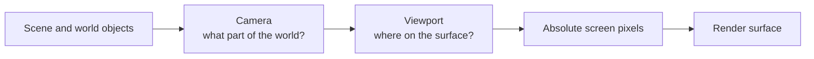
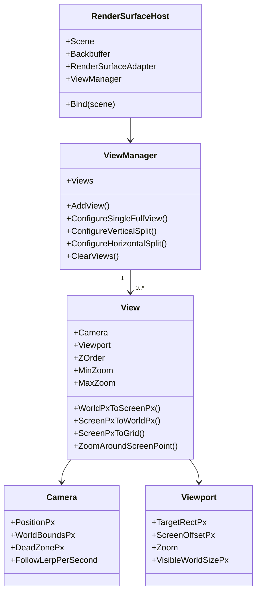
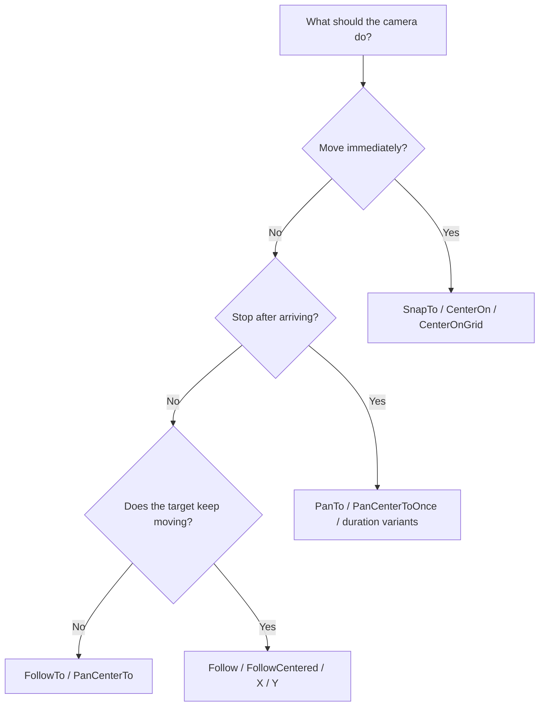
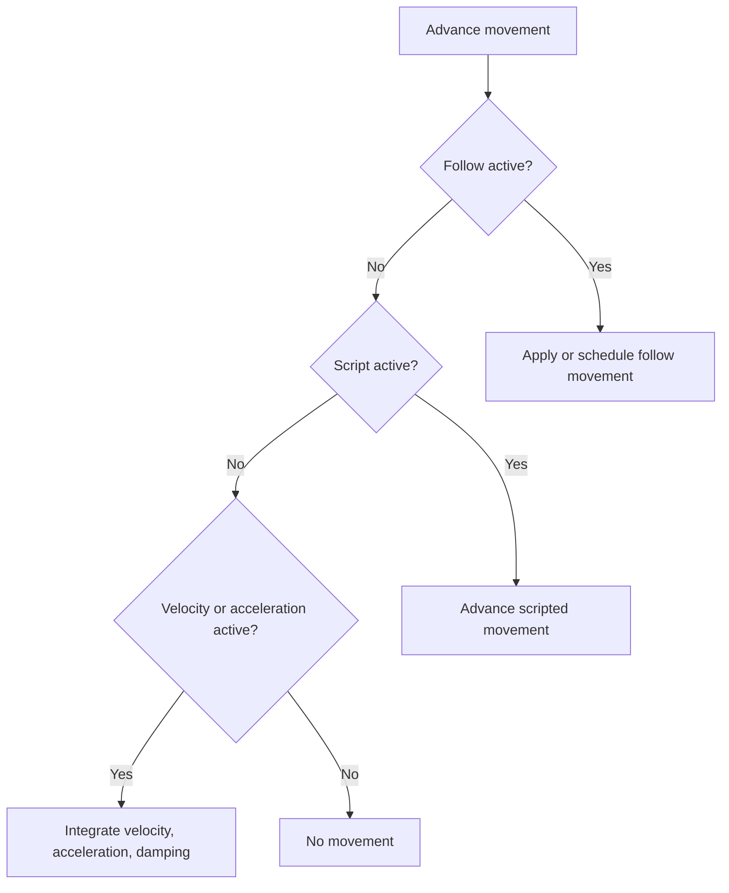

> **Rendering and Gameplay**
>
> A practical guide to controlling what the player sees in a Gondwana-hosted game.

---

## Table of Contents

- [What This Page Covers](#what-this-page-covers)
- [The Mental Model](#the-mental-model)
- [The Main Objects](#the-main-objects)
- [Getting the Primary View](#getting-the-primary-view)
- [Coordinate Spaces](#coordinate-spaces)
- [Camera and Viewport Responsibilities](#camera-and-viewport-responsibilities)
- [Understanding Camera Position](#understanding-camera-position)
- [Choosing a Camera Movement Style](#choosing-a-camera-movement-style)
- [Instant Camera Movement](#instant-camera-movement)
- [One-Shot Camera Pans](#one-shot-camera-pans)
- [Continuous Camera Following](#continuous-camera-following)
- [Dead Zones](#dead-zones)
- [Camera World Bounds](#camera-world-bounds)
- [Zooming a View](#zooming-a-view)
- [Converting Between Coordinate Spaces](#converting-between-coordinate-spaces)
- [Grid-Aware Camera Helpers](#grid-aware-camera-helpers)
- [Using Multiple Views](#using-multiple-views)
- [Common Camera Recipes](#common-camera-recipes)
- [Camera Movement vs Object Movement](#camera-movement-vs-object-movement)
- [Using MovementController](#using-movementcontroller)
- [Movement Spaces](#movement-spaces)
- [Combining Camera and Object Movement](#combining-camera-and-object-movement)
- [Common Mistakes](#common-mistakes)
- [Troubleshooting](#troubleshooting)
- [Quick Reference](#quick-reference)
- [Glossary](#glossary)
- [Related Source Files](#related-source-files)

---

## What This Page Covers

This page is for developers **using** Gondwana rather than modifying its rendering internals.

It explains how to:

- access a view and its camera;
- position or animate the camera;
- follow players and other moving objects;
- center the camera on world points or tiles;
- constrain the camera to the world;
- configure dead zones;
- zoom a view;
- convert between grid, world, and screen coordinates;
- create split-screen and picture-in-picture layouts;
- understand how camera movement differs from `MovementController`;
- choose the appropriate movement API for common game scenarios.

You do not need to understand Skia's canvas state, matrix stack, backbuffer implementation, or dirty-rectangle renderer to use these features.

For those lower-level topics, see:

- [[Understanding Skia Rendering in Gondwana]]
- [[Backbuffers]]
- [[Dirty Rectangles]]
- [[Refresh Queues]]

---

## The Mental Model

A Gondwana camera does not render anything by itself.

A **view** is the complete description of one observation of the scene:

```text
View
 ├─ Camera   → which part of the world is being observed
 └─ Viewport → where that observation appears on the render surface
```

The simplest way to think about the relationship is:

> **The camera chooses the world region. The viewport chooses its on-screen destination.**

One scene can be observed by several views at once:

- a normal full-screen game view;
- split-screen views for two players;
- a minimap;
- a picture-in-picture security camera;
- a preview panel in Gondwana Studio.

Each view has its own camera and viewport.

### What moves when the camera moves?

The scene does not physically move.

The camera position changes the world-to-screen calculation used for that view. Objects then draw at different absolute screen coordinates.



---

## The Main Objects

The relevant object structure is:

```text
RenderSurfaceHost<TBackbuffer> : RenderSurfaceHostBase
 ├─ RenderSurfaceAdapterBase
 ├─ BackbufferBase (TBackbuffer)
 ├─ ViewManager
 │    └─ 0..N View
 │         ├─ Camera
 │         └─ Viewport
 └─ Scene
      └─ Scene.Empty when no real scene is bound
```



### `RenderSurfaceHost`

The render-surface host coordinates:

- the currently bound scene;
- the backbuffer;
- the platform-specific render adapter;
- all views associated with the surface.

The host owns the `ViewManager`.

### `ViewManager`

The view manager creates, removes, orders, and updates views.

It also provides common layouts:

```csharp
host.ViewManager.ConfigureSingleFullView();

host.ViewManager.ConfigureVerticalSplit();

host.ViewManager.ConfigureHorizontalSplit();
```

Its `Views` collection is sorted by `ZOrder`, with lower values rendered behind higher values.

### `View`

A `View` combines one camera with one viewport.

It also provides the supported coordinate-conversion methods. When converting between world and screen positions, prefer the methods on `View` rather than duplicating the arithmetic elsewhere.

### `Camera`

The camera stores a world-space upper-left position and provides:

- instant positioning;
- one-shot pans;
- continuous following;
- dead zones;
- world-bound clamping;
- grid-centering helpers.

### `Viewport`

The viewport stores:

- where the view appears on the render surface;
- the view's zoom;
- an optional screen offset;
- the visible world size implied by the viewport and zoom.

---

## Getting the Primary View

When a scene is bound and no view has been configured, Gondwana creates a default full-surface view.

A common setup is:

```csharp
var host = renderSurface.Host;

host.Bind(scene);

var view = host.ViewManager.Views[0];
var camera = view.Camera;
var viewport = view.Viewport;
```

That first view is usually the primary game view.

> [!NOTE]
> `Views[0]` means the first view in current Z-order, not a permanent special "main view" identity. For complex layouts, keep references to the views you configure rather than repeatedly relying on an index.

### Configuring a single full view explicitly

```csharp
host.ViewManager.ConfigureSingleFullView(
    zoom: 1f,
    zOrder: 0);

var view = host.ViewManager.Views[0];
```

### Binding and camera limits

By default:

```csharp
host.Bind(scene);
```

limits view cameras to the scene's world bounds.

To allow cameras to move beyond the scene:

```csharp
host.Bind(
    scene,
    limitCameraToWorldBoundPx: false);
```

This can be useful for:

- editors;
- cinematic shots outside the playable map;
- debug tools;
- worlds where empty space outside the primary scene bounds is meaningful.

---

## Coordinate Spaces

Gondwana users normally work with three primary coordinate spaces.

| Name | Suggested variable suffix | Meaning | Common examples |
|---|---|---|---|
| **Grid coordinates** | `grid` | Coordinates in a layer's tile or map system | Column/row, axial hex coordinates |
| **World pixels** | `worldPx` | Pixel coordinates in scene/layer space | Sprite positions, camera position, world bounds |
| **Screen pixels** | `screenPx` | Absolute pixels on the render surface/backbuffer | Mouse position, viewport rectangle, final drawing destination |

A fourth space may appear inside a particular object:

| Name | Suggested suffix | Meaning |
|---|---|---|
| **Drawable-local pixels** | `localPx` | Coordinates relative to an image, widget, path, or custom drawing |

Drawable-local coordinates are not part of the camera system. They are useful when drawing the contents of one object.

### Grid coordinates

Grid coordinates describe a location in a scene layer's coordinate system.

Examples:

```csharp
var grid = new PointF(12, 8);
```

Depending on the layer, those values could represent:

- orthogonal column and row;
- isometric coordinates;
- hex axial coordinates;
- another supported grid system.

Grid coordinates are not necessarily pixels.

### World pixels

World pixels describe positions inside the scene.

Examples include:

```csharp
camera.PositionPx

sprite.WorldBounds

scene.GetWorldBoundsPx()
```

The name "world pixels" means the engine expresses world distances using pixel-like units. They are still logical world coordinates, not physical pixels in the adapter.

### Screen pixels

Screen pixels are absolute pixel coordinates on the render surface.

The top-left of the complete adapter or backbuffer is:

```text
(0, 0)
```

A viewport at:

```text
(400, 100, 800, 600)
```

begins at absolute screen position `(400, 100)`.

An object that appears 20 pixels inside the viewport's left edge is ultimately drawn at:

```text
screen X = 420
```

not at X = 20.

### Viewport-local values are intermediate, not a primary engine contract

A calculation may temporarily subtract the viewport origin:

```csharp
float relativeX =
    screenPx.X - viewport.TargetRectPx.Left;
```

That produces a viewport-relative value, but normal Gondwana rendering still uses absolute screen coordinates for final drawing.

The engine renders **per view**, but it does not normally hand drawables a viewport-local destination.

### The conversion chain

```text
Grid coordinates
        ↓  layer coordinate system
World pixels
        ↓  camera + parallax + zoom + viewport placement
Absolute screen pixels
        ↓
Backbuffer and adapter
```


---

## Camera and Viewport Responsibilities

Camera and viewport settings often appear together, but they answer different questions.

| Concern | Owned by | Example |
|---|---|---|
| Which world position is at the visible upper-left? | `Camera` | `Camera.PositionPx` |
| Should the camera stay inside the world? | `Camera` | `Camera.WorldBoundsPx` |
| How quickly should following react? | `Camera` | `FollowLerpPerSecond` |
| Can a target move before the camera reacts? | `Camera` | `DeadZonePx` |
| Where is the view displayed? | `Viewport` | `TargetRectPx` |
| How large is the view on screen? | `Viewport` | `TargetRectPx.Size` |
| How much world is visible? | `Viewport` | `VisibleWorldSizePx` |
| What is the scale? | `Viewport` | `Zoom` |
| Is there an extra HUD/safe-area offset? | `Viewport` | `ScreenOffsetPx` |

A useful test is:

- changing the **camera** should change what part of the world is visible;
- changing the **viewport** should change where or how that view appears on the adapter.

---

## Understanding Camera Position

`Camera.PositionPx` is the world-pixel location of the camera's **upper-left**.

It is not the camera center.

Suppose the visible world size is:

```text
1280 × 720 world pixels
```

and:

```csharp
camera.PositionPx = new PointF(1000, 500);
```

Then the visible world region begins at approximately:

```text
left = 1000
top  = 500
```

and extends according to the viewport's visible world size.

### Upper-left versus center APIs

Gondwana intentionally provides both styles.

#### Upper-left methods

These interpret the target as the desired camera upper-left:

```csharp
camera.SnapTo(worldUpperLeftPx);

camera.PanTo(worldUpperLeftPx, speed);

camera.PanToOverDuration(
    worldUpperLeftPx,
    durationSeconds);
```

#### Center methods

These interpret the target as a world point that should appear in the center of the view:

```csharp
camera.CenterOn(worldCenterPx);

camera.PanCenterToOnce(
    worldCenterPx,
    speed);

camera.PanCenterToOverDuration(
    worldCenterPx,
    durationSeconds);
```

Center methods internally account for the visible world size.

### A common mistake

This looks reasonable but centers the wrong location:

```csharp
camera.SnapTo(playerWorldCenterPx);
```

`SnapTo` treats the player's center as the camera's upper-left.

Use:

```csharp
camera.CenterOn(playerWorldCenterPx);
```

or continuous following:

```csharp
camera.FollowCentered(player);
```

---

## Choosing a Camera Movement Style

Camera methods fall into three broad categories.

| Category | Behavior | Best for |
|---|---|---|
| **Instant** | Camera moves immediately | Initialization, teleporting, editor navigation |
| **One-shot** | Camera moves toward a destination and stops | Cutscenes, inspection, transitions |
| **Continuous** | Camera keeps evaluating or tracking a target | Gameplay follow cameras |



### Full camera method summary

| Method | Input meaning | Type | Stops automatically? |
|---|---|---|:---:|
| `SnapTo` | Camera upper-left in world pixels | Instant | Yes |
| `PanBy` | Relative upper-left delta | Instant | Yes |
| `CenterOn` | World point to center | Instant | Yes |
| `CenterOnGrid` | Grid cell to center | Instant | Yes |
| `PanTo` | Camera upper-left | One-shot, speed-based | Yes |
| `PanToOverDuration` | Camera upper-left | One-shot, duration-based | Yes |
| `PanCenterToOnce` | World point to center | One-shot, speed-based | Yes |
| `PanCenterToOverDuration` | World point to center | One-shot, duration-based | Yes |
| `PanToGridOverDuration` | Grid cell to center | One-shot, duration-based | Yes |
| `Follow` | Dynamic world point | Continuous | No |
| `FollowTo` | Fixed world point | Continuous | No |
| `FollowCentered` | Movable target | Continuous | No |
| `FollowCenteredX` | Movable target's X | Continuous | No |
| `FollowCenteredY` | Movable target's Y | Continuous | No |
| `PanCenterTo` | Fixed world center | Continuous | No |
| `AnimateCenterOnGrid` | Fixed tile center | Continuous | No |
| `ClearFollow` | — | Cancellation | — |

> [!NOTE]
> There is currently no speed-based `PanToGrid(...)` method. Use `CenterOnGrid`, `AnimateCenterOnGrid`, or `PanToGridOverDuration`.

---

## Instant Camera Movement

### `SnapTo`

`SnapTo` immediately places the camera's upper-left at a world-pixel location.

```csharp
camera.SnapTo(
    new PointF(1200, 640));
```

Use it for:

- initial placement;
- teleport transitions;
- debug commands;
- editor navigation;
- restoring a saved camera position.

`SnapTo` applies world-bound clamping.

### `PanBy`

`PanBy` applies an immediate relative delta.

```csharp
camera.PanBy(
    new PointF(100, 0));
```

This moves the camera 100 world pixels to the right.

Typical keyboard navigation:

```csharp
const float step = 100f;

switch (key)
{
    case Keys.Left:
        camera.PanBy(new PointF(-step, 0));
        break;

    case Keys.Right:
        camera.PanBy(new PointF(step, 0));
        break;

    case Keys.Up:
        camera.PanBy(new PointF(0, -step));
        break;

    case Keys.Down:
        camera.PanBy(new PointF(0, step));
        break;
}
```

### `CenterOn`

`CenterOn` immediately places a world point at the visual center of the view.

```csharp
camera.CenterOn(
    playerWorldCenterPx);
```

This is usually a better initialization method than manually subtracting half the viewport size.

### `CenterOnGrid`

`CenterOnGrid` immediately centers a tile.

```csharp
camera.CenterOnGrid(
    layer,
    col: 20,
    row: 12);
```

Gondwana asks the layer's coordinate system for the tile's world anchor and offsets by half the tile size.

That means the same call works with the layer's supported coordinate system rather than assuming an orthogonal grid.

### Instant moves do not necessarily cancel existing behavior

`SnapTo` and `PanBy` reposition the camera, but they do not explicitly clear all existing follow or pan state.

If the camera is already following something, the follow may continue on the next update.

To take permanent manual control:

```csharp
camera.ClearFollow();
camera.SnapTo(newPosition);
```

---

## One-Shot Camera Pans

One-shot pans move toward a destination and stop when the destination is reached.

They are appropriate for:

- cinematic shots;
- room-entry pans;
- inspecting an objective;
- moving from one conversation participant to another;
- focusing a selected object in an editor.

### Speed-based versus duration-based

| Style | You specify | Use when |
|---|---|---|
| Speed-based | Responsiveness/lerp rate | You care how sharp or floaty movement feels |
| Duration-based | Approximate arrival time | You care how long a transition takes |

Both use smooth exponential movement rather than a constant linear speed.

### `PanTo`

`PanTo` moves the camera's upper-left toward a target.

```csharp
camera.PanTo(
    new PointF(1800, 900),
    speed: 6f);
```

Higher speeds feel snappier.

Lower speeds feel more gradual.

A speed less than or equal to zero snaps immediately.

### `PanToOverDuration`

`PanToOverDuration` moves the camera's upper-left over an approximate duration.

```csharp
camera.PanToOverDuration(
    new PointF(1800, 900),
    durationSeconds: 1.5f);
```

The implementation calculates an exponential smoothing rate that covers approximately 99% of the distance in the requested time.

That means the duration is intentionally approximate rather than an exact linear arrival timestamp.

### `PanCenterToOnce`

This method pans until a world point is centered, then stops.

```csharp
camera.PanCenterToOnce(
    boss.WorldCenterPx,
    speed: 7f);
```

Use this instead of manually calculating the desired upper-left.

### `PanCenterToOverDuration`

This method centers a world point over an approximate duration.

```csharp
camera.PanCenterToOverDuration(
    objectiveWorldPx,
    durationSeconds: 2f);
```

This is a useful cutscene primitive.

### `PanToGridOverDuration`

This method centers a tile over an approximate duration.

```csharp
camera.PanToGridOverDuration(
    layer,
    col: 32,
    row: 14,
    durationSeconds: 1.25f);
```

### Starting a one-shot pan cancels continuous follow

`PanTo` and `PanToOverDuration` take direct upper-left control and clear center-follow state.

A common cutscene sequence is therefore:

```csharp
camera.PanCenterToOverDuration(
    objectiveWorldPx,
    1.5f);

// Later, after the shot:
camera.FollowCentered(player);
```

At present, the camera does not expose a built-in pan-completed event. Game code that needs a precise sequence may:

- use its own timer;
- compare `PositionPx` with the expected target;
- wrap camera control in a higher-level cinematic controller;
- restore follow after the intended duration.

---

## Continuous Camera Following

Continuous follow remains active until cancelled or replaced.

### `Follow`

`Follow` accepts a function that returns a world-space point each update.

```csharp
camera.Follow(
    () => GetPlayerCenterWorldPx(),
    hardFollow: false);
```

This is the most flexible camera-follow API.

The target function can return:

- a player's center;
- a midpoint between two players;
- a scripted point of interest;
- a weighted party center;
- the center of the currently selected editor object.

### Hard follow

Hard follow snaps to the desired camera position every update.

```csharp
camera.Follow(
    () => GetPlayerCenterWorldPx(),
    hardFollow: true);
```

Use hard follow when:

- the camera must remain rigidly attached;
- smoothing would expose unwanted map edges;
- a retro presentation requires exact tracking;
- a tool view must match an object exactly.

### Smooth follow

Smooth follow uses `FollowLerpPerSecond`.

```csharp
camera.FollowLerpPerSecond = 8f;

camera.Follow(
    () => GetPlayerCenterWorldPx());
```

Higher values react more quickly.

Lower values produce more camera lag.

A value less than or equal to zero results in snapping behavior.

### `FollowTo`

`FollowTo` follows a fixed world point.

```csharp
camera.FollowTo(
    new PointF(2400, 1200));
```

This sounds similar to a one-shot pan, but it is **continuous follow state**.

After reaching the point, follow remains active.

Use it when that persistent state is desirable. Use a one-shot pan when the camera should stop owning an ongoing target after arrival.

### `FollowCentered`

`FollowCentered` follows an `IMovableOnSceneLayer` and centers it.

```csharp
camera.FollowCentered(
    player,
    speed: 8f,
    hard: false);
```

For grid-space targets, Gondwana converts the tile coordinate into its world-pixel center.

For pixel-space targets, the target's reported position is treated as the point of interest.

### `FollowCenteredX`

This follows only the target's horizontal movement.

```csharp
camera.FollowCenteredX(
    player,
    speed: 7f);
```

The camera's vertical position remains anchored.

Useful for:

- side-scrolling platformers;
- horizontal runners;
- games with fixed vertical framing.

### `FollowCenteredY`

This follows only the target's vertical movement.

```csharp
camera.FollowCenteredY(
    player,
    speed: 7f);
```

The camera's horizontal position remains anchored.

Useful for:

- vertical shooters;
- elevator or climbing sequences;
- vertically constrained maps.

### `PanCenterTo`

Despite its name, `PanCenterTo` is continuous follow behavior.

```csharp
camera.PanCenterTo(
    fixedWorldPoint,
    speed: 5f);
```

It calls the follow system with a fixed point.

Use `PanCenterToOnce` when the camera should arrive and stop.

### `AnimateCenterOnGrid`

`AnimateCenterOnGrid` continuously follows the fixed center of a tile.

```csharp
camera.AnimateCenterOnGrid(
    layer,
    col: 18,
    row: 9,
    speed: 5f);
```

Use `PanToGridOverDuration` for a one-shot tile-centered pan.

### Cancelling follow

```csharp
camera.ClearFollow();
```

`ClearFollow` clears:

- continuous follow;
- active one-shot pan targets;
- hard-follow state.

The camera stays at its current position.

---

## Dead Zones

A dead zone allows the follow target to move within an area before the camera reacts.

Without a dead zone, a smooth camera usually tries to keep the target centered.

With a dead zone:

- the target may move freely inside the zone;
- the camera begins moving only when the target leaves it;
- the camera moves just enough to contain the target again.

This often feels more natural in gameplay.

### Configuring a dead zone

```csharp
camera.DeadZonePx = new Rectangle(
    x: 320,
    y: 180,
    width: 640,
    height: 360);
```

The rectangle is positioned relative to the visible world region's upper-left and measured in world-pixel units.

At the intended 1:1 zoom, those values correspond directly to visible screen distances.

### A centered dead zone helper

Given the visible world size:

```csharp
SizeF visible = viewport.VisibleWorldSizePx;
```

a centered dead zone can be calculated as:

```csharp
float deadZoneWidth = visible.Width * 0.40f;
float deadZoneHeight = visible.Height * 0.35f;

camera.DeadZonePx = new Rectangle(
    x: (int)((visible.Width - deadZoneWidth) * 0.5f),
    y: (int)((visible.Height - deadZoneHeight) * 0.5f),
    width: (int)deadZoneWidth,
    height: (int)deadZoneHeight);
```

### Empty dead zone

```csharp
camera.DeadZonePx = Rectangle.Empty;
```

An empty dead zone means the follow system targets the normal centered camera position.

### Dead zones and zoom

Because the dead zone is interpreted within the visible world region, changing zoom changes the relationship between dead-zone world units and physical screen pixels.

A game that allows large zoom changes may recalculate the dead zone after zooming.

### Dead-zone design guidance

| Game style | Typical dead-zone behavior |
|---|---|
| Top-down action | Moderate centered rectangle |
| Side-scroller | Wider horizontally, tighter vertically |
| Precision platformer | Small zone or hard follow |
| Exploration game | Larger zone for looser camera |
| Editor | Usually none; direct navigation is preferable |

---

## Camera World Bounds

`Camera.WorldBoundsPx` constrains the camera's upper-left.

```csharp
camera.WorldBoundsPx =
    scene.GetWorldBoundsPx();
```

When bounds are active, the camera is clamped so that the visible world region does not normally extend beyond the world.

### Automatic world bounds

The default binding call:

```csharp
host.Bind(scene);
```

uses scene world bounds.

### Disabling bounds

```csharp
host.Bind(
    scene,
    limitCameraToWorldBoundPx: false);
```

or:

```csharp
camera.WorldBoundsPx =
    RectangleF.Empty;
```

An empty rectangle disables clamping.

### What happens when the viewport is larger than the world?

If the visible world width or height exceeds the corresponding world bounds, Gondwana clamps that axis to the world's minimum position.

This prevents invalid `Math.Clamp` ranges.

The result is stable, but the world may occupy only part of the view unless other rendering fills the surrounding area.

### Bounds and zoom

Changing zoom changes the visible world size.

Therefore the valid camera upper-left range also changes.

A camera near the right or bottom edge may be clamped to a new position after a zoom change.

### Bounds and parallax

The camera has one world-bound rectangle, but each layer may apply a different parallax factor during projection.

Camera bounds normally represent the primary gameplay world. Decorative parallax layers may still appear offset or expose different content depending on their design.

---

## Zooming a View

Zoom belongs to the `Viewport`, not the `Camera`.

The intended public behavior is:

| Zoom | Meaning |
|---:|---|
| `1f` | 1:1 |
| `> 1f` | Zoom in |
| `< 1f` | Zoom out |

### Set zoom immediately

```csharp
viewport.SnapZoom(2f);
```

or:

```csharp
viewport.Zoom = 2f;
```

`SnapZoom` also clears any active zoom animation.

### Smooth zoom by response rate

```csharp
viewport.ZoomTo(
    targetZoom: 2f,
    lerpPerSecond: 6f);
```

Higher rates react more quickly.

### Smooth zoom by duration

```csharp
viewport.ZoomToOverDuration(
    targetZoom: 2f,
    durationSeconds: 0.75f);
```

Like duration-based camera pans, this uses an exponential model and reaches approximately 99% of the target in the requested time.

### Zoom limits

Each view has:

```csharp
view.MinZoom
view.MaxZoom
```

Defaults are currently:

```text
MinZoom = 0.1
MaxZoom = 8
```

`View.ZoomAroundScreenPoint` clamps its target using these values.

Directly assigning `Viewport.Zoom` does not automatically use the `View` limits, so user code should clamp explicit assignments:

```csharp
float targetZoom =
    Math.Clamp(requestedZoom, view.MinZoom, view.MaxZoom);

viewport.SnapZoom(targetZoom);
```

### Zoom around the mouse pointer

`ZoomAroundScreenPoint` changes both:

- viewport zoom;
- camera position.

It keeps the same world location under the chosen screen point during the zoom.

```csharp
view.ZoomAroundScreenPoint(
    layer,
    screenPoint: mouseScreenPx,
    targetZoom: 1.5f,
    durationSeconds: 0.3f);
```

This is ideal for:

- map controls;
- editors;
- strategy games;
- inspection tools.

The supplied layer matters because its parallax participates in the conversion. Use the primary gameplay layer, usually with parallax `1f`, unless the zoom is intentionally anchored to another layer.

### Zooming around view center

```csharp
Rectangle vp = viewport.TargetRectPx;

var centerScreenPx = new PointF(
    vp.Left + vp.Width * 0.5f,
    vp.Top + vp.Height * 0.5f);

view.ZoomAroundScreenPoint(
    gameplayLayer,
    centerScreenPx,
    targetZoom,
    durationSeconds: 0.4f);
```

### Mouse-wheel example

```csharp
void ZoomFromMouseWheel(
    View view,
    SceneLayer layer,
    PointF mouseScreenPx,
    int wheelDelta)
{
    float factor = wheelDelta > 0
        ? 1.15f
        : 1f / 1.15f;

    float target =
        Math.Clamp(
            view.Viewport.Zoom * factor,
            view.MinZoom,
            view.MaxZoom);

    view.ZoomAroundScreenPoint(
        layer,
        mouseScreenPx,
        target,
        durationSeconds: 0.15f);
}
```

---

## Converting Between Coordinate Spaces

Use the conversion methods on `View`.

These methods already account for:

- camera position;
- layer parallax;
- viewport position;
- viewport screen offset;
- zoom.

### World point to screen point

```csharp
PointF screenPx =
    view.WorldPxToScreenPx(
        layer,
        worldPx);
```

Use this for:

- screen-space labels attached to world objects;
- editor handles;
- targeting indicators;
- custom overlays;
- debug visualization.

### Screen point to world point

```csharp
PointF worldPx =
    view.ScreenPxToWorldPx(
        layer,
        mouseScreenPx);
```

Use this for:

- mouse picking;
- placing objects;
- selecting map locations;
- converting touch input into world interactions.

### Screen point to grid coordinate

```csharp
PointF grid =
    view.ScreenPxToGrid(
        layer,
        mouseScreenPx);
```

This performs:

```text
screen → world → layer grid
```

Use it for:

- tile painting;
- tile selection;
- grid-based commands;
- editor cursors.

### World rectangle to screen rectangle

```csharp
RectangleF screenRect =
    view.WorldRectToScreenRect(
        layer,
        worldRect);
```

Use this for:

- world-bound UI overlays;
- debug rectangles;
- screen-space culling;
- visual selection boxes.

### Screen rectangle to world rectangle

```csharp
RectangleF worldRect =
    view.ScreenRectToWorldRect(
        layer,
        screenRect);
```

Use this for:

- selection marquees;
- querying visible objects;
- editor region tools;
- converting viewport extents into layer queries.

### Conversion methods use absolute screen coordinates

The screen point passed to and returned from these methods is relative to the **whole render surface**, not merely the viewport's upper-left.

For a viewport located at `(400, 100)`, a mouse click inside that viewport may have coordinates such as `(620, 340)`.

Do not subtract `TargetRectPx.Left` and `Top` unless a lower-level API specifically asks for viewport-local values.

### Different layers can produce different world results

Parallax is a layer property.

Therefore:

```csharp
view.ScreenPxToWorldPx(backgroundLayer, mouse);
```

may produce a different world point from:

```csharp
view.ScreenPxToWorldPx(gameplayLayer, mouse);
```

Choose the layer that owns the interaction.

---

## Grid-Aware Camera Helpers

Gondwana's grid helpers use the layer's coordinate system rather than assuming that every map is orthogonal.

### Center immediately on a tile

```csharp
camera.CenterOnGrid(
    layer,
    col,
    row);
```

### Continuously follow a fixed tile center

```csharp
camera.AnimateCenterOnGrid(
    layer,
    col,
    row,
    speed);
```

Remember that this is continuous follow state.

### Pan once to a tile over time

```csharp
camera.PanToGridOverDuration(
    layer,
    col,
    row,
    durationSeconds);
```

### Convert a tile to a world point manually

```csharp
PointF anchorWorldPx =
    layer.GridToWorldPx(
        new PointF(col, row));

PointF tileCenterWorldPx =
    new PointF(
        anchorWorldPx.X + layer.TileWidth * 0.5f,
        anchorWorldPx.Y + layer.TileHeight * 0.5f);
```

Use the built-in camera helpers when their behavior matches the goal. Manual conversion is useful when:

- centering on a point within the tile other than its middle;
- offsetting the shot;
- building a custom cinematic composition.

### Grid positions can be fractional

Many coordinate APIs use `PointF` or `Vector2`.

That allows:

- smooth movement through grid space;
- partial tile offsets;
- interpolation;
- nonorthogonal coordinate systems.

Do not automatically round grid values unless gameplay semantics require whole-cell positions.

---

## Using Multiple Views

A render surface can display several views of the same scene.

Each view has independent:

- camera position;
- zoom;
- viewport rectangle;
- screen offset;
- Z-order.

### Vertical split-screen

```csharp
host.ViewManager.ConfigureVerticalSplit(
    leftZoom: 1f,
    rightZoom: 1f);

var leftView = host.ViewManager.Views[0];
var rightView = host.ViewManager.Views[1];

leftView.Camera.FollowCentered(playerOne);
rightView.Camera.FollowCentered(playerTwo);
```

### Horizontal split-screen

```csharp
host.ViewManager.ConfigureHorizontalSplit(
    topZoom: 1f,
    bottomZoom: 1f);

var topView = host.ViewManager.Views[0];
var bottomView = host.ViewManager.Views[1];
```

### Picture-in-picture

```csharp
host.ViewManager.ConfigureSingleFullView();

host.ViewManager.AddView(
    targetRectPx: new Rectangle(
        x: host.RenderSurfaceAdapter.Width - 340,
        y: 20,
        width: 320,
        height: 180),
    zoom: 1.5f,
    zOrder: 100,
    worldBoundsPx: scene.GetWorldBoundsPx());

var insetView =
    host.ViewManager.Views
        .OrderByDescending(v => v.ZOrder)
        .First();

insetView.Camera.CenterOn(
    objectiveWorldPx);
```

The higher Z-order causes the inset to render above the main view.

### Custom view layouts

```csharp
host.ViewManager.ClearViews();

host.ViewManager.AddView(
    new Rectangle(0, 0, 960, 1080),
    zoom: 1f,
    zOrder: 0,
    worldBoundsPx: scene.GetWorldBoundsPx());

host.ViewManager.AddView(
    new Rectangle(960, 0, 960, 1080),
    zoom: 1f,
    zOrder: 1,
    worldBoundsPx: scene.GetWorldBoundsPx());
```

### Keep references when the layout matters

Because `Views` is sorted by Z-order, it is safer to resolve views immediately after creating a known layout or identify them through your own game-side structure.

For a larger project, consider wrapping view creation:

```csharp
public sealed class GameViews
{
    public required View Main { get; init; }
    public required View Minimap { get; init; }
}
```

### View rectangles are absolute screen rectangles

Each `TargetRectPx` is measured against the whole render surface.

```csharp
view.Viewport.TargetRectPx =
    new Rectangle(
        left,
        top,
        width,
        height);
```

The view does not establish a separate origin for normal drawable rendering.

### Adapter resizing

When the render surface resizes, the host currently rescales each viewport rectangle proportionally.

That preserves the broad layout but may not preserve exact UI design constraints.

For a production layout, especially in Studio, you may reapply intentional view rectangles after resize based on:

- docked panels;
- aspect ratios;
- safe areas;
- minimum sizes;
- editor layout state.

---

## Common Camera Recipes

### Follow the player

```csharp
var view = host.ViewManager.Views[0];

view.Camera.FollowLerpPerSecond = 8f;
view.Camera.FollowCentered(player);
```

### Follow the player with a dead zone

```csharp
var view = host.ViewManager.Views[0];
var camera = view.Camera;
var visible = view.Viewport.VisibleWorldSizePx;

camera.FollowLerpPerSecond = 7f;

camera.DeadZonePx = new Rectangle(
    x: (int)(visible.Width * 0.30f),
    y: (int)(visible.Height * 0.30f),
    width: (int)(visible.Width * 0.40f),
    height: (int)(visible.Height * 0.40f));

camera.FollowCentered(player);
```

### Side-scroller camera

```csharp
camera.FollowLerpPerSecond = 6f;

camera.DeadZonePx = new Rectangle(
    x: 380,
    y: 220,
    width: 520,
    height: 220);

camera.FollowCenteredX(player);
```

This keeps vertical framing fixed while allowing horizontal tracking.

### Camera look-ahead

Use `Follow` and offset the target based on movement direction:

```csharp
camera.Follow(() =>
{
    PointF center = player.GetWorldCenterPx();

    float lookAheadX =
        Math.Sign(playerVelocity.X) * 160f;

    return new PointF(
        center.X + lookAheadX,
        center.Y);
});
```

For a smoother look-ahead, interpolate the offset separately rather than switching it instantly.

### Midpoint between two players

```csharp
camera.Follow(() =>
{
    PointF a = playerOne.GetWorldCenterPx();
    PointF b = playerTwo.GetWorldCenterPx();

    return new PointF(
        (a.X + b.X) * 0.5f,
        (a.Y + b.Y) * 0.5f);
});
```

A more advanced implementation may also adjust zoom based on player separation.

### Cinematic objective shot

```csharp
camera.ClearFollow();

camera.PanCenterToOverDuration(
    objectiveWorldPx,
    durationSeconds: 1.25f);
```

Later:

```csharp
camera.FollowCentered(
    player,
    speed: 8f);
```

### Keyboard camera navigation

Smooth one-shot steps:

```csharp
PointF current = camera.PositionPx;

switch (key)
{
    case Keys.W:
        camera.PanToOverDuration(
            new PointF(current.X, current.Y - 100),
            0.25f);
        break;

    case Keys.S:
        camera.PanToOverDuration(
            new PointF(current.X, current.Y + 100),
            0.25f);
        break;

    case Keys.A:
        camera.PanToOverDuration(
            new PointF(current.X - 100, current.Y),
            0.25f);
        break;

    case Keys.D:
        camera.PanToOverDuration(
            new PointF(current.X + 100, current.Y),
            0.25f);
        break;
}
```

For editor-style drag panning, use `ClearFollow()` and `PanBy()`.

### Click to center

```csharp
PointF worldPx =
    view.ScreenPxToWorldPx(
        gameplayLayer,
        mouseScreenPx);

camera.PanCenterToOverDuration(
    worldPx,
    durationSeconds: 0.5f);
```

### Click a tile to center it

```csharp
PointF grid =
    view.ScreenPxToGrid(
        layer,
        mouseScreenPx);

camera.PanToGridOverDuration(
    layer,
    col: (int)MathF.Floor(grid.X),
    row: (int)MathF.Floor(grid.Y),
    durationSeconds: 0.5f);
```

The appropriate rounding rule depends on the layer's coordinate system and desired selection behavior.

---

## Camera Movement vs Object Movement

The camera and `MovementController` solve different problems.

| System | Changes | Visual consequence |
|---|---|---|
| `Camera` | Which world region a view observes | The entire world appears to move relative to that view |
| `MovementController` | An object's position | That particular object moves through its coordinate space |
| `Viewport` | Where and how the view is displayed | The rendered observation moves or scales on the adapter |

A player may move because of `MovementController`, while the camera continuously follows the player's resulting position.

```text
Input
  ↓
Player MovementController
  ↓
Player position changes
  ↓
Camera follow evaluates player position
  ↓
View projection changes
  ↓
Scene renders to screen
```

### Do not move the camera with `MovementController`

`Camera` has its own movement system.

It does not implement `IMovable` and is not controlled by the ordinary object `MovementController`.

Use camera methods for the camera.

Use `MovementController` for sprites, movable direct drawings, and other `IMovable` objects.

---

## Using MovementController

`MovementController` provides three movement families:

1. follow;
2. scripted movement;
3. integrated movement.

They run in this priority order:



### Movement family summary

| Family | Common methods | Behavior | Typical use |
|---|---|---|---|
| **Follow** | `FollowPixelSoft`, `FollowPixelHard`, `FollowTileSoft`, `FollowTileHard` | Tracks a target | Name tags, companions, attached effects |
| **Scripted** | `MoveTo`, `MoveBy`, `MoveToward` | Moves toward an authored destination | UI motion, doors, cutscenes |
| **Integrated** | `SetVelocity`, `SetAcceleration`, `SetMaxSpeed`, `SetLinearDamping` | Physics-style continuous motion | Players, projectiles, momentum |

### Follow movement

#### Pixel target, soft follow

```csharp
drawing.Movement.FollowPixelSoft(
    getPixelPos: () => target.GetPosition(),
    speed: 240f,
    snap: 0.5f,
    offsetPx: new Vector2(0, -24));
```

#### Pixel target, hard follow

```csharp
drawing.Movement.FollowPixelHard(
    () => target.GetPosition(),
    offsetPx: new Vector2(0, -24));
```

#### Tile target, soft follow

```csharp
nameTag.Movement.FollowTileSoft(
    tileTarget: player,
    speedTilesPerSec: 4f,
    snapTiles: 0.1f,
    gridOffset: new Vector2(0, -0.75f));
```

#### Tile target, hard follow

```csharp
nameTag.Movement.FollowTileHard(
    player,
    gridOffset: new Vector2(0, -0.75f));
```

### Scripted movement

#### Move to an absolute position over a duration

```csharp
mover.Movement.MoveTo(
    target: new Vector2(640, 360),
    durationSec: 1f);
```

With easing:

```csharp
mover.Movement.MoveTo(
    target: new Vector2(640, 360),
    seconds: 1f,
    easingKind: EasingKind.EaseInOut);
```

#### Move by a relative amount

```csharp
mover.Movement.MoveBy(
    delta: new Vector2(100, 0),
    durationSec: 0.5f);
```

#### Move toward at a constant speed

```csharp
mover.Movement.MoveToward(
    target: new Vector2(640, 360),
    speedPerSec: 200f);
```

#### Completion callback

```csharp
mover.Movement
    .MoveTo(
        new Vector2(640, 360),
        1f)
    .OnComplete(() =>
    {
        OpenDoor();
    });
```

### Integrated movement

#### Velocity

```csharp
mover.Movement.SetVelocity(
    new Vector2(180f, 0f));
```

#### Acceleration

```csharp
mover.Movement.SetAcceleration(
    new Vector2(0f, 600f));
```

#### Maximum speed

```csharp
mover.Movement.SetMaxSpeed(
    300f);
```

#### Damping

```csharp
mover.Movement.SetLinearDamping(
    4f);
```

Damping gradually reduces velocity and is frame-rate independent.

### Movement priority consequences

Follow has priority over scripts and integrated motion.

That means:

```csharp
mover.Movement.SetVelocity(...);
```

may not visibly move the object while a follow target remains active.

Call:

```csharp
mover.Movement.Unfollow();
```

before taking manual or physics control.

Starting scripted or integrated methods may cancel portions of other movement state, but follow remains the highest-level owner until removed.

### Stop everything

```csharp
mover.Movement.StopAllMovement();
```

This clears follow, cancels script state, and zeros velocity and acceleration.

---

## Movement Spaces

`MovementSpace` has two values:

```csharp
MovementSpace.Grid
MovementSpace.Pixel
```

The names describe the units used by the movable.

### Grid movement

Grid-space positions are expressed in layer coordinates.

Examples:

```text
(5, 3)
(12.5, 8)
(q, r) for an axial coordinate system
```

Speeds and snap tolerances are generally interpreted in tiles or grid units.

### Pixel movement

Pixel-space movement means the position is expressed in pixels—but the kind of pixel still depends on context.

| Object context | `MovementSpace.Pixel` means |
|---|---|
| Scene-layer object | World pixels |
| View-mode object | Absolute screen pixels |
| General standalone mover | Whatever pixel coordinate system its implementation defines |

### Direct drawings

`DirectDrawingMovableBase` always reports:

```csharp
MovementSpace.Pixel
```

For scene-layer mode:

```text
position = world-pixel upper-left
```

For view mode:

```text
position = screen-pixel upper-left
```

This distinction is critical when following another object or supplying offsets.

### Units follow the mover

For `MoveTo`, `MoveBy`, velocity, acceleration, and many follow settings:

> Values are interpreted in the movable object's own position space.

A speed of `5` means:

- 5 grid units per second for a grid mover;
- 5 pixels per second for a pixel mover.

### Cross-space following

`MovementController` can convert between pixel and grid targets when it has access to the relevant scene layer and coordinate system.

This is useful, but explicit matching spaces remain easier to reason about.

Prefer:

- grid follower → grid target;
- pixel follower → pixel target;

unless cross-space behavior is intentionally required.

---

## Combining Camera and Object Movement

### Player physics plus camera follow

```csharp
player.Movement.SetMaxSpeed(280f);
player.Movement.SetLinearDamping(5f);

view.Camera.FollowLerpPerSecond = 8f;
view.Camera.FollowCentered(player);
```

Input updates the player's acceleration:

```csharp
player.Movement.SetAcceleration(
    new Vector2(inputX * 900f, inputY * 900f));
```

The player moves through world or grid space.

The camera follows the player's updated position.

### Moving name tag attached to a player

```csharp
nameTag.Movement.FollowTileSoft(
    player,
    speedTilesPerSec: 8f,
    snapTiles: 0.05f,
    gridOffset: new Vector2(0f, -0.75f));
```

The name tag moves because of its own `MovementController`.

The camera may independently follow the player.

### Screen-space HUD should not follow the camera

A HUD element associated with a view should use view mode and absolute screen bounds.

```csharp
var hudBounds = new Rectangle(
    view.Viewport.TargetRectPx.Left + 20,
    view.Viewport.TargetRectPx.Top + 20,
    240,
    80);
```

Do not convert those bounds through `WorldPxToScreenPx`.

### World-space label without movement following

A label can also be manually positioned from a world object each frame:

```csharp
PointF screen =
    view.WorldPxToScreenPx(
        player.SceneLayer,
        playerWorldPx);

label.ScreenBounds =
    new Rectangle(
        (int)screen.X,
        (int)screen.Y - 30,
        160,
        24);
```

Choose between:

- a scene-layer direct drawing that naturally projects with the world;
- a view-mode label manually projected into screen space;
- a movable drawing following through `MovementController`.

The best option depends on whether the object should:

- appear once per view;
- be clipped with the scene layer;
- remain fixed-size on screen;
- participate in screen-space input.

---

## Common Mistakes

### Treating `Camera.PositionPx` as the center

Wrong:

```csharp
camera.SnapTo(playerCenter);
```

Correct:

```csharp
camera.CenterOn(playerCenter);
```

or:

```csharp
camera.FollowCentered(player);
```

### Using a continuous method for a one-shot pan

This remains active:

```csharp
camera.PanCenterTo(point, speed);
```

This stops after arriving:

```csharp
camera.PanCenterToOnce(point, speed);
```

### Assuming `SnapTo` cancels follow

```csharp
camera.SnapTo(newPosition);
```

may be followed by another follow update.

Use:

```csharp
camera.ClearFollow();
camera.SnapTo(newPosition);
```

### Subtracting the viewport origin twice

The conversion methods already include `TargetRectPx.Left` and `Top`.

Wrong:

```csharp
PointF screen =
    view.WorldPxToScreenPx(layer, world);

screen.X += view.Viewport.TargetRectPx.Left;
screen.Y += view.Viewport.TargetRectPx.Top;
```

Correct:

```csharp
PointF screen =
    view.WorldPxToScreenPx(layer, world);
```

### Treating final screen coordinates as viewport-local

Normal final draw coordinates are absolute adapter coordinates.

A point at screen `(620, 340)` inside a viewport at `(400, 100)` should normally remain `(620, 340)` when passed to Gondwana's screen-space drawing APIs.

### Ignoring layer parallax during conversion

Wrong:

```csharp
view.ScreenPxToWorldPx(
    arbitraryLayer,
    mouse);
```

Use the layer that owns the object or interaction.

### Applying camera movement to view-mode UI

View-mode UI is already screen-space.

Do not manually subtract camera position.

### Setting velocity while follow is active

Follow owns the movement frame first.

Call:

```csharp
mover.Movement.Unfollow();
```

before relying on integrated velocity.

### Using pixel units without identifying the pixel space

Write variable names such as:

```csharp
worldPx
screenPx
offsetWorldPx
offsetScreenPx
```

Avoid:

```csharp
position
offset
rect
```

when the space is not otherwise obvious.

### Assuming every pixel-space target position is its center

Custom `IMovable` implementations may report a top-left position.

When centering a camera, supply an explicit center delegate when needed:

```csharp
camera.Follow(
    () => customObject.GetCenterWorldPx());
```

---

## Troubleshooting

### The camera does not move

Check:

1. Is the expected view the one being rendered?
2. Is the camera clamped by `WorldBoundsPx`?
3. Is the world smaller than the visible world region?
4. Is a follow or pan target immediately replacing your manual move?
5. Is the scene actually bound to the render-surface host?

### The camera moves and then snaps back

A continuous follow is probably still active.

```csharp
camera.ClearFollow();
```

before manual movement.

### The camera centers beside the target

Check whether the supplied point is:

- top-left;
- anchor point;
- center.

Use a center method only with a true point of interest.

### The target is centered incorrectly at different zoom levels

Check:

- visible world size;
- zoom convention in the current engine version;
- whether the camera target was calculated manually using screen size instead of visible world size.

Prefer built-in center methods.

### Mouse picking is offset in a secondary view

Check that the mouse position is passed as absolute adapter coordinates.

Do not first make it viewport-local unless the called API requires that.

Also confirm the correct `View` and `SceneLayer` are used.

### A minimap displays the wrong area

Each view has its own camera.

Make sure the minimap's camera is being moved rather than the primary view's camera.

Store references instead of assuming `Views[0]`.

### A HUD appears in the wrong view

View-mode direct drawings belong to a specific `View`.

Verify:

- the view passed to the drawing constructor;
- absolute `ScreenBounds`;
- `TargetRectPx`;
- view Z-order.

### Smooth movement feels different across machines

Camera smoothing and movement integration are time-based.

Check that:

- the engine update loop is running normally;
- large debugger pauses are not being interpreted as gameplay;
- speed values are in the intended units;
- no code is manually applying frame-count-dependent deltas.

### The camera exposes space outside the map

Check:

```csharp
camera.WorldBoundsPx
```

and whether the scene was bound with:

```csharp
limitCameraToWorldBoundPx: false
```

Also verify the visible world region is not larger than the map.

### Zoom feels inverted

Review the maintainer warning at the top of this page and verify the engine version's world/screen conversion convention.

---

## Quick Reference

### Primary setup

```csharp
var host = renderSurface.Host;

host.Bind(scene);

var view = host.ViewManager.Views[0];
var camera = view.Camera;
var viewport = view.Viewport;
```

### Instant positioning

```csharp
camera.SnapTo(worldUpperLeftPx);

camera.PanBy(deltaWorldPx);

camera.CenterOn(worldCenterPx);

camera.CenterOnGrid(layer, col, row);
```

### One-shot movement

```csharp
camera.PanTo(worldUpperLeftPx, speed);

camera.PanToOverDuration(
    worldUpperLeftPx,
    durationSeconds);

camera.PanCenterToOnce(
    worldCenterPx,
    speed);

camera.PanCenterToOverDuration(
    worldCenterPx,
    durationSeconds);

camera.PanToGridOverDuration(
    layer,
    col,
    row,
    durationSeconds);
```

### Continuous follow

```csharp
camera.Follow(
    () => worldPointPx);

camera.FollowTo(
    fixedWorldPointPx);

camera.FollowCentered(
    target);

camera.FollowCenteredX(
    target);

camera.FollowCenteredY(
    target);

camera.PanCenterTo(
    fixedWorldPointPx,
    speed);

camera.AnimateCenterOnGrid(
    layer,
    col,
    row,
    speed);
```

### Cancel camera motion

```csharp
camera.ClearFollow();
```

### Camera tuning

```csharp
camera.FollowLerpPerSecond = 8f;

camera.DeadZonePx =
    new Rectangle(x, y, width, height);

camera.WorldBoundsPx =
    scene.GetWorldBoundsPx();
```

### Zoom

```csharp
viewport.SnapZoom(zoom);

viewport.ZoomTo(
    targetZoom,
    lerpPerSecond);

viewport.ZoomToOverDuration(
    targetZoom,
    durationSeconds);

view.ZoomAroundScreenPoint(
    layer,
    screenPoint,
    targetZoom,
    durationSeconds);
```

### Coordinate conversion

```csharp
PointF screenPx =
    view.WorldPxToScreenPx(
        layer,
        worldPx);

PointF worldPx =
    view.ScreenPxToWorldPx(
        layer,
        screenPx);

PointF grid =
    view.ScreenPxToGrid(
        layer,
        screenPx);

RectangleF screenRect =
    view.WorldRectToScreenRect(
        layer,
        worldRect);

RectangleF worldRect =
    view.ScreenRectToWorldRect(
        layer,
        screenRect);
```

### View layouts

```csharp
host.ViewManager.ConfigureSingleFullView();

host.ViewManager.ConfigureVerticalSplit();

host.ViewManager.ConfigureHorizontalSplit();

host.ViewManager.AddView(
    targetRectPx,
    zoom,
    zOrder,
    worldBoundsPx);

host.ViewManager.ClearViews();
```

### Object scripted movement

```csharp
mover.Movement.MoveTo(
    target,
    durationSec);

mover.Movement.MoveBy(
    delta,
    durationSec);

mover.Movement.MoveToward(
    target,
    speedPerSec);
```

### Object integrated movement

```csharp
mover.Movement.SetVelocity(velocity);

mover.Movement.SetAcceleration(acceleration);

mover.Movement.SetMaxSpeed(maxSpeed);

mover.Movement.SetLinearDamping(damping);
```

### Stop object movement

```csharp
mover.Movement.Unfollow();

mover.Movement.CancelScript();

mover.Movement.StopAllMovement();
```

---

## Glossary

| Term | Meaning |
|---|---|
| **Adapter** | Platform-specific render surface, such as a WinForms control |
| **Camera** | World-space upper-left position and follow/pan behavior for one view |
| **Camera upper-left** | World pixel corresponding to the view's visible upper-left |
| **Dead zone** | Region in which a follow target may move without moving the camera |
| **Grid coordinates** | Tile or layer coordinates |
| **Hard follow** | Target is applied immediately each update |
| **One-shot pan** | Camera movement that stops after reaching its destination |
| **Parallax** | Layer multiplier controlling how strongly camera movement affects that layer |
| **Screen pixels** | Absolute pixels on the complete adapter/backbuffer |
| **Soft follow** | Smoothed movement toward a target |
| **View** | One camera and one viewport observing a scene |
| **Viewport** | Screen rectangle, zoom, and screen offset for a view |
| **World pixels** | Pixel-like logical units inside the scene |
| **World bounds** | World rectangle within which camera movement may be constrained |
| **Zoom** | Scale relationship between visible world and viewport |
| **`MovementController`** | Movement system for `IMovable` objects, not for cameras |
| **`MovementSpace.Grid`** | Movement positions and speeds expressed in grid units |
| **`MovementSpace.Pixel`** | Movement positions and speeds expressed in context-specific pixel units |

---

## Related Source Files

- [`Gondwana/Rendering/Views/Camera.cs`](https://github.com/Isthimius/Gondwana/blob/master/Gondwana/Rendering/Views/Camera.cs)
- [`Gondwana/Rendering/Views/View.cs`](https://github.com/Isthimius/Gondwana/blob/master/Gondwana/Rendering/Views/View.cs)
- [`Gondwana/Rendering/Views/Viewport.cs`](https://github.com/Isthimius/Gondwana/blob/master/Gondwana/Rendering/Views/Viewport.cs)
- [`Gondwana/Rendering/Views/ViewManager.cs`](https://github.com/Isthimius/Gondwana/blob/master/Gondwana/Rendering/Views/ViewManager.cs)
- [`Gondwana/Rendering/RenderSurfaceHost.cs`](https://github.com/Isthimius/Gondwana/blob/master/Gondwana/Rendering/RenderSurfaceHost.cs)
- [`Gondwana/Physics/Movement/MovementController.cs`](https://github.com/Isthimius/Gondwana/blob/master/Gondwana/Physics/Movement/MovementController.cs)
- [`Gondwana/Physics/Movement/MovementController.Follow.cs`](https://github.com/Isthimius/Gondwana/blob/master/Gondwana/Physics/Movement/MovementController.Follow.cs)
- [`Gondwana/Physics/Movement/MovementController.Scripted.cs`](https://github.com/Isthimius/Gondwana/blob/master/Gondwana/Physics/Movement/MovementController.Scripted.cs)
- [`Gondwana/Physics/Movement/MovementController.Integrated.cs`](https://github.com/Isthimius/Gondwana/blob/master/Gondwana/Physics/Movement/MovementController.Integrated.cs)
- [`Gondwana/Physics/Movement/MovementSpace.cs`](https://github.com/Isthimius/Gondwana/blob/master/Gondwana/Physics/Movement/MovementSpace.cs)
- [`Gondwana/Drawing/Direct/DirectDrawingMovableBase.cs`](https://github.com/Isthimius/Gondwana/blob/master/Gondwana/Drawing/Direct/DirectDrawingMovableBase.cs)

Related wiki pages:

- [[Understanding Skia Rendering in Gondwana]]
- [[Parallax and Multi-View Rendering]]
- [[DirectDrawing]]
- [[Dirty Rectangles]]
- [[Refresh Queues]]

---

## Final Mental Model

Remember these distinctions:

> **A scene contains the world.**

> **A camera chooses which part of that world a view observes.**

> **A viewport chooses where that view appears on the render surface.**

> **Final screen coordinates are absolute adapter pixels, even though rendering is performed per view.**

> **Camera methods move the observation. `MovementController` moves objects.**

> **Instant, one-shot, and continuous camera methods are intentionally different contracts.**

Once those rules are clear, most camera code becomes a matter of choosing the method that matches the intended lifetime and coordinate space.
