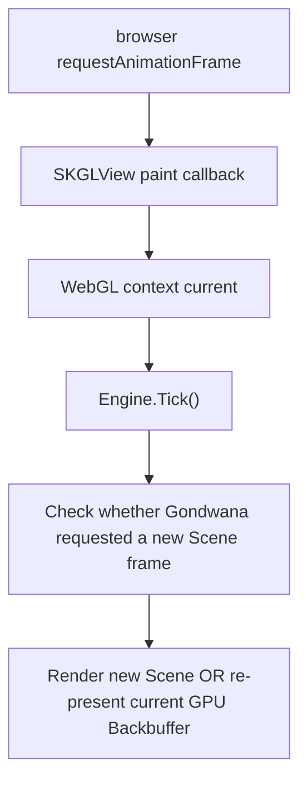
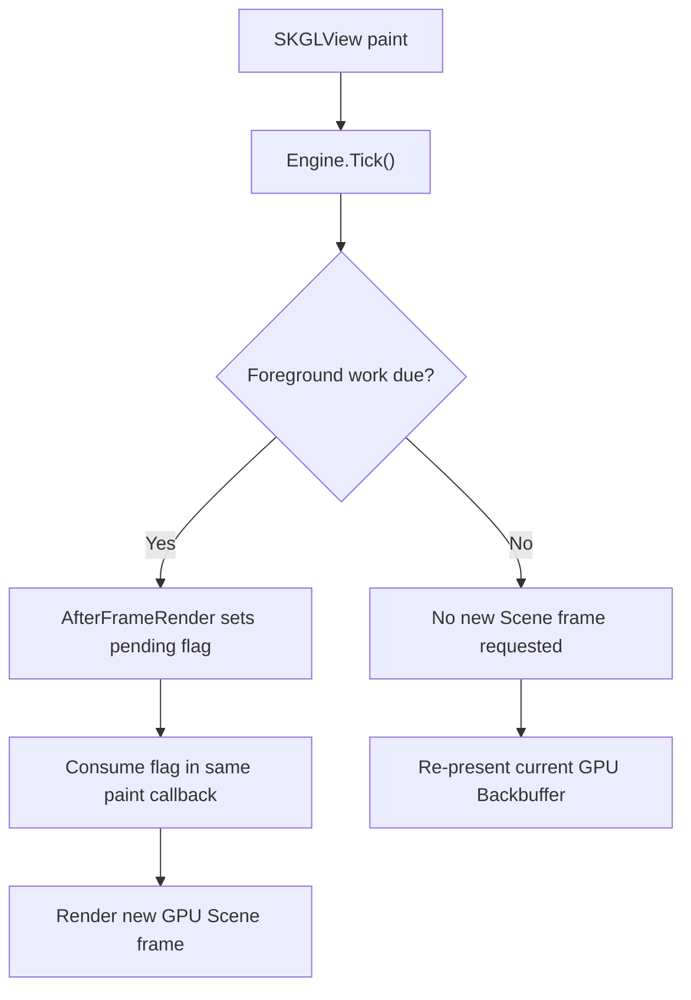

This page documents Gondwana's **Blazor WebGL rendering path**.

WebGL uses the same `GpuBackbuffer` and full-scene GPU renderer as the desktop GL path, but browser execution changes who owns the outer frame loop. Instead of the engine requesting each GPU paint, SkiaSharp's `SKGLView` owns the browser `requestAnimationFrame` loop and advances Gondwana from inside that WebGL paint callback.

That distinction is central to the design.

See [[GL Rendering Path]] for the native WinForms/Avalonia OpenGL path and [[Bitmap Rendering Path]] for Blazor's CPU/Canvas 2D compatibility path.

---

## Main types

The WebGL path is built from:

- `BlazorGpuGameHost` — the Blazor game host that selects GPU rendering.
- `BlazorGpuRenderSurfaceComponent` — owns `SKGLView`, the browser WebGL paint callback, and the render surface.
- `BlazorGpuRenderSurfaceAdapter` — tracks presentation size and records whether Gondwana's foreground cadence requested a new Scene frame.
- `RenderSurfaceHost<GpuBackbuffer>` — performs normal Gondwana Scene/View composition.
- `GpuBackbuffer` — off-screen Skia GPU render target.
- `SKGLView` — supplies the browser animation/WebGL callback.

`BlazorGpuGameHost.RenderSurfaceDrivesBrowserFrames` returns `true`, so `BlazorGameHostBase` does **not** start Gondwana's separate JavaScript animation loop for this path.

There is only one browser animation-frame source: `SKGLView`.

---

## Why WebGL uses one animation loop

Blazor/WASM runs Gondwana in timer-driven mode through `Engine.StartTimerDriven(...)`.

The bitmap Blazor host uses Gondwana's JavaScript `requestAnimationFrame` callback to call `Engine.Tick()`.

The WebGL host deliberately does not do that. `SKGLView` already owns a browser animation loop so that its WebGL context is current during painting. Starting a second `requestAnimationFrame` loop would create competing clocks for simulation and GPU presentation.

Instead, every `SKGLView` paint callback advances the engine first and then presents the GPU frame in that same callback.



This keeps simulation timing, foreground-frame decisions, and WebGL presentation coordinated without another JavaScript scheduler.

---

## Component initialization

`BlazorGpuRenderSurfaceComponent.OnInitialized()` creates:

```text
BlazorGpuRenderSurfaceAdapter
        +
RenderSurfaceHost<GpuBackbuffer>
```

It then calls `Adapter.AttachToEngine()`.

The adapter subscribes to `Engine.AfterFrameRender`, but unlike desktop GL it does **not** request another browser repaint. `SKGLView` is already painting through its own animation loop.

Instead, the adapter only sets an atomic pending-frame flag:

```text
Engine foreground frame completes
  -> AfterFrameRender
     -> BlazorGpuRenderSurfaceAdapter
        -> pending Scene-frame flag = true
```

The active WebGL paint callback consumes that flag.

---

## The WebGL paint callback

`BlazorGpuRenderSurfaceComponent.HandlePaintSurface(...)` is the heart of the path.

Each browser paint callback performs the following sequence:

1. update the adapter's current destination dimensions;
2. obtain the active Skia `GRContext` from the `SKGLView` surface;
3. initialize/reinitialize the `GpuBackbuffer` if required;
4. call `Engine.Tick()`;
5. consume the adapter's pending foreground-frame request;
6. decide whether the Scene must be rerendered;
7. either render a new Scene frame or draw the existing GPU Backbuffer;
8. record the successful browser GPU presentation.

The core decision is effectively:

```csharp
engine.Tick();

bool engineFrameRequested = Adapter.ConsumeFrameRequest();
bool renderScene = _backbufferNeedsRender || engineFrameRequested;

bool presented = renderScene
    ? Host.GlRenderToCanvas(e.Surface.Canvas)
    : Host.GlDrawCurrentFrameToCanvas(e.Surface.Canvas);
```

That is what separates **browser paint cadence** from **Gondwana Scene-render cadence**.

---

## Two cadences, one browser callback

A WebGL game can be presented by the browser more often than Gondwana needs to rerender the Scene.

For example, if the browser is painting near 60 Hz but `EngineConfiguration.TargetFPS` is 30, approximately every other browser paint can reuse the already rendered GPU Backbuffer.

Conceptually:

```text
Browser rAF:       | paint | paint | paint | paint | paint | paint |
Engine foreground: | render|      | render|      | render|      |
Presentation:      | new   | reuse| new   | reuse| new   | reuse|
```

`TargetFPS` therefore controls how often Gondwana requests a new foreground Scene frame; it does not replace the browser's own animation/compositor cadence.

`GpuBackbuffer.RecordFrame()` counts successful WebGL paint/presentation callbacks, so actual presented FPS may differ from the number of Scene rerenders.

---

## Rendering a new WebGL Scene frame

When `_backbufferNeedsRender` is true or the adapter reports a pending engine frame, the component calls:

```csharp
Host.GlRenderToCanvas(e.Surface.Canvas)
```

`GlRenderToCanvas`:

1. verifies that the Backbuffer is GL-thread-rendered;
2. obtains a fresh high-resolution tick;
3. calls `RenderToBackbuffer(tick)`;
4. finalizes the `GpuBackbuffer` with `EndFrame()`;
5. draws the current GPU Backbuffer into the active WebGL destination canvas;
6. calls `BeginFrame()` to prepare the Backbuffer for future rendering.

No completed frame pixels are copied to CPU memory or passed through JavaScript.

---

## Re-presenting the current GPU frame

When no new Gondwana foreground frame is due, the component calls:

```csharp
Host.GlDrawCurrentFrameToCanvas(e.Surface.Canvas)
```

This skips Scene rendering entirely and draws the existing GPU Backbuffer into the current browser WebGL surface.

That matters for both performance and semantics:

- animation/simulation still advances through `Engine.Tick()` according to Gondwana's timing rules;
- a Scene frame is rendered only when the foreground cadence says one is due; and
- the browser remains free to repaint at its own cadence without forcing duplicate Scene composition.

The existing Backbuffer can also be re-presented after destination-size changes using the new presentation transform.

---

## Full-scene GPU rendering

Whenever WebGL does render a new Scene frame, `RenderSurfaceHost.RenderToBackbuffer(...)` selects `RenderToBackbufferGpuFull(...)` because `GpuBackbuffer.IsGlThreadRendered` is true.

The GPU renderer bypasses SceneLayer RefreshQueues and Backbuffer dirty rectangles. It clears and redraws the complete View composition for the logical Backbuffer.

For each View it renders the visible SceneLayers, normal drawables, and View-bound DirectDrawings, then invokes post-scene canvas hooks.

This is the same core full-scene GPU renderer used by desktop GL.

The difference is that **WebGL does not necessarily invoke that renderer on every browser paint**.

---

## Why WebGL does not use RefreshQueues

RefreshQueues are optimized for the CPU bitmap path, where changed world rectangles can limit both redraw and presentation work.

A `GpuBackbuffer` intentionally bypasses those queues because:

- GPU presentation is full-surface;
- dirty-region bookkeeping would provide little presentation benefit; and
- the shared GL-thread path avoids queue ordering/race problems between engine-side invalidation and GPU rendering.

View clipping remains in effect. A View still draws only within its configured logical Backbuffer viewport, but that is composition clipping rather than dirty-region tracking.

---

## Logical resolution and browser canvas size

The WebGL Backbuffer and browser canvas are separate sizes.

When the first valid canvas size is available, `EngineConfiguration.RenderScale` establishes the logical `GpuBackbuffer` resolution.

After that, ordinary browser layout/canvas resizing updates the adapter destination size but does **not** resize the logical Backbuffer.

`RenderSurfaceAdapterBase` derives an aspect-preserving `PresentationTransform` that:

- fits the logical Backbuffer into the current browser destination;
- preserves aspect ratio;
- centers the image; and
- leaves margins when the aspect ratios differ.

`RenderSurfaceHostBase.PresentationScale` reports the resulting scale.

This means CSS/layout resize changes presentation geometry instead of silently changing game resolution, View dimensions, or Camera math.

---

## Changing RenderScale

Changing `Engine.Instance.Configuration.RenderScale` is different from resizing the browser canvas.

A `RenderScale` change requests a new logical Backbuffer resolution based on the current destination size. `GpuBackbuffer.RequestResize(...)` records that request, and the next WebGL callback applies it through:

```csharp
backbuffer.EnsureInitialized(grContext)
```

The GPU surface is recreated only while the proper `GRContext` is current.

When `EnsureInitialized(...)` reports that a new GPU surface was created, `BlazorGpuRenderSurfaceComponent` sets `_backbufferNeedsRender = true`, ensuring the new surface receives a complete Scene frame before being reused.

A replaced/new GPU context is handled the same way.

---

## Presentation to the WebGL canvas

`RenderSurfaceHostBase.DrawCurrentSurface(...)` applies the adapter's current `PresentationTransform`.

The destination canvas is cleared, translated to the centered destination rectangle, and scaled by the current `PresentationScale`.

For the common unscaled or nearest-neighbor route, Gondwana draws the GPU Backbuffer surface directly:

```text
GpuBackbuffer SKSurface
        -> destination WebGL SKCanvas
```

For linear filtering where scaling or fractional destination offsets require sampling, Gondwana takes a scoped `SKImage` snapshot and uses Skia's sampling options.

That snapshot is still a GPU texture view. It is not a CPU readback.

---

## RenderScalingFilter

`EngineConfiguration.RenderScalingFilter` controls presentation sampling:

- `Linear` — smooth filtering; may use a scoped GPU image snapshot when scaling requires explicit sampling.
- `NearestNeighbor` — pixel-preserving sampling; the direct surface path can be used where applicable.

The filtering choice affects presentation scaling, not Scene/View coordinate calculations inside the logical Backbuffer.

---

## No JavaScript frame-pixel transfer

This is one of the major architectural differences between Blazor's WebGL and bitmap paths.

### Bitmap Blazor path

```text
BitmapBackbuffer
  -> CPU SKImage
  -> RGBA byte[]
  -> .NET / JavaScript interop
  -> HTML Canvas 2D pixels
```

### WebGL path

```text
GpuBackbuffer
  -> GPU Skia surface / texture view
  -> WebGL destination surface
```

WebGL does not serialize a completed frame into a byte array or send frame pixels through JavaScript interop.

JavaScript is still used for ordinary browser integration such as focus, input behavior, and DOM measurements, but not for transporting completed WebGL frame pixels.

---

## `AfterFrameRender` means something different here

Desktop GL adapters react to `AfterFrameRender` by requesting a native GL repaint.

The WebGL adapter reacts by setting a pending flag only.

Why? Because `SKGLView` already owns the browser repaint loop.



This avoids recursively requesting another animation frame from within the animation frame that is already active.

---

## Post-scene canvas hooks

`RenderSurfaceHost.RenderBackbufferPostScene` and `IEnginePlugin.OnPostRenderCanvas` execute after WebGL renders a new Scene frame with at least one configured View.

They run synchronously inside the `SKGLView` paint callback while the `GRContext` is current.

That makes GPU canvas operations legal during the hook, but context-bound resources must not be retained and used after the callback returns.

A browser paint that merely calls `GlDrawCurrentFrameToCanvas()` does not rerun Scene composition or post-scene hooks; it simply re-presents the already completed Backbuffer.

---

## Thread / execution model

Blazor/WASM uses Gondwana's timer-driven engine mode.

For the WebGL path, `Engine.Tick()` is called inside the `SKGLView` browser paint callback before Scene rendering/presentation. There is no separate Gondwana background engine thread driving WebGL frames in the normal browser configuration.

| Operation | WebGL execution context |
| --- | --- |
| Browser animation callback | `SKGLView` / browser rAF |
| `Engine.Tick()` | Same browser callback |
| Foreground-frame decision | Same browser callback |
| New Scene GPU rendering | Same WebGL callback |
| Post-scene canvas hooks | Same WebGL callback |
| Presentation/re-blit | Same WebGL callback |
| `RecordFrame()` | Same WebGL callback |

This single-callback model avoids the desktop GL thread handoff between engine and UI/GL threads.

Normal care is still required for asynchronous game state, external callbacks, or other code that can mutate renderable state independently of the browser frame callback.

---

## Frame counters and performance interpretation

WebGL has two useful notions of "frame":

1. a **Gondwana Scene frame**, when `TargetFPS` causes foreground work and full GPU Scene rendering; and
2. a **browser GPU presentation**, when `SKGLView` paints and the current Backbuffer reaches the browser surface.

`GpuBackbuffer.RecordFrame()` counts successful browser GPU presentations.

Therefore a high presentation FPS does not imply that Gondwana rebuilt the Scene at the same rate. Reusing the current GPU Backbuffer is an expected optimization.

When diagnosing performance, distinguish:

- simulation/cycle timing;
- Gondwana foreground/Scene-render timing;
- browser `requestAnimationFrame` cadence; and
- actual GPU presentation cost.

---

## Failure / initialization behavior

If the WebGL paint callback does not yet have a valid size or `GRContext`, the component clears the destination rather than attempting GPU Scene work.

If the engine is not running, the WebGL surface is cleared to the Backbuffer clear color.

If `EnsureInitialized(...)` creates/recreates the GPU surface, the component forces a full Scene render on the new surface.

The component clears the destination for invalid dimensions or context, while the engine is stopped, or when a GPU presentation helper reports failure. Exceptions from GPU initialization or scene/presentation drawing are not caught by this callback.

---

## Condensed call stack

```text
browser requestAnimationFrame
└─ SKGLView paint callback
   └─ BlazorGpuRenderSurfaceComponent.HandlePaintSurface(...)
      ├─ Adapter.BeginPaint(width, height)
      ├─ GpuBackbuffer.EnsureInitialized(GRContext)
      ├─ Engine.Tick()
      │  └─ DoForegroundTasks(tick), when due
      │     └─ AfterFrameRender
      │        └─ Adapter marks Scene frame pending
      ├─ Adapter.ConsumeFrameRequest()
      ├─ if new Scene frame required
      │  └─ Host.GlRenderToCanvas(destinationCanvas)
      │     ├─ RenderToBackbufferGpuFull(glTick)
      │     ├─ GpuBackbuffer.EndFrame()
      │     ├─ apply PresentationTransform
      │     └─ GpuBackbuffer.BeginFrame()
      ├─ else
      │  └─ Host.GlDrawCurrentFrameToCanvas(destinationCanvas)
      │     └─ apply PresentationTransform to existing Backbuffer
      └─ GpuBackbuffer.RecordFrame()
```

---

## WebGL vs desktop GL

| WebGL | Desktop GL |
| --- | --- |
| `SKGLView`/browser rAF owns the outer frame loop | Engine foreground cadence requests native GL repaint |
| `Engine.Tick()` executes inside the WebGL paint callback | Engine normally runs on its separate engine thread |
| `AfterFrameRender` sets a pending flag | `AfterFrameRender` posts `Invalidate()` / `RequestNextFrameRendering()` |
| Browser paint may rerender or re-present | Requested native GL callback normally renders a new Scene frame |
| Uses `GlRenderToCanvas()` / `GlDrawCurrentFrameToCanvas()` | Uses `GlRenderAndSnapshot()` + adapter `DrawImage()` |
| Browser compositor governs final display cadence | Native UI framework/compositor governs final display cadence |

Both paths use `GpuBackbuffer` and the same full-scene GPU renderer when a new Scene frame is needed.

---

## WebGL vs Blazor bitmap

| WebGL | Blazor bitmap |
| --- | --- |
| `GpuBackbuffer` | `BitmapBackbuffer` |
| Full Scene redraw when a Scene frame is due | Dirty-region Scene redraw |
| `SKGLView` owns rAF | Gondwana JavaScript helper owns rAF |
| GPU surface remains on GPU | CPU image converted to RGBA bytes |
| No frame-pixel JS transfer | Frame pixels cross .NET/JS boundary |
| Can re-present current GPU surface between Scene renders | Presents CPU bitmap updates to Canvas 2D |

The bitmap path remains useful as a compatibility/debugging path. WebGL is the normal GPU route when browser GPU rendering is desired.

---

## Summary

Gondwana's WebGL path is a **browser-animation-driven GPU renderer with decoupled Scene-render and presentation cadences**:

- `SKGLView` supplies the single browser `requestAnimationFrame` loop;
- the WebGL callback calls `Engine.Tick()` while the GPU context is current;
- `AfterFrameRender` records that a new Scene frame is due rather than scheduling another browser frame;
- a due Scene frame uses Gondwana's full GPU Scene renderer;
- browser paints between Scene frames simply re-present the existing GPU Backbuffer;
- `RenderScale` controls logical resolution while canvas resizing changes presentation only;
- `PresentationTransform` preserves aspect ratio and centers the logical Backbuffer; and
- completed frame pixels remain on the GPU instead of crossing the .NET/JavaScript boundary.

---

## Where to read next

- [[Rendering Pipeline]]
- [[Backbuffers]]
- [[GL Rendering Path]]
- [[Bitmap Rendering Path]]
- [[Performance Tuning]]
- [[Gondwana Engine Lifecycle]]

Relevant source files:

- [`Gondwana.Blazor.Hosting/BlazorGpuGameHost.cs`](https://isthimius.github.io/Gondwana/api/latest/BlazorGpuGameHost_8cs_source.html)
- [`Gondwana.Blazor.Hosting/BlazorGameHostBase.cs`](https://isthimius.github.io/Gondwana/api/latest/BlazorGameHostBase_8cs_source.html)
- [`Gondwana.Blazor/Rendering/BlazorGpuRenderSurfaceComponent.razor.cs`](https://isthimius.github.io/Gondwana/api/latest/BlazorGpuRenderSurfaceComponent_8razor_8cs_source.html)
- [`Gondwana.Blazor/Rendering/BlazorGpuRenderSurfaceAdapter.cs`](https://isthimius.github.io/Gondwana/api/latest/BlazorGpuRenderSurfaceAdapter_8cs_source.html)
- [`Gondwana/Rendering/RenderSurfaceHostBase.cs`](https://isthimius.github.io/Gondwana/api/latest/RenderSurfaceHostBase_8cs_source.html)
- [`Gondwana/Rendering/RenderSurfaceHost.cs`](https://isthimius.github.io/Gondwana/api/latest/RenderSurfaceHost_8cs_source.html)
- [`Gondwana/Rendering/Backbuffers/GpuBackbuffer.cs`](https://isthimius.github.io/Gondwana/api/latest/GpuBackbuffer_8cs_source.html)
- [`Gondwana/Rendering/RenderSurfaceAdapterBase.cs`](https://isthimius.github.io/Gondwana/api/latest/RenderSurfaceAdapterBase_8cs_source.html)
- [`Gondwana/Rendering/PresentationTransform.cs`](https://isthimius.github.io/Gondwana/api/latest/PresentationTransform_8cs_source.html)
